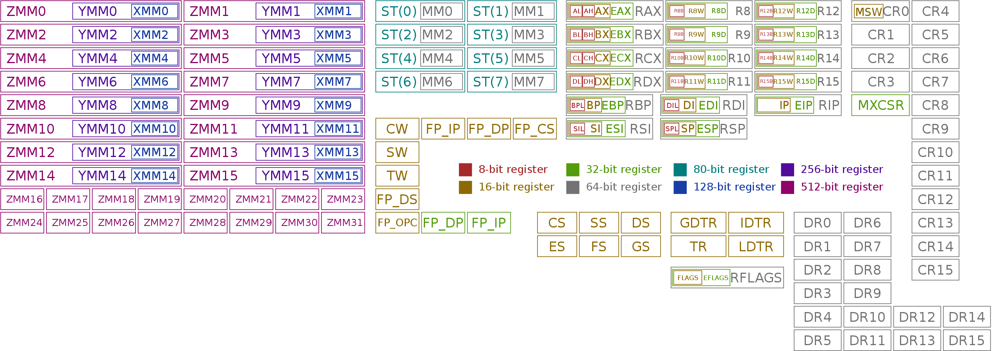
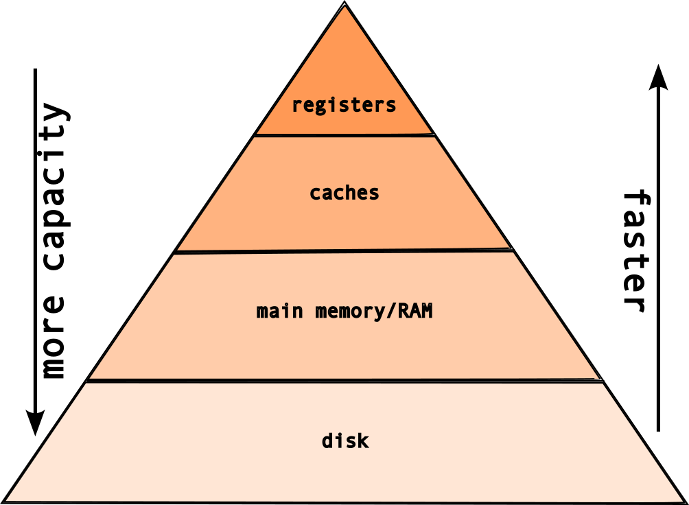
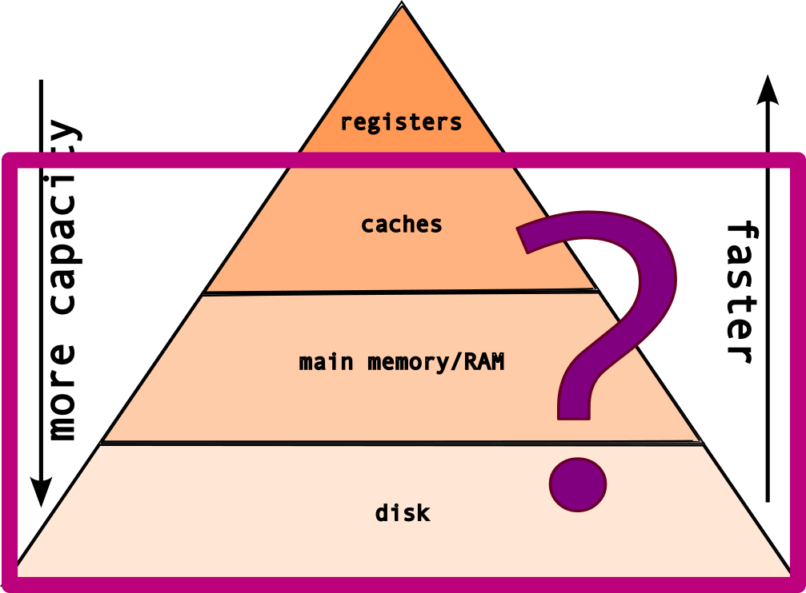
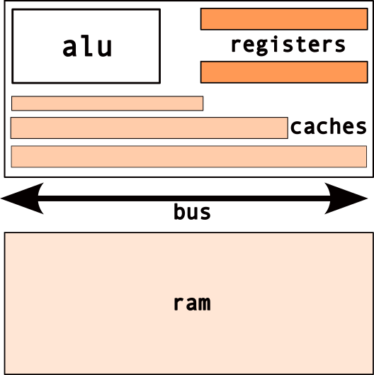
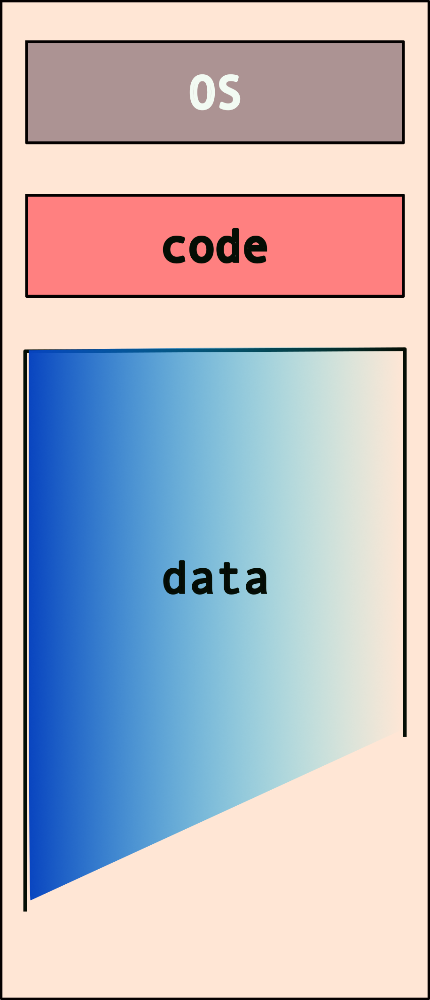
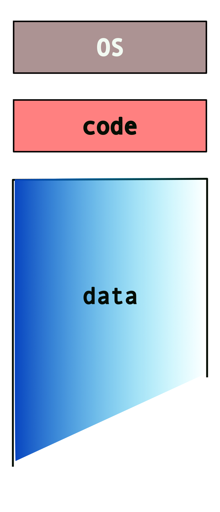

# Memory
[Slides](https://sibin.github.io/teaching/csci2410-gwu-systems_programming/fall_2024/slides/reveal_slides/memory.html#/)

## Computer memory

different shapes, sizes and **speeds**

* registers
* caches (L1, L2, L3)
* main memory/RAM
* disk (hard disks, flash)

### Registers

* **fastest** form of memory
* this what the processor uses
* e.g., <code>a = 3 + 4 ;</code>
* <code>3</code> and <code>4</code> &rarr; loaded into registers

#### register "width" | defines "width" of cpu

* "32 bit processor" &rarr; 32-bit registers
* "64 bit processor" &rarr; 64-bit registers

#### All (known) x86 registers 
for the **64-bit** architecture [source: <a href="https://en.wikipedia.org/wiki/X86#x86_registers">wikipedia</a>]

 

### Important question: **how much memory** is necessary?

But before we answer that, we need to answer this question: **why** do we need memory?

### **Why** do we need memory?

|component| (typical) sizes |
|--------|--------|    
| programs/code | kilobytes to megabytes |
| temporary values | kilobytes to megabytes* |
| data | kilobytes to **tera**bytes!|
||

[*depends on the program]

#### So, the **memory hierarchy** looks like this:

  

But, if the registers are the fastest type of memory, then why do we need these layers?

 

  
**Because, registers are expensive**!

The classic tradeoff: **speed vs size**! The faster the memory &rarr; more **expensive**!

## memory layout

### Caches 

* fast, on-chip memory
* **transparent** to program
* used by cpu to improve performance

### Main Memory

* random access memory [ram]
* typical &rarr; **giga**bytes range
* **limited by "width" of cpu/registers**
* e.g. <scb>32 bit</scb> cpu &rarr; max <scb>4 gb</scb> memory!

 
Wait, what's with the "register width", "memory"...

 
 

**Memory Addressing:**

 

 

But _what_ goes into this memory?

The typical memory layout for a program/system looks like this:

 

But what happens when you have more than one program? Note that each program needs its own access to the OS services and also has to store/mainpulate its own data!

So, do we have something like this (for _two_ programs)?

 
 

What if we have _more than two_ programs? 

 
 
 
 
 
 

This can get messy, really quick! Also, note that the system may not have enough memory to fit all of these programs and their data. We nave to deal with additional issues such as programs overwiting other programs' data/memory!

### Enter **Virtual Memory**!

* makes each program "*believe*"
* it has the **entire** memory to itself!
* combination of os+hardware

So, instead of this...

 
 
 
 
 
 

 
we get...

 
 
 
 
 

 
or, at least the programs "*think*" so!

Hence, **programmers need **not** worry about other programs!**

