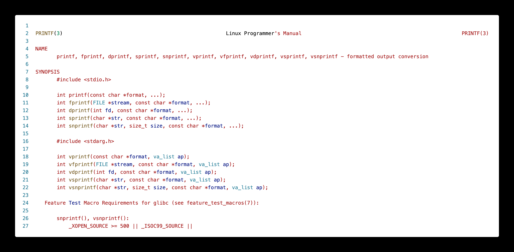

# Intro to C

**You already know **C**!**

well, some of it anyways...

### C constructs [if you're familiar with Java, Python, etc.]

|construct|syntax|
|--------|--------|    
|conditionals| `if` and `else`|
|loops| `while{}`, `do...while`, `for`|
|**basic** types| `int`, `float`, `double`, `char`|
|**compound**| `arrays`*, `struct`, `union`, `enum`|
|functions| `ret_val` **`func_name`** `(args){}`|
|||

\* **no range checks!!** 

C will let you access an array beyond the maximum size that you have specified while creating it. The effects of such access are **implementation specific** -- each platform/operating system will handle it differently. Note that on platforms that don't have memory protection, this can cause some serious problems!

**What's different [from Java]**

* no object-oriented programming
* no function overloading
* **no classes!**
* we have `struct` instead
    * which is similar but *very* different
* **compiled** not interpreted
* **pointers!!!**

### Compound types

**contiguous memory** layouts: objects within these data types are laid out in memory, next to each other. This becomes important when you're trying to use pointers to access various elements.

|type|usage|
|--------|--------|  
| `struct` | related variables (like class) |
| `union` | same, but *shared* memory |
| `enum` | enumeration, assign names |
| array | pointer to contiguous memory |
|||

More details in following sections.

#### **no (built-in) boolean!** {-}

C does not have a built in boolean data type. We can mimic it by using integer values, _e.g.,_

|||
|----|----|
| `0` | `false` |
| **any non-zero value** | `true` |
||


### Unix Manual (`man`) pages

* compilation of unix/C knowledge
* `man \<topic\> `

Organized into sections:

|#|contents|
|--------|--------|    
|1| general commands|
|**2**| **system calls**|
|**3**| **library funtions (c)**|
|4| special files|
|5| file formats and conventions|
|6| games and screensavers|
|7| miscellaneous|
|8| system administration|
|||
                        
[the highlighted sections are most relevant to us.]

Consider the following example. If we want to see details about the common `C` standard library function, `printf()`, we type:
```C DNE
man 3 printf
```

The _initial_ part of the output will look something like this (run the above command in a terminal for the full output):




### Header Files

* include libraries in your program
* even the C standard library
* similar to `import` in java

|method|what is included|
|--------|--------|    
|`\#include \<stdio.h\>`| common libraries |
|`\#include \"my_header.h"`| user header file |
|||

Depending on how you invlude your header files, is determined by _where_ they are located on your system:

|method|**location**|
|--------|--------|    
|`\#include \<...\>`| header path, e.g., <br> `\/usr\/include\/`* |
|`\#include \"..."`| **current** directory |
|||

\* **not** exhaustive

### Some Common C libraries

|library|function|
|--------|--------|    
|`stdio.h`| standard **input/ouput** |
|`stdlib.h`| **C** standard library/utilities |
|`unistd.h`| **unix** standard library |
|`sys/types.h`| **system types** library |
|`string.h`| **string** manipulation |
|`math.h`| **math** utility functions |
|||


### Basic Types

These are the basic data types defined by the C language:

|type|description/size|
|----|-----------|
|`char`| smallest type, **one** byte |
|`short int`| **two** bytes |
|`int`| **four** bytes |
|`long int`/`long`| larger `int`, **four-eight** bytes |
|`float`| floating point, **four** bytes* |
|`double`| double precision, **eight** bytes* |
|`void`| **lack** of a type |
||

**Important Caveats!**

* when we say "one byte" &rarr; depends on **platform**
* `char` is one byte, typically on **intel**
* varies based on,
    * architectures (ARM, IBM, INTEL)
    * 32-bit vs 64-bit
* \* Similarly, the size of the `float` and `double` data types are not defined by C. Different compilers (and platforms) implement them with different sizes. 

### Code Samples{-}

Now, let's look at some code!

```c
#include <stdio.h>

int main()
{
    return 0 ;
}
```

This is a basic `C` program. Some details to note:

* `<stdio.h>` is the header file for the **standard I/O library** in C
* **Every** C program requires a `main()` function -- this is where the execution starts and ends (for the most part -- we will look at nuances later)
* This function expects a return value as an `int`. Hence we return `0` at the end. This return value from main, is the value _returned by your program_ when it completes execution.

Note that this doesn't have to be the signature of `main()` but it is _typical_. We will explore the "proper" signature for `main()` later on but let's stick to this.

```c
// this is a single line comment

#include <stdio.h>

int main()
{
    char c = 'a' ;
    int i ;
    float f ;
    double d ;

    i = 100 ;
    f = 1.0 ;
    d = 12398723897.2332 ;

    printf( "Memory sizes of variables...\n\n \
            size of char: %d \
            size of int: %d \
            size of float: %d \
            size of double: %d\n", 
            sizeof(c), sizeof(int), sizeof(f), sizeof(d) ) ;
 
    printf( "\n" ) ; // adding an extra line for nice printing at the end
    return 0 ;
}
```

`sizeof()` is a unary operator in the programming languages C and C++. It generates the storage size of an expression or a data type, measured in the number of char-sized units. Consequently, the construct sizeof (char) is guaranteed to be **1**^[Description from Wikipedia. https://en.wikipedia.org/wiki/Sizeof].

> What happens when you try: `man sizeof`?


### Compound types | `struct`, `enum`, `unions`

The C standard defines multiple **compound** data types, _viz._,

|type|description|size|
|----|-----------|----|
| `struct` | collection of **different** values | **sum** of all fields |
| `union` | **one** of a set of values| size of **largest** field |
| `enum` | an **enumeration** with "named" values|typically size of `int`|
||

### Code Samples{-}

Consider the following use case: we want to build a calendar. What information do we need?
* date
* month
* year

```c
// this is a single line comment

#include <stdio.h>

struct calendar{
    int _date ;
    int _month ;
    int _year ;
} ;

int main()
{
    struct calendar today ; // creating an object of type "calendar"

    printf( "size of struct calendar: %d\n", sizeof(today) ) ;

    // let's initialize the object, "today"
    // remember, no "constructors"
    today._month = 9 ;
    today._date = 5 ;
    today._year = 2024 ;

    printf( "date: %d/%d/%d\n", 
            today._month, today._date, today._year ) ;

 
    printf( "\n" ) ; // adding an extra line for nice printing at the end
    return 0 ;
}
```

Are we missing anything else?
* what about the day of the week?
* so let's add a field in the struct for the day of the week

```c
// this is a single line comment

#include <stdio.h>

struct calendar{
    int _date ;
    int _month ;
    int _year ;
    int _day_of_week ; // 1 -- sunday, 2 -- monday, etc.
} ;

int main()
{
    struct calendar today ; // creating an object of type "calendar"

    printf( "size of struct calendar: %d\n", sizeof(today) ) ;

    // let's initialize the object, "today"
    // remember, no "constructors"
    today._month = 9 ;
    today._date = 5 ;
    today._year = 2024 ;
    today._day_of_week = 5 ;

    printf( "date: %d/%d/%d\t day: %d\n", 
            today._month, today._date, today._year, today._day_of_week ) ;

 
    printf( "\n" ) ; // adding an extra line for nice printing at the end
    return 0 ;
}
```

But this is a little tedious. We need to keep track of the mapping, _i.e._, "1" &rarr; "sunday", "2" &rarr; "monday", _etc._ Liable to make a mistake or forget, especially if we're writing a of code that needs to use this mapping. 

#### Enter `enum`

An `enum` is a way to create an "enumeration", _i.e.,_ a list of things that are spelled out in natural language, but are really just numbers (typically `int`). 

So, we could define something like, 

```C DNE
enum weekdays{ sunday, monday, tuesday, wednesday, thursday, friday, saturday } ;
```

and use if in the code as follows,

```c
// this is a single line comment

#include <stdio.h>

enum weekdays{ sunday, monday, tuesday, wednesday, thursday, friday, saturday } ;

struct calendar{
    int _date ;
    int _month ;
    int _year ;
    // int _day_of_week ; // 1 -- sunday, 2 -- monday, etc.
    weekdays _day_of_week ;
} ;

int main()
{
    struct calendar today ; // creating an object of type "calendar"

    printf( "size of struct calendar: %d\n", sizeof(today) ) ;

    // let's initialize the object, "today"
    // remember, no "constructors"
    today._month = 9 ;
    today._date = 5 ;
    today._year = 2024 ;
    // today._day_of_week = 5 ;
    today._day_of_week = thursday ;

    printf( "date: %d/%d/%d\t day: %d\n", 
            today._month, today._date, today._year, today._day_of_week ) ;

 
    printf( "\n" ) ; // adding an extra line for nice printing at the end
    return 0 ;
}
```

But, to be honest, this is not very useful. It _still_ prints out a _number_ instead of a string, like "monday", "tuesday", etc.

Well, if what we want is a _string_, then we need to store a **string**.

```c
// this is a single line comment

#include <stdio.h>

enum weekdays{ sunday, monday, tuesday, wednesday, thursday, friday, saturday } ;

struct calendar{
    int _date ;
    int _month ;
    int _year ;
    // int _day_of_week ; // 1 -- sunday, 2 -- monday, etc.
    // weekdays _day_of_week ;
    char _day_of_week[64] ;
} ;

int main()
{
    struct calendar today ; // creating an object of type "calendar"

    printf( "size of struct calendar: %d\n", sizeof(today) ) ;

    // let's initialize the object, "today"
    // remember, no "constructors"
    today._month = 9 ;
    today._date = 5 ;
    today._year = 2024 ;
    // today._day_of_week = 5 ;
    // today._day_of_week = thursday ;
    today._day_of_week = "thursday" ;

    printf( "date: %d/%d/%d\t day: %s\n", 
            today._month, today._date, today._year, today._day_of_week ) ;

 
    printf( "\n" ) ; // adding an extra line for nice printing at the end
    return 0 ;
}
```

Wait, why does this fail?

We **cannot** assign one array to another! C has no way of knowing how to do this.

One way to bypass this, is to do it _at creation time_ for the `today` object, as follows:

```C DNE
// all items created and initialized together so this works!
struct calendar today = {9, 5, 2024, "thursday"} ; 
```

One alternative is to **explicitly** set the elements of the array, as follows:

```c
// this is a single line comment

#include <stdio.h>

enum weekdays{ sunday, monday, tuesday, wednesday, thursday, friday, saturday } ;

struct calendar{
    int _date ;
    int _month ;
    int _year ;
    // int _day_of_week ; // 1 -- sunday, 2 -- monday, etc.
    // weekdays _day_of_week ;
    char _day_of_week[10] ;
} ;

int main()
{
    struct calendar today ; // creating an object of type "calendar"

    printf( "size of struct calendar: %d\n", sizeof(today) ) ;

    // let's initialize the object, "today"
    // remember, no "constructors"
    today._month = 9 ;
    today._date = 5 ;
    today._year = 2024 ;
    // today._day_of_week = 5 ;
    // today._day_of_week = thursday ;
    // today._day_of_week = "thursday" ;
    today._day_of_week[0] = 't' ;
    today._day_of_week[1] = 'h' ;
    today._day_of_week[2] = 'u' ;
    today._day_of_week[3] = 'r' ;
    today._day_of_week[4] = 's' ;
    today._day_of_week[5] = 'd' ;
    today._day_of_week[6] = 'a' ;
    today._day_of_week[7] = 'y' ;
    today._day_of_week[8] = '\0' ;

    printf( "date: %d/%d/%d\t day: %s\n", 
            today._month, today._date, today._year, today._day_of_week ) ;

 
    printf( "\n" ) ; // adding an extra line for nice printing at the end
    return 0 ;
}
```

Strings in `C` &rarr; an **array** of characters that are `null` terminated, _i.e._, `\0`. So the `day_of_week' field looks like this.


There's a reason I've used the arrow in the above image. :wink: 

### So what is a `union`? {-}

A `union` is a value that may have any of **multiple representations** or formats within the **same area of memory**; that consists of a variable that may hold such a data structure.^[Definition from Wikipedia. https://en.wikipedia.org/wiki/Union_type]

A union specifies the _oermitted_ data types that may be stored in that region of memory, _e.g.,_ an `int` and a `float`, but **never** both. Hence, a union can hold only _one_ data type at a time. Once a new value is assigned, the existing data is _overwritten_ with the new value.

Syntax is similar to `struct` but the _effects_ are very different.

### Code Samples{-}

```c 
#include <stdio.h>


union info{
    int _age ;
    double _weight ;
} ;

int main()
{
    union info my_info ;

    // look at the output of this sizeof!
    printf( "size of struct = %d\t size of union = %d\n", 
            sizeof(today), sizeof(my_info) ) ;


    // now I'm using the "int" part of the union
    my_info._age = 23452345 ;
    printf( "\n age = %d\t weight = %f\n", my_info._age, my_info._weight ) ;

    // now I'm using the "float" part of the union
    my_info._weight = 999999 ;
    printf( "age = %d\t weight = %f\n", my_info._age, my_info._weight ) ;

    printf( "\n" ) ;
    return 0 ; // default value
}
```

As we see, we can only use one of the fields at any point in time. Unions aren't very common today bit still do find use in may systems with limited memory, _e.g.,_ embedded systems. 


