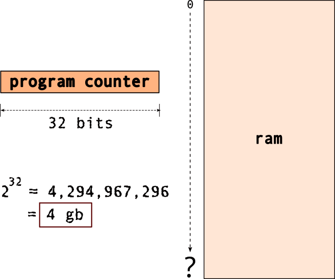
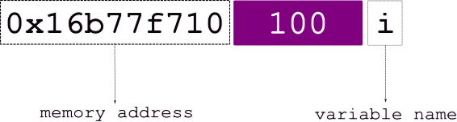
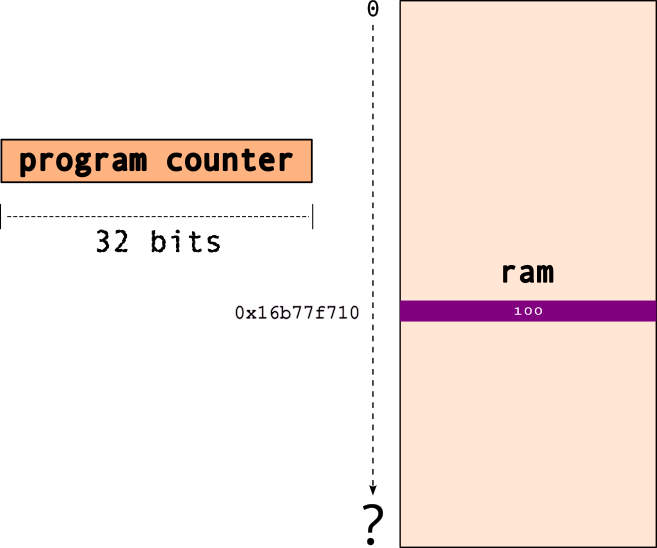
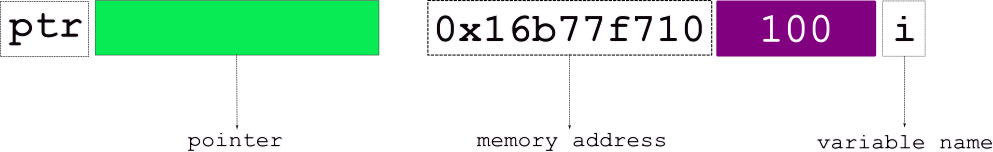
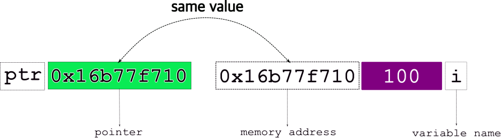
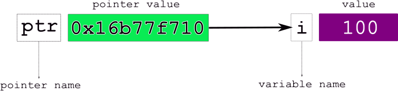
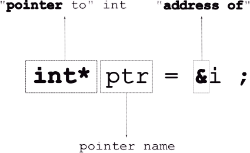

# Pointers and Arrays

[Slides](https://sibin.github.io/teaching/csci2410-gwu-systems_programming/fall_2024/slides/reveal_slides/pointers.html)


what is a "**pointer**"?


<quote><small>_"Pointing dogs, sometimes called bird dogs, 
<br>are a type of gundog typically used in finding game."_</small></quote>

### Remember this?



<br>

ok...hold on to that...

### What happens when we _declare_ a variable?

```C DNE
int i = 100 ;
```

A visual representation of the above:
<br>
 

Let's break it down a bit,

 

<br>
The various elements from the above figure:

|||
|-------|-------|
|variable **name**| `i`|
|stored at **address**| `0x16677f710`|
|**value**| `100`|
||

<br>
Let's revisit this...


<br>

so it _could_ look something like,



note that `0x16677f710` is the **address** _i.e._, the **location** in memory for the variable , `i`.

Now, _what_ is a **pointer**, say `ptr`?

 

<br>

Well, a pointer "**points to**" &rarr; another object..in effect, <font style="background-color: #FFEC8B;"> points to a **memory location**!`</font>

So, the pointer, _e.g._, `ptr`,

 

stores the **address** of the object it points to!

**Final** view of a pointer, `ptr` pointing to a variable, `i`,



<br>

The various elements from the above figure:

|||
|-------|-------|
|variable **name**| `i`|
|stored at **address**| `0x16677f710`|
|**value**| `100`|
|**pointer name**| `ptr`|
|**pointer value**| `0x16677f710`, _i.e._, `i`|
||

### How do we declare/use pointers?

```C DNE
int i = 100 ;
int* ptr = &i ;
```

where,



Note, that the "address of", `&` operator takes a variable and **returns its address**.

If you print out the pointer, `printf("%p", ptr)`, you'll get the _address_ (_i.e._, the arrow). 

Consider the following code example:

```c
#include <stdio.h>

int main()
{
    int i = 100 ;
    int* p_int; // declare a pointer, NOT initialized

    printf( "i = %d\t p_int = %p\n", i, p_int ) ;
    
    p_int = &i ; //initialize pointer to point to address of 'i'

    printf( "i = %d\t p_int = %p\t address of i = %p\n\n", i, p_int, &i ) ;

    printf( "\n" ) ;
    return 0 ;
}

```

To *follow the arrow*, _i.e._, get the value in the location _pointed to_ by it (or to modify the actual value), you must **dereference** the pointer as follows: `*ptr`.

For the above code, if we change the following line, 
```C DNE
printf( "i = %d\t p_int = %p\t address of i = %p\t value at i = %d\n\n", i, p_int, &i, *p_int ) ;
```
the output changes to:
```
i = 100  p = 0x7fffffffe338      address of i = 0x7fffffffe338   value at i = 100
```

What happens when you run the following?

```c DNE
#include <stdio.h>

int main()
{
    int i = 100 ;
    int* p_int; // declare a pointer, NOT initialized

    printf( "i = %d\t p_int = %p\n", i, p_int ) ;
    
    p_int = &i ; //initialize pointer to point to address of 'i'

    printf( "i = %d\t p = %p\t address of i = %p\t value at i = %d\n\n", i, p_int, &i, *p_int ) ;

    int j = 200 ;
    p_int = j ; // works but NOT what we want

    printf( "i = %d\t p_int = %p\t address of i = %p\n\n", i, p_int, &i ) ;
    printf( "value at p_int = %d\n", *p_int ) ;

    printf( "\n" ) ;
    return 0 ;
}
```

What can you do to fix the above code to make it compile?

Now, if we want to change the value of `i` from `100` to `200`, _using the pointer_, we do:

```C
#include <stdio.h>

int main()
{
    int i = 100 ;
    int* p_int; // declare a pointer, NOT initialized

    printf( "i = %d\t p_int = %p\n", i, p_int ) ;
    
    p_int = &i ; //initialize pointer to point to address of 'i'

    printf( "i = %d\t p = %p\t address of i = %p\t value at i = %d\n\n", i, p_int, &i, *p_int ) ;

    *p_int = 200 ;
    printf( "i = %d\t p_int = %p\t address of i = %p\t value at i = %d\n\n", i, p_int, &i, *p_int ) ;

    printf( "\n" ) ;
    return 0 ;
}
```

Pointers are necessary as they enable us to build linked data-structures (linked-lists, binary trees, etc...). Languages such as Java assume that every single object variable is a pointer, and since all object variables are pointers, they don't need special syntax for them.

## Pointers and Modifiers

We can use modifiers in front of types, _e.g.,_ `const double pi = 3.14 ;` which means that the variable `pi` _cannot_ be modified in the program. Try the following program:

```C
#include <stdio.h>

int main()
{
    const double pi = 3.14 ;
    pi = 728.0 ;

    printf( "\n" ) ;
    return 0 ;
}
```

But, we can declare a pointer to it! We can even _dereference_ it and access the value.

```C
#include <stdio.h>

int main()
{
    const double pi = 3.14 ;
    // pi = 728.0 ; BAD!
   
    const double* p_double = &pi ;

    printf( "p_double points to the value = %f\n", *p_double ) ;   

    printf( "\n" ) ;
    return 0 ;
}
```

Will this work?
```c DNE
*p_double = 728 ;
```


The modifiers can be applied to the _pointers_ themselves and not only the variables they point to. So, the following are _**all** valid C statements_:

```c DNE
    double d ; // a regular 'double'
    double* p_d ; // a pointer to a 'double'
    const double cd ; // a 'constant' double
    const double* p_cd ; // a pointer to double that is constant
    double* const c_pd ; // a 'constant pointer' to a double
    const double* const c_p_cd ; // a constant pointer to a double that is a constant
```


## Arrays

Arrays are a **contiguous** collection of data items, _all of the same type_.