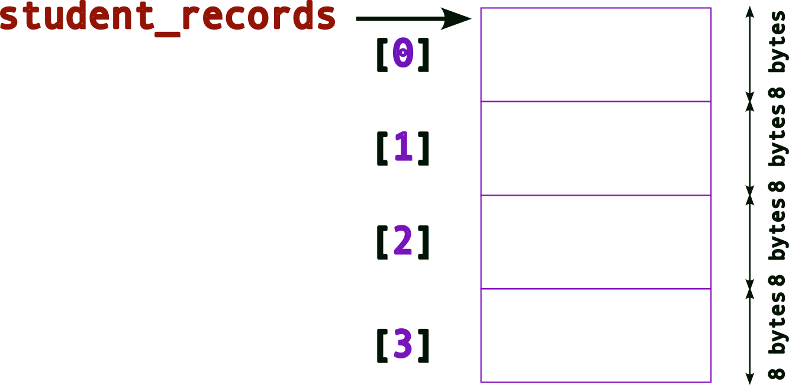

## Pointers | Memory Layouts and Interfaces

[Slides](https://sibin.github.io/teaching/csci2410-gwu-systems_programming/fall_2024/slides/reveal_slides/pointers_memory_layout.html)


### Basic Memory Layouts

It is important to understand how memory in `C` (_e.g._, variables, dynamic memory such from `malloc()`, _\etc._), once _allocated_, is _laid out_ in memory. This particularly important when dealing with pointers, arrays, complex types built using `struct`, _etc._

Consider the following **example**: suppose we need to create a database of student records. We can, perhaps, create a simle `struct` as follows:
```c DNE
struct student{
    unsigned int _gwid ;
    char _name [128] ;
} ;
```

The memory _layout_ for this struct will look like:

<twocolumn>


</twocolumn>

where the memory for the two variables, `_gwid` and `name` are (likely) consecutively laid out in memory (note: `unsigned int` is typically `4 bytes` for 32-bit architectures but can be `8 bytes` in 64-bit architectures.).

In the above example, the array, `_name[128]` has a **fixed** size, `128 bytes`. While this may be enough for _most_ names, there's a likelihood that names can be longer. Hence, `128 bytes` may not be enough. On the other hand, if most names in the database are much smaller, then we will end up _wasting_ a lot of memory (especially as the number of student records grows). For instance, if most names take up only `64 bytes` and if we have a $100,000$ records, then we're wasting `6.4 million` bytes! In some systems this can be prohibitive. Even otherwise, this is memory that other applications (or the OS) can use.

What is the solution then?

We can **dynamically allocate** memory for `_name` (based on how much memory is needed _at runtime_), _i.e._, **make it a pointer**!

So, once we update the `struct`, we get the following memory layout:

<twocolumn>


</twocolumn>

<br>

> Note: a pointer's size depends on the architecture:
> 
> |architecture|size (bytes)|
>|------------|------------|
> | 32-bit | 4 bytes |
>| 64-bit | 8 bytes |
> ||

So, now we must _allocate_ memory for us to store names, _.e.g._,

`new_student._name = (char*) malloc( sizeof(char) * 128 ) ;`

The memory layout will now look like,


### Complex Memory Layouts

Since we want to create a database of student records, we need to story more than one. One way could be to create an _array_ of `struct student`,

```c DNE
struct student{
    unsigned int _gwid ;
    char _name [128] ;
} ;

struct student student_records[4] ;
```

Recall (from above) what the memory layout for _one_ `struct` (still with the hardcoded array for `_name`, _i.e._, an array of `128 bytes`) looks like. Now, the memory layout for an _array_ will look like,

<twocolumn>


</twocolumn>

Remember that,

- an array is _contiguous_ memory of the _same type_
- `_student_records`, the array name is a **pointer** to the start of the array memory address.

Hence, when you access each element of the array, _e.g._, `student_records[n]


Of course, this still suffers from the earlier issue with the fixed value for the size of `_name`. Hence, we want to use the _pointer_ version of the struct. So, if we create an array of `struct student` as follows,
```c DNE
struct student{
    unsigned int _gwid ;
    char* _name ; // this is a pointer now
} ;

struct student student_records[4] ;
```

The memory layout for the `student_records` array will look like (again recall what the memory layout for _one_ struct will look like from above),

<twocolumn>


</twocolumn>

As before, to access each element of this array, we can use the `[]` operator, 


Note, we need to be careful with how we access/allocate/use the memory now. More of that later. 

Let's draw the same figure this way for convenience:


Remember that `_name` still needs memory! So we can allocate it, say using `malloc()`. Hence, allocating memory for the _first_ `_name` may look like this:

```c DNE
struct student{
    unsigned int _gwid ;
    char* _name ; // this is a pointer now
} ;

struct student student_records[4] ;
student_records[0]._name = (char*) malloc( sizeof(char)*128 ) ; // allocate memory for first name
```

The memory layout, after _one_ `_name` allocation will look like:

<twocolumn>


</twocolumn>

Updated memory layout after _all four_ `_name` allocations

<twocolumn>


</twocolumn>

and the corresponding code will look like,
```c DNE
struct student{
    unsigned int _gwid ;
    char* _name ; // this is a pointer now
} ;

struct student student_records[4] ;
student_records[0]._name = (char*) malloc( sizeof(char)*128 ) ; // allocate memory for first name
student_records[1]._name = (char*) malloc( sizeof(char)*128 ) ; // allocate memory for second name
student_records[2]._name = (char*) malloc( sizeof(char)*128 ) ; // allocate memory for third name
student_records[3]._name = (char*) malloc( sizeof(char)*128 ) ; // allocate memory for fourth name
```

Let's go one step further...

```c DNE
struct student* student_records[4] ;
```
what does this do?

It creates an _array_ of **pointers to `struct`** (remember to read the definitions from right to left)!

The memory layout now looks like,

<twocolumn>


</twocolumn>

(Compare this to the previous layouts)

Hence, when we dereference each element of the array, _e.g.,_ `student_records[0]`, we get back, a `struct student*`, _i.e.,_ a **pointer**.

So, as a first step, we must **allocate a struct**!

```c DNE
struct student{
    unsigned int _gwid ;
    char* _name ; // this is a pointer now
} ;

struct student* student_records[4] ; // an array of pointers!
student_records[0] = (struct student*) malloc( sizeof(struct student) ) ; // allocate memory for a struct first!
```

The memory layout after allocating the struct:

<twocolumn>


</twocolumn>

<br>

We're still missing something &rarr; **no memory space** for `_name` (remember it is still a pointer)! As before, we need to use `malloc()` for this:

```c DNE
struct student{
    unsigned int _gwid ;
    char* _name ; // this is a pointer now
} ;

struct student* student_records[4] ; // an array of pointers!
student_records[0] = (struct student*) malloc( sizeof(struct student) ) ; // allocate memory for a struct first!
student_records[0]->name = (char*) malloc( sizeof(char) * 128 ) ; // allocate memory for name, note the -> operator
```

> Note the **`->`** operator! 
>
> When we're trying to access members of a `struct` (or `union`) using pointers, we use the `->` operator.
> note the differences between the following:
> 
> |variable type|access examples|
> |-------------|---------------|
> | normal variable <br> <font size="small">`struct student sibin ;`| `sibin._name = malloc(...) ;` <br> `printf( "name = %s\n", sibin._name ) ;`|
> | pointer variable <br> `struct student* psibin = &sibin ;` | `psibin->_name = malloc(...) ;` <br> `printf( "gwid = %d\n", psibin->_gwid ) ;`|
> ||

Now, the memory layout after allocating both, the `struct` and `_name`,

<twocolumn>


</twocolumn>

To allocate **all** of the required memory for the _entire_ array, _i.e.,_ allocating for all `struct` and `_name` pointers, we need to,
```c DNE
struct student{
    unsigned int _gwid ;
    char* _name ; // this is a pointer now
} ;

struct student* student_records[4] ; // an array of pointers!
student_records[0] = (struct student*) malloc( sizeof(struct student) ) ; // allocate memory for a struct first!
student_records[0]->name = (char*) malloc( sizeof(char) * 128 ) ; // allocate memory for name, note the -> operator

student_records[1] = (struct student*) malloc( sizeof(struct student) ) ; // allocate memory for a struct first!
student_records[1]->name = (char*) malloc( sizeof(char) * 128 ) ; // allocate memory for name, note the -> operator

student_records[2] = (struct student*) malloc( sizeof(struct student) ) ; // allocate memory for a struct first!
student_records[2]->name = (char*) malloc( sizeof(char) * 128 ) ; // allocate memory for name, note the -> operator

student_records[3] = (struct student*) malloc( sizeof(struct student) ) ; // allocate memory for a struct first!
student_records[3]->name = (char*) malloc( sizeof(char) * 128 ) ; // allocate memory for name, note the -> operator
```

The _final_ memory layout will look like,


### Interfaces

The problem is that the code to initialize the entire array (`struct` and `_name`) is quite laborious and _ugly_ since we are initializing each one explicitly in code. Imagine if we had _hundreds_ or _thousands_ of new student records to initialize/store!

To solve this problem, we create an **interface** for _creating new records_. An "interface" is usually a fancy way of saying **function**. So, we _define_ a new function say, `create_student_record()` as follows:


```c
#include <stdio.h>
#include <stdlib.h>
#include <string.h>

// a macro to define the largest size for a name
#define MAX_NAME_SIZE 256

struct student{
    unsigned int _gwid ;
    char* _name ;
} ;

struct student create_student_record( unsigned int gwid, char* name )
{
    struct student new_student ;

    new_student._gwid = gwid ;
    new_student._name = (char*)malloc( sizeof(char)*MAX_NAME_SIZE ) ;
    strcpy( new_student._name, name ) ; // deep copy

    return new_student ;
}
```

And we use the function as follows:

```c
#include <stdio.h>
#include <stdlib.h>
#include <string.h>

// a macro to define the largest size for a name
#define MAX_NAME_SIZE 256

struct student{
    unsigned int _gwid ;
    char* _name ;
} ;

struct student create_student_record( unsigned int gwid, char* name )
{
    struct student new_student ;

    new_student._gwid = gwid ;
    new_student._name = (char*)malloc( sizeof(char)*MAX_NAME_SIZE ) ;
    strcpy( new_student._name, name ) ; // deep copy

    return new_student ;
}

int main()
{
    struct student me = create_student_record( 920348, "sibin" ) ;

    // An array of struct OBJECTS
    struct student student_records[4] ;

    // Use the create INTERFACE to fill the array
    student_records[0] = create_student_record( 123, "ABC" ) ;
    student_records[1] = create_student_record( 456, "DEF" ) ;
    student_records[2] = create_student_record( 789, "GHI" ) ;
    student_records[3] = create_student_record( 987, "JKL" ) ;

    printf( "\n" ) ;
    return 0 ;
}
```

What, if anything, is the problem here?

Consider the first line, `struct student me = create( 920348, "sibin" ) ;`. The return value from `create_student_record()` is a `struct` so the values of the original `struct`, created inside the function, are **copied** over to the the one in main, _i.e._, `me`. **Except**, when copying over the `_name` variables, we're doing a **shallow copy** since we're **only copying the pointers and not the underlying data** (names in this case)!

To avoid this problem, let's **return a pointer** to `struct student`, as follows:

```c
#include <stdio.h>
#include <stdlib.h>
#include <string.h>

// a macro to define the largest size for a name
#define MAX_NAME_SIZE 256

struct student{
    unsigned int _gwid ;
    char* _name ;
} ;

// copied struct but shallow copy returned (for _name)
struct student create_student_record( unsigned int gwid, char* name )
{
    struct student new_student ;

    new_student._gwid = gwid ;
    new_student._name = (char*)malloc( sizeof(char)*MAX_NAME_SIZE ) ;
    strcpy( new_student._name, name ) ; // deep copy

    return new_student ;
}

// return a pointer to the struct to avoid shallow copy
// note: we're returning a pointer to the ORIGINAL memory that was created
struct student* create_student_record_pointer( unsigned int gwid, const char* name )
{
    struct student* pnew_student = (struct student*) malloc( sizeof(struct student) ) ; 

    pnew_student->_gwid = gwid ;
    pnew_student->_name = (char*)malloc( sizeof(char)*MAX_NAME_SIZE ) ;
    strcpy( pnew_student->_name, name ) ;

    return pnew_student ;
}

int main()
{
    struct student* pme = create_student_record_pointer( 920348, "sibin" ) ; // returning/storing a pointer

    // An array of POINTERS to struct
    struct student* pstudent_records[4] ;

    // Use the (pointer) create INTERFACE to fill the array
    pstudent_records[0] = create_student_record_pointer( 123, "ABC" ) ;
    pstudent_records[1] = create_student_record_pointer( 456, "DEF" ) ;
    pstudent_records[2] = create_student_record_pointer( 789, "GHI" ) ;
    pstudent_records[3] = create_student_record_pointer( 987, "JKL" ) ;

    printf( "\n" ) ;
    return 0 ;
}
```

This code should work. In fact, if we want tp _print_ the records, we can define an interface for that as well.

```c
#include <stdio.h>
#include <stdlib.h>
#include <string.h>

// a macro to define the largest size for a name
#define MAX_NAME_SIZE 256

struct student{
    unsigned int _gwid ;
    char* _name ;
} ;

// return a pointer to the struct to avoid shallow copy
// note: we're returning a pointer to the ORIGINAL memory that was created
struct student* create_student_record_pointer( unsigned int gwid, const char* name )
{
    struct student* pnew_student = (struct student*) malloc( sizeof(struct student) ) ; 

    pnew_student->_gwid = gwid ;
    pnew_student->_name = (char*)malloc( sizeof(char)*MAX_NAME_SIZE ) ;
    strcpy( pnew_student->_name, name ) ;

    return pnew_student ;
}

// interface to print a SINGLE student record, given a pointer to it
void print_student_record( const struct student* record )
{
    printf( "gwid = %d\t name = %s\n", record->_gwid, record->_name ) ;
}


int main()
{
    struct student* pme = create_student_record_pointer( 920348, "sibin" ) ; // returning/storing a pointer

    // An array of POINTERS to struct
    struct student* pstudent_records[4] ;

    // Use the (pointer) create INTERFACE to fill the array
    pstudent_records[0] = create_student_record_pointer( 123, "ABC" ) ;
    pstudent_records[1] = create_student_record_pointer( 456, "DEF" ) ;
    pstudent_records[2] = create_student_record_pointer( 789, "GHI" ) ;
    pstudent_records[3] = create_student_record_pointer( 987, "JKL" ) ;

    // UGLY way to print, call the interface instead
    printf( "\nAll Student Records (FOR LOOP):\n----------------------\nGIWD \t Name\n" ) ;
    for(unsigned int i = 0 ; i < 4 ; ++i)
        printf( "Student record %d: gwid = %d\t name = %s\n", i, 
                     pstudent_records[i]->_gwid, pstudent_records[i]->_name ) ;

    printf( "\nAll Student Records (INTERFACE):\n----------------------\nGIWD \t Name\n" ) ;
    // print using INTERFACE -- same effect as above printf
    for(unsigned int i = 0 ; i < 4 ; ++i)
    {
        printf( "Student record %d: ", i ) ;
        print_student_record( pstudent_records[i] ) ;
    }

    printf( "\n" ) ;
    return 0 ;
}
```

There still remains a serious problem with this code (even though it compiles and runs). There are lots of **memory leaks**! We need to call `free()` to release the memory back to the system once we are done with it. In this case, at the end of the `main()` function.

So, will this work?
```c DNE
free(pstudent_records) ;
```

It won't work since we're only _releasing the memory for the array_. Remember we used `malloc()` for each of the following:
* each `struct student*` in the array
* each `char* _name` in _each_ of the structs thus allocated!

A **lot** of memory will _leak_. Hence, we need to _carefully_ release all of it. 

```c DNE
// FIRST, free the memory for _name
free(pstudent_records[0]->_name) ;

// SECOND, free the struct
free(pstudent_records[0]) ;

// REPEAT for all 

free(pstudent_records[1]->_name) ;
free(pstudent_records[1]) ;
free(pstudent_records[2]->_name) ;
free(pstudent_records[2]) ;
free(pstudent_records[3]->_name) ;
free(pstudent_records[4]) ;
```

But this is fairly ugly code as well -- and quite unmanageable for a large number of records. As before, we create a new interface, `delete_student_record()` to _properly_ delete a record

```c
#include <stdio.h>
#include <stdlib.h>
#include <string.h>

// a macro to define the largest size for a name
#define MAX_NAME_SIZE 256

struct student{
    unsigned int _gwid ;
    char* _name ;
} ;

// return a pointer to the struct to avoid shallow copy
// note: we're returning a pointer to the ORIGINAL memory that was created
struct student* create_student_record_pointer( unsigned int gwid, const char* name )
{
    struct student* pnew_student = (struct student*) malloc( sizeof(struct student) ) ; 

    pnew_student->_gwid = gwid ;
    pnew_student->_name = (char*)malloc( sizeof(char)*MAX_NAME_SIZE ) ;
    strcpy( pnew_student->_name, name ) ;

    return pnew_student ;
}

// interface to print a SINGLE student record, given a pointer to it
void print_student_record( const struct student* record )
{
    // WHY is this 'const'?

    printf( "gwid = %d\t name = %s\n", record->_gwid, record->_name ) ;
}

void delete_student_record( struct student* pstudent )
{

    print_student_record( pstudent ) ; // reuse the print interface!

    free(pstudent->_name) ;
    free(pstudent) ;

}

int main()
{
    struct student* pme = create_student_record_pointer( 920348, "sibin" ) ; // returning/storing a pointer

    // An array of POINTERS to struct
    struct student* pstudent_records[4] ;

    // Use the (pointer) create INTERFACE to fill the array
    pstudent_records[0] = create_student_record_pointer( 123, "ABC" ) ;
    pstudent_records[1] = create_student_record_pointer( 456, "DEF" ) ;
    pstudent_records[2] = create_student_record_pointer( 789, "GHI" ) ;
    pstudent_records[3] = create_student_record_pointer( 987, "JKL" ) ;

    // UGLY way to print, call the interface instead
    printf( "\nAll Student Records (FOR LOOP):\n----------------------\nGIWD \t Name\n" ) ;
    for(unsigned int i = 0 ; i < 4 ; ++i)
        printf( "Student record %d: gwid = %d\t name = %s\n", i, 
                     pstudent_records[i]->_gwid, pstudent_records[i]->_name ) ;

    // print using INTERFACE -- same effect as above printf
    printf( "\nAll Student Records (INTERFACE):\n----------------------\nGIWD \t Name\n" ) ;
    for(unsigned int i = 0 ; i < 4 ; ++i)
    {
        printf( "Student record %d: ", i ) ;
        print_student_record( pstudent_records[i] ) ;
    }

    // Use the DELETE interface to PROPERLY clean up memory
    printf( "\nDeleting all Student Records (INTERFACE):\n----------------------\nGIWD \t Name\n" ) ;
    for(unsigned int i = 0 ; i < 4 ; ++i )
    {
        // send each element of the array to be "cleaned up        
        delete_student_record( pstudent_records[i] ) ;
    }

    // ALL Memory properly released!

    printf( "\n" ) ;
    return 0 ;
}
```

Remember that properly designing and using programmatic interfaces is a critical part of system design and software development. All of the system calls, _e.g.,_ `printf()`, `malloc()`, _etc._ are interfaces that we use to interact with the system, _i.e.,_ the operating system!