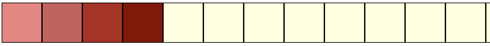

## Pointers | Casting 
[Slides](https://sibin.github.io/teaching/csci2410-gwu-systems_programming/fall_2023/slides/reveal_slides/pointer_casting.html/)

### Pointers and Arrays

..are the same thing!


* just different conventions to **access memory**
* *e.g.,* pointer arithmetic over an array of ints
* moves addresses by **size of the int** &rarr; `4` bytes
* **no interaction** with individual bytes 
    * only **whole ints**


#### Pointer Arithmetic 

* consider an integer array &rarr; `int a[5]`
* `5` ints, **each** of `4` bytes


<br>

* so `a[0]` is:


<br>

* so `a[1]` is &rarr; **same** as `++a`!


<br>

* we **cannot** access the individual bytes, i.e., these ones:


<br>

what if we **want** to access the individual bytes?

## Casting!

* can cast from one pointer type to another!
* between **any two pointers**!
* a pointer is always the same size, *i.e.,* `4` bytes
* making it point to something else 
* doesn't change the memory underneath
    * but, **changes pointer arithmetic**!


### Casting from `int*` to `char*`
* now, as before, if we have &rarr; `int a[5]`
* and we do, 
**`char* pc = (char*) a ;`**
* `pc` points to the **same** memory region as `a`
* but now, can treat it as **characters**
* *i.e.,* **one byte**
<br>
<br>

* so `pc[0]` is:


<br>

* so `pc[1]` is &rarr; same as `++pc`!


### Example

Consider the following code:
```c
#include <assert.h>
#include <stdio.h>

int main()
{
    int* a = (int*)malloc( sizeof(int) ) ;
    assert(a != NULL) ; // SAME as assert (a)

    *a = 1145258561 ;

    printf( "a = %d\n", *a ) ;

    char* ppc = (char*) a ;
    for(unsigned int i = 0 ; i < sizeof(a); ++i )
        printf( "%c ", *ppc++ ) ;

    printf("\n") ;
    return 0 ;
}
```


### Pointer Casting | `void*`

* can cast **any** point to a `void*`
* all of these are valid:

```c
void* pv = malloc(32);
int* pi = (int*) pv ; 
double* pd = (double*) pv ;
char* pc = (char*) pi ; 
```                        

* can cast **any** point to a `void*`
* all of these are valid:
* **cannot** dereference a `void*` directly!
compiler does not know the type

