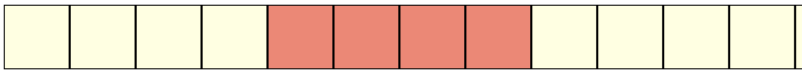
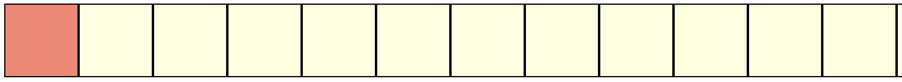
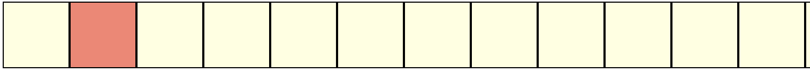

# Function Pointers

Functions have **types** too. E.g., 

```c DNE
void foo(int i, double d){...}
```
The "type" of this function is:
* takes as input two arguments &rarr; one `int` and one `double`
* returns nothing, hence return type is `void`
* **note**: this is **not** the same as a return type of `void*`

Sometimes, you need to decide *which* function to call at **run time**. Why?

### Example | Bubble Sort 

\[[Follow along with the Generic Bubble Sort Code](https://sibin.github.io/teaching/csci2410-gwu-systems_programming/fall_2023/code/generic_bubble_sort.c)\]

How do you write a bubble sort? Say for an array of `int`s?

```c
#include <stdio.h>
#include <stdlib.h>
#include <assert.h>

// Sorting ints
void bubble_sort_int( int array[], int array_size )
{
    for( unsigned int i = 0 ; i < array_size-1 ; ++i )
    {
        for( unsigned int j = 0 ; j < i ; ++j )
        {
            if( array[j] > array[j+1] )
            {
                int temp = array[j] ;
                array[j] = array[j+1] ;
                array[j+1] = temp ;
            }
        }
    }
}

// printing out an array
void print_array( int array[], int array_size )
{
    printf( "array = " ) ;
    for( unsigned int i = 0 ; i < array_size ; ++i )
        printf( "%d ", array[i] ) ;
}

int main()
{
    int my_array[] = { 2341, 8632, 3, 2344, 747645 } ;
    int array_size = 5 ;

    // sort the array
    bubble_sort( my_array, array_size ) ;

    print_array( my_array, array_size ) ;

    printf( "\n" ) ;
    return 0 ;
}
```

This works for an array of `int`s. But what if I want to sort an array of `double`?

Maybe, write a new function to do that?

```c DNE
// Sorting ints
void bubble_sort_double( double array[], int array_size )
{
    for( unsigned int i = 0 ; i < array_size-1 ; ++i )
    {
        for( unsigned int j = 0 ; j < i ; ++j )
        {
            if( array[j] > array[j+1] )
            {
                double temp = array[j] ;
                array[j] = array[j+1] ;
                array[j+1] = temp ;
            }
        }
    }
}
```

But what if I want to sort an array of `char`? Strings? `float`s? My custom `struct`s? Do we write one function for each?
```c DNE
void bubble_sort_char( char array[], int array_size ){...}
void bubble_sort_strings( char* array[], int array_size ){...}
void bubble_sort_float( float array[], int array_size ){...}
void bubble_sort_struct_student( struct student array[], int array_size ){...}
```

But what if **we don't know which one will be needed until run time?***

So, depending on the data that we're given, or some input from the user, we may have to pick one of the above but *won't know of the choice at compile time*.

Enter **function pointers**!

### Example | Generic Bubble Sort

A sorting algorithm, at its heart, has two parts:

1. *compare*: given two elements, let us know which is larger/greater
2. *swap*: given two elements, exchange their values

so, in a generic sense, we have:
```c DNE
if( is_greater(a, b) ) // If a is larger than b
    swap(a, b)         // swap their values
```

hence, we can rewrite the bubble sort function, in a "generic" form as:
```c DNE
// Sorting | Generic
void generic_bubble_sort(...)
{
    for( unsigned int i = 0 ; i < array_size-1 ; ++i )
        for( unsigned int j = 0 ; j < i ; ++j )
            if( is_greater( array[j], array[j+1]) )
                swap( array[j], array[j+1] ) ;
}
```

But, what are the **inputs** to the function? 

We first need to define the type of the array. Since we won't know the type of the data elements in the array, we can't pick a specific array type. 

But, remember:
* arrays and pointers are interchangeable
* can cast from any pointer type to `void*` and back

using this, we define the array as a `void*`:

```c DNE
void generic_bubble_sort( void* array, ... )
```

As before, we need to know the *size* of the entire array, so we can now expand the function signature more:

```c DNE
void generic_bubble_sort( void* array, int array_size, ...)
```

Remember that a void* pointer is just a pointer to a *block* of memory. C does not know the *type of each element* in the array. So, we **cannot** do:
* `array[i]` &rarr; since the type is a `void*`

We can use pointer arithmetic with `void*` so this is possible:
* `array+i` &rarr; but that moves the pointer forward by `i` **bytes**

and **not** by the number of bytes of the data type. Recall,
* `char* pc ; pc+1 ;` &rarr; advances by `1` byte
* `int* pi ; pi+1 ;  `  &rarr; advances by `4` bytes


Hence, we need information about the *size of each element*, i.e.,
```c DNE
void generic_bubble_sort( void* array, int array_size, 
                                        int element_size ) 
```

So, we can do: `array + (i * element_size)` to move to the next element in the array

So, for an `int` array, we get (`element_size = 4`):


<br>

and for a `char` array, we get (`element_size = 1`):



<br>

Using this information about `element_size`, we can rewrite the generic bubble sort function as:
```c DNE
// Sorting | Generic
void generic_bubble_sort( void* array, int array_size, 
                                        int element_size ) 
{
    for( unsigned int i = 0 ; i < array_size-1 ; ++i )
        for( unsigned int j = 0 ; j < i ; ++j )
            if( is_greater( array + (j * element_size), array + ((j+1) * element_size )) )
                swap( array + (j * element_size), array + ((j+1) * element_size )) ) ;
}
```

Now we see the *generic* version of bubble sort taking shape. 

### What is "*generic*"?

But we are still missing critical information, *viz.*, what are `is_greater()` and `swap()`?

Remember that since the `generic_bubble_sort()` function doesn't know which *exact* type it is operating on, we need to _somehow_ provide it with the **actual** functions that will carry out the comparison and swapping, depending on the type of the array being passed in. For instance, if we are comparing integers, we need a comparator and swap that can operate on integers and similarly ones for structs, doubles, *etc.*

Wouldn't it be great, if we could just **send in the specific functions as arguments to `generic_bubble_sort()`**, say like,
```c DNE
void generic_bubble_sort( void* array, int array_size, 
                          int element_size, 
                          <SOME_TYPE> is_greater,
                          <SOME_TYPE> swap ) 
{
    for( unsigned int i = 0 ; i < array_size-1 ; ++i )
        for( unsigned int j = 0 ; j < i ; ++j )
            if( is_greater( array + (j * element_size), array + ((j+1) * element_size )) )
                swap( array + (j * element_size), array + ((j+1) * element_size )) ) ;
}
```

This is *precisely* where **function pointers** come in.

We can define `is_greater()` and `swap()` to be pointers to functions, *i.e.,* to a **type** of function (the signatures). Hence, a *comparator* function pointer would look like:
```c DNE
typedef int (*comparator_function_pointer)( void* l, void* r ) ;
```

Recall that the `typedef` keyword *associates a name with a type*. In the above example, we are saying that `comparator_function_pointer` is now a name that refers to the (function) type, `int (*)( void*, void* )`, *i.e.,* a **pointer to a function that takes two arguments, each of type `void*` and returns and `int`**. 

Note, that the job of a comparator function is to take two values and,
* return positive (non-zero) values if `l > r` or 
* a zero if `l <= r`.

We can define the `swap` function pointer in a similar manner:
```c DNE
typedef void (*swap_function_pointer)( void* l, void* r ) ;
```
where, `swap_function_pointer` is a **name** that refers to the (function) type, `void (*)( void*, void* )` since such a function doens't need to return anything, just swap the two elements pointed to by the `void*` arguments.

Updating our sorting function to use the function pointers,
```c DNE
void generic_bubble_sort( void* array, int array_size, 
                          int element_size, 
                          comparator_function_pointer is_greater,
                          swap_function_pointer swap ) 
{
    for( unsigned int i = 0 ; i < array_size-1 ; ++i )
        for( unsigned int j = 0 ; j < i ; ++j )
            if( is_greater( array + (j * element_size), array + ((j+1) * element_size )) )
                swap( array + (j * element_size), array + ((j+1) * element_size )) ) ;
}
```
So, `is_greater` is now a function pointer of type, `comparator_function_pointer` and `swap` is a function pointer of type, `swap_function_pointer`. 

**NOTE:** function pointers are invoked **exactly** like regular functions, *i.e.,* `is_greater(...)` and `swap(...)`. The above code will work without any changes. 


### Generic to *concrete* functions

Eventually, we need to decide what it is that we are sorting. Is it an array of `int`s, `doubles`s, `struct`s, etc. And at that point in time, we will need the actual, **concrete* functions for comparing and swapping `int`s (or `double`s or whatever). 

We we define the two functions (using `int` as an example):

```c DNE
// Compare and Swap functions for integers
int is_greater_than_int( void* l, void* r )
{
    // cast it from void* to relevant type, int*
    // since we cannot dereference void*
    int* left = l ;
    int* right = r ;

    // compare and return result
    if( *left > *right )
        return 1 ;
    else
        return 0 ; 

   // Can just use this one line instead but not doing so for clarity
   // return ( *l > *r ? 1 : 0 ) ; 
}

void swap_int( void* l, void* r )
{
    // cast it from void* to relevant type, int*
    // since we cannot dereference void*
    int* left = l ;
    int* right = r ;
    int temp = *left ;

    // swap
    *left = *right ;
    *right = temp ;
}
```

We can define equivalent functions for `double`,
```c DNE
// Compare and Swap functions for doubles 
int is_greater_than_double( void* l, void* r )
{
    double* left = l ;
    double* right = r ;

    if( *left > *right )
        return 1 ;
    else
        return 0 ; 
}

void swap_double( void* l, void* r )
{
    double* left = l ;
    double* right = r ;
    double temp = *left ;

    *left = *right ;
    *right = temp ;
}
```

**NOTE:** the type signatures of the concrete functions must **exactly match** that of the corresponding function pointers. Otherwise it will result in compile time errors.

### Putting it all Together | Using Function Pointers

Now we are ready to use the concrete functions and the pointers in our code:

```c DNE
int main()
{
    int my_array_int[] = { 2341, 8632, 3, 2344, 747645 } ;
    int array_size = 5 ;

    // calling the INTEGER version with the concrete integer comparator and swap
    generic_bubble_sort( my_array_int, array_size, 
                         sizeof(int), /*element size*/
                         is_greater_than_int, 
                         swap_int ) ;

    // calling the DOUBLE version with the concrete DOUBLE comparator and swap
    double my_double_array[] = {1.0, 9485.2, 34.567, 9383.243, 44.1 } ;
    generic_bubble_sort( my_double_array, array_size, 
                         sizeof(double), /*element size*/
                         is_greater_than_double, 
                         swap_double ) ;

    return 0 ;
}
```

As we see from the above, we are using the **same** `generic_bubble_srt` function to sort both, arrays of `int` and `double`. The only difference is the different *concrete* versions of the comparator and swap functions that we pass to the sorting function.


### Why bother if we need `concrete` functions anyways?

Using function pointers allows us to do a few things well:
1. **code reuse**: the code for sorting doesn't need to be rewritten each time. In fact, when we have larger, more complex, functions, this will be a lifesaver as we can implement the main "concept" just once and then write "*specialized*" concrete functions (usually much smaller) as needed.
2. **dynamic dispatch**: oftentimes, it may not be clear *which* version of the concrete functions are needed, **until runtime**! In our example, what if we don't know if we're given arrays of `int`s or `double`s until we receive the data at runtime? Then we cannot know which concrete function is to be invoked while writing the code. Hence, we can pick the appropriate function pointer *at run time* and the code will work correctly!
3. **specialization**: different data types require different handling. The way we sort numbers *will not* be the same way we sort strings or other, more complex, data types (*e.g.,* user defined `struct`s). 


### In-class Exercise | Generic Insertion Sort for `struct`

Fill out the missing elements in this code:
```c DNE
#include <stdio.h>
#include <stdlib.h>

#define NAME_LENGTH 128

struct map{
    char _country[NAME_LENGTH] ;
    char _capital[NAME_LENGTH] ;
} ;


// DEFINE TWO FUNCTION POINTERS, ONE EACH FOR COMPARE AND SWAP


// UNCOMMENT THE TWO ARGUMENTS ONCE YOU DEFINE THE FUNCTION POINTERS
void generic_insertion_sort( void* array, int array_size, int element_size
                            /*is_greater_than my_comparator,
                            swap my_swap*/ )
{

}

// CREATE A NEW STRUCT AND RETURN A POINTER TO IT
struct map* create_new_struct(/*...*/)
{

}

// CREATE THE COMPARATOR AND SWAP FUNCTIONS HERE


// FUNCTION TO PRINT THE ARRAY OF STRUCTS AND ITS ELEMENTS
// PRINT EACH RECORD ON A NEW LINE AS FOLLOWS:
// country: USA             capital: Washington D.C.
// country: Sierra Leone    capital: Freetown
// ...
void print_array_structs(/*...*/)
{

}


int main()
{ 
    unsigned int num_countries ;
    printf( "number of countries: " ) ;
    scanf( "%d", &num_countries ) ;

    // CREATE AN ARRAY OF POINTERS TO STRUCTS
    struct map** array_countries /*= ...*/ ;


    // CREATE num_countries NUMBER OF "COUNTRIES" AND STORE IN THE ARRAY
    // ASK USER FOR INPUT ON COUNTRY/CAPITALS
    // YOU CAN PICK YOUR OWN COUNTRY/CAPITAL COMBINATIONS


    // PRINT THE ARRAY BEFORE SORT
    print_array_structs( /*...*/ ) ;


    // SORT THE ARRAY -- FIRST BY COUNTRY NAME
    generic_insertion_sort( array_countries, num_countries, sizeof(struct map*) /*,...*/) ; 

    // PRINT THE ARRAY AFTER FIRST SORT
    print_array_structs( /*...*/ ) ;


    // SORT THE ARRAY -- SECOND BY CAPITAL NAME
    generic_insertion_sort( array_countries, num_countries, sizeof(struct map*) /*,...*/) ; 

    // PRINT THE ARRAY AFTER SECOND SORT
    print_array_structs( /*...*/ ) ;

    printf( "\n" ) ;
    return 0 ;
}
```