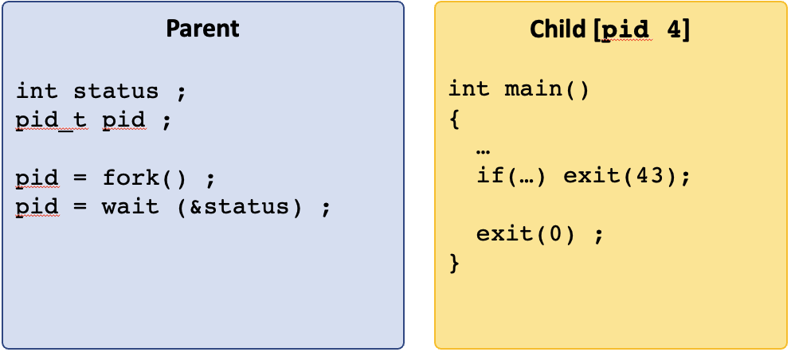
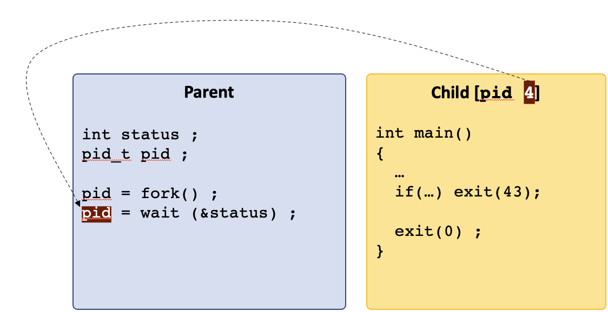
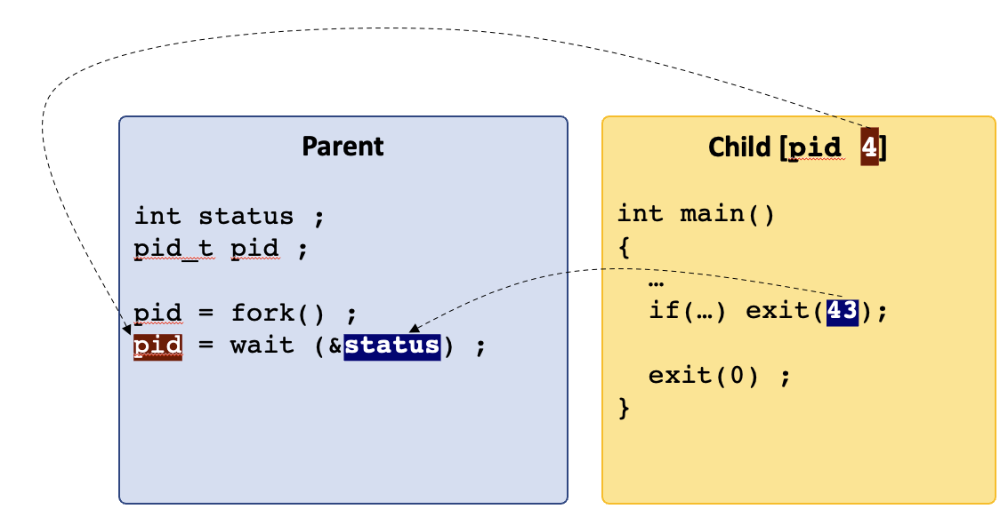
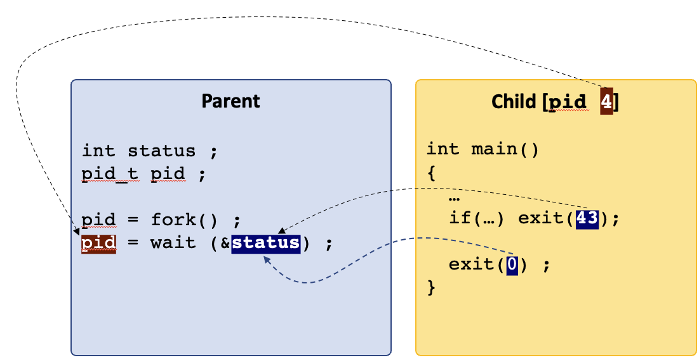

## `wait()`

[Slides](https://sibin.github.io/teaching/csci2410-gwu-systems_programming/fall_2023/slides/reveal_slides/processes.html#/42)

Parents are responsible for managing their children!


so, they...`wait()`!


```c DNE
pid_t wait(int *wstatus)
```

- wait for state changes in a **child**
- called by a **parent**
- parents can wait for, 
- *all* children
- *specific* child
- a *subset* of children

defined in `<sys/wait.h>`

A child changes "*state*" if one of following happens:
- child **terminated/exited**
- child was **stopped by a signal** *
- child was **resumed** by a signal

[* will discuss signals later]

|child status| action |
|-------------|-------------|
| already changed | **return immediately** to parent |
| executing normally | parent **waits**/**blocks** for child|
||

#### `wait()` return value

|return value | meaning |
|-------------|-------------|
| pid via `pid_t` | pid of terminated child |
| `-1` | error |
||


```c DNE
/* CSC 2410 Code Sample 
 * intro to fork() and wait()
 * Fall 2023
 * (c) Sibin Mohan
 */

#include <stdio.h>
#include <unistd.h>
#include <sys/types.h>
#include <sys/wait.h>

int main()
{
        pid_t child_pid ;
        pid_t parent ;

        printf( "------------------------------\n" ) ;
        printf( ":::BEFORE::: \
                 getpid() = %d \
                 parent = %d \
                 child = %d\n",
             getpid(), child_pid, parent ) ;
        printf( "------------------------------\n" ) ;

        // create 5 children
        for( unsigned int i = 0 ; i < 5 ; ++i )
        {
                child_pid = fork() ;

                // make sure the children don't create more children!
                if(!child_pid)
                        break ;
        }

        // wait for the kids
        int wait_status ;
        pid_t wait_result = wait( &wait_status ) ;

        printf( ":::AFTER::: " ) ;
        child_pid ? printf( "---PARENT!--- " ) : printf( "---CHILD!--- " ) ;
        printf( "getpid() = %d \
                 parent = %d \
                 child = %d\n",
             getpid(), child_pid, parent ) ;

        printf( "\n" ) ;
        return 0 ;
}
```

**Note:** the output can **vary!** Depends on which process gets to writing its buffer first.

```
------------------------------
:::BEFORE::: 		 getpid() = 2492442 		 parent = 1612788000 	 	 child = 374366320
------------------------------
:::AFTER::: ---CHILD!--- getpid() = 2492443 		 parent = 0 	 	 child = 374366320

:::AFTER::: ---CHILD!--- getpid() = 2492444 		 parent = 0 	 	 child = 374366320

:::AFTER::: ---CHILD!--- getpid() = 2492445 		 parent = 0 	 	 child = 374366320

:::AFTER::: ---PARENT!--- getpid() = 2492442 		 parent = 2492447 	 	 child = 374366320
:::AFTER::: ---CHILD!--- getpid() = 2492446 		 parent = 0 	 	 child = 374366320


:::AFTER::: ---CHILD!--- getpid() = 2492447 		 parent = 0 	 	 child = 374366320
```
OR
```
------------------------------
:::BEFORE::: 		 getpid() = 2492454 		 parent = -2016386784 	 	 child = 780062336
------------------------------
:::AFTER::: ---CHILD!--- getpid() = 2492455 		 parent = 0 	 	 child = 780062336

:::AFTER::: ---CHILD!--- getpid() = 2492456 		 parent = 0 	 	 child = 780062336

:::AFTER::: ---CHILD!--- getpid() = 2492457 		 parent = 0 	 	 child = 780062336

:::AFTER::: ---CHILD!--- getpid() = 2492458 		 parent = 0 	 	 child = 780062336
:::AFTER::: ---PARENT!--- getpid() = 2492454 		 parent = 2492459 	 	 child = 780062336


:::AFTER::: ---CHILD!--- getpid() = 2492459 		 parent = 0 	 	 child = 780062336
```
OR many other combinations. We are seeing the **inherent nondeterminism** in parallel execution.

### process vs thread

A minor detour. One may ver well be confused about the difference between a "process" and a "thread". The main difference is that a process, *owns resources* while a thread is just a *unit of execution*. This table should help clarify the difference:

|process | thread |
|--------|--------|
|owns resources | unit of execution |
|isolation | share memory |
|system call* | no system call*|
||

\* for creation: *i.e.,* the creation of a process is a **system call**, *i.e.,* we need to ask the operating system to help us since the OS is what allocates resources to newly formed procsses. A new thread, on the other hand, doesn't require us to invoke a system call and is often created using *user-space libraries* (*e.g., look up [pthreads](https://man7.org/linux/man-pages/man7/pthreads.7.html)). 


## `exit()`

[Slides](https://sibin.github.io/teaching/csci2410-gwu-systems_programming/fall_2023/slides/reveal_slides/processes-2-exit.html#/)

`exit` is the function that used to terminate the current process.
```c DNE
void exit(int status);
```
as defined in `<stdlib.h`. The input argument is the **exit status**:
|value| meaning |
|--------|--------|
| `0`| `EXIT_SUCCESS`|
| `1`| `EXIT_FAILURE`|
||

And note that `exit()` does not *explicitly* return any value. All the information is passed via the `status` field.

The following two pieces of code are identical:
```c DNE
#include <stdlib.h>

int main()
{
	exit(EXIT_SUCCESS) ;
}
```
```c DNE
#include <stdlib.h>

int main()
{
	return EXIT_SUCCESS ;
}
```
<br>

### Interpreting `exit()` status

Despite `wait`'s status return value being a simple `int`, the *bits* of that integer mean very specific things. See the `man` page for `wait` for details, but we can use a set of functions (really "macros") to interpret the status value:
- `WIFEXITED(status)` will return `0` if the process didn't exit (e.g. if it faulted instead), and non-`0` otherwise
- `WEXITSTATUS(status)` will get the intuitive integer value that was passed to `exit` (or returned from `main`), but assumes that this value is only 8 bits large, max (thus has a maximum value of 256)

both defined in `<sys/wait.h>`.


### Relationship between `wait()` and `exit()`

The relationship between these two calls can be confusing but they are *closelfy related*. 

1. first `fork()` creates a new child:



2. if the parent is waiting for the child, then the return value of `wait()` is the `pid` of that child.



3. when the **child** calls `exit(status)` then that status is written into the status variable of the `wait(&status)` call. 



**Note:** the interface for `wait()`:
```c DNE
pid_t wait(int *wstatus)
```
the input is a **pointer to an integer**. Hence, the value passed from `exit()` is written into that integer and is **accessible after the `wait()` call returns**. 

4. this goes for *any* `exit()` call from the child.



```c DNE
/* CSC 2410 Code Sample 
 * intro to fork(), wait() and exit()
 * Fall 2023
 * (c) Sibin Mohan
 */


#include <unistd.h>     // fork(), getpid()
#include <sys/wait.h>   // wait()
#include <stdlib.h>     // exit()
#include <stdio.h>


#define NUM_CHILDREN 5

int main()
{
    pid_t pid, child_pid ;

    // create multiple children 
    for( unsigned int i = 0 ; i < NUM_CHILDREN ; ++i )
    {
        pid = fork() ;
        if( !pid )
        {
            // we are inside the child
            printf( "---CHILD %d--- exiting with %d\n", getpid(), i+1 ) ;

            // both of these terminate immediately AND return the same value
            // identical, really!
            if( i % 2 )
                exit( i+1 ) ;
            else
                return i+1 ;
        }
    }

    /* Inside the parent, wait until the wait() call returns -1 -> no more children left
     * take the return value from wait(), put it in "child_pid" and compare that to "-1"
     */
    int status ;
    while( ( child_pid = wait( &status ) ) != -1 )
    {
        // all children are done!
        if( WIFEXITED(status) )
        {
            // check that the process didn't terminate with any errors
            // note that the output of WIFEEXITED is non-zero for normal exit

            printf( "Inside :::PARENT::: where child %d exited with status: %d\n", 
                    child_pid, 
                    (char) WEXITSTATUS(status) ) ;
        }
    }

    printf( "\n" ) ;
    return 0 ;
    // exit(EXIT_SUCCESS) ;
    // return EXIT_SUCCESS ;
}
```

**Note:** the output of this is alo **non-deterministic** as we can see with multiple runs of it:
```
---CHILD 2566089--- exiting with 1
---CHILD 2566090--- exiting with 2
---CHILD 2566091--- exiting with 3
---CHILD 2566092--- exiting with 4
Inside :::PARENT::: where child 2566089 exited with status: 1
---CHILD 2566093--- exiting with 5
Inside :::PARENT::: where child 2566090 exited with status: 2
Inside :::PARENT::: where child 2566091 exited with status: 3
Inside :::PARENT::: where child 2566092 exited with status: 4
Inside :::PARENT::: where child 2566093 exited with status: 5
```
```
---CHILD 2568612--- exiting with 1
---CHILD 2568613--- exiting with 2
---CHILD 2568614--- exiting with 3
---CHILD 2568615--- exiting with 4
Inside :::PARENT::: where child 2568612 exited with status: 1
---CHILD 2568616--- exiting with 5
Inside :::PARENT::: where child 2568613 exited with status: 2
Inside :::PARENT::: where child 2568614 exited with status: 3
Inside :::PARENT::: where child 2568615 exited with status: 4
Inside :::PARENT::: where child 2568616 exited with status: 5
```

This *non-determinism* is a product of the *isolation* that is provided by processes.
The OS switches back and forth between processes frequently (up to thousands of time per second!) so that if one goes into an infinite loop, others will still make progress.
But this also means that the OS can choose to run any of the processes that are trying to execute at any point in time!
We cannot predict the order of execution, completion, or `wait` notification.
This non-deterministic execution is called *concurrency*.
You'll want to keep this in mind as you continue to learn the process APIs, and when we talk about IPC, later.

### life after `exit()`?

Remember that when `main()` returns, it is the same as `exit()` because **main() calls exit()**.

> **Investigating `main` return → `exit` via `gdb`.**
> You can see this by diving into any program with `gdb -tui`, breakpointing before the return (e.g. `b 5`), and single-stepping through the program.
> You'll want to `layout asm` to drop into "assembly mode", and single step through the assembly and if you want to step through it instruction at a time use `stepi` or `si`.
> You can see that it ends up calling `__GI_exit`.
> `__GI_*` functions are glibc internal functions, so we see that `libc` is actually calling `main`, and when it returns, it is then going through its logic for `exit`.

`C` provides you with additional control of what happens when you exit from a program. For instance, you may need to *clean up resources*, *e.g.,* release some memory, close some files or network connections, write some debug information to a file, *etc.* Hence, the following functions *can be* are called once `exit()` is invoked:
|function| defined in |
|--------|--------|
| `on_exit`| `<stdlib.h>`|
| `atexit`| `<stdlib.h>`|
| `_exit`| `<unistd.h>`|
||

Let's look at these in more details.

#### `on_exit()`
```c DNE
typdef void (*function)( int , void * ) ;
int on_exit( function my_func, void *arg ) ;
```
- register a *user-defined*  **function pointer**
- `my_func`
- to be called while exiting from `main()`<br>
`typdef void (*function)( int , void * ) ;`
- function receives &rarr; exit `status` & `argument`
- we can pass data/args to that function


#### `atexit()`

```c 
typedef void (*function)(void) ;
int atexit(function my_func);
```
- register a *user-defined*  **function pointer**
- `my_func`
- to be called while exiting from `main()`<br>
`typedef void (*function)(void) ;`
- **much simpler** function/interface &rarr; **no** args!
-  **no** data/args passed to that function

**Note:** some nuances:
1. neither `atexit()` nor `on_exit()` immediately terminate the process.
2. you can register **multiple** functions using either one; these are called in **reverse** order of registrations
3. `atexit()` is *standard* `c`, while `on_exit()` *may not* be!


#### `_exit()`
`void _exit(int status);`

- **immediate** termination of process!
- no return value
- output buffers are **not** flushed
- **does not** call the funcs registered by others

```c DNE
/* CSC 2410 Code Sample 
 * intro to fork(), wait() and exit()
 * Fall 2023
 * (c) Sibin Mohan
 */


#include <unistd.h>     // fork(), getpid()
#include <sys/wait.h>   // wait()
#include <stdlib.h>     // exit()
#include <stdio.h>


#define NUM_CHILDREN 1

// function signature to match on_exit()
void cleanup( int status, void* args )
{
    free( args ) ;
    printf( "AFTER Exit(): Doing some cleanup. Freeing memory %hhx status = %d\n", args, status ) ;
}

void simple_cleanup()
{
    printf( "Goodbye cruel world!\n" ) ;
}

int main()
{
    pid_t pid, child_pid ;

    int* some_memory = (int*)malloc(1024) ;
    // register the function and also tell it what to cleanup
    on_exit( cleanup, some_memory ) ;

    // register the simpler atexit function
    atexit(simple_cleanup) ;
    

    // create multiple children 
    for( unsigned int i = 0 ; i < NUM_CHILDREN ; ++i )
    {
        pid = fork() ;
        if( !pid )
        {
            // we are inside the child
            printf( "---CHILD %d--- exiting with %d\n", getpid(), i+1 ) ;

            // both of these terminate immediately AND return the same value
            // identical, really!
            if( i % 2 )
                exit( i+1 ) ;
            else
                return i+1 ;
        }
    }

    /* Inside the parent, wait until the wait() call returns -1 -> no more children left
     * take the return value from wait(), put it in "child_pid" and compare that to "-1"
     */
    int status ;
    while( ( child_pid = wait( &status ) ) != -1 )
    {
        // all children are done!
        if( WIFEXITED(status) )
        {
            // check that the process didn't terminate with any errors
            // note that the output of WIFEEXITED is non-zero for normal exit

            printf( "Inside :::PARENT::: where child %d exited with status: %d\n", 
                    child_pid, 
                    (char) WEXITSTATUS(status) ) ;
        }
    }

    printf( "\n" ) ;
    return 0 ;
    // exit(EXIT_SUCCESS) ;
    // return EXIT_SUCCESS ;
}
```

The output:
```
---CHILD 2608965--- exiting with 1
Goodbye cruel world!
AFTER Exit(): Doing some cleanup. Freeing memory a0 status = 1
Inside :::PARENT::: where child 2608965 exited with status: 1

Goodbye cruel world!
AFTER Exit(): Doing some cleanup. Freeing memory a0 status = 0
```

But, what happens if we change the following lines?
```c DNE
    // register the simpler atexit function
    atexit(simple_cleanup) ;

    int* some_memory = (int*)malloc(1024) ;
    // register the function and also tell it what to cleanup
    on_exit( cleanup, some_memory ) ;
```

The output now looks like (what's the difference?):
```
---CHILD 2609577--- exiting with 1
AFTER Exit(): Doing some cleanup. Freeing memory a0 status = 1
Goodbye cruel world!
Inside :::PARENT::: where child 2609577 exited with status: 1

AFTER Exit(): Doing some cleanup. Freeing memory a0 status = 0
Goodbye cruel world!
```

Finally, we change the `return (i+1)` to `_exit(i+1)` as follows:
```c DNE
            if( i % 2 )
                exit( i+1 ) ;
            else
                // return i+1 ;
                _exit(i+1) ;
```

What does the output look like now?
```
---CHILD 2610300--- exiting with 1
Inside :::PARENT::: where child 2610300 exited with status: 1

AFTER Exit(): Doing some cleanup. Freeing memory a0 status = 0
Goodbye cruel world!
```