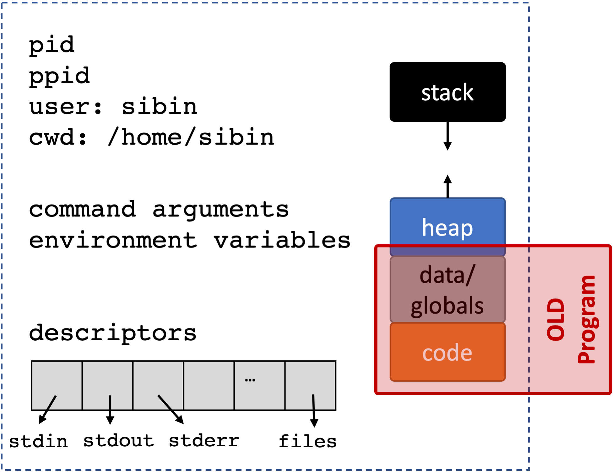

## Executing Other Processes 

`fork()` only makes clones of *itself*. So, we're limited to the functions defined in that program. A shell can execute **other programs**! Recall the difference between a program and process:
- program &rarr; **compiled** version of code
- process &rarr; program **executing** in memory

So, we want to create a new process and then **execute a new program**. This is done via the `exec()` *family* of calls:

```C DNE
     int execl(const char *path, const char *arg0, ..., /*, (char *)0, */);
     int execle(const char *path, const char *arg0, ..., /* (char *)0 char *const envp[] */);
     int execlp(const char *file, const char *arg0, ..., /*, (char *)0, */);
     int execv(const char *path, char *const argv[]);
     int execvp(const char *file, char *const argv[]);
     int execvP(const char *file, const char *search_path, char *const argv[]);
```

They are defined in `<unistd.h>`.

These calls will do the following:
- Stop executing in the current process.
- Reclaim all memory within the current process.
- Load the target program into the process.
- Start executing in the target program (i.e. starting normally, resulting in `main` execution).

**Note:** the main insight is that the **same process continues execution** but **it now executes a new program**.

### Sequence of operations
1. initial process executing [parent]


2. `fork()` a new process [child]:


  
3. replace **old** code [child]


                      
 
4. with **new** code [child]


  

5. with **new** code [child]


  

6. reclaim resources [child]


  

7. execute **new** program [child | from `main()`]


  

<br>

A few handy side-effects:

- The execution of the new program inherits the process identifier (`pid_t`) and the parent/child relationships of the process.
- Comparably, the *descriptors* are inherited into the new program's execution.
- The environment variables (see section below) pass to the new program's execution.
- Many other process properties are comparably inherited.
    With the exception of the process memory, you can assume, by default, that process properties are inherited across an `exec`.

**Good** side effects | Shared Resources


  

<br>

**Note:** only memory **not** shared | Resources not Shared


  

<br>


> **Detour**: Variadic functions.
> 
> Sometimes, *we don't know how many arguments are needed for a function*, *e.g.*, `printf()`. 
> Also, command line functions, *e.g.,* `ls` vs `ls -l`. In this instance, the shell is calling `fork()` and one of the `exec()` functions to launch `ls` which starts from...its own `main()`. 
>
> So, how does `ls` (or any other program) know what arguments are passed to it, and more importantly, **how many**?
> 
> The *actual* signature of `main()` is:
> ```C DNE
> int main( int argc, char* argv[] )
> ```
> - `argc` tells us *now many* arguments have been passed and 
> - `char* argv[]` is the actual set of arguments, i.e. *an array of strings*!
>
> **Note**: the *first* argument is always the **name of the program**! Hence, we always have *at least one* argument.

```C
/* CSC 2410 Code Sample 
 * exec() family of system calls | arguments to main()
 * Fall 2023
 * (c) Sibin Mohan
 */


#include <stdio.h>
#include <unistd.h>
#include <stdlib.h>
#include <sys/wait.h>
#include <errno.h>

int main( int argc, char* argv[] ) 
{
    if( argc )
    {
        // we get a positive number of arguments
        // note that the first argument is always the name of the program
        // so we ALWAYS have AT LEAST ONE argument

        printf( "Command Line Args received:\t" ) ;
        for( unsigned int i = 0 ; i < argc ; ++i )
        {
            printf( "%s ", argv[i] ) ;
        }
    } 

    printf( "\n" ) ;
    return 0 ;
}
```


## `exec_()` family

Multiple ways to launch a new program:
- `execl`
- `execlp`
- `execle`
- `execv`
- `execvp`

The naming scheme is quite annoying and hard to remember, but the `man` page has a decent summary.
The trailing characters correspond to specific operations that differ in how the command-line arguments are passed to the `main`:

1. `execl()` and `execlp()`:  pass the argmuments *directly* to the `exec()` call:

```C DNE
 int execl( const char *path, const char *arg, ..., (char*)0 ) ;
```

 The program gets the argument via the `argc` and `argv` method described earlier. 

 **Note:** the last argument has to be `(char*)0`, *i.e.,* a `NULL`. This is so that the progam can figure out when the list of arguments is done.

2. `execv()` and `execvp()`: pass argmuments in **null terminated array**, `argv[]`

```C DNE
int execv( const char *path, char *const argv[] ) ;
```

The caller *actually creates* an **array of strings** and passes the arguments using that. 

**Note:** *no `NULL` termination* in the function call.

3. `execle()` and `execvpe()`: **environment variables** of caller are passed

```C DNE
int execle( const char *pathname, const char *arg, .../*, (char *) NULL, char *const envp[] */ ) ;
int execvpe(const char *file, char *const argv[], char *const envp[]) ;
```


 (`l` means pass the arguments to this `exec` call to the program,  while `v` means pass the arguments as an array of the arguments into the `exec` call), how the program's path is specified (by default, an "absolute path" starting with `/` must be used, but in a `v` variant, the binary is looked up using comparable logic to your shell), and how environment variables are passed to the program.
For now, we'll simply use `execvp`, and cover the rest in subsequent sections.

### `execve()`

All of the above are layers on top of `execve()`

```C DNE
#include "unistd.h"

int execve(const char *pathname, char *const argv[],
char *const envp[]);

```

### `fork()` and `exec()`

Consider the following piece of code:

```C
/* CSC 2410 Code Sample 
 * exec() 
 * Fall 2023
 * (c) Sibin Mohan
 */

#include <stdio.h>
#include <unistd.h>     // fork(), getpid()
#include <sys/types.h>  // pid_t
#include <sys/wait.h>   // wait()
#include <stdlib.h>     // exit()

// int main() // not actual signature
int main( int argc, char* argv[] )
{
    char* program = "/bin/ls" ;
    char* arg1 = "-al" ;
    char* arg2 = "/home" ;

    printf( "BEFORE EXEC!\n" ) ;

    int ret = execl( program, "banana", arg1, arg2, NULL ) ;

    printf( "AFTER EXEC!\n" ) ;

    printf( "\n" ) ;
    return 0 ;
}
```

**Note:** the `printf( "AFTER EXEC!\n" ) ;` and further code will **never** execute as the code for the *current* process is **completely replaced** by the code for the program called using `execl()`, *i.e.,* `/bin/ls`. 

So, to get the behavior that *we want*, *i.e.,* for some post-processing/messages, *etc.*, we must first `fork()` and new child process and then run `execl()` **in the child process**!

Updating the previous code:
```C
/* CSC 2410 Code Sample 
 * exec() 
 * Fall 2023
 * (c) Sibin Mohan
 */

#include <stdio.h>
#include <unistd.h>     // fork(), getpid()
#include <sys/types.h>  // pid_t
#include <sys/wait.h>   // wait()
#include <stdlib.h>     // exit()

// int main() // not actual signature
int main( int argc, char* argv[] )
{
    char* program = "/bin/ls" ;
    char* arg1 = "-al" ;
    char* arg2 = "/home" ;

    printf( "BEFORE EXEC!\n" ) ;

    pid_t child = fork() ;

    if( !child)
    {
        // in child process
        int ret = execl( program, "banana", arg1, arg2, NULL ) ;

        // ideally never comes here!
        // as the child process' code has now been replaced
        perror("what happened!") ;
    }

    int status ;
    pid_t pid = wait(&status) ;

    if( WIFEXITED(status) )
    {
            // the child exited normally
            printf( "--PARENT--: Child %d exited with status %d\n",
                    pid, WEXITSTATUS(status) ) ;
    }

    printf( "AFTER EXEC!\n" ) ;

    printf( "\n" ) ;
    return 0 ;
}
```

### Launch **Any** Child Processes

If we have **another** program that we've written, *e.g.*, `child1.c`:
```C DNE
/* CSC 2410 Code Sample 
 * exec() child 1
 * Fall 2023
 * (c) Sibin Mohan
 */

#include <stdio.h>
#include <unistd.h>

int main(int argc, char* argv[])
{
    /* Does nothing. Just prints the arguments passed to this program */
    printf( "INSIDE CHILD 1: argc = %d, argv[0] = %s, argv[1] = %s, argv[2] = %s\n", 
                                            argc, argv[0], argv[1], argv[2] ) ;
 
    return 0 ;
}
```

Once it is compiled and linked and ready as an executable, say, `child1`, we can do:
```C DNE
/* CSC 2410 Code Sample 
 * exec() 
 * Fall 2023
 * (c) Sibin Mohan
 */

#include <stdio.h>
#include <unistd.h>     // fork(), getpid()
#include <sys/types.h>  // pid_t
#include <sys/wait.h>   // wait()
#include <stdlib.h>     // exit()

// int main() // not actual signature
int main( int argc, char* argv[] )
{
    char* program = "./child1" ;
    char* args = "hello" ;
    char* args2 = "world" ;

    pid_t child = fork() ;

    if( !child)
    {
        // in child process
        int ret = execl( program, "banana", args, args2, NULL ) ;

        // ideally never comes here!
        perror("what happened!") ;
    }

    int status ;
    pid_t pid = wait(&status) ;

    if( WIFEXITED(status) )
    {
            // the child exited normally
            printf( "--PARENT--: Child %d exited with status %d\n",
                    pid, WEXITSTATUS(status) ) ;
    }

    printf( "\n" ) ;
    return 0 ;
}
```