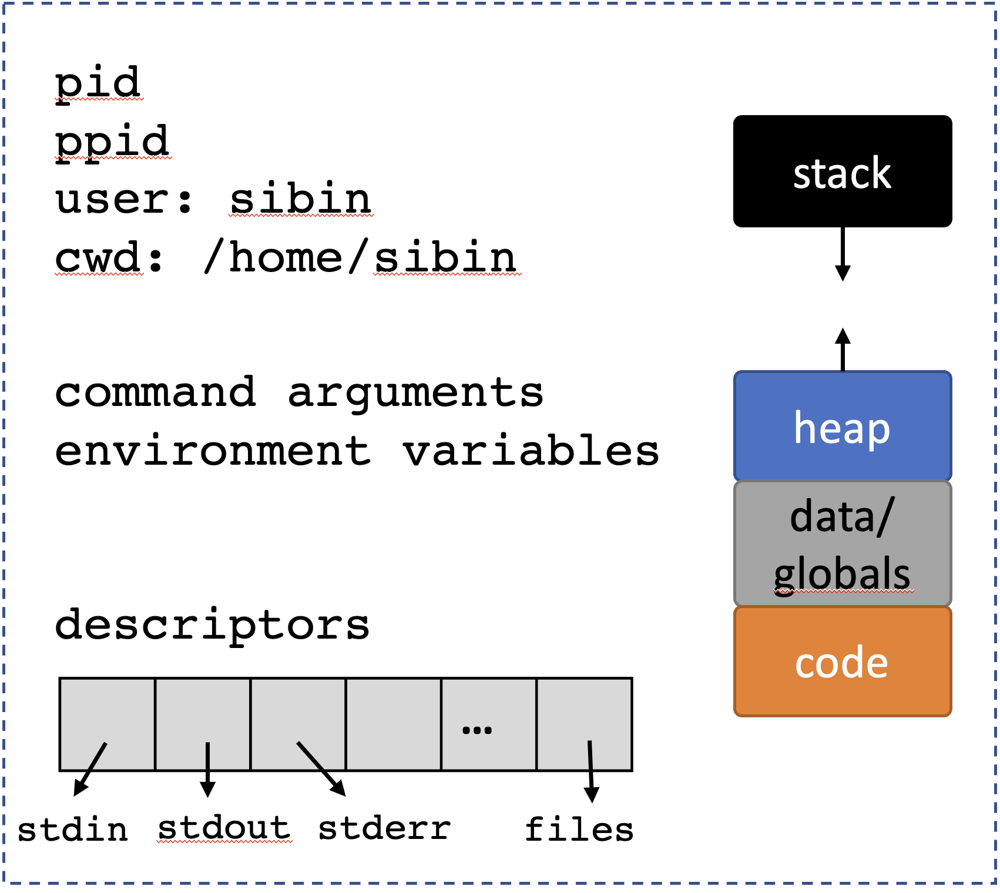

# Process Descriptors

[Slides](https://sibin.github.io/teaching/csci2410-gwu-systems_programming/fall_2023/slides/reveal_slides/process_descriptors.html)

We’re going to start discussing how processes can **manipulate the resources** it has access to.

### Key Mechanisms
for a process to use effectively

- current working directory, `pwd`
- ability to manipulate **descriptors**
    - "file descriptors"
- controlling "exceptional" control flow, via **signals**


### current working directory

- each process has a "working directory"
- base for any relative pathrs
- all file system paths are one of,
    - absolute paths &rarr; they begin with "/"
    - relative paths

Relative paths are quite frequently used when we interact with the shell. Every time you type `cd blah/`, you’re saying “please change the current working directory to  `blah/`" which is a directory in the current working directory. 

A simple API to interact with the current working directory:
|function| operation |
|--------|--------|
| `getcwd`| gets the current process' working dir |
| `chdir`| enables process to change dir |
||

both defined in `<unistd.h>`.

A quick listing of the *directory structure* of Linux:


Let's look at a simple code example:
```C
#include <unistd.h>
#include <assert.h>
#include <stdio.h>
#include <stdlib.h>

int main(void)
{
    char *wd = getcwd(NULL, 0);

    assert(wd);
    printf("Current directory: %s\n", wd);
    free(wd);

    if (chdir("..") == -1) {
        perror("chdir");
        abort();
    }
    wd = getcwd(NULL, 0);
    printf("New current dir: %s\n", wd);
    free(wd);

    printf( "\n" ) ;
    return 0;
}
```
<br>

**Note:** the command `cd` is actually **not** a program, and is instead a *shell-internal function*. Try using the `which` program (used to find the location of a *known* program):

```
$ which ls
/bin/ls
$ which pwd
/bin/pwd
$ which cd
$
```

### Process Descriptors

- each process has a set of **descriptors**
- associated with a system resource
    - integer &rarr; passed to a family of APIs



<br>

Most processes have **at least** three:
|number | descriptor | What it is |
|--------|--------|--------|
|`0` | `STDIN_FILENO` | standard **input** |
|`1` | `STDOUT_FILENO` | standard **output** |
|`2` | `STDERR_FILENO` | standard **error** `perror()`|
||

defined in `unistd.h`.
    

#### Standard **input**, **output** and **error**

- *infinite* sequence of bytes or "channels"
- can terminate, if they run out of data
    - *e.g.*, reaches end of file
    - user hits `ctrl-d`


When we type at the shell, we’re providing a channel of data that is sent to the standard input of the active process. When a process prints, it sends a sequence of characters to the standard output, and because programs can loop, that stream can be **infinite**! 

`STDIN_FILENO` = `0` is the *standard input*, or the main way the process gets input from the system. As such, the resource is often the terminal if the user directly provides input, or sometimes the output of a previous stage in a command-line pipeline. `STDOUT_FILENO` = `1` is the *standard output*, or the main way the process sends its output to the system. When we call `printf`, it will, by default, output using this descriptor. `STDERR_FILENO` = `2` is the *standard error*, or the main way that the process outputs error messages. `perror` (and other error-centric APIs) output to the standard error.

Each of these descriptors is associated with a potentially infinite sequence of bytes, or *channel*^["Channel" is a term that is heavily overloaded, but I'll inherit the general term from the [glibc documentation](https://www.gnu.org/software/libc/manual/html_node/Stream_002fDescriptor-Precautions.html).].
When we type at the shell, we're providing a channel of data that is sent to the standard input of the active process.
When a process prints, it sends a sequence of characters to the standard output, and because programs can loop, that stream can be infinite!
Channels, however, *can* terminate if they run out of data.
This could happen, for example, if a channel reading through a file reaches the end of the file, or if the user hits `cntl-d` on their terminal to signify "I don't have any more data".

### File Descriptor Operations

Now these are **file descriptors** so we treat them as **files**!

File descriptors are *analogous* to pointers. The descriptors effectively *point to channel resources*. 

Some core operations on files:
|operation| interface |
|---------|-----------|
|**pull** bytes from channel into buffer | `read` | 
|**send** bytes from channel into buffer | `write`
|**duplicate** a file descriptor | `dup/dup2/dup3` |
|**deallocate** a file descriptor | `close` |
||

**Note:**:
- `printf()` is a `write` to standard out
- `close` doesn't necessarily remove channel
    - analogous to removing a pointer

#### `dup()` vs `dup2()` vs `dup3()`

- `dup()` returns smallest unused number as `fd`
- `dup2()` same as dup() but uses given `fd`
- if given `fd` exists, then it is closed, *atomically*
- `dup3()` same as `dup2()` but takes flags as input

Look at the `man dup` page for more information.

Let's see some of these calls in action:
```C 
#include <stdio.h>
#include <string.h>
#include <unistd.h>
#include <assert.h>
#include <stdlib.h>

int
main(void)
{
    char *hw = "hello world\n";
    char output[256];
    int fd;
    ssize_t amnt; /* signed size */

    amnt = write(STDOUT_FILENO, hw, strlen(hw));
    if (amnt == 0) { /* maybe STDOUT writes to a file with no disk space! */
        /* this is *not* an error, so errno not set! */
        printf("Cannot write more data to channel\n");
        exit(EXIT_FAILURE);
    } else if (amnt > 0) {
        /* normally, the return value tells us how much was written */
        assert(amnt == (ssize_t)strlen(hw));
    } else { /* amnt == -1 */
        perror("Error writing to stdout");
        exit(EXIT_FAILURE);
    }

    amnt = write(STDERR_FILENO, hw, strlen(hw));
    assert(amnt >= 0);

    fd = dup(STDOUT_FILENO);
    assert(fd >= 0);

    /* We can write formatted data out to stdout manually! */
    snprintf(output, 255, "in: %d, out: %d, err: %d, new: %d\n",
             STDIN_FILENO, STDOUT_FILENO, STDERR_FILENO, fd);
    output[255] = '\0';
    amnt = write(fd, output, strlen(output));
    /* new file descriptors are supposed to use the lowest unused descriptor! */

    /* make a descriptor available */
    close(STDIN_FILENO); /* STDIN is no longer really the input! */
    fd = dup(STDOUT_FILENO);
    printf("New descriptor @ %d\n", fd);

    return 0;
}
```

You can run this, and redirect the standard error to a file to see that writing to standard error is a different operation than writing to standard output.
For example: `$ prog 2> errors.txt` will redirect file descriptor `2` (stderr) to the file.

Lets focus in a little bit on `read` and `write`. First, it is notable that the buffer they take as an argument (along with its length) is simply an array of bytes. It can be a string, or it could be the bytes that are part of an encoded video. Put another way, by default, *channels are just sequences of bytes*. It is up to our program to interpret those bytes properly.

Second, we need to understand that the return value for `read`/`write` has four main, interesting conditions:

```c DNE
#include <unistd.h>
#include <stddef.h>
#include <string.h>
#include <errno.h>

int
main(void)
{
	ssize_t amnt;
	char *hi = "more complicated than you'd think...";
	ssize_t hi_sz = strlen(hi);

	amnt = write(STDOUT_FILENO, hi, hi_sz);

	/* Can often mean that we are not able to write to the resource */
	if (amnt == 0) {
	    /*
		 * Keep trying to write, or give up.
		 * Common return value for `read` when a file has no more data, or a pipe is closed.
		 */
	} else if (amnt > 0 && amnt < hi_sz) {
		/*
		 * Didn't write everythign we wanted, better call write again sending
		 * data starting at `&hi[amnt]`, of length `hi_sz - amnt`.
		 */
	} else if (amnt == hi_sz) {
		/*
		 * Wrote out everything! Wooo!
		 */
	} else { /* amnt == -1 */
		/* Could be a genuine error, but not always... */
		if (errno == EPIPE || errno == EAGAIN || errno == EINTR || errno == EWOULDBLOCK) {
		    /* conditions we should probably handle properly */
		} else {
		    /* error in the channel! */
		}
	}

	return 0;
}
```

It is common to have a convention on how channel data is structured.
UNIX pipeline encourage channels to be plain text, so that each program can read from their standard input, do some processing that can involved filtering out data or transforming it, and send the result to the standard out.
That standard output is sent to the standard input of the next process in the pipeline.
An example in which we print out each unique program that is executing on the system:

```
$ ps aux | tr -s ' ' | cut -d ' ' -f 11 | sort | uniq
```

Each of the programs in the pipeline is not configured to print out each unique process, and we are able to compose them together in a pipeline to accomplish the goal.
