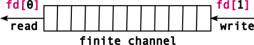

## Pipes

[Slides](https://sibin.github.io/teaching/csci2410-gwu-systems_programming/fall_2023/slides/reveal_slides/pipes.html)

Processes have resources


Note that descriptors `0-2` are automatically set up: 
- `STDIN_FILENO`
- `STDOUT_FILENO`
- `STDERR_FILENO`

But how do we *create* resources? But first off, **what** are resources? There are many different resources in a UNIX system, but three of the main ones:

1. `files` and other file-system objects (e.g. directories),
2. `sockets` that are used to communicate over the network, and
3. communication facilities like `pipe`s that are used to send data and coordinate between processes.

Each of these has very different APIs for creating the resources. We'll discuss files later, and will now focus on **`pipe`s**.

We've seen pipes before:
```
$ ps aux | tr -s ' ' | cut -d ' ' -f 11 | sort | uniq
```
(look up each of those commands).

Not what we're talking about...well, not exactly!

### unix 'pipes'

(short for "*pipelines*")

A finite *channel* &rarr; a sequence of bytes:


A pipe is accessed using **two (file) descriptors**^[We see why the name "file" in file descriptors is not very accurate. Recall that I'm using the traditional "file descriptors" to denote all of our generic descriptors.],

|descriptor| function |
|----------|----------|
| `fd[0]` | read |
| `fd[1]` | write|
||

This can be represented as follows:



The sequence of bytes written to the pipe will be correspondingly read out *in a FIFO* manner.

### pipes api

```C DNE
int pipe( int pipefd[2] ) ;
```

defined in `<unistd.h>`. 

The `pipe` and `pipe2` functions create a pipe resource, and return the two file descriptors that reference the readable and writable ends of the pipe.

**Return values**

|value| meaning|
|----------|----------|
| `0` | success |
| `1` | failed |
||

We use a familiar interface to send/receive data from a pipe, *viz.*, `read()` and `write()`.

Let's look at a simple example of how to use a `pipe`.

```C DNE
/* CSC 2410 Code Sample 
 * intro to pipes
 * Fall 2023
 * (c) Sibin Mohan
 */

#include <unistd.h>
#include <stdio.h>
#include <stdlib.h>
#include <errno.h>
#include <string.h>
#include <assert.h>
#include <sys/param.h> /* MIN */

#define BUFFER_SIZE 16

int main()
{
    char from[BUFFER_SIZE] = {'\0'} ;
    char to[BUFFER_SIZE] = {'\0'} ;

    int pipe_fds[2] ; // the two FDs for reading/writing

    memset( from, 'x', BUFFER_SIZE-1 ) ;
    memset (to, '-', BUFFER_SIZE-1 ) ;

    if( pipe(pipe_fds) )
    {
        // non zero is an error!
        perror( "Pipe creation failed!" ) ;
        exit( EXIT_FAILURE ) ;
    }

    printf( "BEFORE\n\t from: %s\n\t to: %s\n", from, to ) ;

    ssize_t write_return = write( pipe_fds[1], &from, BUFFER_SIZE ) ;
    assert( write_return == BUFFER_SIZE ) ; // check how many bytes were written

    ssize_t read_return = read( pipe_fds[0], &to, BUFFER_SIZE ) ;

    printf( "AFTER\n\t from: %s\n\t to: %s\n", from, to ) ;


    printf( "\n" ) ;
    return 0 ;
}
```

Output, as expected:

```
BEFORE
         from: xxxxxxxxxxxxxxx
         to: ---------------
AFTER
         from: xxxxxxxxxxxxxxx
         to: xxxxxxxxxxxxxxx
```

Now, let's change things a bit. Let's make the `from` buffer really **LARGE**!

```C DNE
/* CSC 2410 Code Sample 
 * intro to pipes
 * Fall 2023
 * (c) Sibin Mohan
 */

#include <unistd.h>
#include <stdio.h>
#include <stdlib.h>
#include <errno.h>
#include <string.h>
#include <assert.h>
#include <sys/param.h> /* MIN */

#define BUFFER_SIZE 16
#define LARGE_BUFFER_SIZE 1<<18


int main()
{
    char from[LARGE_BUFFER_SIZE] = {'\0'} ;
    char to[BUFFER_SIZE] = {'\0'} ;

    int pipe_fds[2] ; // the two FDs for reading/writing

    memset( from, 'x', LARGE_BUFFER_SIZE-1 ) ;
    memset (to, '-', BUFFER_SIZE-1 ) ;

    if( pipe(pipe_fds) )
    {
        // non zero is an error!
        perror( "Pipe creation failed!" ) ;
        exit( EXIT_FAILURE ) ;
    }

    ssize_t write_return = write( pipe_fds[1], &from, LARGE_BUFFER_SIZE ) ;
    printf( "Here!\n" ) ;
    assert( write_return == LARGE_BUFFER_SIZE ) ; // check how many bytes were written

    ssize_t read_return = read( pipe_fds[0], &to, BUFFER_SIZE ) ;

    printf( "AFTER\n\t to: %s\n", from, to ) ;


    printf( "\n" ) ;
    return 0 ;
}
```

Output is empty and the program **doesn't terminate**. Why? Two reasons:

1. the size of a pipe is **limited** (usually `64k` on moder linux)
2. `write()` **blocks** until a `read()` clears some space in the pipe buffer.

You can get/set the size of the pipe buffer. See `man 7 pipe` for more details.

so, what do we need to do? We need to **clear** the pipe buffer by using `read`.

Why does this not work?
```C DNE
/* CSC 2410 Code Sample 
 * intro to pipes
 * Fall 2023
 * (c) Sibin Mohan
 */

#include <unistd.h>
#include <stdio.h>
#include <stdlib.h>
#include <errno.h>
#include <string.h>
#include <assert.h>
#include <sys/param.h> /* MIN */

#define BUFFER_SIZE 16
#define LARGE_BUFFER_SIZE 1<<18


int main()
{
    char from[LARGE_BUFFER_SIZE] = {'\0'} ;
    char to[LARGE_BUFFER_SIZE] = {'\0'} ;

    int pipe_fds[2] ; // the two FDs for reading/writing

    memset( from, 'x', LARGE_BUFFER_SIZE-1 ) ;
    memset (to, '-', LARGE_BUFFER_SIZE-1 ) ;

    if( pipe(pipe_fds) )
    {
        // non zero is an error!
        perror( "Pipe creation failed!" ) ;
        exit( EXIT_FAILURE ) ;
    }

    ssize_t write_return = write( pipe_fds[1], &from, LARGE_BUFFER_SIZE ) ;
    printf( "Here!\n" ) ;
    assert( write_return == LARGE_BUFFER_SIZE ) ; // check how many bytes were written

    ssize_t read_return = read( pipe_fds[0], &to, LARGE_BUFFER_SIZE ) ;

    printf( "\n" ) ;
    return 0 ;
}
```

Because the `write()` is *still blocked*! We haven't cleared the pipe buffer. The `write()` call *has not returned* and so the `read()` call *cannot run*! 

**Note**: this is not parallel execution!

So, let's fix it. By writing and reading inside a loop, using **smaller chunks** of read/write each time.

```C DNE
/* CSC 2410 Code Sample 
 * intro to pipes
 * Fall 2023
 * (c) Sibin Mohan
 */

#include <unistd.h>
#include <stdio.h>
#include <stdlib.h>
#include <errno.h>
#include <string.h>
#include <assert.h>
#include <sys/param.h> /* MIN */

#define BUFFER_SIZE 16
#define LARGE_BUFFER_SIZE 1<<18

#define WRITE_CHUNK 1<<8


int main()
{
    char from[LARGE_BUFFER_SIZE] = {'\0'} ;
    char to[LARGE_BUFFER_SIZE] = {'\0'} ;

    int pipe_fds[2] ; // the two FDs for reading/writing

    memset( from, 'x', LARGE_BUFFER_SIZE-1 ) ;
    memset (to, '-', LARGE_BUFFER_SIZE-1 ) ;

    int buffer_size = sizeof(from) ;

    if( pipe(pipe_fds) )
    {
        // non zero is an error!
        perror( "Pipe creation failed!" ) ;
        exit( EXIT_FAILURE ) ;
    }

    size_t written = 0 ;
    while( buffer_size )
    {
        ssize_t write_return, read_return ;
        size_t write_amount = MIN( buffer_size, WRITE_CHUNK ) ;

        write_return = write( pipe_fds[1], &from[written], write_amount ) ;
        if( write_return < 0 )
        {
            perror( "Error writing to pipe!" ) ;
            exit(EXIT_FAILURE) ;
        }

        read_return = read( pipe_fds[0], &to[written], write_return ) ;
        assert( read_return == write_return ) ;

        // what's going on here?
        buffer_size -= write_return ;
        written += write_return ;
    }

    assert( memcmp( from, to, sizeof(from) ) == 0 ) ;
    printf( "from and to are IDENTICAL!\n" ) ;

    printf( "\n" ) ;
    return 0 ;
}
```

Now, let's make this more interesting (and actually useful)! Let's send data **between processes**, **i.e.,** using `fork()`!


```c
#include <unistd.h>
#include <stdio.h>
#include <stdlib.h>
#include <errno.h>
#include <assert.h>

/* Large array containing 2^20 characters */
char from[1 << 20];
char to[1 << 20];

int main(void)
{
	int pipe_fds[2]; /* see `man 3 pipe`: `[0]` = read end, `[1]` = write end */
	pid_t pid;
	size_t buf_sz = sizeof(from);

	if (pipe(pipe_fds) == -1) {
		perror("pipe creation");
		exit(EXIT_FAILURE);
	}

	/* descriptors copied into each process during `fork`! */
	pid = fork();

	if (pid < 0) {
		perror("fork error");
		exit(EXIT_FAILURE);
	} else if (pid == 0) { /* child */
		ssize_t ret_w;

	    close(pipe_fds[0]); /* we aren't reading! */
		ret_w = write(pipe_fds[1], from, buf_sz);
		if (ret_w < 0) {
			perror("write to pipe");
			exit(EXIT_FAILURE);
		}
		assert((size_t)ret_w == buf_sz);
		printf("Child sent whole message!\n");
	} else { /* parent */
		ssize_t ret_r;
		ssize_t rest = buf_sz, offset = 0;

	    close(pipe_fds[1]); /* we aren't writing! */
		while (rest > 0) {
			ret_r = read(pipe_fds[0], &to[offset], rest);
			if (ret_r < 0) {
				perror("read from pipe");
				exit(EXIT_FAILURE);
			}
			rest   -= ret_r;
			offset += ret_r;
		}

		printf("Parent got the message!\n");
	}

	return 0;
}
```

The *concurrency* of the system enables separate processes to be active at the same time, thus for the `write` and `read` to be transferring data through the pipe *at the same time*. This simplifies our code as we don't need to worry about sending chunks of our data.

Note that we're `close`ing the end of the pipe that we aren't using in the corresponding processes.
Though the file descriptors are identical in each process following `fork`, each process does have a *separate* set of those descriptors. Thus closing in one, doesn't impact the other.

Remember, processes provide  **isolation**!

### The Shell

We can start to understand part of how to a shell might be implemented now!

**Setting up pipes.**
Lets start with the more obvious: for each `|` in a command, the shell will create a new `pipe`.
It is a little less obvious to understand how the standard output for one process is hooked up through a `pipe` to the standard input of the next process.
To do this, the shell does the following procedure:

1. Create a `pipe`.
2. `fork` the processes (a `fork` for each process in a pipeline).
3. In the *upstream* process `close(STDOUT_FILENO)`, and `dup2` the writable file descriptor in the pipe into `STDOUT_FILENO`.
4. In the *downstream* process `close(STDIN_FILENO)`, and `dup2` the readable file descriptor in the pipe into `STDIN_FILENO`.

Due to this *careful* usage of `close` to get rid of the old standard in/out, and `dup` or `dup2` to methodically replace it with the pipe, we can see how the shell sets up the processes in a pipeline!

Lets go over an example of setting up the file descriptors for a child process.
This does *not* set up the pipe-based communication between *two children*, so is not sufficient for a shell; but it is well on the way.
Pipes contain arbitrary streams of bytes, not just characters.
This example will

1. setup the input and output of two files to communicate over a pipe, and
2. send and receive binary data between processes.

```c
#include <stdlib.h>
#include <stdio.h>
#include <unistd.h>
#include <sys/wait.h>

void perror_exit(char *s)
{
	perror(s);
	exit(EXIT_FAILURE);
}

int main(void)
{
	int fds[2];
	pid_t pid;

	/* make the pipe before we fork, so we can acccess it in each process */
	if (pipe(fds) == -1) perror_exit("Opening pipe");

	pid = fork();
	if (pid == -1) perror_exit("Forking process");

	if (pid == 0) {       /* child */
		/* Same as above, but for standard output */
		close(STDOUT_FILENO);
		if (dup2(fds[1], STDOUT_FILENO) == -1) perror_exit("child dup stdout");

		close(fds[0]);
		close(fds[1]);

		printf("%d %c %x", 42, '+', 42);
		fflush(stdout); /* make sure that we output to the stdout */

		exit(EXIT_SUCCESS);
	} else {              /* parent */
		int a, c;
		char b;

		/* close standard in... */
		close(STDIN_FILENO);
		/* ...and replace it with the input side of the pipe */
		if (dup2(fds[0], STDIN_FILENO) == -1) perror_exit("parent dup stdin");
		/*
		 * if we don't close the pipes, the child will
		 * always wait for additional input
		 */
		close(fds[0]);
		close(fds[1]);

		scanf("%d %c %x", &a, &b, &c);

		printf("%d %c %x", a, b, c);
		if (wait(NULL) == -1) perror_exit("parent's wait");
	}

	return 0;
}
```

**Closing pipes.**
`read`ing from a pipe will return that there is no more data on the pipe (i.e. return `0`) *only if all `write`-ends of the pipe are `close`d*.

This makes sense because we think of a pipe as a potentially infinite stream of bytes, thus the only way the system can know that there are no more bytes to be `read`, is if the `write` end of the pipe cannot receive more data, i.e. if it is `close`d.

This seems simple, in principle, but when implementing a shell, you use `dup` to make multiple copies of the `write` file descriptor.
In this case, the shell must be very careful to close its own copies because *if any `write` end of a pipe is open, the reader will not realize when there is no more data left*.
If you implement a shell, and it seems like commands are hanging, and not `exit`ing, this is likely why.

![A graphical sequence for the above code. Each image is a snapshot of the system after an operation is preformed. The red portions of each figure show what is changed in each operation. The parent creates a pipe, forks a child, which inherits a copy of all of the file descriptors (including the pipe), the parent and child close their stdin and stdout, respectively, the pipes descriptors are `dup`ed into those now vacant descriptors, and the pipe descriptors are closed. Now all processes are in a state where they can use their stdin/stdout/stderr descriptors as normal (`scanf`, `printf`), but the standard output from the child will get piped to the standard input of the parent. Shells do a similar set of operations, but in which a child has their standard output piped to the standard input of another child.](figures/pipe_proc.png)

**Question.**
If we wanted to have a parent, shell process setup two child connected by `|`, what would the *final* picture (in the image of the pictures above) look like?