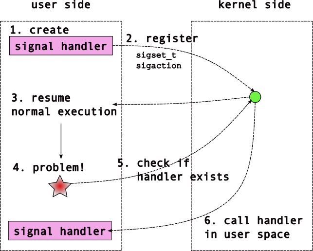

## Signals

[Slides](https://sibin.github.io/teaching/csci2410-gwu-systems_programming/fall_2023/slides/reveal_slides/signals.html)

We're used to *sequential* execution in our processes. Each instruction executes after the previous in the "instruction stream". However, systems also require *exceptional* execution patterns. What happens when you access memory that doesn't exist (e.g. `*(int *)NULL`); when you divide by `0`; when a user types `cntl-c`; when a process terminates; or when you make a call to access a descriptor which somehow is not accessible outside of the call^[We'll discuss the kernel later, and dual-mode execution to protect the implementation of these calls in OS.]?

Consider the following code where we try to access (dereference) address `NULL`.

```C DNE
/* CSC 2410 Code Sample 
 * intro to signals
 * Fall 2023
 * (c) Sibin Mohan
 */

int main()
{
    // some standard errors
    int* a = (int*)NULL ;
    *a = 10 ;

    return 0 ;
}
```

What happens with the following code?
```C DNE
/* CSC 2410 Code Sample 
 * intro to signals
 * Fall 2023
 * (c) Sibin Mohan
 */

int main()
{
    // some standard errors
    int div = 100/0 ;

    return 0 ;
}
```

Programs **crash**! Unless you *plan* to "**handle**" it!

### Enter '**signals**'

UNIX's **signals** provide *asynchronous* execution in a process: 
- provide asynchronous execution
- when a signal activates,
    - a "signal handler" function is activated
    - regardless of what was executing!

Signals can be used for,
- dealing with *exceptions*, *e.g.,*
    - invalid access &rarr; `*(int *)NULL`
    - divide by `0`
- tracking time &rarr; `ualarm`
- parent/child coordination &rarr; `SIGTERM`
- ...

Let's look at a basic setup for using signals:
```c
#include <signal.h> /* sigaction and SIG* */
#include <stdio.h>
#include <stdlib.h>
#include <errno.h>
#include <string.h>

// this is the interface for the signal fault handler!
void sig_fault_handler(int signal_number, siginfo_t *info, void *context)
{
	/* printf has problems here; see "The Dark Side of Signals" */
	printf("My downfall is the forbidden fruit at address %p.\n", info->si_addr);

	/* Question: what happens if we comment this out? */
	exit(EXIT_FAILURE);

	return;
}

int main(void)
{
	sigset_t masked;
	struct sigaction siginfo;
	int ret;

	sigemptyset(&masked);
	sigaddset(&masked, SIGSEGV);
	siginfo = (struct sigaction) {
		.sa_sigaction = sig_fault_handler,
		.sa_mask      = masked,
		.sa_flags     = SA_RESTART | SA_SIGINFO /* we'll see this later */
	};

	if (sigaction(SIGSEGV, &siginfo, NULL) == -1) {
		perror("sigaction error");
		exit(EXIT_FAILURE);
	}

	printf("Lets live dangerously\n");
	ret = *(int *)NULL;
	printf("I live!\n");

	return 0;
}
```

We can actually execute in the signal handler when we access invalid memory! We can write code to execute in response to a segmentation fault. This is how Java prints out a backtrace. 

Let's explore the concepts in the above code and the **signals interface** in general.

### Signals Interface

#### `sigset_t`

- a bitmap &rarr; **one bit per signal**
- used to program the **signal mask**
- filled with `0`s or `1`s


|value|meaning|
|-----|-------|
|| signals **can** nest |
|| signals **cannot** nest |
||

Essentially....`sigset_t` tells us...when a signal executes, 
- can *others* occur?
- if so, *which ones*?      

#### `sigset_t` functions

Defined in `<signal.h>` to manage the `sigset_t` data structure.
|name|function|
|----|--------|
|`sigemptyset`| initialize/empty the signal set <br> *i.e.*, "unmask" all|
|`sigfullset`| initializefill the signal set <br> *i.e.*, "mask" all|                       
|`sigaddset`|add *specific*  signal to set <br> *i.e.,* "mask" specific one|
|`sigdelset`|remove *specific* signal from set <br> *i.e.,* "mask" specific one|
|`sigismember`|checks whether given signal is <br> part of the set|

#### `sig_fault_handler`

- the signal `"handler"`
- function that is called *asynchronously* 
    - when corresponding event happens
- **user defined**

In the example of SIGSEGV above, here, the signal handler is called whenever we access invalid memory (e.g. segmentation fault).

#### `sigaction`

The function that sets up signal handler for a specific signal:

```C DNE
#include "signal.h"

int sigaction( int signum, 
               const struct sigaction *restrict act, 
               struct sigaction *restrict oldact ) ;
```

#### `struct sigaction`

```C
struct sigaction {
            void     (*sa_handler)(int);
            void     (*sa_sigaction)(int, siginfo_t *, void *);
            sigset_t   sa_mask;
            int        sa_flags;
            void     (*sa_restorer)(void);
} ;
```

#### Sequence of Actions
...for using signals




### Notable Signals

There are signals for quite a few events. A list of all of the signals is listed in `man 7 signal` and `glibc` has decent [documentation](https://www.gnu.org/software/libc/manual/html_node/Signal-Handling.html).
Notable signals include:
|signal| description |
|--------|--------|
|`SIGCHILD` | child process terminated |
|`SIGINT` | user typed `ctrl-c` |
|`SIGSTOP/SIGCONT` | stop/continue child execution |
|`SIGTSTP` | user typed `ctrl-z` |
|`SIGTPIPE` | write to a pipe with no reader |
|`SIGSEGV` | invalid memory access [segmentation fault] |
|`SIGTERM/SIGKILL` | kill a process; SIGTERM can be caught, **SIGKILL** not |
|`SIGHUP` | kill terminal that created shell |
|`SIGALRM` | notification that time has passed |
|`SIGUSR1/SIGUSR2` | **user-defined** signal handlers |
||

**Note:** ` SIGKILL/SIGTOP `
- cannot be "caught" 
- to deal with unresponsive processes
- SIGCONT &rarr; continue process after SIGSTOP

Each signal has a *default behavior* that triggers if you do not define a handler. These are:
* ignore
* terminate process
* stop process from executing
* continue execution
            
### Minor Detour | `sa_sigaction`

We have seen (and used) this struct:

```c 
struct sigaction {
    void     (*sa_handler)(int);
    void     (*sa_sigaction)(int, siginfo_t *, void *);
    sigset_t   sa_mask;
    int        sa_flags;
    void     (*sa_restorer)(void);
};
```

Why **two** function pointers?
- `(*sa_handler)`
- `(*sa_sigaction)`

One takes **more information** than the other

```c 
void     (*sa_handler)(int);`
void     (*sa_sigaction)(int, siginfo_t *, void *);
```
choice of which &rarr; depends on a **flag** that is set.

#### Flags?

Provide flags to `sa_flags` member:

|flag|result|
|----|------|
|`SA_SIGINFO`| use the `*sa_sigaction` handler (*i.e.,* take more information)|
|`SA_RESTART`| make sure system calls are '*restartable*'|
|(many others) | ... |
||

`man 2 sigaction` for more details.

### Signals | Further Examples

#### Tracking Time with Signals 

Now let's use another signal, `SIGALRM`. Use the following code example:

```c DNE
/* CSC 2410 Code Sample 
 * intro to signals
 * Fall 2023
 * (c) Sibin Mohan
 */

#include <stdio.h>
#include <stdlib.h>
#include <errno.h>
#include <signal.h>
#include <unistd.h>
#include <string.h>

// why volatile?
volatile int timers = 0 ;

// the signal hanlder
void my_timer_handler( int signal_number, siginfo_t* info,
                                            void* context )
{
    // Handler for SIGALRM

    printf( "Inside Alarm Handler!\n" ) ;

    ++timers ;
    return ;
}

// the function pointer for the signal handler type
typedef void(*signal_handler_function)( int, siginfo_t*, void* ) ;

// We can use a function to set up the signal, 
// hide all the sigset, sigaction stuff using this
// EXPLAIN this function
void setup_signal( int signal_number, 
                   signal_handler_function func,
                   int sa_flags )
{
    sigset_t masked ; // bitmask
    sigemptyset( &masked ) ; // clear the mask
    sigaddset( &masked, signal_number ) ; // set only bit for SIGSEGV
    struct sigaction siginfo = (struct sigaction){
        .sa_sigaction = func,
        .sa_mask = &masked,
        .sa_flags = sa_flags 
    } ; 

    if( sigaction( signal_number, &siginfo, NULL ) == -1 )
    {
        perror( "sigaction failed!" ) ;
        exit(EXIT_FAILURE) ;
    }
}

int main()
{
    int t = timers ;
    setup_signal( SIGALRM, my_timer_handler, (SA_RESTART | SA_SIGINFO) ) ;

    pid_t pid ;

    if( (pid = fork()) == 0 )
    {
        // Child process
        pause() ;
        exit( EXIT_SUCCESS ) ;
    }

    // We did setup_signal BEFORE fork(). Parent/child both get signal info!
    
    ualarm( 1000, 1000 ) ; // 1000 us --> 1 ms
    // alarm(1) ; // same as previous ualarm? SHOW BOTH!

    while (t < 10)
    {
        if( timers > t )
        {
            printf( "Count: %d\n", t ) ;
            t = timers ;
        }
    }

    printf( "\n" ) ;
    return 0 ;
}
```

*Question**: Track and explain the control flow through this program.

`SIGKILL` and `SIGSTOP` are unique in that they *cannot be disabled*, and handlers for them cannot be defined. They enable non-optional control of a child by the parent.


#### Parent/Child Coordination with Signals

Another example of coordination between parent and child processes.
We can use signals to get a notification that *a child has exited*!
Additionally, we can send the `SIGTERM` signal to terminate a process (this is used to implement the `kill` command line program -- see `man 1 kill`).

```c
#include <signal.h>
#include <stdio.h>
#include <stdlib.h>
#include <errno.h>
#include <string.h>
#include <unistd.h> /* kill, pause */
#include <assert.h>
#include <sys/wait.h>

void sig_handler(int signal_number, siginfo_t *info, void *context)
{
	switch(signal_number) {
	case SIGCHLD: {
		/* see documentation on `siginfo_t` in `man sigaction` */
		printf("%d: Child process %d has exited.\n", getpid(), info->si_pid);
		fflush(stdout);
		break;
	}
	case SIGTERM: {
		printf("%d: We've been asked to terminate. Exit!\n", getpid());
		fflush(stdout);
		exit(EXIT_SUCCESS);
		break;
	}}

	return;
}

void setup_signal(int signo, void (*fn)(int , siginfo_t *, void *))
{
	sigset_t masked;
	struct sigaction siginfo;
	int ret;

	sigemptyset(&masked);
	sigaddset(&masked, signo);
	siginfo = (struct sigaction) {
		.sa_sigaction = fn,
		.sa_mask      = masked,
		.sa_flags     = SA_RESTART | SA_SIGINFO
	};

	if (sigaction(signo, &siginfo, NULL) == -1) {
		perror("sigaction error");
		exit(EXIT_FAILURE);
	}
}

int main(void)
{
	pid_t pid;
	int status;

	setup_signal(SIGCHLD, sig_handler);
	setup_signal(SIGTERM, sig_handler);

	/*
	 * The signal infromation is inherited across a fork,
	 * and is set the same for the parent and the child.
	 */
	pid = fork();
	if (pid == -1) {
		perror("fork");
		exit(EXIT_FAILURE);
	}

	if (pid == 0) {
		pause(); /* stop execution, wake upon signal */

		exit(EXIT_SUCCESS);
	}

	printf("%d: Parent asking child (%d) to terminate\n", getpid(), pid);
	kill(pid, SIGTERM); /* send the child the TERM signal */

	/* Wait for the sigchild notification of child termination! */
	pause();

	/* this should return immediately because waited for sigchld! */
	assert(pid == wait(&status));
	assert(WIFEXITED(status));

	return 0;
}
```

*Note:* You want to run this a few times on your system to see the output.
The auto-execution scripts of the lectures might cause wonky effects here due to concurrency.

We now see a couple of new features:

- The `SIGCHLD` signal is activated in the parent when a child process exits.
- We can use the `kill` function to *send a signal* to a another process owned by the same user (e.g. `gparmer`).
- The `pause` call says to stop execution (to pause) until a signal is triggered.


A couple of additional important functions:

- `raise` will trigger a signal in the current process (it is effectively a `kill(getpid(), ...)`).
- `ualarm` will set a recurring `SIGALRM` signal.
    This can be quite useful if your program needs to keep track of time in some way.


### The Dark Side of Signals


Signals are dangerous mechanisms in some situations. It can be difficult to use them properly, and avoid bugs. Signals complication data-structures as only functionality that is re-eentrant should be used in signal handlers, and they complicate the logic around all system calls as they can interrupt slow system calls.

**Two** main problems:
1. problems with "slow" system calls
2. only "reentrant" data structures

#### "Slow" System Calls

- many library calls can *block*
    - *e.g.*, `wait` or `read`
- what if &rarr; signal sent *when blocked?*
- default &rarr; sys call will **return immediately**
- `wait` &rarr; returns even if child didn't `exit`
- `read` &rarr; returns despite **not** reading data!

So how do you tell the difference between the blocking function returning properly, or returning because it was interrupted by a signal? The answer is, of course, in the man pages -- look at the **return**/`errno` values:
- function will return `-1`
- errno will be set to `EINTR`

Given this, we see the problem with this design: now the programmer must add logic for *every single system call* that can block to check this condition.
Yikes^[A hallmark of *bad design* is functionality that is not [*orthogonal* with existing functionality](https://www.youtube.com/watch?v=mKJcqvozfA8&t=2124s). When a feature must be considered in the logic for many other features, we're adding a significant complexity to the system.].

Luckily, UNIX provides a means to disable the interruption of blocking calls by setting the `SA_RESTART` flag to the `sa_flags` field of the `sigaction` struct passed to the `sigaction` call.

**Note:** that the code above already sets this as I consider it a default requirement if you're setting up signal handlers.

The use of `SA_RESTART` can have interesting side effects, especially for **slow** system calls! Lets see the explicit interaction with between the slow call `wait`, and the signal handler:

```c
/* CSC 2410 Code Sample 
 * intro to signals
 * Fall 2023
 * (c) Sibin Mohan
 */

#include <stdio.h>
#include <stdlib.h>
#include <errno.h>
#include <signal.h>
#include <unistd.h>
#include <string.h>
#include <sys/types.h>

void my_timer_handler( int signal_number, siginfo_t* info,
                                            void* context )
{
    // Handler for SIGALRM

    printf( "Inside Alarm Handler!\n" ) ;

    return ;
}

// the function pointer for the signal handler type
typedef void(*signal_handler_function)( int, siginfo_t*, void* ) ;

// We can use a function to set up the signal, 
// hide all the sigset, sigaction stuff using this
void setup_signal( int signal_number, 
                   signal_handler_function func,
                   int sa_flags )
{
    sigset_t masked ; // bitmask
    sigemptyset( &masked ) ; // clear the mask
    sigaddset( &masked, signal_number ) ; // set only bit for given signal
    struct sigaction siginfo = (struct sigaction){
        .sa_sigaction = func,
        .sa_mask = &masked,
        .sa_flags = sa_flags 
    } ; 

    if( sigaction( signal_number, &siginfo, NULL ) == -1 )
    {
        perror( "sigaction failed!" ) ;
        exit(EXIT_FAILURE) ;
    }
}

int main()
{

    // comment out one or the other of this to see the different behaviors
    setup_signal( SIGALRM, my_timer_handler, (SA_SIGINFO) ) ;
    // setup_signal( SIGALRM, my_timer_handler, (SA_RESTART | SA_SIGINFO) ) ;

    pid_t pid ;

    if( (pid = fork()) == 0 )
    {
        // Child process
        pause() ; // wait for a signal
        exit( EXIT_SUCCESS ) ;
    }

    alarm(1);

    while (1)
    {
        pid_t ret = wait(NULL) ;

        if( ret == -1 )
        {
            if( errno == EINTR )
            {
                // Child didn't exit properly

                printf( "System call interrupted by Signal\n" ) ;
                kill( pid, SIGTERM ) ; // end the child process

                // return -1 ;
            }
            else if( errno == ECHILD )
            {
                // this code may NEVER execute!
                printf( "Child exited cleanly\n" ) ;
                return 0 ;
            }
        }
    }

    printf( "\n" ) ;
    return 0 ;
}
```
Comment out one of the other of the `setup_signal` function calls in `main()` to see very different behaviors.


#### Re-entrant Computations

Signal handlers execute by interrupting the currently executing instructions, regardless what computations they are performing. Because we don't really know anything about what was executing when a signal handler started, we have to an issue. What if an action in the signal handler in some way **conflicts with the action it interrupted**?

Consider `printf`,
- copies data into a buffer 
- calls `write` &rarr; send buffer to standard output 
- a signal raised between the two?
- signal calls printf!

The data written by the earlier `printf()` will be overwritten/discarded by the later one!

Any function that has these issues is called [**non-reentrant**](https://www.gnu.org/software/libc/manual/html_node/Nonreentrancy.html). Yikes.

Consider the following example that overwrites `errno` with (potentially) disastrous effects!
```c
#include <signal.h>
#include <stdio.h>
#include <stdlib.h>
#include <errno.h>
#include <unistd.h>
#include <string.h>
#include <assert.h>

void sig_handler(int signal_number, siginfo_t *info, void *context)
{
	/*
	 * Reset `errno`! In a real program, this might instead be a call that causes
	 * an error setting `errno` to whatever the error is for *that call*.
	 */
	errno = 0;

	return;
}

void setup_signal(int signo)
{
	sigset_t masked;
	struct sigaction siginfo;
	int ret;

	sigemptyset(&masked);
	sigaddset(&masked, signo);
	siginfo = (struct sigaction) {
		.sa_sigaction = sig_handler,
		.sa_mask      = masked,
		.sa_flags     = SA_RESTART | SA_SIGINFO
	};

	if (sigaction(signo, &siginfo, NULL) == -1) {
		perror("sigaction error");
		exit(EXIT_FAILURE);
	}
}

int main(void)
{
	setup_signal(SIGUSR1);

	assert(read(400, "not going to work", 10) == -1);
	raise(SIGUSR1);
	printf("errno should be \"Bad file descriptor\", but has value \"%s\"\n", strerror(errno));

	return 0;
}
```

The set of functions you *can* call in a signal handler (i.e. that are *re-entrant*) are listed in the manual page: `man 7 signal-safety`.

Notably these do *not* include the likes of
- `printf`/`snprintf`
- `malloc`
- `exit` (though `_exit` is fine)
- functions that set `errno`!
- ...

It is hard to do much in a program of any complexity without `snprintf` (called by `printf`), `malloc`, or use `errno`. A very common modern way to handle this situation is to create a `pipe` into which the signal handlers `write` a notification (e.g. the signal number), while the main flow execution `read`s from the pipe. This enables the main execution in our programs to handle these notifications. However, this is only really possible and feasible when we get to `poll` later, and can block waiting for any of a number of file descriptors, including this pipe.

Note that in *most* cases, you won't see a bug due to using non-re-entrant functions in your signal handlers. These bugs are heavily non-deterministic, and are dependent on exactly what instructions were interrupted when the signal activated. This may feel like a good thing: buggy behavior is very rare! But reality is opposite: rare, non-deterministic bugs become *very very hard to debug and test*. Worse, these bugs that pass your testing are more likely to happen in customer's systems that might have different concurrency patterns. So it is nearly impossible to debug/test for these bugs, and they are more likely to cause problems in your customer's environment. Again, yikes.