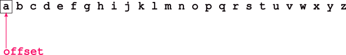
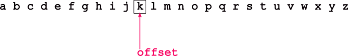

# Files and File Handling

[Slides](https://sibin.github.io/teaching/csci2410-gwu-systems_programming/fall_2023/slides/reveal_slides/files.html)


The filesystem is one of the core abstractions on UNIX systems and indeed, on modern OSes.
Each file is identified by a *path* through directories.

Remember the UNIX philosophy: **everything** is a file!

This is a strange statement as it raises the question "what wouldn't normally be a file?"
Some examples:

|location|description|
|--------|-----------|
|`/proc/*`| processes|
|`/dev/*`|devices (hard disk, keyboards,...)|
|`/dev/random`|random values|
|`/sys/*`|power settings|
|`/dev/null`| "nothing"|
||

**Note:**

- We know of processes as executable instances of programs so certainly they cannot be files, right? We've seen that they are represented by files in `/proc/*`! These files are used to provide "task monitor" type functionality (showing running processes) and `gdb`.
- Devices are the physical parts of our computers like screens, keyboards, USB devices, hard-drives, and networks. They are all represented by files in `/dev/*`! You can actually `cat` a file directly to your disk^[Please, please do *not* try this.]!
- Want random values? `/dev/random`.
- Want the complete absence of anything? `/dev/null`^[This is useful to redirect shell output to if you don't care about the output.].
- Want to update your power settings? There are files in `/sys/*` for that.

Remember the high-level directory structure of modern Linux:


## Basic File Access

When everything is a file, it can all be manipulated and accessed using the exactly same functions and APIs as the normal files in the system, *e.g.,* `open`, `close`, `read`, `write`, *etc.*

This means that all of the shell programs we've seen can be used not just to operate on files, but also *on processes* or *devices*!

Here are the basic APIs for file operations:

1. `open( path, flags, ... ) `
    * open a file &rarr; identified by `path</cb>
    * return &rarr; `file descriptor` &rarr; to access file

"flags" must be one of

- `O_RDONLY` &rarr; only **read** from the file
- `O_WRONLY` &rarr; only **write** from the file
- `O_CREAT` &rarr; **create** the file if it doesn't exist
- can use bitwise OR: `O_RDONLY | O_CREAT`

When using O_CREAT &rarr; pass the third arg, "mode":

```c DNE
open("my_file_name.txt", O_RDWR | O_CREAT, 0700)
```

Whenever you see "flags", you should think of them as a set of bits, and each of the options as a single bit. The above example will create the file, `my_file_name.txt` if it doesn't exist already and open it for reading and writing.

Note that when you pass in `O_CREAT`, you should pass in the third argument, the `mode` (for now, just always pass in `0700`!). 

2. `read`, `write`
    - generic functions for 
        - getting data from,
        - sending data to,
    - "descriptors" &rarr; **file descriptors** in this case.

We've seen them before when using pipes!

3. `close`
    - to "close" any descriptor
    - akin to a `free` for descriptors

4. `stat`
    - get information about file pointed by `path`
    - into the `info` structure
    - `int stat(path, struct stat *info)`
    - `fstat` &rarr; same, but uses `fd`

```c DNE
    struct stat { 
    dev_t    st_dev;    /* device inode resides on */
    ino_t    st_ino;    /* inode's number */
    mode_t   st_mode;   /* inode protection mode */
    nlink_t  st_nlink;  /* number of hard links to the file */
    uid_t    st_uid;    /* user-id of owner */
    gid_t    st_gid;    /* group-id of owner */
    dev_t    st_rdev;   /* device type, for special file inode */
    struct timespec st_atimespec;  /* time of last access */
    struct timespec st_mtimespec;  /* time of last data modification */
    struct timespec st_ctimespec;  /* time of last file status change */
    off_t    st_size;   /* file size, in bytes */
    quad_t   st_blocks; /* blocks allocated for file */
    u_long   st_blksize;/* optimal file sys I/O ops blocksize */
    u_long   st_flags;  /* user defined flags for file */
    u_long   st_gen;    /* file generation number */
};
```
The structure is documented in the `man` page, but it includes, for example, the file size. It is defined in `<sys/stat.h>`.

5. `unlink()`
    - try and **remove** a file
    - *e.g.,* called by the `rm` program

> It is *really* important that quite a few interesting functions operate on *descriptors*, which might reference pipes, files, the terminal, or other resources.
> This means that processes can operate on descriptors and not care what resources back them.
> This enables shells to implement pipelines and the redirection of output to files, all without the processes knowing!
> It enables `fork`ed processes to inherit these resources from its parent.
> In this way, descriptors and the functions to operate on them are a *polymorphic* foundation (in the sense of object-oriented polymorphism) to accessing the system.

Now, let's look at an example of basic file operations:
```C
/* CSC 2410 Code Sample 
 * intro to reading and writing on files
 * Fall 2023
 * (c) Sibin Mohan
 */

#include <stdio.h>
#include <sys/types.h>
#include <fcntl.h>
#include <unistd.h>
#include <stdlib.h>
#include <errno.h>
#include <assert.h>
#include <sys/stat.h>

#define TWEET_LEN 280

int main()
{
    char tweet[TWEET_LEN] ;
    int fd = open( "./daffodils.txt", O_RDONLY ) ;
    if( fd == -1 )
    {
        perror( "File daffodils.txt failed to open!" ) ;
        exit( EXIT_FAILURE ) ;
    }

    // what is the size of the file?
    struct stat file_info ;
    int ret = fstat( fd, &file_info ) ;
    assert( ret >=0 ) ;
    printf( "Number of characters in file: %ld\n", file_info.st_size ) ;
    
    // Read TWEET_LEN number of characters from file
    ret = read( fd, tweet, TWEET_LEN ) ;
    assert( ret == TWEET_LEN ) ;
    write( STDOUT_FILENO, tweet, TWEET_LEN  ) ;

    ret = read( fd, tweet, TWEET_LEN ) ;
    assert( ret == TWEET_LEN ) ;
    write( STDOUT_FILENO, tweet, TWEET_LEN  ) ;

    close(fd) ; // close the file.

    return 0 ;
}
```

## Moving Around in Files

We see something a little strange with files as compared to `pipe`s.

**Files vs Pipes**:

|files|pipes|
|-----|-----|
| finite size | potentially "infinite" |
| data is permanent | temporary &rarr; only until read |
| **forward/backward** | no movement (FIFO) |
||

For files, subsequent reads and writes must progress through the contents of the file, but we must also to be able to go back and read previously read data.

Lets understand what happens when we `read` or `write` from a file -- we'll focus only on `read` to start, but both behave similarly.

First, each `fd`^[I'll try and call it a "file descriptor" when we know the descriptor is to a file.] tracks an "**offset**"
- offset determines *where* we read/write in file


Lets go through an example of a file that contains the alphabet:

For freshly opened files &rarr; `offset = 0`


<br>
<br>

A `read(fd, buf, 10)` that returns `10` (saying that `10` bytes or characters `a` through `j`  was successfully read) advances `offset` by `10`.
<br>
<br>

<br>
<br>
Thus, an additional read will start reading from the file at `k`. The offset, then, enables subsequent reads to iterate through a file's contents. 

`write()` uses the offset identically.

There are many cases in which we might want to modify the `offset`.
For example, databases want to jump around a file to find exactly the interesting records, playing audio and video requires us to skip around a file finding the appropriate frames. So, we use:
```C DNE
off_t lseek(int fd, off_t update, int whence)
```

"**whence**"?


**how** to update the `offset`

|value|how updated|
|-----|-----------|
| `SEEK_SET` | `offset = update` |
| `SEEK_CUR` | `offset += update` |
| `SEEK_END` | `offset = eof + update` |
||

`eof` &rarr; end of file

Let's update our previous example to use `lseek()` to reset to the start of the file.
```C
/* CSC 2410 Code Sample 
 * intro to reading and writing on files
 * Fall 2023
 * (c) Sibin Mohan
 */

#include <stdio.h>
#include <sys/types.h>
#include <fcntl.h>
#include <unistd.h>
#include <stdlib.h>
#include <errno.h>
#include <assert.h>
#include <sys/stat.h>

#define TWEET_LEN 280

int main()
{
    char tweet[TWEET_LEN] ;
    int fd = open( "./daffodils.txt", O_RDONLY ) ;
    if( fd == -1 )
    {
        perror( "File daffodils.txt failed to open!" ) ;
        exit( EXIT_FAILURE ) ;
    }

    // what is the size of the file?
    struct stat file_info ;
    int ret = fstat( fd, &file_info ) ;
    assert( ret >=0 ) ;
    printf( "Number of characters in file: %ld\n", file_info.st_size ) ;
    
    // Read TWEET_LEN number of characters from file
    ret = read( fd, tweet, TWEET_LEN ) ;
    assert( ret == TWEET_LEN ) ;
    write( STDOUT_FILENO, tweet, TWEET_LEN  ) ;

    ret = read( fd, tweet, TWEET_LEN ) ;
    assert( ret == TWEET_LEN ) ;
    write( STDOUT_FILENO, tweet, TWEET_LEN  ) ;

    // Reset to the start of the file
    ret = lseek( fd, 0, SEEK_SET ) ;
    if( ret == -1 )
    {
        perror( "lseek failed!" ) ;
        exit( EXIT_FAILURE ) ;
    } 

    printf( "\n\n ------ AFTER LSEEK ---------\n\n" ) ;
    // Read TWEEDT_LEN number of characters from file
    ret = read( fd, tweet, TWEET_LEN ) ;
    assert( ret == TWEET_LEN ) ;
    write( STDOUT_FILENO, tweet, TWEET_LEN  ) ;

    close(fd) ; // close the file.

    return 0 ;
}
```
