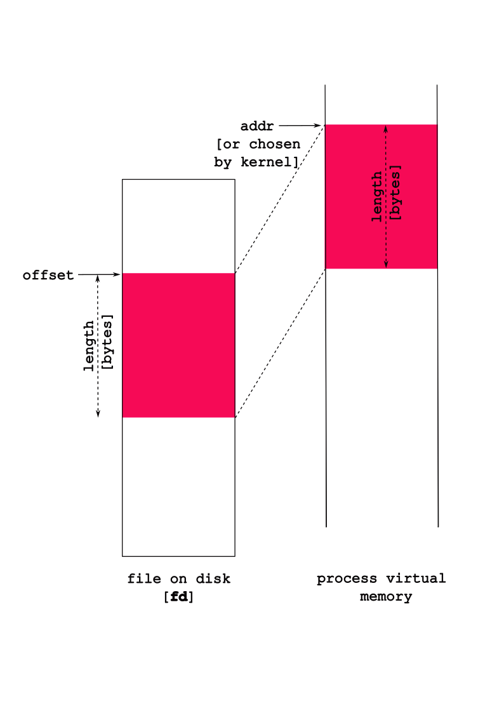

## Other Ways to Access Files

So far,
- `read` & `write` are fine interfaces for files
- require many interactions with multiple calls 

There are *two* additional methods to access files:
- **memory mapping**
- **streams**

### Memory Mapping Files | `mmap()`

UNIX also provides a way to directly "map" a file into a process, enabling to appear directly in memory, thus be accessible using normal memory accesses.

This is cool because your changes *in memory* update the file directly!

```C DNE
void *mmap(addr, len, prot, flags, fd, offset)
```

defined in `<sys/mman.h>`.

#### `mmap` arguments:

|arg|description|
|-----|-----------|
| `fd` | file descriptor to map to memory |
| `addr` | address in memory to map |
| `len` | how much of the file to map?|
| `prot` | `PROT_READ` or `PROT_WRITE` |
| `flags` | type of mapped object `MAP_PRIVATE` |
| `offset` | where in the file to start the mapping |
||

**return value** is the **address** at which the file is mapped.

Overview:



Some nuances:

1. The `flags` argument indicates the *type* of mapped object:

|flag|meaning|
|-----|-----------|
| `MAP_PRIVATE` | changes **not** written to file |
| `MAP_SHARED` | changes **written to** file |
||

So, if you want you changes to be reflected in the actual file, then make sure you set the flag as: `MAP_SHARED`.

Look at `man mmap` for more details on the `prot` and `flags` options.

2. Normally, `addr`, the address in memory at which you want to map, is `NULL`, which means "please map it whereever you want". The *return value* is the address at which the file is mapped, or `NULL` if there was an error (see the `man` page and `errno` values).

3. `stat` is quite useful to find the file's size if you want to map it all in.

4. `prot` enables you to choose some properties for the mapping, *e.g.*, `PROT_READ`, and `PROT_WRITE` that ask the system to map the memory in readable, or writable modes respectively (you can choose both with `PROT_READ | PROT_WRITE`).
**Note:** the type of accesses here must *match* request accesses previously requested in `open` -- for example, if we passed `O_RDONLY` in to `open`, `mmap` will return an error if we ask for `PROT_WRITE`.

#### `munmap()`

- **unmap** a previously mapped file
- deletes "mapping" for **specified address range**

```C DNE
int munmap(void *addr, size_t len);
```

<br>

Consider the following code:
```C
/* CSC 2410 Code Sample 
 * accessing files using mmap()
 * Fall 2023
 * (c) Sibin Mohan
 */

#include <stdio.h>
#include <stdlib.h>
#include <errno.h>
#include <fcntl.h>
#include <string.h>
#include <unistd.h>
#include <stdlib.h>
#include <sys/mman.h>
#include <assert.h>
#include <sys/types.h>
#include <sys/stat.h>

#define TWEET_LEN 280
#define NUM_TWEETS 2

int main()
{
    int fd = open( "./daffodils.txt", O_RDONLY ) ;
    // int fd = open( "./daffodils.txt", O_RDWR ) ;
    if( fd == -1 )
    {
        perror( "File daffodils.txt failed to open!" ) ;
        exit(EXIT_FAILURE) ;
    }

    // char* addr = mmap( NULL, TWEET_LEN, ( PROT_READ | PROT_WRITE ), MAP_SHARED, fd, 0 ) ;
    char* addr = mmap( NULL, TWEET_LEN, ( PROT_READ | PROT_WRITE ), MAP_PRIVATE, fd, 0 ) ;
    if( addr == NULL )
    {
        perror( "nmmap failed!" ) ;
        exit( EXIT_FAILURE ) ;
    }

    // write out a tweet length 
    write( STDOUT_FILENO, addr, TWEET_LEN ) ;

    // change the case of "by" to "BY"
    char* by = strstr( addr, "by" ) ;
    assert(by) ;
    by[0] = 'B' ;
    by[1] = 'Y' ;

    // printf( "%c %c\n", by[0], by[1] ) ;

    // write out a tweet length 
    write( STDOUT_FILENO, addr, TWEET_LEN ) ;

    munmap( addr, TWEET_LEN ) ;
    close(fd) ;

    printf( "\n" ) ;
    return 0 ;
}
```
**Note:** 

1. will the above code work?
2. will the file reflect the changes?
3. what happens if the following line is uncommented (and the other, corresponding line is commented out?)
```c 
char* addr = mmap( NULL, TWEET_LEN, ( PROT_READ | PROT_WRITE ), MAP_SHARED, fd, 0 ) ;
``` 
4. how will you fix the (inevitable) problem that occurs?


#### `mmap` and memory allocation

* can use mmap to **allocate memory**!
* ` fd = 0 `
* ` prot = PROT_READ | PROT_WRITE `
* ` flags = MAP_ANONYMOUS | MAP_PRIVATE `
* mmap returns &rarr; **newly allocated memory**
* `malloc()` actually calls `mmap`!


### Stream-Based I/O

There is actually a *third* way to access files beyond "raw" `read`/`write` and `mmap` -- streams! [Streams](https://www.gnu.org/software/libc/manual/html_node/I_002fO-on-Streams.html) are an abstraction *on top of the* "raw" descriptor accesses using `read` and `write`.

Streams:
- a **sequence** of characters
- includes functions to
    - put characters in one end
    - take characters out on one end

Streams are identified by the type `FILE *`, and all the APIs for operating on streams take `FILE`s instead of file descriptors.

We've seen streams before...a lot!
- `stdin`, `stdout`, `stderr`
- `FILE*` names 
- `STDOUT_FILENO`, `STDIN_FILENO` and `STDERR_FILENO` 
- `printf()` writes to a stream! Hence, it is **buffered I/O**

> **Why use Streams?**
>
> From the [GNU manual](https://www.gnu.org/software/libc/manual/html_mono/libc.html#Streams-and-File-Descriptors): 
"*Streams provide a higher-level interface, layered on top of the primitive file descriptor facilities. The stream interface treats all kinds of files pretty much alike...The main advantage of using the stream interface is that the set of functions for performing actual input and output operations (as opposed to control operations) on streams is much richer and more powerful than the corresponding facilities for file descriptors. The file descriptor interface provides only simple functions for transferring blocks of characters, but the stream interface also provides powerful formatted input and output functions (`printf` and `scanf`) as well as functions for character- and line-oriented input and output.*"
>
> There is also the issue of **portability**:
> "*(raw) file descriptors are not as portable as streams. You can expect any system running ISO C to support streams, but non-GNU systems may not support file descriptors at all, or may only implement a subset of the GNU functions that operate on file descriptor*"

**file** streams &rarr; opened/read/written/closed as streams

#### File Stream Interface

|function|description|
|-----|-----------|
| `fopen` | same as `open` &rarr; but returns stream |
| `fclose` | similar to `close` but for `FILE*`|
| `fread/ fwrite` | similar to `read/ write` |
| `feof` | tells us if we are at **end of file** |
| `printf/fprintf` | write to a stream <br> [`fprintf` to **any** stream not just `stdout`] |
| `scanf/fscanf` | read from a stream <br> [`fscanf` read from **any** stream not just `stdin`] |
| `fflush` | "flush out" buffer associated with **specific stream** |
| `fileno` | get file descriptor, `fd`, associated with stream `FILE*` |
| `getline` | read out **one line** (delineated by `\n`) | 
||

Some notes:
1. access rights (while opening a file) that we're asking for (reading or writing to the file), are specified in a more intuitive `mode` string, *e.g.*, `"r"` to read, `"r+"` for read/write, *etc.*
2. streams provide the `feof` function that tells us if we are at the end of a file.

Now, let's look at our previous example of printing the `daffodils.txt` file in tweet lengths, this time using streams:

```c
#include <stdio.h>
#include <assert.h>

int main(void)
{
    // why do we need the +1?
    char tweet[TWEET_LEN+1] ;

    FILE* f = fopen( "./daffodils.txt", "r" ) ;
    if( f == NULL )
    {
        perror( "File open failed!" ) ;
        exit( EXIT_FAILURE ) ;
    }

    // read TWEET_LEN characters from the file
    int ret = fread( tweet, TWEET_LEN, 1, f ) ;
    tweet[TWEET_LEN] = '\0' ;

    // write it to stdout
    fprintf( stdout, "%s", tweet ) ;
    fflush(stdout) ;

   	fclose(f);

    printf( "\n" ) ;
	return 0;
}
```

#### Streams as buffered I/O

So it doesn't seem like we're getting much of use out of these streams compared to raw descriptors. Streams are an *optimization* over `read`/`write` as they *buffer* data.

Buffering essentially means that your `fwrite`s actually write data into a "buffer" in memory, and only when either you write out a `\n` or when the buffer gets large enough does a `write` get called to send the data to the system.

Why do this?

By buffering data in memory rather than making a `write` for each `fwrite`, we're saving any **overheads** associated with each `write` (to be discussed in a couple of weeks).

However, this means that just because we called `printf`, doesn't mean it will output immediately!

Lets see this how this works in practice:

```c
#include <unistd.h>
#include <stdio.h>
#include <stdlib.h>

int main(void)
{
	printf("hello world");
	_exit(EXIT_SUCCESS); /* this exits immediately without calling `atexit` functions */

	return 0;
}
```

Well that's not good!

The *buffered data* is copied into each process, then it is output when an `\n` is encountered.

```c
#include <stdio.h>
#include <unistd.h>
#include <string.h>

int main(void)
{
	printf("hello ");
	write(STDOUT_FILENO, "world ", 6);
	printf("\n"); /* remember, streams output on \n */

	return 0;
}
```

Both `printf` and the `write ` are, technically, to the standard output, but `printf` is to a *stream*. The *buffered* `printf` output is not written out immediately, thus ordering can get messed up.

Yikes.

Last example of the complexities of streams. What happens if you get a **segfault!?** Runtime errors can mess up expected behaviors. 

```c
#include <stdio.h>
#include <unistd.h>
#include <string.h>

int main(void)
{
	int a;

	printf("hello ");
	a = *(int *)NULL;

	return 0;
}
```

Even though we fault *after* the `printf`, we don't see the `printf`'s output!

We now know why: the `printf` wrote into a buffer, and **didn't yet `write` to the system**! Thus the segmentation fault, that terminates the process, happens **before the buffer is actually written!**

#### Flushing Stream Buffers

It is imperative that streams give us some means to force the buffer to be output! Thus, streams provide a means of *flushing* the stream's buffers, and sending them out to the system (e.g. using `write`).

- `fflush` - flush out the buffer associated with a specific stream.

Fixing the previous examples:

```c
#include <unistd.h>
#include <stdio.h>
#include <stdlib.h>

int main(void)
{
	printf("hello ");
	fflush(stdout); // "flush" out the buffer to standard output
	write(STDOUT_FILENO, "world ", 6);
	printf("\n"); /* remember, streams output on \n */

	printf("hello world");
	fflush(stdout);
	_exit(EXIT_SUCCESS); /* this exits immediately without calling `atexit` functions */

	return 0;
}
```

```c
#include <stdio.h>
#include <unistd.h>

int main(void)
{
	printf("hello world");
	fflush(stdout); // "flush" out the buffer to standard output
	fork();
	printf("\n"); /* remember, streams output on \n */

	return 0;
}
```

#### Other Useful Stream Functions

A few other functions for streams that can be useful:

- `fileno`: get the file descriptor number associated with a stream.
    This can be useful if you need to use an API that takes a descriptor, rather than a stream `* FILE`.
- `getline`: read out a line (delimited by a `\n`) from a stream.
    Since reading input, line at a time, is a pretty common thing, this is a useful function.

```c
#include <stdio.h>
#include <assert.h>
#include <stdlib.h>
#include <string.h>

int main(void)
{
	FILE *f = fopen("./05/prufrock.txt", "r");
	size_t s = 0;
	char *line = NULL;
	int i;

	assert(f);
	printf("The new genre: abridged, tweet-worthy poetry...\n\n");
	for (i = 0; getline(&line, &s, f) != -1; i++) {
		if (i % 15 == 0) {
			fwrite(line, 1, strlen(line), stdout);
			/* same as printf("%s", line); */
		}
	}
	if (!feof(f)) {
		perror("getline");
		exit(EXIT_FAILURE);
	}
	free(line);
	fclose(f);

	return 0;
}
```