# Intro to Systems Programming


## Computer Organization 

Find the [slides](https://sibin.github.io/teaching/csci2410-gwu-systems_programming/fall_2024/slides/reveal_slides/comparch.html).


<!--## Memory Hierarchies

Find the [slides](https://sibin.github.io/teaching/csci2410-gwu-systems_programming/fall_2023/slides/reveal_slides/memory.html#/10).-->


# Memory
[Slides](https://sibin.github.io/teaching/csci2410-gwu-systems_programming/fall_2024/slides/reveal_slides/memory.html#/)


## Computer memory

different shapes, sizes and **speeds**

* registers
* caches (L1, L2, L3)
* main memory/RAM
* disk (hard disks, flash)

### Registers

* **fastest** form of memory
* this what the processor uses
* e.g., <code>a = 3 + 4 ;</code>
* <code>3</code> and <code>4</code> &rarr; loaded into registers

#### register "width" | defines "width" of cpu

* "32 bit processor" &rarr; 32-bit registers
* "64 bit processor" &rarr; 64-bit registers

#### All (known) x86 registers 
for the **64-bit** architecture [source: <a href="https://en.wikipedia.org/wiki/X86#x86_registers">wikipedia</a>]

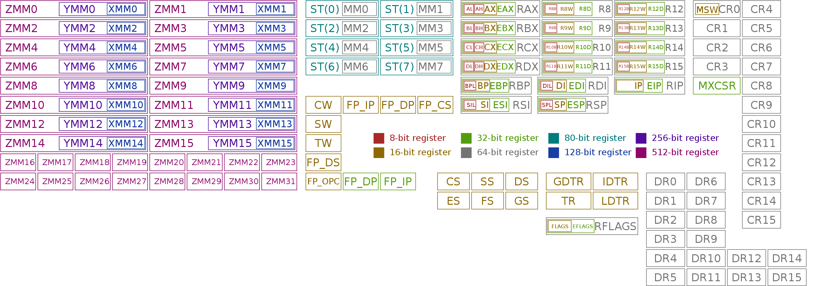
<br>

### Important question: **how much memory** is necessary?

But before we answer that, we need to answer this question: **why** do we need memory?

### **Why** do we need memory?

|component| (typical) sizes |
|--------|--------|    
| programs/code | kilobytes to megabytes |
| temporary values | kilobytes to megabytes* |
| data | kilobytes to **tera**bytes!|
||

[*depends on the program]

#### So, the **memory hierarchy** looks like this:

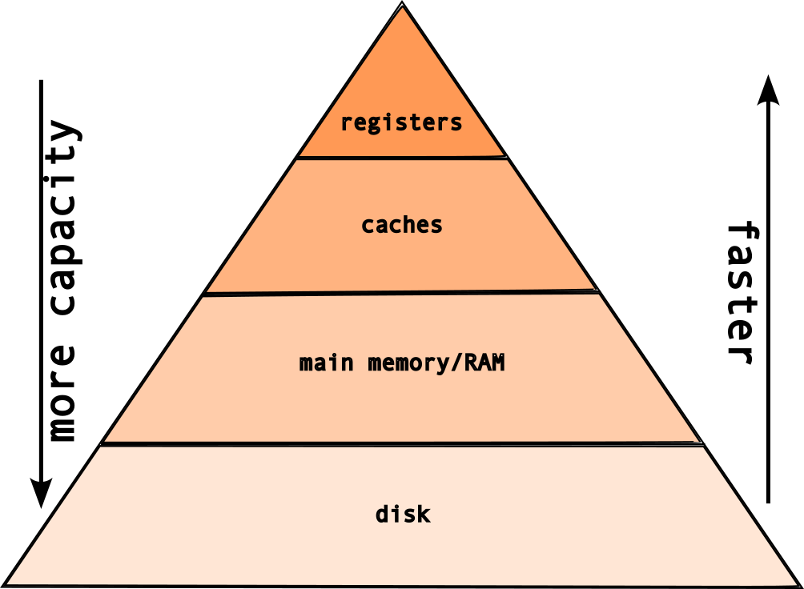

<br><br>

But, if the registers are the fastest type of memory, then why do we need these layers?

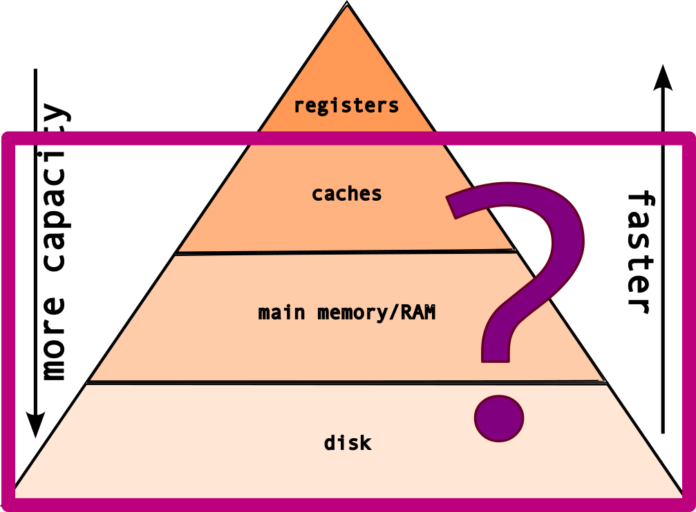 

<br><br>
**Because, registers are expensive**!

The classic tradeoff: **speed vs size**! The faster the memory &rarr; more **expensive**!

## memory layout

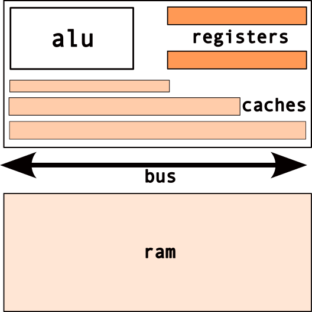

### Caches 

* fast, on-chip memory
* **transparent** to program
* used by cpu to improve performance

### Main Memory

* random access memory [ram]
* typical &rarr; **giga**bytes range
* **limited by "width" of cpu/registers**
* e.g. <scb>32 bit</scb> cpu &rarr; max <scb>4 gb</scb> memory!

<br>
Wait, what's with the "register width", "memory"...


<br>
<br>

**Memory Addressing:**

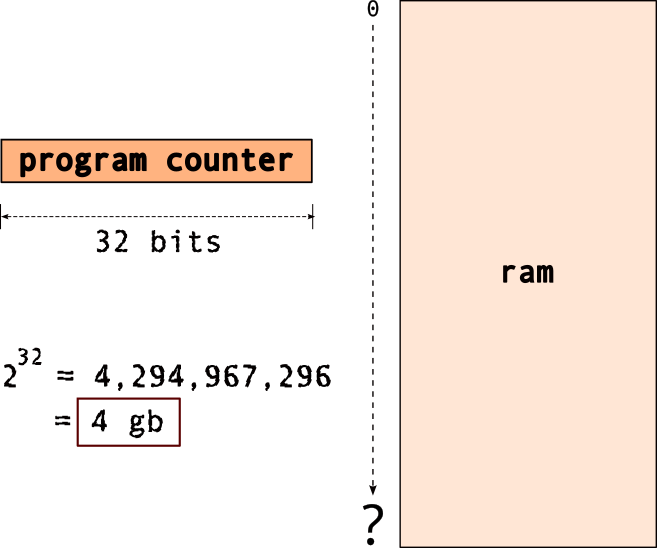 

<br>

But _what_ goes into this memory?

The typical memory layout for a program/system looks like this:

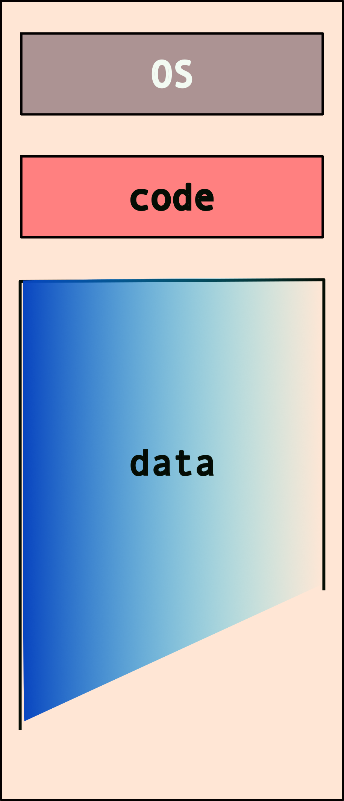 

But what happens when you have more than one program? Note that each program needs its own access to the OS services and also has to store/mainpulate its own data!

So, do we have something like this (for _two_ programs)?

 
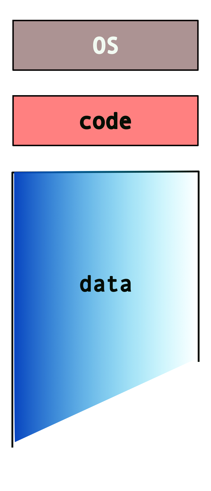 

What if we have _more than two_ programs? 

 
 
 
 
 
 


This can get messy, really quick! Also, note that the system may not have enough memory to fit all of these programs and their data. We nave to deal with additional issues such as programs overwiting other programs' data/memory!


### Enter **Virtual Memory**!


* makes each program "*believe*"
* it has the **entire** memory to itself!
* combination of os+hardware

So, instead of this...

 
 
 
 
 
 

<br>
we get...

 
 
 
 
 


<br>
or, at least the programs "*think*" so!

Hence, **programmers need **not** worry about other programs!**


# Intro to C

**You already know **C**!**

well, some of it anyways...

### C constructs [if you're familiar with Java, Python, etc.]

|construct|syntax|
|--------|--------|    
|conditionals| `if` and `else`|
|loops| `while{}`, `do...while`, `for`|
|**basic** types| `int`, `float`, `double`, `char`|
|**compound**| `arrays`*, `struct`, `union`, `enum`|
|functions| `ret_val` **`func_name`** `(args){}`|
|||

\* **no range checks!!** 

C will let you access an array beyond the maximum size that you have specified while creating it. The effects of such access are **implementation specific** -- each platform/operating system will handle it differently. Note that on platforms that don't have memory protection, this can cause some serious problems!

**What's different [from Java]**

* no object-oriented programming
* no function overloading
* **no classes!**
* we have `struct` instead
    * which is similar but *very* different
* **compiled** not interpreted
* **pointers!!!**

### Compound types

**contiguous memory** layouts: objects within these data types are laid out in memory, next to each other. This becomes important when you're trying to use pointers to access various elements.

|type|usage|
|--------|--------|  
| `struct` | related variables (like class) |
| `union` | same, but *shared* memory |
| `enum` | enumeration, assign names |
| array | pointer to contiguous memory |
|||

More details in following sections.

#### **no (built-in) boolean!** {-}

C does not have a built in boolean data type. We can mimic it by using integer values, _e.g.,_

|||
|----|----|
| `0` | `false` |
| **any non-zero value** | `true` |
||


### Unix Manual (`man`) pages

* compilation of unix/C knowledge
* `man \<topic\> `

Organized into sections:

|#|contents|
|--------|--------|    
|1| general commands|
|**2**| **system calls**|
|**3**| **library funtions (c)**|
|4| special files|
|5| file formats and conventions|
|6| games and screensavers|
|7| miscellaneous|
|8| system administration|
|||
                        
[the highlighted sections are most relevant to us.]

Consider the following example. If we want to see details about the common `C` standard library function, `printf()`, we type:
```C 
man 3 printf
```

The _initial_ part of the output will look something like this (run the above command in a terminal for the full output):

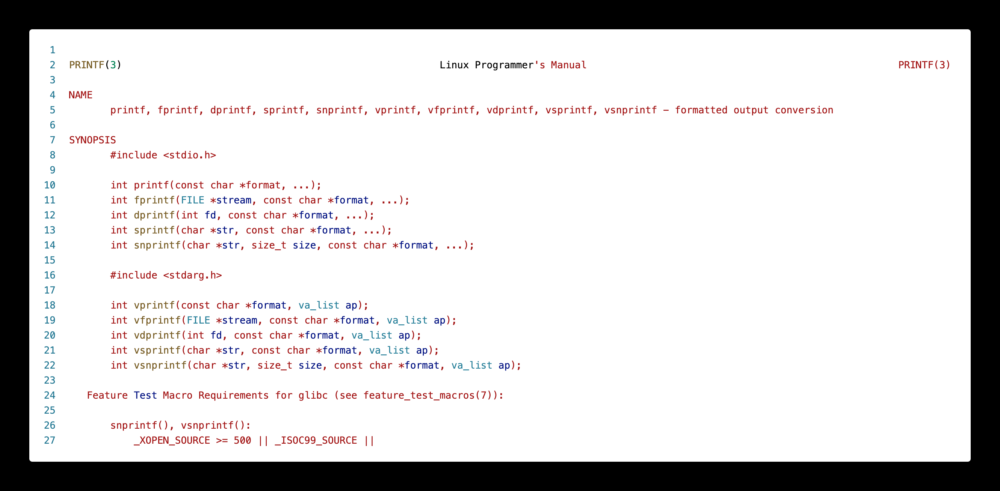


### Header Files

* include libraries in your program
* even the C standard library
* similar to `import` in java

|method|what is included|
|--------|--------|    
|`\#include \<stdio.h\>`| common libraries |
|`\#include \"my_header.h"`| user header file |
|||

Depending on how you invlude your header files, is determined by _where_ they are located on your system:

|method|**location**|
|--------|--------|    
|`\#include \<...\>`| header path, e.g., <br> `\/usr\/include\/`* |
|`\#include \"..."`| **current** directory |
|||

\* **not** exhaustive

### Some Common C libraries

|library|function|
|--------|--------|    
|`stdio.h`| standard **input/ouput** |
|`stdlib.h`| **C** standard library/utilities |
|`unistd.h`| **unix** standard library |
|`sys/types.h`| **system types** library |
|`string.h`| **string** manipulation |
|`math.h`| **math** utility functions |
|||


### Basic Types

These are the basic data types defined by the C language:

|type|description/size|
|----|-----------|
|`char`| smallest type, **one** byte |
|`short int`| **two** bytes |
|`int`| **four** bytes |
|`long int`/`long`| larger `int`, **four-eight** bytes |
|`float`| floating point, **four** bytes* |
|`double`| double precision, **eight** bytes* |
|`void`| **lack** of a type |
||

**Important Caveats!**

* when we say "one byte" &rarr; depends on **platform**
* `char` is one byte, typically on **intel**
* varies based on,
    * architectures (ARM, IBM, INTEL)
    * 32-bit vs 64-bit
* \* Similarly, the size of the `float` and `double` data types are not defined by C. Different compilers (and platforms) implement them with different sizes. 

### Code Samples{-}

Now, let's look at some code!

```c
#include <stdio.h>

int main()
{
    return 0 ;
}
```

Program output:
```
```

This is a basic `C` program. Some details to note:

* `<stdio.h>` is the header file for the **standard I/O library** in C
* **Every** C program requires a `main()` function -- this is where the execution starts and ends (for the most part -- we will look at nuances later)
* This function expects a return value as an `int`. Hence we return `0` at the end. This return value from main, is the value _returned by your program_ when it completes execution.

Note that this doesn't have to be the signature of `main()` but it is _typical_. We will explore the "proper" signature for `main()` later on but let's stick to this.

```c
// this is a single line comment

#include <stdio.h>

int main()
{
    char c = 'a' ;
    int i ;
    float f ;
    double d ;

    i = 100 ;
    f = 1.0 ;
    d = 12398723897.2332 ;

    printf( "Memory sizes of variables...\n\n \
            size of char: %lu \
            size of int: %lu \
            size of float: %lu \
            size of double: %lu\n", 
            sizeof(c), sizeof(int), sizeof(f), sizeof(d) ) ;
 
    printf( "\n" ) ; // adding an extra line for nice printing at the end
    return 0 ;
}
```

Program output:
```
Memory sizes of variables...

             size of char: 1             size of int: 4             size of float: 4             size of double: 8

```

`sizeof()` is a unary operator in the programming languages C and C++. It generates the storage size of an expression or a data type, measured in the number of char-sized units. Consequently, the construct sizeof (char) is guaranteed to be **1**^[Description from Wikipedia. https://en.wikipedia.org/wiki/Sizeof].

> What happens when you try: `man sizeof`?


### Compound types | `struct`, `enum`, `unions`

The C standard defines multiple **compound** data types, _viz._,

|type|description|size|
|----|-----------|----|
| `struct` | collection of **different** values | **sum** of all fields |
| `union` | **one** of a set of values| size of **largest** field |
| `enum` | an **enumeration** with "named" values|typically size of `int`|
||

### Code Samples{-}

Consider the following use case: we want to build a calendar. What information do we need?
* date
* month
* year

```c
// this is a single line comment

#include <stdio.h>

struct calendar{
    int _date ;
    int _month ;
    int _year ;
} ;

int main()
{
    struct calendar today ; // creating an object of type "calendar"

    printf( "size of struct calendar: %lu\n", sizeof(today) ) ;

    // let's initialize the object, "today"
    // remember, no "constructors"
    today._month = 9 ;
    today._date = 5 ;
    today._year = 2024 ;

    printf( "date: %d/%d/%d\n", 
            today._month, today._date, today._year ) ;

 
    printf( "\n" ) ; // adding an extra line for nice printing at the end
    return 0 ;
}
```

Program output:
```
size of struct calendar: 12
date: 9/5/2024

```

Are we missing anything else?
* what about the day of the week?
* so let's add a field in the struct for the day of the week

```c
// this is a single line comment

#include <stdio.h>

struct calendar{
    int _date ;
    int _month ;
    int _year ;
    int _day_of_week ; // 1 -- sunday, 2 -- monday, etc.
} ;

int main()
{
    struct calendar today ; // creating an object of type "calendar"

    printf( "size of struct calendar: %lu\n", sizeof(today) ) ;

    // let's initialize the object, "today"
    // remember, no "constructors"
    today._month = 9 ;
    today._date = 5 ;
    today._year = 2024 ;
    today._day_of_week = 5 ;

    printf( "date: %d/%d/%d\t day: %d\n", 
            today._month, today._date, today._year, today._day_of_week ) ;

 
    printf( "\n" ) ; // adding an extra line for nice printing at the end
    return 0 ;
}
```

Program output:
```
size of struct calendar: 16
date: 9/5/2024	 day: 5

```

But this is a little tedious. We need to keep track of the mapping, _i.e._, "1" &rarr; "sunday", "2" &rarr; "monday", _etc._ Liable to make a mistake or forget, especially if we're writing a of code that needs to use this mapping. 

#### Enter `enum`

An `enum` is a way to create an "enumeration", _i.e.,_ a list of things that are spelled out in natural language, but are really just numbers (typically `int`). 

So, we could define something like, 

```C 
enum weekdays{ sunday, monday, tuesday, wednesday, thursday, friday, saturday } ;
```

and use it in the code as follows,

```c
// this is a single line comment

#include <stdio.h>

enum weekdays{ sunday, monday, tuesday, wednesday, thursday, friday, saturday } ;

struct calendar{
    int _date ;
    int _month ;
    int _year ;
    // int _day_of_week ; // 1 -- sunday, 2 -- monday, etc.
    enum weekdays _day_of_week ;
} ;

int main()
{
    struct calendar today ; // creating an object of type "calendar"

    printf( "size of struct calendar: %lu\n", sizeof(today) ) ;

    // let's initialize the object, "today"
    // remember, no "constructors"
    today._month = 9 ;
    today._date = 5 ;
    today._year = 2024 ;
    // today._day_of_week = 5 ;
    today._day_of_week = thursday ;

    printf( "date: %d/%d/%d\t day: %d\n", 
            today._month, today._date, today._year, today._day_of_week ) ;

 
    printf( "\n" ) ; // adding an extra line for nice printing at the end
    return 0 ;
}
```

Program output:
```
size of struct calendar: 16
date: 9/5/2024	 day: 4

```

You can choose the values in an `enum` explicitly, _e.g._.
```c 
enum grades { MON = 1, TUES = 2, WED = 3, THURS = 4, FRI = 5};
```

But, to be honest, this is not very useful. It _still_ prints out a _number_ instead of a string, like "monday", "tuesday", etc.

Well, if what we want is a _string_, then we need to store a **string**.

```c
// this is a single line comment

#include <stdio.h>

enum weekdays{ sunday, monday, tuesday, wednesday, thursday, friday, saturday } ;

struct calendar{
    int _date ;
    int _month ;
    int _year ;
    // int _day_of_week ; // 1 -- sunday, 2 -- monday, etc.
    // weekdays _day_of_week ;
    char _day_of_week[64] ;
} ;

int main()
{
    struct calendar today ; // creating an object of type "calendar"

    printf( "size of struct calendar: %lu\n", sizeof(today) ) ;

    // let's initialize the object, "today"
    // remember, no "constructors"
    today._month = 9 ;
    today._date = 5 ;
    today._year = 2024 ;
    // today._day_of_week = 5 ;
    // today._day_of_week = thursday ;
    today._day_of_week = "thursday" ;

    printf( "date: %d/%d/%d\t day: %s\n", 
            today._month, today._date, today._year, today._day_of_week ) ;

 
    printf( "\n" ) ; // adding an extra line for nice printing at the end
    return 0 ;
}
```

Program output:
```
inline_exec_tmp.c: In function main:
inline_exec_tmp.c:29:24: error: assignment to expression with array type
   29 |     today._day_of_week = "thursday" ;
      |                        ^
make[1]: *** [Makefile:33: inline_exec_tmp] Error 1
```

Wait, why does this fail?

We **cannot** assign one array to another! C has no way of knowing how to do this.

One way to bypass this, is to do it _at creation time_ for the `today` object, as follows:

```C 
// all items created and initialized together so this works!
struct calendar today = {9, 5, 2024, "thursday"} ; 
```

One alternative is to **explicitly** set the elements of the array, as follows:

```c
// this is a single line comment

#include <stdio.h>

enum weekdays{ sunday, monday, tuesday, wednesday, thursday, friday, saturday } ;

struct calendar{
    int _date ;
    int _month ;
    int _year ;
    // int _day_of_week ; // 1 -- sunday, 2 -- monday, etc.
    // weekdays _day_of_week ;
    char _day_of_week[10] ;
} ;

int main()
{
    struct calendar today ; // creating an object of type "calendar"

    printf( "size of struct calendar: %lu\n", sizeof(today) ) ;

    // let's initialize the object, "today"
    // remember, no "constructors"
    today._month = 9 ;
    today._date = 5 ;
    today._year = 2024 ;
    // today._day_of_week = 5 ;
    // today._day_of_week = thursday ;
    // today._day_of_week = "thursday" ;
    today._day_of_week[0] = 't' ;
    today._day_of_week[1] = 'h' ;
    today._day_of_week[2] = 'u' ;
    today._day_of_week[3] = 'r' ;
    today._day_of_week[4] = 's' ;
    today._day_of_week[5] = 'd' ;
    today._day_of_week[6] = 'a' ;
    today._day_of_week[7] = 'y' ;
    today._day_of_week[8] = '\0' ;

    printf( "date: %d/%d/%d\t day: %s\n", 
            today._month, today._date, today._year, today._day_of_week ) ;

 
    printf( "\n" ) ; // adding an extra line for nice printing at the end
    return 0 ;
}
```

Program output:
```
size of struct calendar: 24
date: 9/5/2024	 day: thursday

```

strings in `C` &rarr; an **array** of characters that are `null` terminated, _i.e._, `\0`. So the `day_of_week' field looks like this.


There's a reason I've used the arrow in the above image. :wink: 

### So what is a `union`? {-}

A `union` is a value that may have any of **multiple representations** or formats within the **same area of memory**; that consists of a variable that may hold such a data structure.^[Definition from Wikipedia. https://en.wikipedia.org/wiki/Union_type]

A union specifies the _oermitted_ data types that may be stored in that region of memory, _e.g.,_ an `int` and a `float`, but **never** both. Hence, a union can hold only _one_ data type at a time. Once a new value is assigned, the existing data is _overwritten_ with the new value.

Syntax is similar to `struct` but the _effects_ are very different.

### Code Samples{-}

```c 
#include <stdio.h>


struct calendar{
    int _date ;
    int _month ;
    int _year ;
    // int _day_of_week ; // 1 -- sunday, 2 -- monday, etc.
    // weekdays _day_of_week ;
    char _day_of_week[10] ;
} ;

union info{
    int _age ;
    double _weight ;
} ;

int main()
{
    union info my_info ;

    struct calendar today ; // creating an object of type "calendar"

    // look at the output of this sizeof!
    printf( "size of struct = %lu\t size of union = %lu\n", 
            sizeof(today), sizeof(my_info) ) ;


    // now I'm using the "int" part of the union
    my_info._age = 23452345 ;
    printf( "\n age = %d\t weight = %f\n", my_info._age, my_info._weight ) ;

    // now I'm using the "float" part of the union
    my_info._weight = 999999 ;
    printf( "age = %d\t weight = %f\n", my_info._age, my_info._weight ) ;

    printf( "\n" ) ;
    return 0 ; // default value
}
```

Program output:
```
size of struct = 24	 size of union = 8

 age = 23452345	 weight = 0.000000
age = 0	 weight = 999999.000000

```

As we see, we can only use one of the fields at any point in time. Unions aren't very common today bit still do find use in may systems with limited memory, _e.g.,_ embedded systems. 


## Intermediate C

## Objectives

- diving into some details about C
- format strings
- variable modifiers
- nuances about compound types

<!--
## Objectives

- Recalling C types with a focus on pointers.
- Focus on more advanced features like `void *`s and function pointers.
- Practice thinking about C programs as memory.
-->

## Types

<!--
### [Basic types](https://en.wikipedia.org/wiki/C_data_types)

- `char` - think "one byte".
    Same as `signed char`.
- `short int` - think "two bytes".
    Same as `short`.
- `int` - think "four bytes".
- `long int` - think "potentially larger `int`".
	Most commonly known solely as `long`.
- `float`, `double` - floating point values (not used in the class).
- `void` - the lack of a type.
    Variables *cannot* have this type.

```c
/* `void` is fine to denote "no variables/return values", ... */
int
main(void)
{
	/* ...but not fine on variables */
	void a;

	return 0;
}
```

Program output:
```
inline_exec_tmp.c: In function main:
inline_exec_tmp.c:6:7: error: variable or field a declared void
    6 |  void a;
      |       ^
make[1]: *** [Makefile:33: inline_exec_tmp] Error 1
```

- `enum` - an `int` or `short int` with some "named" values.

```c
#include <stdio.h>

enum weekdays {
	MON, TUES, WED, THURS, FRI
};

int
main(void)
{
	printf("MON = %d, TUES = %d, ..., FRI = %d\n", MON, TUES, FRI);

	return 0;
}
```

Program output:
```
MON = 0, TUES = 1, ..., FRI = 4
```

You can choose the values explicitly (e.g. `enum grades { MON = 1, TUES = 2, WED = 3, THURS = 4, FRI = 5};`).
-->

**Modifiers**

Most `C` types can have modifiers attached to them, _i.e._, one of,

- `unsigned` - variables that cannot be negative.
    Given that variables have a fixed bit-width, they can use the extra bit ("negative" no longer needs to be tracked) to instead represent numbers twice the size of `signed` variants.
- `signed` - signed variables.
    You don't see this modifier as much because `char`, `int`, `long` all default to `signed`.
- `long` - Used to modify another type to make it larger in some cases.
	`long int` can represent larger numbers and is synonymous with `long`.
	`long long int` (or `long long`) is an even larger value!
- `static` - this variable should not be accessible *outside of the .c file* in which it is defined.
- `const` - an immutable value.
	We won't focus much on this modifier.
- `volatile` - this variable should be "read from memory" every time it is accessed.
    Confusing now, relevant later, but not a focus.

#### Examples

```c
int
main(void)
{
	char a;
	signed char a_signed;     /* same type as `a` */
	char b;                   /* values between [-128, 127] */
	unsigned char b_unsigned; /* values between [0, 256] */
	int c;
	short int c_shortint;
	short c_short;            /* same as `c_shortint` */
	long int c_longint;
	long c_long;              /* same type as `c_longint` */

	return 0;
}
```

Program output:
```
```

You might see all of these, but the common primitives, and their sizes:

```c
#include <stdio.h>

/* Commonly used types that you practically see in a lot of C */
int
main(void)
{
	char c;
	unsigned char uc;
	short s;
	unsigned short us;
	int i;
	unsigned int ui;
	long l;
	unsigned long ul;

	printf("char:\t%ld\nshort:\t%ld\nint:\t%ld\nlong:\t%ld\n",
		sizeof(c), sizeof(s), sizeof(i), sizeof(l));

	return 0;
}
```

Program output:
```
char:	1
short:	2
int:	4
long:	8
```

### Common POSIX types and values

- `stddef.h`^[Which is provided by `gcc` and can be found in `/usr/include/gcc/x86_64-linux-gnu/9/include/stddef.h`.]:

    - `size_t`, `usize_t`, `ssize_t` - types for variables that correspond to sizes.
	    These include the size of the memory request to `malloc`, the return value from `sizeof`, and the arguments and return values from `read`/`write`/...
		`ssize_t` is signed (allows negative values), while the others are unsigned.
	- `NULL` - is just `#define NULL ((void *)0)`

- `limits.h`^[In `/usr/include/limits.h`.]:

	- `INT_MAX`, `INT_MIN`, `UINT_MAX` - maximum and minimum values for a signed integer, and the maximum value for an unsigned integer.
	- `LONG_MAX`, `LONG_MIN`, `ULONG_MAX` - minimum and maximum numerical values for `long`s and `unsigned long`s.
	- Same for `short ints` (`SHRT_MAX`, etc...) and `char`s (`CHAR_MAX`, etc...).

### Format Strings

Many standard library calls take "format strings".
You've seen these in `printf`.
The following format specifiers should be used:

- `%d` - `int`
- `%ld` - `long int`
- `%u` - `unsigned int`
- `%c` - `char`
- `%x` - `unsigned int` printed as hexadecimal
- `%lx` - `long unsigned int` printed as hexadecimal
- `%p` - prints out any pointer value, `void *`
- `%s` - prints out a string, `char *`

Format strings are also used in `scanf` functions to read and parse input.

You can control the spacing of the printouts using `%NX` where `N` is the number of characters you want printed out (as spaces), and `X` is the format specifier above.
For example, `"%10ld"`would print a long integer in a 10 character slot.
Adding `\n` and `\t` add in the newlines and the tabs.
If you need to print out a "\\", use `\\`.

#### Example

```c
#include <stdio.h>
#include <limits.h>

int
main(void)
{
	printf("Integers: %d, %ld, %u, %c\n"
		   "Hex and pointers: %lx, %p\n"
		   "Strings: %s\n",
		   INT_MAX, LONG_MAX, UINT_MAX, '*',
		   LONG_MAX, &main,
		   "hello world");

	return 0;
}
```

Program output:
```
Integers: 2147483647, 9223372036854775807, 4294967295, *
Hex and pointers: 7fffffffffffffff, 0x555555555149
Strings: hello world
```

### More about Compound types (`struct` and `union`)

<!--
- `struct` - A collection of different values.
    Example: objects with many different fields.
- `union` - *One* of a set of values.
    Example: what if you want to represent data for one food item among others.

Unions are not very common, but are sometimes useful.
The size of a `union` is the *maximum* size of its fields.
In contrast, the `struct` is the *sum* of the sizes of each of its fields.

#### Example
-->

Consider the following exmaple:

```c
#include <stdio.h>

struct hamburger {
	int num_burgers;
	int cheese;
	int num_patties;
};

union food {
	int num_eggs;
	struct hamburger burger;
};

/* Same contents as the union. */
struct all_food {
	int num_eggs;
	struct hamburger burger;
};

int
main(void)
{
	union food f_eggs, f_burger;

	/* now I shouldn't access `.burger` in `f_eggs` */
	f_eggs.num_eggs = 10;
	/* This is just syntax for structure initialization. */
	f_burger.burger = (struct hamburger) {
		.num_burgers = 5,
		.cheese      = 1,
		.num_patties = 1
	};
	/* now shouldn't access `.num_eggs` in `f_burger` */

	printf("Size of union:  %ld\nSize of struct: %ld\n",
		   sizeof(union food), sizeof(struct all_food));

	return 0;
}
```

Program output:
```
Size of union:  12
Size of struct: 16
```

We can see the effect of the `union`: The size is `max(fields)` rather than `sum(fields)`.
What other examples can you think of where you might want `union`s?

> An aside on syntax:
> The structure initialization syntax in this example is simply a shorthand.
> The `struct hamburger` initialization above is equivalent to:
>
> ``` c
> f_burger.burger.num_burgers = 5;
> f_burger.burger.cheese      = 1;
> f_burger.burger.num_patties = 1;
> ```
>
> Though since there are so many `.`s, this is a little confusing.
> We'd typically want to simply as:
>
> ``` c
> struct hamburger *h = &f_burger.burger;
> h->num_burgers = 5;
> h->cheese      = 1;
> h->num_patties = 1;
> ```
>
> More on `->` in the next section.


<!--
### Pointers & Arrays

Variables can have be pointer types (e.g. `int *a`).
Variables with pointer types are pointers and hold an *address* to the a variable of the type to which they point, or to `NULL`.
`NULL` denotes that the pointer is not valid.
You want to imagine that variables hold data, for example `int a = 6`:

```
a---+
| 6 |
+---+
```

A pointer, `int *b = &a` should be imagined as a pointer:

```
b -> a---+
       | 6 |
       +---+
```

Note that the "address of", `&` operator takes a variable and returns its address.
If you print out the pointer, `printf("%p", b)`, you'll get the address (i.e. the arrow)
To *follow the arrow*, you must *dereference* the pointer: `*b == 6`.

```c
#include <stdio.h>

static int value;

/* here, the `*` is part of the type "int *", i.e. a pointer to an `int` */
void
foo(int *ptr)
{
	/*
	 * Here, the `*` is the dereference operation, and
	 * gives us the value that is pointed to.
	 */
	*ptr = 1;
}

int
main(void)
{
	printf("value is initialized to %d\n", value);

 	foo(&value); /* `&` gives us the address of the variable `value` */
	printf("value updated to %d\n", value);

	return value - 1;
}
```

Program output:
```
value is initialized to 0
value updated to 1
```

Pointers are *necessary* as they enable us to build *linked* data-structures (linked-lists, binary trees, etc...).
Languages such as Java assume that *every single* object variable is a pointer, and since *all object variables* are pointers, they don't need special syntax for them.

-->

Arrays are simple contiguous data items, all of the same type.
`int a[4] = {6, 7, 8, 9}` should be imagined as:

```
a -> +---+---+---+---+
       | 6 | 7 | 8 | 9 |
       +---+---+---+---+
```

When you access an array item, `a[2] == 8`, C is really treating `a` as a pointer, doing pointer arithmetic, and dereferences to find offset `2`.

```c
#include <stdio.h>

int main(void) {
	int a[] = {6, 7, 8, 9};
	int n = 1;

	printf("0th index: %p == %p; %d == %d\n", a,     &a[0], *a,       a[0]);
	printf("nth index: %p == %p; %d == %d\n", a + n, &a[n], *(a + n), a[n]);

	return 0;
}
```

Program output:
```
0th index: 0x7fffffffe270 == 0x7fffffffe270; 6 == 6
nth index: 0x7fffffffe274 == 0x7fffffffe274; 7 == 7
```

Making this a little more clear, lets understand how C accesses the `n`th item.
Lets make a pointer `int *p = a + 1` (we'll just simply and assume that `n == 1` here), we should have this:

```
p ---------+
           |
		   V
a ---> +---+---+---+---+
       | 6 | 7 | 8 | 9 |
       +---+---+---+---+
```

Thus if we dereference `p`, we access the `1`st index, and access the value `7`.

```c
#include <stdio.h>

int
main(void)
{
	int a[] = {6, 7, 8, 9};
	/* same thing as the previous example, just making the pointer explicit */
	int *p = a + 1;

	printf("nth index: %p == %p; %d == %d\n", p, &a[1], *p, a[1]);

	return 0;
}
```

Program output:
```
nth index: 0x7fffffffe274 == 0x7fffffffe274; 7 == 7
```

We can see that *pointer arithmetic* (i.e. doing addition/subtraction on pointers) does the same thing as array indexing plus a dereference.
That is, `*(a + 1) == a[1]`.
For the most part, arrays and pointers can be viewed as very similar, with only a few exceptions^[Arrays differ from pointers as 1. the `sizeof` operator on an array variable gives the total size of the array (including all elements) whereas for pointers, it returns the size of the pointer (i.e. 8 bytes on a 64 bit architecture); 2. `&` on an array returns the address of the first item in the array whereas for pointers, it returns the address of the pointer; and 3. assignments to pointers end up initializing the pointer to an address, or doing math on the pointer whereas for arrays, initialization will initialize items in the array, and math/assignment after initialization are not allowed.].

*Pointer arithmetic should generally be avoided in favor of using the array syntax.*
One complication for pointer arithmetic is that it does not fit our intuition for addition:

```c
#include <stdio.h>

int
main(void)
{
	int a[] = {6, 7, 8, 9};
	char b[] = {'a', 'b', 'c', 'd'};
	/*
	 * Calculation: How big is the array?
	 * How big is each item? The division is the number of items.
	 */
	int num_items = sizeof(a) / sizeof(a[0]);
	int i;

	for (i = 0; i < num_items; i++) {
		printf("idx %d @ %p & %p\n", i, a + i, b + i);
	}

	return 0;
}
```

Program output:
```
idx 0 @ 0x7fffffffe270 & 0x7fffffffe284
idx 1 @ 0x7fffffffe274 & 0x7fffffffe285
idx 2 @ 0x7fffffffe278 & 0x7fffffffe286
idx 3 @ 0x7fffffffe27c & 0x7fffffffe287
```

Note that the pointer for the integer array (`a`) is being incremented by 4, while the character array (`b`) by 1.
Focusing on the key part:

```
idx 0 @ ...0 & ...4
idx 1 @ ...4 & ...5
idx 2 @ ...8 & ...6
idx 3 @ ...c & ...7
           ^      ^
           |      |
Adds 4 ----+      |
Adds 1 -----------+
```

Thus, pointer arithmetic depends on the *size of the types within the array*.
There are types when one wants to iterate through each byte of an array, even if the array contains larger values such as integers.
For example, the `memset` and `memcmp` functions set each byte in an range of memory, and byte-wise compare two ranges of memory.
In such cases, *casts* can be used to manipulate the pointer type (e.g. `(char *)a` enables `a` to not be referenced with pointer arithmetic that iterates through bytes).

#### Example

```c
#include <stdio.h>

/* a simple linked list */
struct student {
	char *name;
	struct student *next;
};

struct student students[] = {
	{.name = "Penny", .next = &students[1]}, /* or `students + 1` */
	{.name = "Gabe",  .next = NULL}
};
struct student *head = students;
/*
 * head --> students+------+
 *          | Penny | Gabe |
 *          | next  | next |
 *          +-|-----+---|--+
 *            |     ^   +----->NULL
 *            |     |
 *            +-----+
 */
int
main(void)
{
	struct student *i;

	for (i = head; i != NULL; i = i->next) {
		printf("%s\n", i->name);
	}

	return 0;
}

```

Program output:
```
Penny
Gabe
```

#### Generic Pointer Types

Generally, if you want to treat a pointer type as another, you need to use a cast.
You rarely want to do this (see the `memset` example below to see an example where you might want it).
However, there is a need in C to have a "generic pointer type" that can be implicitly cast into any other pointer type.
To get a sense of why this is, two simple examples:

> 1. What should the type of `NULL` be?

`NULL` is used as a valid value for *any* pointer (of any type), thus `NULL` must have a generic type that can be used in the code as a value for any pointer.
Thus, the type of `NULL` must be `void *`.

> 2. `malloc` returns a pointer to newly-allocated memory.
>     What should the type of the return value be?

C solves this with the `void *` pointer type.
Recall that `void` is not a valid type for a variable, but a `void *` is different.
It is a "generic pointer that cannot be dereferenced*.
Note that dereferencing a `void *` pointer shouldn't work as `void ` is not a valid variable type (e.g. `void *a; *a = 10;` doesn't make much sense because `*a` is type `void`).

```c
#include <stdlib.h>

int
main(void)
{
	int *intptr = malloc(sizeof(int)); /* malloc returns `void *`! */

	*intptr = 0;

	return *intptr;
}
```

Program output:
```
```

Data-structures often aim to store data of any type (think: a linked list of anything).
Thus, in C, you often see `void *`s to reference the data they store.

#### Relationship between Pointers, Arrays, and Arrows

Indexing into arrays (`a[b]`) and arrows (`a->b`) are redundant syntactic features, but they are very convenient.

- `&a[b]` is equivalent to `a + b` where `a` is a pointer and `b` is an index.
- `a[b]` is equivalent to `*(a + b)` where `a` is a pointer and `b` is an index.
- `a->b` is equivalent to `(*a).b` where `a` is a pointer to a variable with a structure type that has `b` as a field.

Generally, you should always try and stick to the array and arrow syntax were possible, as it makes your intention much more clear when coding than the pointer arithmetic and dereferences.

<!--## Memory Allocation

Dynamic memory allocations

- `void *malloc(size_t size)` - allocate `size` memory, or return `NULL`.
- `void *calloc(size_t nmemb, size_t size)` - allocate `nmemb * size` bytes, and initialize them to `0`.
- `void *realloc(void *ptr, size_t size)` - pass in a previous allocation, and *either* grow/shrink it to `size`, or allocate a new chunk of memory and copy the data in `ptr` into it.
    Return the memory of size `size`, or `NULL` on error.
- `void free(void *ptr)` - deallocate previously allocated memory (returned from any of the above).

A few things to keep in mind:

1. If you want to allocate an array, then you have to do the math yourself for the array size.
    For example, `int *arr = malloc(sizeof(int) * n);` to allocate an array of `int`s with a length of `n`.
1. `malloc` is not guaranteed to initialize its memory to `0`.
    *You* must make sure that your array gets initialized.
	It is not uncommon to do a `memset(arr, 0, sizeof(int) * n);` to set the memory `0`.
1. `calloc` is guaranteed to initialize all its allocated memory to `0`.

### Common Errors

- *Allocation error.*
    You *must* check the return value of memory allocation functions for `NULL`, and handle the error appropriately.
```c
#include <stdlib.h>

int
main(void)
{
	int *a = malloc(sizeof(int));
	/* Error: did not check return value! */
	*a = 1;
	free(a);

	return 0;
}
```

Program output:
```
```

- *Dangling pointer.*
    If you maintain a pointer to a chunk of memory that you `free`, and then dereference that pointer, bad things can happen.
	The memory might have already been re-allocated due to another call to `malloc`, and is used for something completely different in your program.
	It is up to you as a programmer to avoid `free`ing memory until all references to it are dropped.
```c
#include <stdlib.h>

int
main(void)
{
	int *a = malloc(sizeof(int));
	if (a == NULL) return -1;
	free(a);

	/* Error: accessing what `a` points to after `free`! */
	return *a;
}
```

Program output:
```
```

- *Memory leaks.*
    If you remove all references to memory, but *don't* `free` it, then the memory will *never* get freed.
	This is a memory leak.
```c
#include <stdlib.h>

int
main(void)
{
	int *a = malloc(sizeof(int));
	if (!a) return -1;
	a = NULL;
	/* Error: never `free`d `a` and no references to it remain! */

	return 0;
}
```

Program output:
```
```

- *Double `free`.*
    If you `free` the memory twice, bad things can happen.
	You could confuse the memory allocation logic, or you could accidentally `free` an allocation made after the first `free` was called.
```c
#include <stdlib.h>

int
main(void)
{
	int *a = malloc(sizeof(int));
	if (!a) return -1;
	free(a);
	free(a);
	/* Error: yeah, don't do that! */

	return 0;
}
```

Program output:
```
free(): double free detected in tcache 2
make[1]: *** [Makefile:30: inline_exec] Aborted
```

`valgrind` will help you debug the last three of these issues, and later in the class, we'll develop a library to help debug the first.
--><style>
#box {
  fill: lightyellow;
  stroke: black;
  border:black;
}

#boxhighlight {
  fill: red;
  stroke: black;
  border:black;
}
</style>

# Pointers and Arrays

[Slides](https://sibin.github.io/teaching/csci2410-gwu-systems_programming/fall_2024/slides/reveal_slides/pointers.html)


what is a "**pointer**"?


<quote><small>_"Pointing dogs, sometimes called bird dogs, 
<br>are a type of gundog typically used in finding game."_</small></quote>

### Remember this?


<br>

ok...hold on to that...

### What happens when we _declare_ a variable?

```C 
int i = 100 ;
```

A visual representation of the above:
<br>
 

Let's break it down a bit,

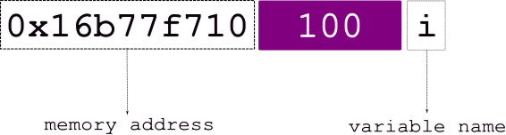 

<br>
The various elements from the above figure:

|||
|-------|-------|
|variable **name**| `i`|
|stored at **address**| `0x16677f710`|
|**value**| `100`|
||

<br>
Let's revisit this...


<br>

so it _could_ look something like,

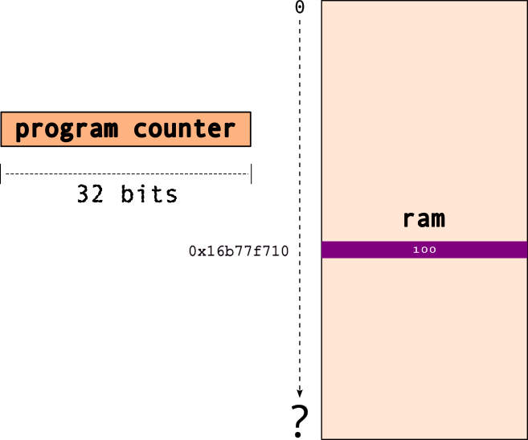

note that `0x16677f710` is the **address** _i.e._, the **location** in memory for the variable , `i`.

Now, _what_ is a **pointer**, say `ptr`?

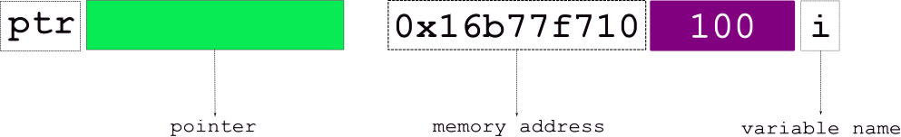 

<br>

Well, a pointer "**points to**" &rarr; another object..in effect, <font style="background-color: #FFEC8B;"> points to a **memory location**!`</font>

So, the pointer, _e.g._, `ptr`,

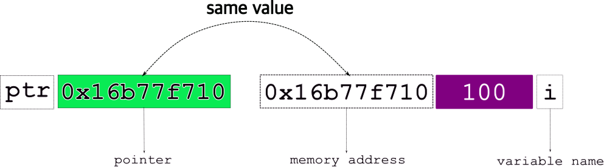 

stores the **address** of the object it points to!

**Final** view of a pointer, `ptr` pointing to a variable, `i`,

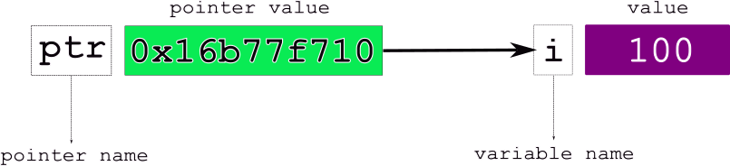

<br>

The various elements from the above figure:

|||
|-------|-------|
|variable **name**| `i`|
|stored at **address**| `0x16677f710`|
|**value**| `100`|
|**pointer name**| `ptr`|
|**pointer value**| `0x16677f710`, _i.e._, `i`|
||

### How do we declare/use pointers?

```C 
int i = 100 ;
int* ptr = &i ;
```

where,

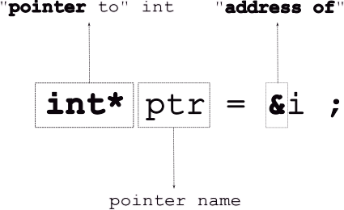

Note, that the "address of", `&` operator takes a variable and **returns its address**.

If you print out the pointer, `printf("%p", ptr)`, you'll get the _address_ (_i.e._, the arrow). 

Consider the following code example:

```c
#include <stdio.h>

int main()
{
    int i = 100 ;
    int* p_int; // declare a pointer, NOT initialized

    printf( "i = %d\t p_int = %p\n", i, p_int ) ;
    
    p_int = &i ; //initialize pointer to point to address of 'i'

    printf( "i = %d\t p_int = %p\t address of i = %p\n\n", i, p_int, &i ) ;

    printf( "\n" ) ;
    return 0 ;
}

```

Program output:
```
inline_exec_tmp.c: In function main:
inline_exec_tmp.c:8:5: warning: p_int is used uninitialized in this function [-Wuninitialized]
    8 |     printf( "i = %d\t p_int = %p\n", i, p_int ) ;
      |     ^~~~~~~~~~~~~~~~~~~~~~~~~~~~~~~~~~~~~~~~~~~
i = 100	 p_int = 0x7fffffffe380
i = 100	 p_int = 0x7fffffffe27c	 address of i = 0x7fffffffe27c


```

To *follow the arrow*, _i.e._, get the value in the location _pointed to_ by it (or to modify the actual value), you must **dereference** the pointer as follows: `*ptr`.

For the above code, if we change the following line, 
```C 
printf( "i = %d\t p_int = %p\t address of i = %p\t value at i = %d\n\n", i, p_int, &i, *p_int ) ;
```
the output changes to:
```
i = 100  p = 0x7fffffffe338      address of i = 0x7fffffffe338   value at i = 100
```

What happens when you run the following?

```c 
#include <stdio.h>

int main()
{
    int i = 100 ;
    int* p_int; // declare a pointer, NOT initialized

    printf( "i = %d\t p_int = %p\n", i, p_int ) ;
    
    p_int = &i ; //initialize pointer to point to address of 'i'

    printf( "i = %d\t p = %p\t address of i = %p\t value at i = %d\n\n", i, p_int, &i, *p_int ) ;

    int j = 200 ;
    p_int = j ; // works but NOT what we want

    printf( "i = %d\t p_int = %p\t address of i = %p\n\n", i, p_int, &i ) ;
    printf( "value at p_int = %d\n", *p_int ) ;

    printf( "\n" ) ;
    return 0 ;
}
```

What can you do to fix the above code to make it compile?

Now, if we want to change the value of `i` from `100` to `200`, _using the pointer_, we do:

```C
#include <stdio.h>

int main()
{
    int i = 100 ;
    int* p_int; // declare a pointer, NOT initialized

    printf( "i = %d\t p_int = %p\n", i, p_int ) ;
    
    p_int = &i ; //initialize pointer to point to address of 'i'

    printf( "i = %d\t p = %p\t address of i = %p\t value at i = %d\n\n", i, p_int, &i, *p_int ) ;

    *p_int = 200 ;
    printf( "i = %d\t p_int = %p\t address of i = %p\t value at i = %d\n\n", i, p_int, &i, *p_int ) ;

    printf( "\n" ) ;
    return 0 ;
}
```

Pointers are necessary as they enable us to build linked data-structures (linked-lists, binary trees, etc...). Languages such as Java assume that every single object variable is a pointer, and since all object variables are pointers, they don't need special syntax for them.

## Pointers and Modifiers

We can use modifiers in front of types, _e.g.,_ `const double pi = 3.14 ;` which means that the variable `pi` _cannot_ be modified in the program. Try the following program:

```C
#include <stdio.h>

int main()
{
    const double pi = 3.14 ;
    pi = 728.0 ;

    printf( "\n" ) ;
    return 0 ;
}
```

But, we can declare a pointer to it! We can even _dereference_ it and access the value.

```C
#include <stdio.h>

int main()
{
    const double pi = 3.14 ;
    // pi = 728.0 ; BAD!
   
    const double* p_double = &pi ;

    printf( "p_double points to the value = %f\n", *p_double ) ;   

    printf( "\n" ) ;
    return 0 ;
}
```

Will this work?
```c 
*p_double = 728 ;
```


The modifiers can be applied to the _pointers_ themselves and not only the variables they point to. So, the following are _**all** valid C statements_:

```c 
    double d ; // a regular 'double'
    double* p_d ; // a pointer to a 'double'
    const double cd ; // a 'constant' double
    const double* p_cd ; // a pointer to double that is constant
    double* const c_pd ; // a 'constant pointer' to a double
    const double* const c_p_cd ; // a constant pointer to a double that is a constant
```


## Arrays


We have seen arrays before...in the form of strings!


Arrays are a **contiguous** collection of data items, _all of the same type_.

so, if we _declare_ an integer array,

```c 
int a[5] = { 100, 200, 300, 400, 500 } ;
```

this is what it looks like in memory:

`a` &rarr; 
<svg>
<g>
<rect id="box" x="0" y="100" width="50" height="50"/>
<text x="5" y="131" font-size="23">100</text>
</g> 
<g>
<rect id="box" x="50" y="100" width="50" height="50"/>
<text x="55" y="131" font-size="23">200</text>
</g> 
<g>
<rect id="box" x="100" y="100" width="50" height="50"/>
<text x="105" y="131" font-size="23">300</text>
</g> 
<g>
<rect id="box" x="150" y="100" width="50" height="50"/>
<text x="155" y="131" font-size="23">400</text>
</g> 
<g>
<rect id="box" x="200" y="100" width="50" height="50"/>
<text x="205" y="131" font-size="23">500</text>
</g> 
<g>
<rect id="box" x="250" y="100" width="50" height="50"/>
<text x="255" y="131" font-size="23">600</text>
</g> 
</svg>

To access individual elements of the array, 
use the **array access operator**, `[]`

_e.g._, `a[0]`: 
<svg>
<g>
<rect id="boxhighlight" x="0" y="100" width="50" height="50"/>
<text x="5" y="131" font-size="23">100</text>
</g> 
<g>
<rect id="box" x="50" y="100" width="50" height="50"/>
<text x="55" y="131" font-size="23">200</text>
</g> 
<g>
<rect id="box" x="100" y="100" width="50" height="50"/>
<text x="105" y="131" font-size="23">300</text>
</g> 
<g>
<rect id="box" x="150" y="100" width="50" height="50"/>
<text x="155" y="131" font-size="23">400</text>
</g> 
<g>
<rect id="box" x="200" y="100" width="50" height="50"/>
<text x="205" y="131" font-size="23">500</text>
</g> 
<g>
<rect id="box" x="250" y="100" width="50" height="50"/>
<text x="255" y="131" font-size="23">600</text>
</g> 
</svg>

_e.g._, `a[2]`: 
<svg>
<g>
<rect id="box" x="0" y="100" width="50" height="50"/>
<text x="5" y="131" font-size="23">100</text>
</g> 
<g>
<rect id="box" x="50" y="100" width="50" height="50"/>
<text x="55" y="131" font-size="23">200</text>
</g> 
<g>
<rect id="boxhighlight" x="100" y="100" width="50" height="50"/>
<text x="105" y="131" font-size="23">300</text>
</g> 
<g>
<rect id="box" x="150" y="100" width="50" height="50"/>
<text x="155" y="131" font-size="23">400</text>
</g> 
<g>
<rect id="box" x="200" y="100" width="50" height="50"/>
<text x="205" y="131" font-size="23">500</text>
</g> 
<g>
<rect id="box" x="250" y="100" width="50" height="50"/>
<text x="255" y="131" font-size="23">600</text>
</g> 
</svg>

Now, there's a reason why I drew it like this:

`a` &rarr; 
<svg>
<g>
<rect id="box" x="0" y="100" width="50" height="50"/>
<text x="5" y="131" font-size="23">100</text>
</g> 
<g>
<rect id="box" x="50" y="100" width="50" height="50"/>
<text x="55" y="131" font-size="23">200</text>
</g> 
<g>
<rect id="box" x="100" y="100" width="50" height="50"/>
<text x="105" y="131" font-size="23">300</text>
</g> 
<g>
<rect id="box" x="150" y="100" width="50" height="50"/>
<text x="155" y="131" font-size="23">400</text>
</g> 
<g>
<rect id="box" x="200" y="100" width="50" height="50"/>
<text x="205" y="131" font-size="23">500</text>
</g> 
<g>
<rect id="box" x="250" y="100" width="50" height="50"/>
<text x="255" y="131" font-size="23">600</text>
</g> 
</svg>

because, `a` is actually a...**pointer**...to the start of the array, _i.e._, the **first** element.

When we access an array item, _e.g._, `a[2]`...`C` is basically doing **pointer arithmetic**. So, 

`a[2]` &rarr; `*(a+2)`:

|||
|-----|-----|
| `a` | pointer to start of array |
| `a+2` | add `2` to the pointer, <br> _i.e.,_ to the **address** `a` |
| `*(a+2)` | **dereference** address `a+2`, <br> _i.e.,_ get **data** from location `a+2` |
||

A simple example of using pointers vs array name:

```c
#include <stdio.h>

int main()
{
    int a[5] = { 100, 200, 300, 400, 500 } ;
    int* p_a = a ;

    printf( "%d\n", *(a+2) ) ;
    printf( "%d\n", *(p_a++) ) ;

    printf( "\n" ) ;
    return 0 ;
}
```

Program output:
```
300
100

```
## Pointers | Memory Allocation

[Slides](https://sibin.github.io/teaching/csci2410-gwu-systems_programming/fall_2024/slides/reveal_slides/memory_allocation.html)


Typically, in `C`, there are **two** types of memory allocations:

* static
* dynamic


### Static Memory Allocation

* most **definitions** we encounter
* all local, global, file scope variables

|Examples|
|--------|
| `int i ;`|
| `struct student st ;`|
| `char name[128] ;`|
| `const double* pd ;`|
|...|
||

* memory allocated at **<font style="background-color: #FFEC8B;">compile time</font>**
* compiler needs to to **exactly** how much memory
* the following is illegal:
char array<font style="color:white ; background-color: darkred; font-weight: bold;">[n]</font> ;

* the value of *n* can **change at run time**
* *e.g.*, we can do `n = 200 ;` 
* **before** the array is defined

[caveat: newer `C` compilers may allow it. Avoid doing this.]

### Dynamic Memory Allocation

* everything allocated using `malloc` [and other calls as we shall see]
* memory allocated at **<font style="background-color: #FFEC8B;">run time</font>**
 `char* pc = (char*) malloc( 128*sizeof(char) ) ;`

* `128 bytes` of memory allocated **dynamically**
* this is completely **legal**:
(char*) malloc( <font style="color:white ; background-color: darkgreen; font-weight: bold;">n</font>*sizeof(char) )` 
* value of *n* **can** change at run time


### `C` Standard Library Functions for Memory Allocation

|function name|bytes allocated|inititalize?|
|--------|--------|--------|
|`malloc(size)`|`size`| no|
|`calloc<br>(nmemb,size)`|`nmemb*size`<br>|`0`|
|`realloc<br>(*ptr,size)`|grow/shrink<br>`*ptr` to `size<Scb>|orig `*ptr`|
|`free(*ptr)`|n/a| n/a|
||

all defined in `<stdlib.h>`.

#### `size_t`

* unsigned integer data type 
* lots of system calls use `size_t`
* not a real data type 
* `typedef` is used &rarr; depends on platform!

|platform|`size_t`|
|--------|--------|
|32 bit|`unsigned int`|
|64 bit|`unsigned long long int`|

#### `malloc`

Signature: `void *malloc(size_t size);`

* allocate **raw memory** of `size_t size` bytes
* **no** initialization
* "data" is whatever is in memory
* use `memset()` to set memory to `0`
* returns &rarr; **pointer to newly allocated memory**


```C
#include <stdio.h>
#include <stdlib.h>
#include <assert.h>

// ALWAYS good to define array sizes as such constants
#define ARRAY_SIZE 16

int main()
{
    // random size
    int* temp = (int*) malloc( 12323445 ) ;

    int* pi = (int*) malloc( sizeof(int) * ARRAY_SIZE ) ;
    assert(pi) ; // check that a valid address was returned

    pi[0] = 233 ;

    printf( "After malloc\n") ;
    for( unsigned int i = 0 ; i < ARRAY_SIZE ; ++i )
        printf( "pi[%d] = %d\t", i, pi[i] ) ;
    printf( "\n" ) ;

    // remember to release the memory!
    free(pi) ;
    free(temp) ;

    printf("\n") ;
    return 0 ;
}
```


Let's look at another example:
```C
#include <stdio.h>
#include <stdlib.h>
#include <assert.h>

int main()
{
    // Create a new string to store a Haiku
    char haiku[] = "'You Laughed While I Slept'\n\
- by Bertram Dobell\n\
\n\
You laughed while I wept,\n\
Yet my tears and your laughter\n\
Had only one source." ;

    char* new_haiku = (char*)malloc( sizeof(char)*128 ) ;
    assert(new_haiku) ; // check if we got a valid pointer

    // copy from one to the other?
    new_haiku = haiku ;

    printf( "haiku = %s\n\n", haiku ) ;
    printf( "new_haiku = %s\n\n", new_haiku ) ;

    // Exactly the same, so all ok?

    // But, what if we do this?
    haiku [1] = '#' ;

    // new_haiku has changed!
    printf( "new_haiku = %s\n\n", new_haiku ) ;

    printf("\n") ;
    return 0 ;
}
```

The above change happens, because the copy `` new_haiku = haiku`` was a **shallow copy**, _i.e._, it only copied the pointers and **not** the underlying string!

To fix this problem, do a **deep copy** instead. 
```C
#include <stdio.h>
#include <stdlib.h>
#include <assert.h>

int main()
{
    // Create a new string to store a Haiku
    char haiku[] = "'You Laughed While I Slept'\n\
- by Bertram Dobell\n\
\n\
You laughed while I wept,\n\
Yet my tears and your laughter\n\
Had only one source." ;

    char* new_haiku = (char*)malloc( sizeof(char)*128 ) ;
    assert(new_haiku) ; // check if we got a valid pointer

    // copy from one to the other?
    // SHALLOW COPY
    // new_haiku = haiku ;

    // Deep Copy
    unsigned int i ; 
    for( i = 0 ; i < sizeof(haiku) ; ++i )
        new_haiku[i] = haiku[i] ;

    // modify original Haiku
    haiku [1] = '#' ;

    printf( "haiku = %s\n\n", haiku ) ;
    printf( "new_haiku = %s\n\n", new_haiku ) ; //unchanged

    printf("\n") ;
    return 0 ;
}
```

Note: we can use a `C` standard library function, `strcpy()` (defined in `<string.h>`) to do the copy:
```C
#include <stdio.h>
#include <stdlib.h>
#include <assert.h>
#include <string.h>

int main()
{
    // Create a new string to store a Haiku
    char haiku[] = "'You Laughed While I Slept'\n\
- by Bertram Dobell\n\
\n\
You laughed while I wept,\n\
Yet my tears and your laughter\n\
Had only one source." ;

    char* new_haiku = (char*)malloc( sizeof(char)*128 ) ;
    assert(new_haiku) ; // check if we got a valid pointer

    // Deep Copy
    strcpy( new_haiku, haiku ) ;

    // modify original Haiku
    haiku [1] = '#' ;

    printf( "haiku = %s\n\n", haiku ) ;
    printf( "new_haiku = %s\n\n", new_haiku ) ; //unchanged

    printf("\n") ;
    return 0 ;
}
```

What happens if I do, 
```c 
1[new_haiku] = `*` ;
```


#### `calloc`

Signature: `void* calloc(size_t nmemb, size_t size);`

* allocate **raw memory** of `nmemb*size` bytes
* guaranteed to initialize memory to `0`
* *e.g.*, `calloc(10, sizeof(int)) ;`
    * creates memory for `10` integers
    * each one set to `0`
* returns &rarr; **pointer to newly allocated memory**


```C
#include <stdio.h>
#include <stdlib.h>
#include <assert.h>

// ALWAYS good to define array sizes as such constants
#define ARRAY_SIZE 16

int main()
{
    // replace with calloc()
    // int* pi = (int*) malloc( sizeof(int) * ARRAY_SIZE ) ;
    int* pi = (int*) calloc( ARRAY_SIZE, sizeof(int) )  ; // notice the difference in args
    assert(pi) ; // check that a valid address was returned

    pi[0] = 233 ;

    printf( "After malloc\n") ;
    for( unsigned int i = 0 ; i < ARRAY_SIZE ; ++i )
        printf( "pi[%d] = %d\t", i, pi[i] ) ;
    printf( "\n" ) ;

    printf("\n") ;
    return 0 ;
}
```
Compare the differences, _if any_, in the outputs of the above two pieces of code. 


#### `realloc`

Signature: `void* realloc(void *ptr, size_t size);`

* **reallocate** the memory pointed to by `ptr`
* *i.e.,* grow/shrink it to the **new** `size`
* grows/shrink *in place* if possible
* if not enough space to grow, 
* allocate **new** memory of `size` (create a new pointer, `ptr2`)
* copy _as much_ of old data as possible, *i.e.,* from `ptr` &rarr; `ptr2`
* free old pointer, *i.e.,* `ptr`
* returns &rarr; one of,
    * `*ptr` if the new size fits
    * `*ptr2`, *i.e.,* pointer to new allocation

There are some "oddities" you need to be aware of while using `realloc()`:

* if original allocation was using `calloc()` &rarr; remember it sets the memory to `0`
* `realloc` **will not** set *extended* memory to `0`
* *e.g.,* 
    * if `calloc` created a 10 byte array, `pa`
    * initialized to `0`
    * `realloc(pa, 20)`
    * last `10` bytes **not** set to `0`


Adapting the code example from earlier, let's assume we now have a much longer poem to copy,
```C
#include <stdio.h>
#include <stdlib.h>
#include <assert.h>
#include <string.h>

// ALWAYS good to define array sizes as such constants
#define HAIKU_SIZE 128

int main()
{
    // Create a new string to store the Haiku
    char haiku[] = "'You Laughed While I Slept'\n\
- by Bertram Dobell\n\
\n\
You laughed while I wept,\n\
Yet my tears and your laughter\n\
Had only one source." ;

    // get space to store it
    char* new_haiku = (char*)malloc( sizeof(char)*128 ) ;

    // Deep Copy
    strcpy( new_haiku, haiku ) ;

    // ... same code as before

    // Now we have a new, LONGER, poem
    char twain_poem[] = "'These Annual Bills'\n\
- Mark Twain\n\
\n\
These annual bills! these annual bills!\n\ 
How many a song their discord trills \n\
Of 'truck' consumed, enjoyed, forgot,\n\
Since I was skinned by last year's lot!\n\
Those joyous beans are passed away;\n\
\n\
Those onions blithe, O where are they?\n\
Once loved, lost, mourned-now vexing ILLS\n\
Your shades troop back in annual bills! \n\
\n\
And so 'twill be when I'm aground \n\
These yearly duns will still go round, \n\
While other bards, with frantic quills,\n\
\n\
Shall damn and damn these annual bills!" ;

    // Deep Copy?
    strcpy( new_haiku, twain_poem ) ;

    printf( "\n---------------\n" ) ;
    printf( "%s\n\n", twain_poem ) ;
    printf( "new_haiku = %s\n\n", new_haiku ) ;

    printf( "new_haiku size = %lu \t twain size = %lu", sizeof(new_haiku), sizeof(twain_poem) ) ;

    printf("\n") ;
    return 0 ;
}
```

We see some random behaviors. Program can crash!

Some important issues: 
1. `strcpy() ` **does not** do a bounds check while copying! Use `strncpy()` instead.
2. we need to _increase_ the space for `new_haiku`, so we use `realloc()`.

```C
#include <stdio.h>
#include <stdlib.h>
#include <assert.h>
#include <string.h>

// ALWAYS good to define array sizes as such constants
#define HAIKU_SIZE 128
#define POEM_SIZE 1024 

int main()
{
    // Create a new string to store the Haiku
    char haiku[] = "'You Laughed While I Slept'\n\
- by Bertram Dobell\n\
\n\
You laughed while I wept,\n\
Yet my tears and your laughter\n\
Had only one source." ;

    // get space to store it
    char* new_haiku = (char*)malloc( sizeof(char)*128 ) ;

    // Deep Copy
    strcpy( new_haiku, haiku ) ;

    // ... same code as before

    // Now we have a new, LONGER, poem
    char twain_poem[] = "'These Annual Bills'\n\
- Mark Twain\n\
\n\
These annual bills! these annual bills!\n\ 
How many a song their discord trills \n\
Of 'truck' consumed, enjoyed, forgot,\n\
Since I was skinned by last year's lot!\n\
Those joyous beans are passed away;\n\
\n\
Those onions blithe, O where are they?\n\
Once loved, lost, mourned-now vexing ILLS\n\
Your shades troop back in annual bills! \n\
\n\
And so 'twill be when I'm aground \n\
These yearly duns will still go round, \n\
While other bards, with frantic quills,\n\
\n\
Shall damn and damn these annual bills!" ;


    // realloc for more space
    new_haiku = (char*) realloc( new_haiku, POEM_SIZE ) ;
    assert(new_haiku) ; // ALWAYS CHECK!

    // Deep Copy?
    strcpy( new_haiku, twain_poem ) ;

    printf( "\n---------------\n" ) ;
    printf( "%s\n\n", twain_poem ) ;
    printf( "new_haiku = %s\n\n", new_haiku ) ;

    printf( "new_haiku size = %lu \t twain size = %lu", sizeof(new_haiku), sizeof(twain_poem) ) ;

    printf("\n") ;
    return 0 ;
}
```


#### ` free()`

Signature: ` void free(void *ptr); `

* **releases** memory block referenced by `ptr`
    * other processes/OS can now use it
* only works for _dynamically allocated_ memory
    * **do not** try for static variables
    * "_undefined_" behavior
* no action if `ptr` is `NULL`
* _does not_ return anything

Modifying the above code block:

```C
#include <stdio.h>
#include <stdlib.h>
#include <assert.h>

// ALWAYS good to define array sizes as such constants
#define ARRAY_SIZE 16

int main()
{
    // replace with calloc()
    // int* pi = (int*) malloc( sizeof(int) * ARRAY_SIZE ) ;
    int* pi = (int*) calloc( ARRAY_SIZE, sizeof(int) )  ; // notice the difference in args
    assert(pi) ; // check that a valid address was returned

    pi[0] = 233 ;

    printf( "After malloc\n") ;
    for( unsigned int i = 0 ; i < ARRAY_SIZE ; ++i )
        printf( "pi[%d] = %d\t", i, pi[i] ) ;
    printf( "\n" ) ;

    // double the size o
    realloc( pi, ARRAY_SIZE*2 ) ;

    printf( "After realloc\n") ;
    for( unsigned int i = 0 ; i < ARRAY_SIZE*2 ; ++i )
        printf( "pi[%d] = %d\t", i, pi[i] ) ;
    printf( "\n" ) ;

    // I WANT TO BREAK FREE!
    free(pi) ;

    printf("\n") ;
    return 0 ;
}
```

A few things to keep in mind w.r.t. memory allocation in `C`:

1. If you want to allocate an array, then you have to do the math yourself for the array size.
    For example, `int *arr = malloc(sizeof(int) * n);` to allocate an array of `int`s with a length of `n`.
1. `malloc` is **not guaranteed** to initialize its memory to `0`.
    *You* must make sure that your array gets initialized.
	It is not uncommon to do a `memset(arr, 0, sizeof(int) * n);` to set the memory `0`.
1. `calloc` is guaranteed to initialize all its allocated memory to `0`.


### Common Memory Allocation Errors


Be aware of these issues as you use pointers and memory allocation/free. 

Note: `valgrind` will help you debug the last three of these issues.

1. **allocation error** &rarr; memory not allocated
    * maybe not enough memory in system
    * returns `NULL`
    * check for the return value **before** use!

```c
#include <stdlib.h>

int
main(void)
{
	int *a = malloc(sizeof(int));
	/* Error: did not check return value! */
	*a = 1;
	free(a);

	return 0;
}
```

Program output:
```
```


2. **dangling pointer** &rarr; accessing free'd pointer
    * mem may have been reallocated &rarr; someone else did a `malloc()` maybe
    * bad things happen (crashes, *etc.*) 
    * avoid `free()` until **all** references are done 


```c
#include <stdlib.h>

int
main(void)
{
	int *a = malloc(sizeof(int));
	if (a == NULL) return -1;
	free(a);

	/* Error: accessing what `a` points to after `free`! */
	return *a;
}
```

Program output:
```
```

3. **memory leaks** &rarr; allocate but forget to `free()`!
    * memory **never** get freed/released
    * over time, less memory available 
    * can slow down/crash entire system!
    * **always** pair a `free()` with an allocation     


```c
#include <stdlib.h>

int
main(void)
{
	int *a = malloc(sizeof(int));
	if (!a) return -1;
	a = NULL;
	/* Error: never `free`d `a` and no references to it remain! */

	return 0;
}
```

Program output:
```
```

4. **double free** &rarr; `free` memory twice
    * bad (unpredictable) things happen!
    * accidentally free memory used elsewhere
    * memory allocation logic can crash!

```c
#include <stdlib.h>

int
main(void)
{
	int *a = malloc(sizeof(int));
	if (!a) return -1;
	free(a);
	free(a);
	/* Error: yeah, don't do that! */

	return 0;
}
```

Program output:
```
free(): double free detected in tcache 2
make[1]: *** [Makefile:30: inline_exec] Aborted
```

## Exercises

### C is a Thin Language Layer on Top of Memory

We're going to look at a set of variables as memory.
When variables are created globally, they are simply allocated into subsequent addresses.

```c
#include <stdio.h>
#include <string.h>

void print_values(void);

unsigned char a = 1;
int b = 2;
struct foo {
	long c_a, c_b;
	int *c_c;
};
struct foo c = (struct foo) { .c_a = 3, .c_c = &b };
unsigned char end;

int
main(void)
{
	size_t vars_size;
	unsigned int i;
	unsigned char *mem;

	/* Q1: What would you predict the output of &end - &a is? */
	printf("Addresses:\na   @ %p\nb   @ %p\nc   @ %p\nend @ %p\n"
	       "&end - &a = %ld\n", /* Note: you can split strings! */
		   &a, &b, &c, &end, &end - &a);
	printf("\nInitial values:\n");
	print_values();
	/* Q2: Describe what these next two lines are doing. */
	vars_size = &end - &a;
	mem = &a;
	/* Q3: What would you expect in the following printout (with the print uncommented)? */
	printf("\nPrint out the variables as raw memory\n");
	for (i = 0; i < vars_size; i++) {
		unsigned char c = mem[i];
//		printf("%x ", c);
	}
	/* Q4: What would you expect in the following printout (with the print uncommented)? */
	memset(mem, 0, vars_size);
	/* memset(a, b, c): set the memory starting at `a` of size `c` equal `b` */
	printf("\n\nPost-`memset` values:\n");
//	print_values();

	return 0;
}

void
print_values(void)
{
	printf("a     = %d\nb     = %d\nc.c_a = %ld\nc.c_b = %ld\nc.c_c = %p\n",
		   a, b, c.c_a, c.c_b, c.c_c);
}
```

Program output:
```
Addresses:
a   @ 0x555555558010
b   @ 0x555555558014
c   @ 0x555555558020
end @ 0x555555558039
&end - &a = 41

Initial values:
a     = 1
b     = 2
c.c_a = 3
c.c_b = 0
c.c_c = 0x555555558014

Print out the variables as raw memory


Post-`memset` values:
```

**Question**
Answer *Q1-4* in the code, uncommenting and modifying where appropriate.

#### Takeaways

1. Each variable in C (including fields in structs) want to be aligned on a boundary equal to the variable's type's size.
    This means that a variable (`b`) with an integer type (`sizeof(int) == 4`) should always have an address that is a multiple of its size (`&b % sizeof(b) == 0`, so an `int`'s address is always divisible by `4`, a `long`'s by `8`).
2. The operation to figure out the size of all the variables, `&end - &a`, is *crazy*.
    We're used to performing math operations values on things of the same type, but not on *pointers*.
	This is only possible because C sees the variables are chunks of memory that happen to be laid out in memory, one after the other.
3. The *crazy* increases with `mem = &a`, and our iteration through `mem[i]`.
	We're able to completely ignore the types in C, and access memory directly!

**Question**: What would break if we changed `char a;` into `int a;`?
C doesn't let us do math on variables of *any type*.
If you fixed compilation problems, would you still get the same output?

### Quick-and-dirty Key-Value Store

Please read the `man` pages for `lsearch` and `lfind`.
`man` pages can be pretty cryptic, and you are aiming to get *some idea* where to start with an implementation.
An simplistic, and incomplete initial implementation:

```c
#include <stdio.h>
#include <assert.h>
#include <search.h>

#define NUM_ENTRIES 8
struct kv_entry {
	int key; /* only support keys for now... */
};
/* global values are initialized to `0` */
struct kv_entry entries[NUM_ENTRIES];
size_t num_items = 0;

/**
 * Insert into the key-value store the `key` and `value`.
 * Return `0` on successful insertion of the value, or `-1`
 * if the value couldn't be inserted.
 */
int
put(int key, int value)
{
	return 0;
}

/**
 * Attempt to get a value associated with a `key`.
 * Return the value, or `0` if the `key` isn't in the store.
 */
int
get(int key)
{
	return 0;
}

int
compare(const void *a, const void *b)
{
	/* We know these are `int`s, so treat them as such! */
	const struct kv_entry *a_ent = a, *b_ent = b;

	if (a_ent->key == b_ent->key) return 0;

	return -1;
}

int
main(void)
{
	struct kv_entry keys[] = {
		{.key = 1},
		{.key = 2},
		{.key = 4},
		{.key = 3}
	};
	int num_kv = sizeof(keys) / sizeof(keys[0]);
	int queries[] = {4, 2, 5};
	int num_queries = sizeof(queries) / sizeof(queries[0]);
	int i;

	/* Insert the keys. */
	for (i = 0; i < num_kv; i++) {
		lsearch(&keys[i], entries, &num_items, sizeof(entries) / sizeof(entries[0]), compare);
	}

	/* Now lets lookup the keys. */
	for (i = 0; i < num_queries; i++) {
		struct kv_entry *ent;
		int val = 0;

		ent = lfind(&queries[i], entries, &num_items, sizeof(entries[0]), compare);
		if (ent != NULL) {
			val = ent->key;
		}

		printf("%d: %d @ %p\n", i, val, ent);
	}

	return 0;
}
```

Program output:
```
0: 4 @ 0x55555555804c
1: 2 @ 0x555555558044
2: 0 @ (nil)
```

You want to implement a simple "key-value" store that is very similar in API to a hash-table (many key-value stores are implemented using hash-tables!).

**Questions/Tasks:**

- *Q1*: What is the difference between `lsearch` and `lfind`?
	The `man`pages should help here (`man 3 lsearch`) (you can exit from a `man` page using 'q').
    What operations would you want to perform with each (and why)?
- *Q2*: The current implementation doesn't include *values* at all.
    It returns the keys instead of values.
	Expand the implementation to properly track values.
- *Q3*: Encapsulate the key-value store behind the `put` and `get` functions.
- *Q4*: Add testing into the `main` for the relevant conditions and failures in `get` and `put`.

## Pointers | Memory Layouts and Interfaces

[Slides](https://sibin.github.io/teaching/csci2410-gwu-systems_programming/fall_2024/slides/reveal_slides/pointers_memory_layout.html)

<details>
<summary>[Notes]</summary>

> - Start with code examples
> - Intersperse with slides
</details>

### Basic Memory Layouts

It is important to understand how memory in `C` (_e.g._, variables, dynamic memory such from `malloc()`, _\etc._), once _allocated_, is _laid out_ in memory. This particularly important when dealing with pointers, arrays, complex types built using `struct`, _etc._

Consider the following **example**: suppose we need to create a database of student records. We can, perhaps, create a simle `struct` as follows:
```c 
struct student{
    unsigned int _gwid ;
    char _name [128] ;
} ;
```

The memory _layout_ for this struct will look like:

<twocolumn>
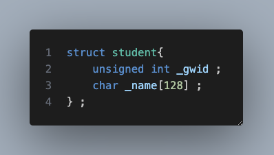
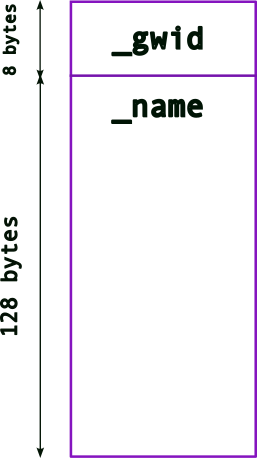
</twocolumn>

where the memory for the two variables, `_gwid` and `name` are (likely) consecutively laid out in memory (note: `unsigned int` is typically `4 bytes` for 32-bit architectures but can be `8 bytes` in 64-bit architectures.).

In the above example, the array, `_name[128]` has a **fixed** size, `128 bytes`. While this may be enough for _most_ names, there's a likelihood that names can be longer. Hence, `128 bytes` may not be enough. On the other hand, if most names in the database are much smaller, then we will end up _wasting_ a lot of memory (especially as the number of student records grows). For instance, if most names take up only `64 bytes` and if we have a $100,000$ records, then we're wasting `6.4 million` bytes! In some systems this can be prohibitive. Even otherwise, this is memory that other applications (or the OS) can use.

What is the solution then?

We can **dynamically allocate** memory for `_name` (based on how much memory is needed _at runtime_), _i.e._, **make it a pointer**!

So, once we update the `struct`, we get the following memory layout:

<twocolumn>
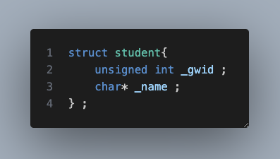
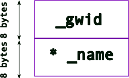
</twocolumn>

<br>

> Note: a pointer's size depends on the architecture:
> 
> |architecture|size (bytes)|
>|------------|------------|
> | 32-bit | 4 bytes |
>| 64-bit | 8 bytes |
> ||

So, now we must _allocate_ memory for us to store names, _.e.g._,

`new_student._name = (char*) malloc( sizeof(char) * 128 ) ;`

The memory layout will now look like,

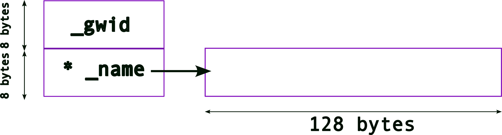

### Complex Memory Layouts

Since we want to create a database of student records, we need to story more than one. One way could be to create an _array_ of `struct student`,

```c 
struct student{
    unsigned int _gwid ;
    char _name [128] ;
} ;

struct student student_records[4] ;
```

Recall (from above) what the memory layout for _one_ `struct` (still with the hardcoded array for `_name`, _i.e._, an array of `128 bytes`) looks like. Now, the memory layout for an _array_ will look like,

<twocolumn>
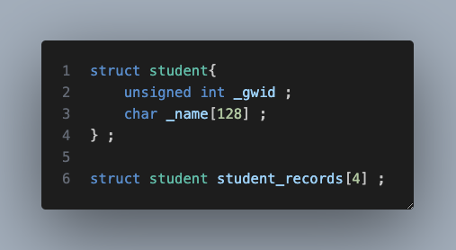
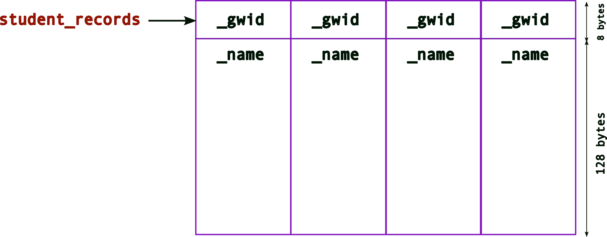
</twocolumn>

Remember that,

- an array is _contiguous_ memory of the _same type_
- `_student_records`, the array name is a **pointer** to the start of the array memory address.

Hence, when you access each element of the array, _e.g._, `student_records[n]

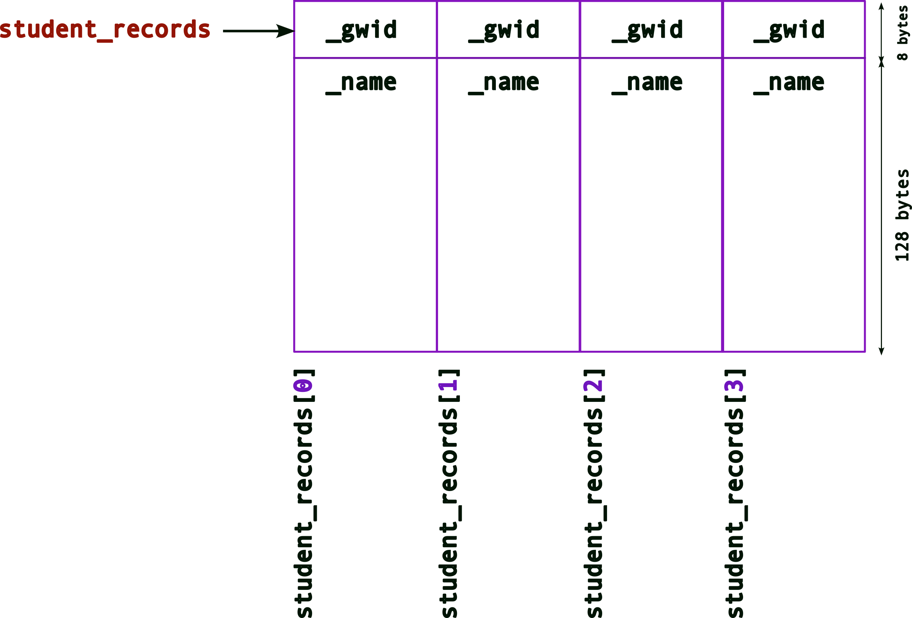

Of course, this still suffers from the earlier issue with the fixed value for the size of `_name`. Hence, we want to use the _pointer_ version of the struct. So, if we create an array of `struct student` as follows,
```c 
struct student{
    unsigned int _gwid ;
    char* _name ; // this is a pointer now
} ;

struct student student_records[4] ;
```

The memory layout for the `student_records` array will look like (again recall what the memory layout for _one_ struct will look like from above),

<twocolumn>
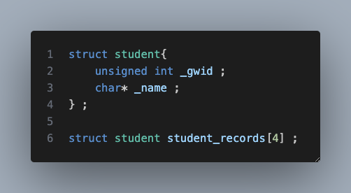
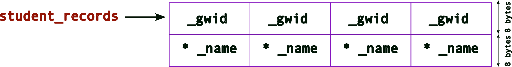
</twocolumn>

As before, to access each element of this array, we can use the `[]` operator, 

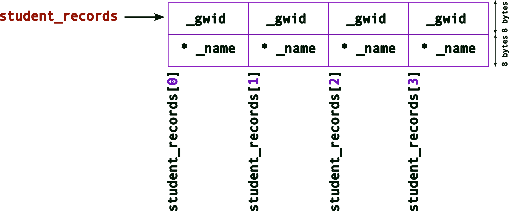

Note, we need to be careful with how we access/allocate/use the memory now. More of that later. 

Let's draw the same figure this way for convenience:

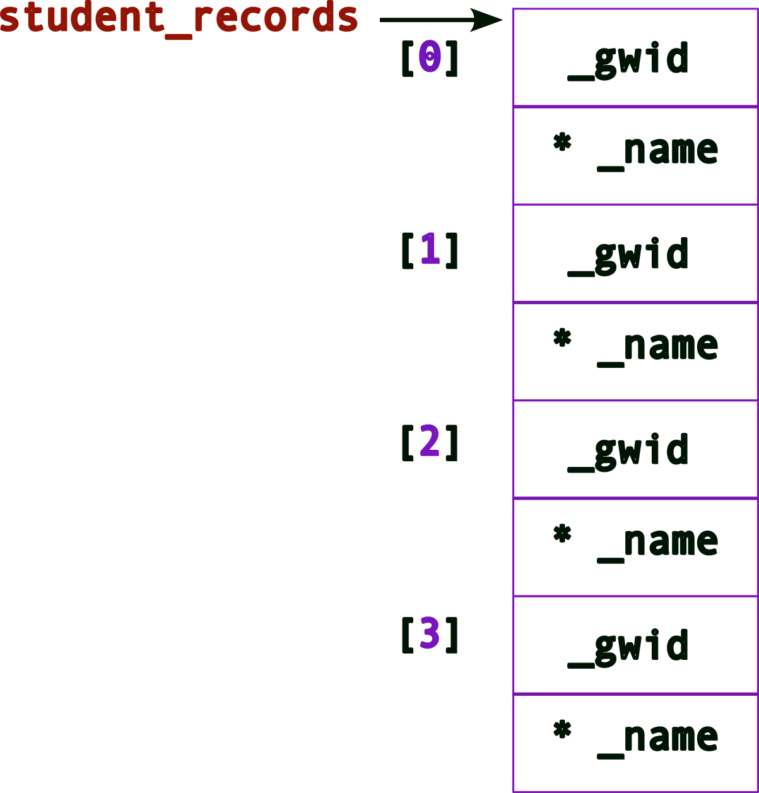

Remember that `_name` still needs memory! So we can allocate it, say using `malloc()`. Hence, allocating memory for the _first_ `_name` may look like this:

```c 
struct student{
    unsigned int _gwid ;
    char* _name ; // this is a pointer now
} ;

struct student student_records[4] ;
student_records[0]._name = (char*) malloc( sizeof(char)*128 ) ; // allocate memory for first name
```

The memory layout, after _one_ `_name` allocation will look like:

<twocolumn>
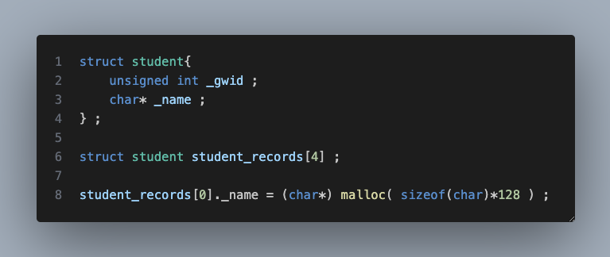
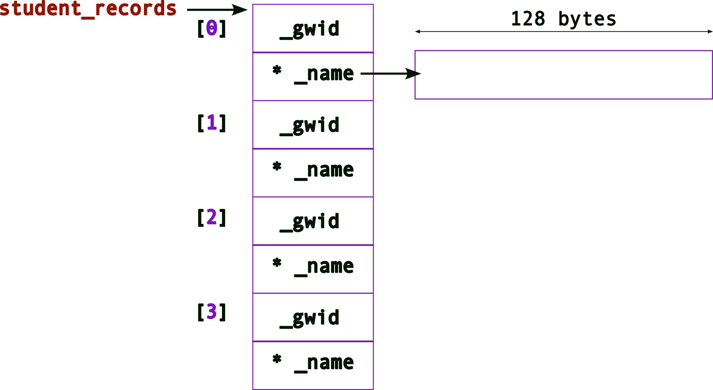
</twocolumn>

Updated memory layout after _all four_ `_name` allocations

<twocolumn>
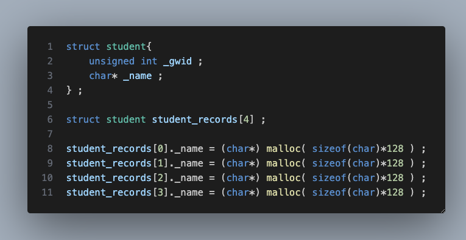
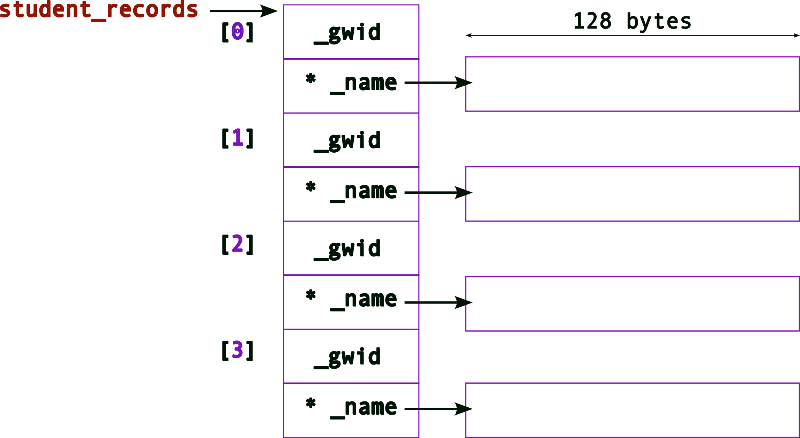
</twocolumn>

and the corresponding code will look like,
```c 
struct student{
    unsigned int _gwid ;
    char* _name ; // this is a pointer now
} ;

struct student student_records[4] ;
student_records[0]._name = (char*) malloc( sizeof(char)*128 ) ; // allocate memory for first name
student_records[1]._name = (char*) malloc( sizeof(char)*128 ) ; // allocate memory for second name
student_records[2]._name = (char*) malloc( sizeof(char)*128 ) ; // allocate memory for third name
student_records[3]._name = (char*) malloc( sizeof(char)*128 ) ; // allocate memory for fourth name
```

Let's go one step further...

```c 
struct student* student_records[4] ;
```
what does this do?

It creates an _array_ of **pointers to `struct`** (remember to read the definitions from right to left)!

The memory layout now looks like,

<twocolumn>
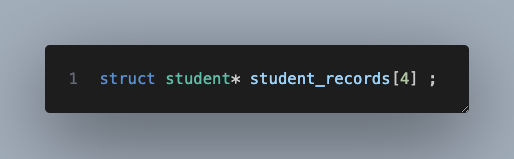
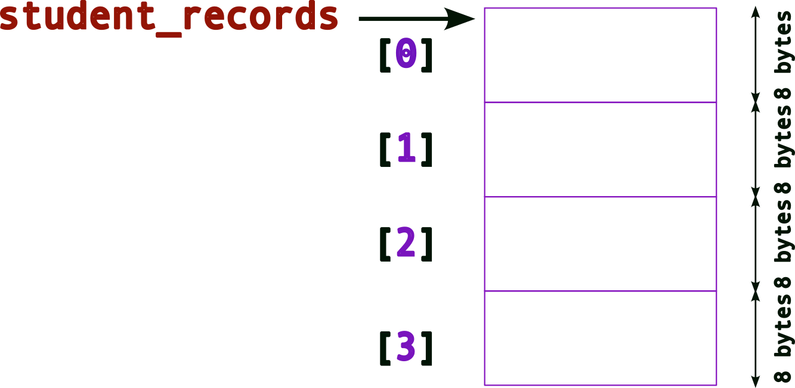
</twocolumn>

(Compare this to the previous layouts)

Hence, when we dereference each element of the array, _e.g.,_ `student_records[0]`, we get back, a `struct student*`, _i.e.,_ a **pointer**.

So, as a first step, we must **allocate a struct**!

```c 
struct student{
    unsigned int _gwid ;
    char* _name ; // this is a pointer now
} ;

struct student* student_records[4] ; // an array of pointers!
student_records[0] = (struct student*) malloc( sizeof(struct student) ) ; // allocate memory for a struct first!
```

The memory layout after allocating the struct:

<twocolumn>
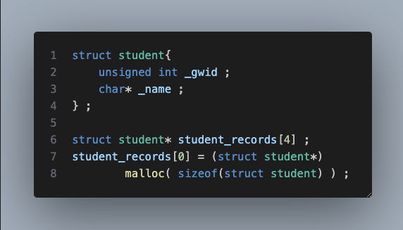
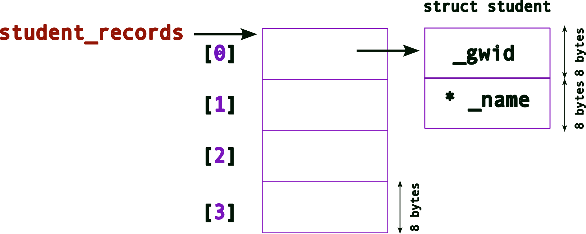
</twocolumn>

<br>

We're still missing something &rarr; **no memory space** for `_name` (remember it is still a pointer)! As before, we need to use `malloc()` for this:

```c 
struct student{
    unsigned int _gwid ;
    char* _name ; // this is a pointer now
} ;

struct student* student_records[4] ; // an array of pointers!
student_records[0] = (struct student*) malloc( sizeof(struct student) ) ; // allocate memory for a struct first!
student_records[0]->name = (char*) malloc( sizeof(char) * 128 ) ; // allocate memory for name, note the -> operator
```

> Note the **`->`** operator! 
>
> When we're trying to access members of a `struct` (or `union`) using pointers, we use the `->` operator.
> note the differences between the following:
> 
> |variable type|access examples|
> |-------------|---------------|
> | normal variable <br> <font size="small">`struct student sibin ;`| `sibin._name = malloc(...) ;` <br> `printf( "name = %s\n", sibin._name ) ;`|
> | pointer variable <br> `struct student* psibin = &sibin ;` | `psibin->_name = malloc(...) ;` <br> `printf( "gwid = %d\n", psibin->_gwid ) ;`|
> ||

Now, the memory layout after allocating both, the `struct` and `_name`,

<twocolumn>
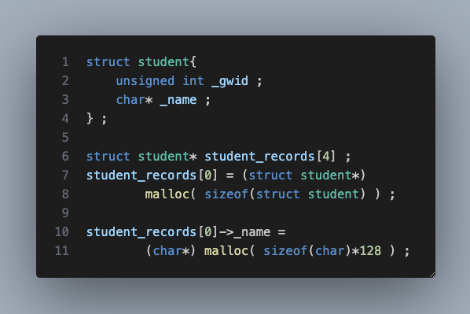
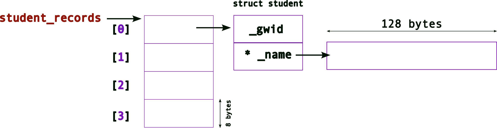
</twocolumn>

To allocate **all** of the required memory for the _entire_ array, _i.e.,_ allocating for all `struct` and `_name` pointers, we need to,
```c 
struct student{
    unsigned int _gwid ;
    char* _name ; // this is a pointer now
} ;

struct student* student_records[4] ; // an array of pointers!
student_records[0] = (struct student*) malloc( sizeof(struct student) ) ; // allocate memory for a struct first!
student_records[0]->name = (char*) malloc( sizeof(char) * 128 ) ; // allocate memory for name, note the -> operator

student_records[1] = (struct student*) malloc( sizeof(struct student) ) ; // allocate memory for a struct first!
student_records[1]->name = (char*) malloc( sizeof(char) * 128 ) ; // allocate memory for name, note the -> operator

student_records[2] = (struct student*) malloc( sizeof(struct student) ) ; // allocate memory for a struct first!
student_records[2]->name = (char*) malloc( sizeof(char) * 128 ) ; // allocate memory for name, note the -> operator

student_records[3] = (struct student*) malloc( sizeof(struct student) ) ; // allocate memory for a struct first!
student_records[3]->name = (char*) malloc( sizeof(char) * 128 ) ; // allocate memory for name, note the -> operator
```

The _final_ memory layout will look like,

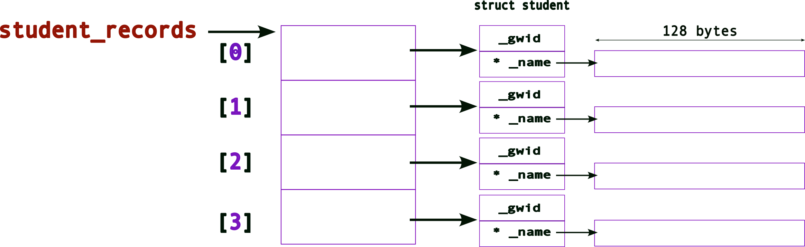

### Interfaces

The problem is that the code to initialize the entire array (`struct` and `_name`) is quite laborious and _ugly_ since we are initializing each one explicitly in code. Imagine if we had _hundreds_ or _thousands_ of new student records to initialize/store!

To solve this problem, we create an **interface** for _creating new records_. An "interface" is usually a fancy way of saying **function**. So, we _define_ a new function say, `create_student_record()` as follows:

<details>
<summary>[Notes]</summary>

> - show the previous, ugly code
> - explain the MAX_NAME_SIZE macro
</details>


```c
#include <stdio.h>
#include <stdlib.h>
#include <string.h>

// a macro to define the largest size for a name
#define MAX_NAME_SIZE 256

struct student{
    unsigned int _gwid ;
    char* _name ;
} ;

struct student create_student_record( unsigned int gwid, char* name )
{
    struct student new_student ;

    new_student._gwid = gwid ;
    new_student._name = (char*)malloc( sizeof(char)*MAX_NAME_SIZE ) ;
    strcpy( new_student._name, name ) ; // deep copy

    return new_student ;
}
```

Program output:
```
/usr/bin/ld: /usr/lib/gcc/x86_64-linux-gnu/9/../../../x86_64-linux-gnu/Scrt1.o: in function `_start':
(.text+0x24): undefined reference to `main'
collect2: error: ld returned 1 exit status
make[1]: *** [Makefile:33: inline_exec_tmp] Error 1
```
<details>
<summary>[Notes]</summary>

> - show with a single student variable first, problems with shallow copy, etc.
</details>

And we use the function as follows:

```c
#include <stdio.h>
#include <stdlib.h>
#include <string.h>

// a macro to define the largest size for a name
#define MAX_NAME_SIZE 256

struct student{
    unsigned int _gwid ;
    char* _name ;
} ;

struct student create_student_record( unsigned int gwid, char* name )
{
    struct student new_student ;

    new_student._gwid = gwid ;
    new_student._name = (char*)malloc( sizeof(char)*MAX_NAME_SIZE ) ;
    strcpy( new_student._name, name ) ; // deep copy

    return new_student ;
}

int main()
{
    struct student me = create_student_record( 920348, "sibin" ) ;

    // An array of struct OBJECTS
    struct student student_records[4] ;

    // Use the create INTERFACE to fill the array
    student_records[0] = create_student_record( 123, "ABC" ) ;
    student_records[1] = create_student_record( 456, "DEF" ) ;
    student_records[2] = create_student_record( 789, "GHI" ) ;
    student_records[3] = create_student_record( 987, "JKL" ) ;

    printf( "\n" ) ;
    return 0 ;
}
```

Program output:
```

```

What, if anything, is the problem here?

Consider the first line, `struct student me = create( 920348, "sibin" ) ;`. The return value from `create_student_record()` is a `struct` so the values of the original `struct`, created inside the function, are **copied** over to the the one in main, _i.e._, `me`. **Except**, when copying over the `_name` variables, we're doing a **shallow copy** since we're **only copying the pointers and not the underlying data** (names in this case)!

To avoid this problem, let's **return a pointer** to `struct student`, as follows:

```c
#include <stdio.h>
#include <stdlib.h>
#include <string.h>

// a macro to define the largest size for a name
#define MAX_NAME_SIZE 256

struct student{
    unsigned int _gwid ;
    char* _name ;
} ;

// copied struct but shallow copy returned (for _name)
struct student create_student_record( unsigned int gwid, char* name )
{
    struct student new_student ;

    new_student._gwid = gwid ;
    new_student._name = (char*)malloc( sizeof(char)*MAX_NAME_SIZE ) ;
    strcpy( new_student._name, name ) ; // deep copy

    return new_student ;
}

// return a pointer to the struct to avoid shallow copy
// note: we're returning a pointer to the ORIGINAL memory that was created
struct student* create_student_record_pointer( unsigned int gwid, const char* name )
{
    struct student* pnew_student = (struct student*) malloc( sizeof(struct student) ) ; 

    pnew_student->_gwid = gwid ;
    pnew_student->_name = (char*)malloc( sizeof(char)*MAX_NAME_SIZE ) ;
    strcpy( pnew_student->_name, name ) ;

    return pnew_student ;
}

int main()
{
    struct student* pme = create_student_record_pointer( 920348, "sibin" ) ; // returning/storing a pointer

    // An array of POINTERS to struct
    struct student* pstudent_records[4] ;

    // Use the (pointer) create INTERFACE to fill the array
    pstudent_records[0] = create_student_record_pointer( 123, "ABC" ) ;
    pstudent_records[1] = create_student_record_pointer( 456, "DEF" ) ;
    pstudent_records[2] = create_student_record_pointer( 789, "GHI" ) ;
    pstudent_records[3] = create_student_record_pointer( 987, "JKL" ) ;

    printf( "\n" ) ;
    return 0 ;
}
```

Program output:
```

```

This code should work. In fact, if we want tp _print_ the records, we can define an interface for that as well.

```c
#include <stdio.h>
#include <stdlib.h>
#include <string.h>

// a macro to define the largest size for a name
#define MAX_NAME_SIZE 256

struct student{
    unsigned int _gwid ;
    char* _name ;
} ;

// return a pointer to the struct to avoid shallow copy
// note: we're returning a pointer to the ORIGINAL memory that was created
struct student* create_student_record_pointer( unsigned int gwid, const char* name )
{
    struct student* pnew_student = (struct student*) malloc( sizeof(struct student) ) ; 

    pnew_student->_gwid = gwid ;
    pnew_student->_name = (char*)malloc( sizeof(char)*MAX_NAME_SIZE ) ;
    strcpy( pnew_student->_name, name ) ;

    return pnew_student ;
}

// interface to print a SINGLE student record, given a pointer to it
void print_student_record( const struct student* record )
{
    printf( "gwid = %d\t name = %s\n", record->_gwid, record->_name ) ;
}


int main()
{
    struct student* pme = create_student_record_pointer( 920348, "sibin" ) ; // returning/storing a pointer

    // An array of POINTERS to struct
    struct student* pstudent_records[4] ;

    // Use the (pointer) create INTERFACE to fill the array
    pstudent_records[0] = create_student_record_pointer( 123, "ABC" ) ;
    pstudent_records[1] = create_student_record_pointer( 456, "DEF" ) ;
    pstudent_records[2] = create_student_record_pointer( 789, "GHI" ) ;
    pstudent_records[3] = create_student_record_pointer( 987, "JKL" ) ;

    // UGLY way to print, call the interface instead
    printf( "\nAll Student Records (FOR LOOP):\n----------------------\nGIWD \t Name\n" ) ;
    for(unsigned int i = 0 ; i < 4 ; ++i)
        printf( "Student record %d: gwid = %d\t name = %s\n", i, 
                     pstudent_records[i]->_gwid, pstudent_records[i]->_name ) ;

    printf( "\nAll Student Records (INTERFACE):\n----------------------\nGIWD \t Name\n" ) ;
    // print using INTERFACE -- same effect as above printf
    for(unsigned int i = 0 ; i < 4 ; ++i)
    {
        printf( "Student record %d: ", i ) ;
        print_student_record( pstudent_records[i] ) ;
    }

    printf( "\n" ) ;
    return 0 ;
}
```

Program output:
```

All Student Records (FOR LOOP):
----------------------
GIWD 	 Name
Student record 0: gwid = 123	 name = ABC
Student record 1: gwid = 456	 name = DEF
Student record 2: gwid = 789	 name = GHI
Student record 3: gwid = 987	 name = JKL

All Student Records (INTERFACE):
----------------------
GIWD 	 Name
Student record 0: gwid = 123	 name = ABC
Student record 1: gwid = 456	 name = DEF
Student record 2: gwid = 789	 name = GHI
Student record 3: gwid = 987	 name = JKL

```

There still remains a serious problem with this code (even though it compiles and runs). There are lots of **memory leaks**! We need to call `free()` to release the memory back to the system once we are done with it. In this case, at the end of the `main()` function.

So, will this work?
```c 
free(pstudent_records) ;
```

It won't work since we're only _releasing the memory for the array_. Remember we used `malloc()` for each of the following:
* each `struct student*` in the array
* each `char* _name` in _each_ of the structs thus allocated!

A **lot** of memory will _leak_. Hence, we need to _carefully_ release all of it. 

```c 
// FIRST, free the memory for _name
free(pstudent_records[0]->_name) ;

// SECOND, free the struct
free(pstudent_records[0]) ;

// REPEAT for all 

free(pstudent_records[1]->_name) ;
free(pstudent_records[1]) ;
free(pstudent_records[2]->_name) ;
free(pstudent_records[2]) ;
free(pstudent_records[3]->_name) ;
free(pstudent_records[4]) ;
```

But this is fairly ugly code as well -- and quite unmanageable for a large number of records. As before, we create a new interface, `delete_student_record()` to _properly_ delete a record

```c
#include <stdio.h>
#include <stdlib.h>
#include <string.h>

// a macro to define the largest size for a name
#define MAX_NAME_SIZE 256

struct student{
    unsigned int _gwid ;
    char* _name ;
} ;

// return a pointer to the struct to avoid shallow copy
// note: we're returning a pointer to the ORIGINAL memory that was created
struct student* create_student_record_pointer( unsigned int gwid, const char* name )
{
    struct student* pnew_student = (struct student*) malloc( sizeof(struct student) ) ; 

    pnew_student->_gwid = gwid ;
    pnew_student->_name = (char*)malloc( sizeof(char)*MAX_NAME_SIZE ) ;
    strcpy( pnew_student->_name, name ) ;

    return pnew_student ;
}

// interface to print a SINGLE student record, given a pointer to it
void print_student_record( const struct student* record )
{
    // WHY is this 'const'?

    printf( "gwid = %d\t name = %s\n", record->_gwid, record->_name ) ;
}

void delete_student_record( struct student* pstudent )
{

    print_student_record( pstudent ) ; // reuse the print interface!

    free(pstudent->_name) ;
    free(pstudent) ;

}

int main()
{
    struct student* pme = create_student_record_pointer( 920348, "sibin" ) ; // returning/storing a pointer

    // An array of POINTERS to struct
    struct student* pstudent_records[4] ;

    // Use the (pointer) create INTERFACE to fill the array
    pstudent_records[0] = create_student_record_pointer( 123, "ABC" ) ;
    pstudent_records[1] = create_student_record_pointer( 456, "DEF" ) ;
    pstudent_records[2] = create_student_record_pointer( 789, "GHI" ) ;
    pstudent_records[3] = create_student_record_pointer( 987, "JKL" ) ;

    // UGLY way to print, call the interface instead
    printf( "\nAll Student Records (FOR LOOP):\n----------------------\nGIWD \t Name\n" ) ;
    for(unsigned int i = 0 ; i < 4 ; ++i)
        printf( "Student record %d: gwid = %d\t name = %s\n", i, 
                     pstudent_records[i]->_gwid, pstudent_records[i]->_name ) ;

    // print using INTERFACE -- same effect as above printf
    printf( "\nAll Student Records (INTERFACE):\n----------------------\nGIWD \t Name\n" ) ;
    for(unsigned int i = 0 ; i < 4 ; ++i)
    {
        printf( "Student record %d: ", i ) ;
        print_student_record( pstudent_records[i] ) ;
    }

    // Use the DELETE interface to PROPERLY clean up memory
    printf( "\nDeleting all Student Records (INTERFACE):\n----------------------\nGIWD \t Name\n" ) ;
    for(unsigned int i = 0 ; i < 4 ; ++i )
    {
        // send each element of the array to be "cleaned up        
        delete_student_record( pstudent_records[i] ) ;
    }

    // ALL Memory properly released!

    printf( "\n" ) ;
    return 0 ;
}
```

Program output:
```

All Student Records (FOR LOOP):
----------------------
GIWD 	 Name
Student record 0: gwid = 123	 name = ABC
Student record 1: gwid = 456	 name = DEF
Student record 2: gwid = 789	 name = GHI
Student record 3: gwid = 987	 name = JKL

All Student Records (INTERFACE):
----------------------
GIWD 	 Name
Student record 0: gwid = 123	 name = ABC
Student record 1: gwid = 456	 name = DEF
Student record 2: gwid = 789	 name = GHI
Student record 3: gwid = 987	 name = JKL

Deleting all Student Records (INTERFACE):
----------------------
GIWD 	 Name
gwid = 123	 name = ABC
gwid = 456	 name = DEF
gwid = 789	 name = GHI
gwid = 987	 name = JKL

```

Remember that properly designing and using programmatic interfaces is a critical part of system design and software development. All of the system calls, _e.g.,_ `printf()`, `malloc()`, _etc._ are interfaces that we use to interact with the system, _i.e.,_ the operating system!# Pointers | Casting 
[Slides](https://sibin.github.io/teaching/csci2410-gwu-systems_programming/fall_2023/slides/reveal_slides/pointer_casting.html/)

## Pointers and Arrays

..are the same thing!


* just different conventions to **access memory**
* *e.g.,* pointer arithmetic over an array of ints
* moves addresses by **size of the int** &rarr; `4` bytes
* **no interaction** with individual bytes 
    * only **whole ints**


## Pointer Arithmetic 

* consider an integer array &rarr; `int a[5]`
* `5` ints, **each** of `4` bytes


<br>

* so `a[0]` is:


<br>

* so `a[1]` is &rarr; **same** as `++a`!


<br>

* we **cannot** access the individual bytes, i.e., these ones:


<br>

what if we **want** to access the individual bytes?

## Pointer Casting!

* can cast from one pointer type to another!
* between **any two pointers**!
* a pointer is always the same size, *i.e.,* `4` bytes
* making it point to something else 
* doesn't change the memory underneath
    * but, **changes pointer arithmetic**!


### Casting from `int*` to `char*`
* now, as before, if we have &rarr; `int a[5]`
* and we do, 
**`char* pc = (char*) a ;`**
* `pc` points to the **same** memory region as `a`
* but now, can treat it as **characters**
* *i.e.,* **one byte**
<br>
<br>

* so `pc[0]` is:


<br>

* so `pc[1]` is &rarr; same as `++pc`!
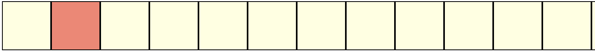

### Example

Consider the following code:
```c 
#include <stdio.h>
#include <stdlib.h>
#include <assert.h>

int main()
{
    int* a = (int*)malloc( sizeof(int) ) ;
    assert(a != NULL) ; // SAME as assert (a)

    *a = 1145258561 ;

    printf( "a = %d\n", *a ) ;

    char* ppc = (char*) a ;
    for(unsigned int i = 0 ; i < sizeof(a); ++i )
        printf( "%c ", *pc++ ) ;

    printf("\n") ;
    return 0 ;
}
```


## Pointer Casting | `void*`

* can cast **any** point to a `void*`
* all of these are valid:

```c
void* pv = malloc(32);
int* pi = (int*) pv ; 
double* pd = (double*) pv ;
char* pc = (char*) pi ; 
```                        

* can cast **any** point to a `void*`
* all of these are valid:
* **cannot** dereference a `void*` directly!
compiler does not know the type

# Function Pointers

Functions have **types** too. E.g., 

```c 
void foo(int i, double d){...}
```
The "type" of this function is:
* takes as input two arguments &rarr; one `int` and one `double`
* returns nothing, hence return type is `void`
* **note**: this is **not** the same as a return type of `void*`

Sometimes, you need to decide *which* function to call at **run time**. Why?

### Example | Bubble Sort 

\[[Follow along with the Generic Bubble Sort Code](https://sibin.github.io/teaching/csci2410-gwu-systems_programming/fall_2023/code/generic_bubble_sort.c)\]

How do you write a bubble sort? Say for an array of `int`s?

```c
#include <stdio.h>
#include <stdlib.h>
#include <assert.h>

// Sorting ints
void bubble_sort_int( int array[], int array_size )
{
    for( unsigned int i = 0 ; i < array_size-1 ; ++i )
    {
        for( unsigned int j = 0 ; j < i ; ++j )
        {
            if( array[j] > array[j+1] )
            {
                int temp = array[j] ;
                array[j] = array[j+1] ;
                array[j+1] = temp ;
            }
        }
    }
}

// printing out an array
void print_array( int array[], int array_size )
{
    printf( "array = " ) ;
    for( unsigned int i = 0 ; i < array_size ; ++i )
        printf( "%d ", array[i] ) ;
}

int main()
{
    int my_array[] = { 2341, 8632, 3, 2344, 747645 } ;
    int array_size = 5 ;

    // sort the array
    bubble_sort( my_array, array_size ) ;

    print_array( my_array, array_size ) ;

    printf( "\n" ) ;
    return 0 ;
}
```

Program output:
```
inline_exec_tmp.c: In function bubble_sort_int:
inline_exec_tmp.c:8:33: warning: comparison of integer expressions of different signedness: unsigned int and int [-Wsign-compare]
    8 |     for( unsigned int i = 0 ; i < array_size-1 ; ++i )
      |                                 ^
inline_exec_tmp.c: In function print_array:
inline_exec_tmp.c:26:33: warning: comparison of integer expressions of different signedness: unsigned int and int [-Wsign-compare]
   26 |     for( unsigned int i = 0 ; i < array_size ; ++i )
      |                                 ^
inline_exec_tmp.c: In function main:
inline_exec_tmp.c:36:5: warning: implicit declaration of function bubble_sort; did you mean bubble_sort_int? [-Wimplicit-function-declaration]
   36 |     bubble_sort( my_array, array_size ) ;
      |     ^~~~~~~~~~~
      |     bubble_sort_int
/usr/bin/ld: /tmp/ccW0E8gd.o: in function `main':
/home/sibin/Teaching/CSCI_2401/lectures-private-forBuildingWebpage/inline_exec_tmp.c:36: undefined reference to `bubble_sort'
collect2: error: ld returned 1 exit status
make[1]: *** [Makefile:33: inline_exec_tmp] Error 1
```

This works for an array of `int`s. But what if I want to sort an array of `double`?

Maybe, write a new function to do that?

```c 
// Sorting ints
void bubble_sort_double( double array[], int array_size )
{
    for( unsigned int i = 0 ; i < array_size-1 ; ++i )
    {
        for( unsigned int j = 0 ; j < i ; ++j )
        {
            if( array[j] > array[j+1] )
            {
                double temp = array[j] ;
                array[j] = array[j+1] ;
                array[j+1] = temp ;
            }
        }
    }
}
```

But what if I want to sort an array of `char`? Strings? `float`s? My custom `struct`s? Do we write one function for each?
```c 
void bubble_sort_char( char array[], int array_size ){...}
void bubble_sort_strings( char* array[], int array_size ){...}
void bubble_sort_float( float array[], int array_size ){...}
void bubble_sort_struct_student( struct student array[], int array_size ){...}
```

But what if **we don't know which one will be needed until run time?***

So, depending on the data that we're given, or some input from the user, we may have to pick one of the above but *won't know of the choice at compile time*.

Enter **function pointers**!

### Example | Generic Bubble Sort

A sorting algorithm, at its heart, has two parts:

1. *compare*: given two elements, let us know which is larger/greater
2. *swap*: given two elements, exchange their values

so, in a generic sense, we have:
```c 
if( is_greater(a, b) ) // If a is larger than b
    swap(a, b)         // swap their values
```

hence, we can rewrite the bubble sort function, in a "generic" form as:
```c 
// Sorting | Generic
void generic_bubble_sort(...)
{
    for( unsigned int i = 0 ; i < array_size-1 ; ++i )
        for( unsigned int j = 0 ; j < i ; ++j )
            if( is_greater( array[j], array[j+1]) )
                swap( array[j], array[j+1] ) ;
}
```

But, what are the **inputs** to the function? 

We first need to define the type of the array. Since we won't know the type of the data elements in the array, we can't pick a specific array type. 

But, remember:
* arrays and pointers are interchangeable
* can cast from any pointer type to `void*` and back

using this, we define the array as a `void*`:

```c 
void generic_bubble_sort( void* array, ... )
```

As before, we need to know the *size* of the entire array, so we can now expand the function signature more:

```c 
void generic_bubble_sort( void* array, int array_size, ...)
```

Remember that a void* pointer is just a pointer to a *block* of memory. C does not know the *type of each element* in the array. So, we **cannot** do:
* `array[i]` &rarr; since the type is a `void*`

We can use pointer arithmetic with `void*` so this is possible:
* `array+i` &rarr; but that moves the pointer forward by `i` **bytes**

and **not** by the number of bytes of the data type. Recall,
* `char* pc ; pc+1 ;` &rarr; advances by `1` byte
* `int* pi ; pi+1 ;  `  &rarr; advances by `4` bytes


Hence, we need information about the *size of each element*, i.e.,
```c 
void generic_bubble_sort( void* array, int array_size, 
                                        int element_size ) 
```

So, we can do: `array + (i * element_size)` to move to the next element in the array

So, for an `int` array, we get (`element_size = 4`):


<br>

and for a `char` array, we get (`element_size = 1`):


<br>

Using this information about `element_size`, we can rewrite the generic bubble sort function as:
```c 
// Sorting | Generic
void generic_bubble_sort( void* array, int array_size, 
                                        int element_size ) 
{
    for( unsigned int i = 0 ; i < array_size-1 ; ++i )
        for( unsigned int j = 0 ; j < i ; ++j )
            if( is_greater( array + (j * element_size), array + ((j+1) * element_size )) )
                swap( array + (j * element_size), array + ((j+1) * element_size )) ) ;
}
```

Now we see the *generic* version of bubble sort taking shape. 

### What is "*generic*"?

But we are still missing critical information, *viz.*, what are `is_greater()` and `swap()`?

Remember that since the `generic_bubble_sort()` function doesn't know which *exact* type it is operating on, we need to _somehow_ provide it with the **actual** functions that will carry out the comparison and swapping, depending on the type of the array being passed in. For instance, if we are comparing integers, we need a comparator and swap that can operate on integers and similarly ones for structs, doubles, *etc.*

Wouldn't it be great, if we could just **send in the specific functions as arguments to `generic_bubble_sort()`**, say like,
```c 
void generic_bubble_sort( void* array, int array_size, 
                          int element_size, 
                          <SOME_TYPE> is_greater,
                          <SOME_TYPE> swap ) 
{
    for( unsigned int i = 0 ; i < array_size-1 ; ++i )
        for( unsigned int j = 0 ; j < i ; ++j )
            if( is_greater( array + (j * element_size), array + ((j+1) * element_size )) )
                swap( array + (j * element_size), array + ((j+1) * element_size )) ) ;
}
```

This is *precisely* where **function pointers** come in.

We can define `is_greater()` and `swap()` to be pointers to functions, *i.e.,* to a **type** of function (the signatures). Hence, a *comparator* function pointer would look like:
```c 
typedef int (*comparator_function_pointer)( void* l, void* r ) ;
```

Recall that the `typedef` keyword *associates a name with a type*. In the above example, we are saying that `comparator_function_pointer` is now a name that refers to the (function) type, `int (*)( void*, void* )`, *i.e.,* a **pointer to a function that takes two arguments, each of type `void*` and returns and `int`**. 

Note, that the job of a comparator function is to take two values and,
* return positive (non-zero) values if `l > r` or 
* a zero if `l <= r`.

We can define the `swap` function pointer in a similar manner:
```c 
typedef void (*swap_function_pointer)( void* l, void* r ) ;
```
where, `swap_function_pointer` is a **name** that refers to the (function) type, `void (*)( void*, void* )` since such a function doens't need to return anything, just swap the two elements pointed to by the `void*` arguments.

Updating our sorting function to use the function pointers,
```c 
void generic_bubble_sort( void* array, int array_size, 
                          int element_size, 
                          comparator_function_pointer is_greater,
                          swap_function_pointer swap ) 
{
    for( unsigned int i = 0 ; i < array_size-1 ; ++i )
        for( unsigned int j = 0 ; j < i ; ++j )
            if( is_greater( array + (j * element_size), array + ((j+1) * element_size )) )
                swap( array + (j * element_size), array + ((j+1) * element_size )) ) ;
}
```
So, `is_greater` is now a function pointer of type, `comparator_function_pointer` and `swap` is a function pointer of type, `swap_function_pointer`. 

**NOTE:** function pointers are invoked **exactly** like regular functions, *i.e.,* `is_greater(...)` and `swap(...)`. The above code will work without any changes. 


### Generic to *concrete* functions

Eventually, we need to decide what it is that we are sorting. Is it an array of `int`s, `doubles`s, `struct`s, etc. And at that point in time, we will need the actual, **concrete* functions for comparing and swapping `int`s (or `double`s or whatever). 

We we define the two functions (using `int` as an example):

```c 
// Compare and Swap functions for integers
int is_greater_than_int( void* l, void* r )
{
    // cast it from void* to relevant type, int*
    // since we cannot dereference void*
    int* left = l ;
    int* right = r ;

    // compare and return result
    if( *left > *right )
        return 1 ;
    else
        return 0 ; 

   // Can just use this one line instead but not doing so for clarity
   // return ( *l > *r ? 1 : 0 ) ; 
}

void swap_int( void* l, void* r )
{
    // cast it from void* to relevant type, int*
    // since we cannot dereference void*
    int* left = l ;
    int* right = r ;
    int temp = *left ;

    // swap
    *left = *right ;
    *right = temp ;
}
```

We can define equivalent functions for `double`,
```c 
// Compare and Swap functions for doubles 
int is_greater_than_double( void* l, void* r )
{
    double* left = l ;
    double* right = r ;

    if( *left > *right )
        return 1 ;
    else
        return 0 ; 
}

void swap_double( void* l, void* r )
{
    double* left = l ;
    double* right = r ;
    double temp = *left ;

    *left = *right ;
    *right = temp ;
}
```

**NOTE:** the type signatures of the concrete functions must **exactly match** that of the corresponding function pointers. Otherwise it will result in compile time errors.

### Putting it all Together | Using Function Pointers

Now we are ready to use the concrete functions and the pointers in our code:

```c 
int main()
{
    int my_array_int[] = { 2341, 8632, 3, 2344, 747645 } ;
    int array_size = 5 ;

    // calling the INTEGER version with the concrete integer comparator and swap
    generic_bubble_sort( my_array_int, array_size, 
                         sizeof(int), /*element size*/
                         is_greater_than_int, 
                         swap_int ) ;

    // calling the DOUBLE version with the concrete DOUBLE comparator and swap
    double my_double_array[] = {1.0, 9485.2, 34.567, 9383.243, 44.1 } ;
    generic_bubble_sort( my_double_array, array_size, 
                         sizeof(double), /*element size*/
                         is_greater_than_double, 
                         swap_double ) ;

    return 0 ;
}
```

As we see from the above, we are using the **same** `generic_bubble_srt` function to sort both, arrays of `int` and `double`. The only difference is the different *concrete* versions of the comparator and swap functions that we pass to the sorting function.


### Why bother if we need `concrete` functions anyways?

Using function pointers allows us to do a few things well:
1. **code reuse**: the code for sorting doesn't need to be rewritten each time. In fact, when we have larger, more complex, functions, this will be a lifesaver as we can implement the main "concept" just once and then write "*specialized*" concrete functions (usually much smaller) as needed.
2. **dynamic dispatch**: oftentimes, it may not be clear *which* version of the concrete functions are needed, **until runtime**! In our example, what if we don't know if we're given arrays of `int`s or `double`s until we receive the data at runtime? Then we cannot know which concrete function is to be invoked while writing the code. Hence, we can pick the appropriate function pointer *at run time* and the code will work correctly!
3. **specialization**: different data types require different handling. The way we sort numbers *will not* be the same way we sort strings or other, more complex, data types (*e.g.,* user defined `struct`s). 


### In-class Exercise | Generic Insertion Sort for `struct`

Fill out the missing elements in this code:
```c 
#include <stdio.h>
#include <stdlib.h>

#define NAME_LENGTH 128

struct map{
    char _country[NAME_LENGTH] ;
    char _capital[NAME_LENGTH] ;
} ;


// DEFINE TWO FUNCTION POINTERS, ONE EACH FOR COMPARE AND SWAP


// UNCOMMENT THE TWO ARGUMENTS ONCE YOU DEFINE THE FUNCTION POINTERS
void generic_insertion_sort( void* array, int array_size, int element_size
                            /*is_greater_than my_comparator,
                            swap my_swap*/ )
{

}

// CREATE A NEW STRUCT AND RETURN A POINTER TO IT
struct map* create_new_struct(/*...*/)
{

}

// CREATE THE COMPARATOR AND SWAP FUNCTIONS HERE


// FUNCTION TO PRINT THE ARRAY OF STRUCTS AND ITS ELEMENTS
// PRINT EACH RECORD ON A NEW LINE AS FOLLOWS:
// country: USA             capital: Washington D.C.
// country: Sierra Leone    capital: Freetown
// ...
void print_array_structs(/*...*/)
{

}


int main()
{ 
    unsigned int num_countries ;
    printf( "number of countries: " ) ;
    scanf( "%d", &num_countries ) ;

    // CREATE AN ARRAY OF POINTERS TO STRUCTS
    struct map** array_countries /*= ...*/ ;


    // CREATE num_countries NUMBER OF "COUNTRIES" AND STORE IN THE ARRAY
    // ASK USER FOR INPUT ON COUNTRY/CAPITALS
    // YOU CAN PICK YOUR OWN COUNTRY/CAPITAL COMBINATIONS


    // PRINT THE ARRAY BEFORE SORT
    print_array_structs( /*...*/ ) ;


    // SORT THE ARRAY -- FIRST BY COUNTRY NAME
    generic_insertion_sort( array_countries, num_countries, sizeof(struct map*) /*,...*/) ; 

    // PRINT THE ARRAY AFTER FIRST SORT
    print_array_structs( /*...*/ ) ;


    // SORT THE ARRAY -- SECOND BY CAPITAL NAME
    generic_insertion_sort( array_countries, num_countries, sizeof(struct map*) /*,...*/) ; 

    // PRINT THE ARRAY AFTER SECOND SORT
    print_array_structs( /*...*/ ) ;

    printf( "\n" ) ;
    return 0 ;
}
```
# C Memory Model, Data-structures, and APIs

C presents some unique opportunities for how to structure your code and data-structures, but also requires that you're careful about how data is passed around a program.

## Memory Allocation Options

In C, when creating a variable, you have the option of allocating it in one of multiple different types of memory:

- In another existing structure.
- In the heap using `malloc` or its sibling functions.
- In global memory.
- On the stack.

It might be surprising, but it is quite *uncommon* in programming languages to have this flexibility.

### Internal Allocation

What does it look like to do internal allocation of one struct or array inside of another?
See the following as an example.

```c
#include <stdlib.h>

struct bar {
	/*
	 * `arr` is allocated internally to `bar`, whereas `bytes` is a pointer to
	 * a separate allocation. `arr` must have a *fixed size*, and `bytes` does not
	 * because its allocation can be as large as you want!
	 */
	int arr[64];
	unsigned char *bytes;
};

struct foo {
	/* The `bar` structure is allocated as *part of* the `struct foo` in `internal` */
	struct bar internal;
	/* But we can *also* allocate another `bar` separately if we'd prefer */
	struct bar *external;
};

int
main(void)
{
	/*
	 * We didn't have to separately allocate the `struct bar internal` as
	 * it was allocated with the enclosing `a` allocation. However, we do have to
	 * allocate the `external` allocation. In both cases, we have access to a
	 * `struct bar` from within `struct foo`.
	 */
	struct foo *a = malloc(sizeof(struct foo)); /* should check return value */
	a->external   = malloc(sizeof(struct bar)); /* and this one ;-( */

	/*
	 * Note the difference in needing to use `->` when `external` is a pointer
	 * versus simply using `.` with `internal`.
	 */
	a->internal.arr[0] = a->external->arr[0];

	return 0;
}
```

Program output:
```
```

One of the more interesting uses of internal allocation is in linked data-structures (e.g. like linked lists).
It is common in languages like java to implement linked data-structures to have "nodes" that reference the data being tracked.

```java
// This could be made generic across the data types it could store by instead
// using `class LinkedList<T>`, but I'm keeping it simple here.
class LinkedListOfStudents {
	Node head;

	class Node {
		Student s;
		Node next;

		Node(Student s, Node next) {
			this.s    = s;
			this.next = next;
		}
	}

	void add(Student s) {
		// The program has *previously* allocated `data`.
		// Now we have to additionally allocate the `node` separate from the data!
		Node n = new(s, this.head);

		this.head = n;
	}

	// ...
}
// This looks like the following. Note separate allocations for Node and Student
//
// head --> Node------+    ,-->Node-----+
//          | s  next |---'    | s next |---...
//          +-|-------+        +-|------+
//            v                  V
//          Student-+           Student-+
//          | ...   |           | ...   |
//          +-------+           +-------+
```

Lets see the same in C.

```c
#include <stdlib.h>
#include <stdio.h>

struct linked_list_node {
	void *data;
	struct linked_list_node *next;
};

struct linked_list {
	struct linked_list_node *head;
};

struct student {
	// student data here...
	struct linked_list_node list;
};

void
add(struct linked_list *ll, struct linked_list_node *n, void *data)
{
	n->next  = ll->head;
	n->data  = data;
	ll->head = n;
}

struct linked_list l;

int
main(void)
{
	struct student *s = malloc(sizeof(struct student));
	/* Should check that `s != NULL`... */
	add(&l, &s->list, s); /* note that `&s->list` is the same as `&(s->list)` */

	printf("student added to list!\n");

	return 0;
}

/*
 * This looks something like the following. Linked list is *internal* to student.
 *
 * head ----> student-+     ,-> student-+
 *            | ...   |    ,    | ...   |
 *            | next  |---'     | next  |--> NULL
 *            +-------+         +-------+
 */
```

Program output:
```
student added to list!
```

A few interesting things happened here:

1. We're using `void *` pointers within the `linked_list_node` so that the linked list can hold data of *any pointer type*.
    You can see that in our list implementation, there is nothing that is `student`-specific.
2. The `list` is inline-allocated inside the `student` structure, which completely avoids the separate `node` allocation.

Most serious data-structure implementations enable this inlining of data-structure nodes even without requiring the `data` pointer in the node.
We won't cover that, but you can [see a sample implementation](https://github.com/gwsystems/ps/blob/master/ps_list.h).

### Heap Allocation

We've already seen `malloc`, `calloc`, `realloc`, and `free` which are our interface to the heap.
These provide the most flexibility, but require that you track the memory and `free` it appropriately^[Not always an easy feat.
See the previous discussion on Common Errors.]

### Global Allocation

We have already seen global allocations frequently in examples so far.

```c
#include <stdio.h>

/* A globally allocated array! No `malloc` needed! */
int arr[64];
struct foo {
	int a, b;
	struct foo *next;
};
/* A globally allocated structure! */
struct foo s;

/* Globally allocated *and* initialized integer... */
int c = 12;
/* ...and array. */
long d[] = {1, 2, 3, 4};

int
main(void)
{
	printf("What is uninitialized global memory set to?\n"
	       "Integer: %d\nPointer: %p (as hex: %lx)\n",
	       arr[0], s.next, (unsigned long)s.next);
	/* Note that we use `.` to access the fields because `s` is not a pointer! */

	return 0;
}
```

Program output:
```
What is uninitialized global memory set to?
Integer: 0
Pointer: (nil) (as hex: 0)
```

Global variables are either initialized where they are defined, or are initialized to `0`.
Note that they are intialized to all `0`s regardless their type.
This makes more sense than it sounds because pointers set to `0` are `NULL` (because, recall, `NULL` is just `(void *)0` -- see the "hex" output above), and because strings (see later) are terminated by `\0` which is also `0`!
Thus, this policy initializes all numerical data to `0`, all pointers to `NULL`, and all strings to `""`.

### Stack Allocation

Variables can also be allocated *on the stack*.
This effectively means that as you're executing in a function, variables can be allocated within the context/memory of that function.
An example that allocates a structure and an array on the stack:

```c
#include <stdio.h>
#include <assert.h>

#define ARR_SZ 12

/*
 * Find an integer in the array, reset it to `0`, and return its offset.
 * Nothing very interesting here.
 */
int
find_and_reset(int *arr, int val)
{
	int i;

	/* find the value */
	for (i = 0; i < ARR_SZ; i++) {
		if (arr[i] == val) {
			arr[i] = 0;
			return i;
		}
	}
	/* Couldn't find it! */
	return -1;
}

int
fib(int v)
{
	/* Allocate an array onto the stack */
	int fibs[ARR_SZ] = {0, 1, 1, 2, 3, 5, 8, 13, 21, 34, 55, 89}; /* looks like a suspicious sequence... */
	int ret;

	ret = find_and_reset(fibs, v);
	/* should have been set to `0`, so this should return `-1` */
	assert(find_and_reset(fibs, v) == -1);

	return ret;
}

int
main(void)
{
	printf("Should find 8 @ 6: %d\n", fib(8));
	/* if the array was the same array for these two calls, it would be found at offset -1 (error) */
	printf("Should find 8 @ 6: %d (-1 is wrong here)\n", fib(8));

	return 0;
}
```

Program output:
```
Should find 8 @ 6: 6
Should find 8 @ 6: 6 (-1 is wrong here)
```

Key points to realize:

- `fibs` in `fib` is allocated *on the stack* and is initialized in `fib`!
- We are passing the array into `find_and_reset` which modifies the array directly as it is passed as a pointer.
- The first time that `fib` is called, it creates the `arr`.
    After we *return* from `fib`, the `fibs` goes away (strictly: its memory is reclaimed as part of returning from `fib`).
- The second time we call `fib`, it effectively is a *new* execution of `fib`, thus a *new* allocation of `fibs` that is now initialized a second time.

#### Stack Usage Example

How do we think about this?
The stack starts out in `main`:

```
stack          |
|              |
+-main---------+
|              | <--- main's local data (note: no local variables)
+--------------+
```

What we're drawing here is a "*stack frame*" for the `main` function.
This includes all of the local data allocated within the function, and (at least conceptually) also includes the arguments passed into the function (`main` has none).
When it calls `fib`, a stack frame is allocated for `fib`, the argument is passed in, and `fib`s variables are allocated:

```
stack          |
|              |
+-main---------+
|              |
+-fib----------+
| arg: v       | <--- argument to fib
| fibs[ARR_SZ] | <-+- local variables, allocated here!
| ret          | <-'
+--------------+
```

`fib` calls `find_and_reset`:

```
stack          |
|              |
+-main---------+
|              |
+-fib----------+
| v            |
| fibs[ARR_SZ] |<--+
| ret          |   | pointer to fibs passed as argument, and used to update arr[v]
+find_and_reset+   |
| arg: arr     |---+
| arg: val     |
| i            |
+--------------+
```

Since `find_and_reset` updates the array in `fib`'s stack frame, when it returns, the array is still properly updated.
Importantly, once we return to `main`, we have deallocated all of the variables from the previous call to `fib`...

```
stack          |
|              |
+-main---------+
|              | <--- returning to main, deallocates the fibs array in fib
+--------------+
```

...thus the next call to `fib` allocates a *new* set of local variables including `fibs`.

```
stack          |
|              |
+-main---------+
|              |
+-fib----------+
| arg: v       |
| fibs[ARR_SZ] | <--- new version of fibs, re-initialized when we fib is called
| ret          |
+--------------+
```

#### Common Errors in Stack Allocation

A few common errors with stack allocation include:

- *Uninitialized variables.*
    You must *always* initialize all variables allocated on the stack, otherwise they can contain seemingly random values (see below).
- *Pointers to stack allocated variables after return.*
    After a function returns, its stack allocated variables are no longer valid (they were deallocated upon `return`).
	Any pointers that remain to any of those variables are no longer pointing to valid memory!

We discuss these next.

**Initializing stack-allocated variables.**
For global memory, we saw that variables, if not intentionally initialized, would be set to `0`.
This is *not* the case with stack allocated variables.
In fact, the answer is "it depends".
If you compile your code without optimizations, stack allocated variables will be initialized to `0`; if you compile with optimizations, they are *not* initialized.
Yikes.
Thus, we must assume that they are not automatically initialized (similar to the memory returned from `malloc`).
An example:

```c
#include <stdio.h>

void
foo(void)
{
	/* don't manually initialize anything here */
	int arr[12];
	int i;

	for (i = 0; i < 12; i++) {
		printf("%d: %d\n", i, arr[i]);
	}
}

int
main(void)
{
	foo();

	return 0;
}
```

Program output:
```
0: 194
1: 0
2: -7561
3: 32767
4: -7562
5: 32767
6: 1431654973
7: 21845
8: -134552856
9: 32767
10: 1431654896
11: 21845
```

Yikes.
We're getting random values in the array!
Where do you think these values came from?

**References to stack variables after function return.**

```c
#include <stdio.h>

unsigned long *ptr;

unsigned long *
bar(void)
{
	unsigned long a = 42;

	return &a;            /* Return the address of a local variable. */
}

void
foo(void)
{
	unsigned long a = 42; /* Allocate `a` on the stack here... */

	ptr = &a;             /* ...and set the global pointer to point to it... */

	return;               /* ...but then we deallocate `a` when we return. */
}

int
main(void)
{
	unsigned long val;

	foo();
	printf("Save address of local variable, and dereference it: %lu\n", *ptr);
	fflush(stdout); /* ignore this ;-) magic sprinkles here */
	ptr = bar();
	printf("Return address of local variable, and dereference it: %lu\n", *ptr);

	return 0;
}
```

Program output:
```
inline_exec_tmp.c: In function bar:
inline_exec_tmp.c:10:9: warning: function returns address of local variable [-Wreturn-local-addr]
   10 |  return &a;            /* Return the address of a local variable. */
      |         ^~
Save address of local variable, and dereference it: 42
make[1]: *** [Makefile:30: inline_exec] Segmentation fault
```

You can see a few interesting facts from the output.

1. The value referenced by `*ptr` after `foo` is a random value, and dereferencing the return value from`bar` causes a segmentation fault.
2. `foo` and `bar` contain logic that feels pretty identical.
    In either case, they are taking a local variable, and passing its address to `main` where it is used.
	`foo` passed it through a global variable, and `bar` simply returns the address.
	Despite this, one of them causes a segmentation fault, and the other seems to return a nonsensical value!
	When you try and use stack allocated variables after they are been freed (by their function returning), you get *unpredictable* results.
3. The C compiler is aggressive about issuing warnings as it can tell that bad things are afoot.
    Warnings are your friend and you *must* do your development with them enabled.

Stack allocation is powerful, can be quite useful.
However, you have to always be careful that stack allocated variables are never added into global data-structures, and are never returned.

### Putting it all Together

Lets look at an example that uses inlined, global, and stack allocation.
We'll avoid heap-based allocation to demonstrate the less normal memory allocation options in C.

```c
#include <stdio.h>
#include <search.h>
#include <assert.h>

struct kv_entry {
	unsigned long key;
	char *value;
};

struct kv_store {
	/* internal allocation of the key-value store's entries */
	struct kv_entry entries[16];
	size_t num_entries;
};

int
kv_comp(const void *a, const void *b)
{
	const struct kv_entry *a_ent = a;
	const struct kv_entry *b_ent = b;

	/* Compare keys, and return `0` if they are the same */
	return !(a_ent->key == b_ent->key);
}

int
put(struct kv_store *store, unsigned long key, char *value)
{
	/* Allocate a structure on the stack! */
	struct kv_entry ent = {
		.key = key,
		.value = value
	};
	struct kv_entry *new_ent;
	/* Should check if the kv_store has open entries. */

	/* Notice we have to pass the `&ent` as a pointer is expected */
	new_ent = lsearch(&ent, store->entries, &store->num_entries, sizeof(struct kv_entry), kv_comp);
	/* Should check if we found an old entry, and we need to update its value. */

	if (new_ent == NULL) return -1;

	return 0;
}

int
main(void)
{
	/* Allocated the data-store on the stack, including the array! */
	struct kv_store store = { .num_entries = 0 };

	unsigned long key = 42;
	char *value = "secret to everything";
	put(&store, key, value);

	/* Validate that the store got modified in the appropriate way */
	assert(store.num_entries == 1);
	assert(store.entries[0].key == key);

	printf("%ld is the %s\n", store.entries[0].key, store.entries[0].value);

	return 0;
}
```

Program output:
```
42 is the secret to everything
```

In this program you might notice that we've used *no dynamic memory allocation at all*!
The cost of this is that we had to create a key-value store of only a fixed size (`16` items, here).

### Comparing C to Java

C enables a high-degree of control in which memory different variables should be placed.
Java traditionally has simple rules for which memory is used for variables:

- *[Primitive types](https://docs.oracle.com/javase/tutorial/java/nutsandbolts/datatypes.html)* are stored in objects and on the stack.
- *Objects* are always allocated using `new` in the heap, and references to objects are always pointers.
- The heap is managed by the garbage collector, thus avoiding the need for `free`.

Many aspects of this are absolutely fantastic:

- The programmer doesn't need to think about how long the memory for an object needs to stick around -- the garbage collector instead manages deallocation.
- The syntax for accessing fields in objects is uniform and simple: always use a `.` to access a field (e.g. `obj.a`) -- all object references are pointers, so instead of having `->` everywhere, just replace it with the uniform `.`.

However, there are significant downsides when the goal is to write systems code:

- Some systems don't have a heap!
    Many embedded (small) systems don't support dynamic allocation.
- Garbage collection (GC) isn't free!
	It has some overhead for some applications, can result in larger memory consumption (as garbage is waiting to be collected), and can causes delays in processing when GC happens.
	That said, modern GC is pretty amazing and does a pretty good job at minimizing all of these factors.
- Many data-structures that might be allocated globally or on the stack, instead must be allocated on the heap, which is slower.
	Similarly, many objects might want other objects to be part of their allocation, but that isn't possible as each must be a separate heap allocation, which adds overhead.

## Strings

String don't have a dedicated type in C -- there is no `String` type.
Strings are

1. arrays of `char`s,
2. with a null-terminator (`\0`) character in the last array position to denote the termination of the string.

In memory, a simple string has this representation:

```
char *str = "hi!"

str ---> +---+---+---+---+
         | h | i | ! |\0 |
         +---+---+---+---+
```

Note that `\0` is a single character even though it looks like two.
We can see this:

```c
#include <stdio.h>
#include <assert.h>

int
main(void)
{
	int i;
	char *str = "hi!";
	char str2[4] = {'h', 'i', '!', '\0'};        /* We can allocate strings on the stack! */

	for (i = 0; str[i] != '\0'; i++) {           /* Loop till we find the null-terminator */
		assert(str[i] == str2[i]);               /* Verify the strings are the same. */
		printf("%c", str[i]);
	}
	assert(str[3] == str2[3] && str[3] == '\0'); /* Explicitly check that the null-terminator is there */
	printf("\n");
}
```

Program output:
```
hi!
```

So strings aren't really all that special in C.
They're just arrays with a special terminating character, and a little bit of syntax support to construct them (i.e. `"this syntax"`).
So what's there to know about strings in C?

### `string.h` Functions

Working with strings is *not* C's strong point.
However, you have to handle strings in every language, and C provides a number of functions to do so.
You can read about each of these `function`s with `man 3 <function>`.

#### Core String Operations

- `strlen` - How many characters is a string (not including the null-terminator)?
- `strcmp` - Compare two strings, return `0` if they are the same, or `-1` or `1`, depending on which is [lexographically less than the other](https://en.wikipedia.org/wiki/Lexicographic_order).
    Similar in purpose to `equals` in Java.
- `strcpy` - Copy into a string the contents of another string.
- `strcat` - Concatenate, or append onto the end of a string, another string.
- `strdup` - Duplicate a string by `malloc`ing a new string, and copying the string into it (you have to `free` the string later!).
- `snprintf` - You're familiar with `printf`, but `snprintf` enables you to "print" into a string!
    This gives you a lot of flexibility in easily constructing strings.
	A downside is that you don't really know how big the resulting string is, so the `n` in the name is the maximum length of the string you're creating.

```c
#include <string.h>
#include <assert.h>
#include <stdio.h>
#include <stdlib.h>

int
main(void)
{
	char result[256] = {'\0', };                /* initialize string to be "" */
	char *a = "hello", *b = "world";
	int c = 42;
	int ret;
	char *d;

	assert(strcmp(a, b) != 0);                  /* these strings are different */

	strcat(result, a);
	strcat(result, " ");
	strcat(result, b);
	assert(strcmp(result, "hello world") == 0); /* should have constructed this string properly */

	d = strdup(result);
	assert(strcmp(d, result) == 0);             /* a duplicate should be equal */
	free(d);

	strcpy(result, "");                         /* reset the `result` to an empty string */

	ret = snprintf(result, 255, "%s %s and also %d", a, b, c);
	printf("\"%s\" has length %d\n", result, ret);
}
```

Program output:
```
"hello world and also 42" has length 23
```

Many of these functions raise an important question:
What happens if one of the strings is not large enough to hold the data being put into it?
If you want to `strcat` a long string into a small character array, what happens?
This leads us to a simple fact...

**It is *easy* to use the string functions incorrectly.**
Many of these functions also have a `strnX` variant where `X` is the operation (`strnlen`, `strncmp`, etc..).
These are safer variants of the string functions.
The key insight here is that if a string is derived from a user, it might not actually be a proper string!
It might not, for example, have a null-terminator -- uh oh!
In that case, many of the above functions will keep on iterating *past* the end of the buffer

```c
#include <string.h>
#include <stdio.h>

char usr_str[8];

int
main(void)
{
	char my_str[4];

	/*
	 * This use of `strcpy` isn't bugged as we know the explicit string is 7 zs,
	 * and 1 null-terminator, which can fit in `usr_str`.
	 */
	strcpy(usr_str, "zzzzzzz");

	/*
	 * Also fine: lets limit the copy to 3 bytes, then add a null-terminator ourself
	 * (`strlcpy` would do this for us)
	 */
	strncpy(my_str, usr_str, 3);
	my_str[3] = '\0';

	printf("%s\n", my_str);
	fflush(stdout);  /* don't mind me, making sure that your print outs happen */

	/*
	 * However, note that `strlen(usr_str)` is larger than the size of `my_str` (4),
	 * so we copy *past* the buffer size of `my_str`. This is called a "buffer overflow".
	 */
	strcpy(my_str, usr_str);

	return 0;
}
```

Program output:
```
zzz
*** stack smashing detected ***: terminated
make[1]: *** [Makefile:30: inline_exec] Aborted
```

#### Parsing Strings

While many of the previous functions have to do with creating and modifying strings, computers frequently need to "parse", or try to understand the different parts of, a string.
Some examples:

- The code we write in `.c` or `.java` files is just a long string, and the programming language needs to *parse* the string to understand what commands you're trying to issue to the computer.
- The shell must *parse* your commands to determine which actions to perform.
- Webpages are simply a collection of `html` code (along with other assets), and a browser needs to *parse* it to determine what to display.
- The markdown text for this lecture is *parsed* by `pandoc` to generate a `pdf` and `html`.

Some of the core functions that help us parse strings include:

- `strtol` - Pull an integer out of a string.
    Converts the first part of a string into a `long int`, and also returns an `endptr` which points to the character *in* the string where the conversion into a number stopped.
	If it cannot find an integer, it will return `0`, and `endptr` is set to point to the start of the string.
- `strtok` - Iterate through a string, and find the first instance of one of a number of specific characters, and return the string leading up to that character.
    This is called multiple times to iterate through the string, each time extracting the substring up to the specific characters.
	See the example in the `man` page for `strtok` for an example.
- `strstr` - Try and find a string (the "needle") in another string (the "haystack"), and return a pointer to it (or `NULL` if you don't find it).
    As such, it finds a string in another string (thus `strstr`).
- `sscanf` -
    A versatile function will enables a format string (e.g. as used in `printf`) to specify the format of the string, and extract out digits and substrings.

Some examples:

```c
#include <string.h>
#include <stdlib.h>
#include <assert.h>
#include <stdio.h>

int
main(void)
{
	char *input = "1 42 the secret to everything";
	char *inputdup;
	char *substr;
	char *substr_saved;
	long int extracted;
	char sec[32];

	extracted = strtol(input, &substr, 10);                               /* pull out the first two integers */
	printf("extracted %ld, remaining string: \"%s\"\n", extracted, substr);
	extracted = strtol(substr, &substr, 10);
	printf("extracted %ld, remaining string: \"%s\"\n", extracted, substr);
	substr_saved = substr;

	/* what happens when we cannot extract a long? */
	extracted = strtol(substr_saved, &substr, 10);
	assert(extracted == 0 && substr_saved == substr);                     /* verify that we couldn't extract an integer */

	assert(strcmp(strstr(input, "secret"), "secret to everything") == 0); /* find secret substring */

	sscanf(input, "1 %ld the %s to everything", &extracted, sec);         /* extract out the number and the secret */
	printf("%ld and \"%s\"\n", extracted, sec);

	printf("Using strtok to parse through a string finding substrings separated by 'h' or 't':\n");
	inputdup = strdup(input);                                            /* strtok will modify the string, lets copy it */
	for (substr = strtok(inputdup, "ht"); substr != NULL; substr = strtok(NULL, "ht")) {
		printf("[%s]\n", substr);
	}

	return 0;
}
```

Program output:
```
extracted 1, remaining string: " 42 the secret to everything"
extracted 42, remaining string: " the secret to everything"
42 and "secret"
Using strtok to parse through a string finding substrings separated by 'h' or 't':
[1 42 ]
[e secre]
[ ]
[o every]
[ing]
```

### Bonus: Explicit Strings

When you use an explicit string (e.g. `"imma string"`) in your code, you're actually asking C to allocate the string in global memory.
This has some strange side-effects:

```c
#include <stdio.h>
#include <string.h>

char c[5];

int
main(void)
{
	char *a = "blah";
	char *b = "blah";

	strncpy(c, a, 5);

	printf("%s%s%s\n", a, b, c);
	/* compare the three pointers */
	printf("%p == %p != %p\n", a, b, c);

	return 0;
}
```

Program output:
```
blahblahblah
0x555555556004 == 0x555555556004 != 0x555555558011
```

The C compiler and linker are smart enough to see that if you have already used a string with a specific value (in this case `"clone"`), it will avoid allocating a copy of that string, and will just reuse the previous value.
Generally, it doesn't make much sense to look at the address of strings, and certainly you should not compare them.
You can see in this example how you must compare strings for equality using `strncmp`, and *not* to compare pointers.

## API Design and Concerns

[Slides](https://sibin.github.io/teaching/csci2410-gwu-systems_programming/fall_2023/slides/reveal_slides/api_design.html#/)

When programming in C, you'll see quite a few APIs.
Throughout the class, we'll see quite a few APIs, most documented in `man` pages.
It takes some practice in reading `man` pages to get what you need from them.
One of the things that helps the most is to understand a few common *patterns* and *requirements* that you find these APIs, and in C programming in general.

### Return Values

Functions often need to return multiple values.
C does not provide a means to return more than one value, thus is forced to use pointers.
To understand this, lets look at the multiple ways that pointers can be used as function arguments.

```c
#include <stdlib.h>
#include <stdio.h>
#include <assert.h>

/*
 * `arg` is used to pass an argument that happens to be an array here. In contrast,
 * `ret` is a *second return value*. This function will set the value that `ret` points
 * to -- which happens to be `retval` in the `main` stack frame -- to the value we are
 * getting from the array.
 */
int
get(int *arg, int offset, int *ret)
{
	if (arg == NULL) return -1;

	*ret = arg[offset];

	return 0;
}

/*
 * Again, the array is passed in as the first argument, but this time it is used to
 * store the new value.
 */
int
set(int *ret_val, int offset, int value)
{
	if (ret_val == NULL) return -1;

	ret_val[offset] = value;

	return 0;
}

/*
 * `arrdup`'s job is to duplicate an array by allocating and populating
 * a new array. It will return `0` or not `0` on success/failure. Thus
 * the new array must be returned using pointer arguments. `ret_allocated`
 * is a pointer to a pointer to an array in the calling function, and it
 * is used to return the new array.
 */
int
arrdup(int **ret_allocated, int *args, size_t args_size)
{
	size_t i;
	int *newarr;

	if (ret_allocated == NULL) return -1;

	newarr = calloc(args_size, sizeof(int)); /* 1 below */
	if (newarr == NULL) return -1;

	for (i = 0; i < args_size; i++) {
		newarr[i] = args[i];
	}
	*ret_allocated = newarr; /* 2 and 3 below */

	return 0;
}
/*
 * Lets draw this one. The stack setup when we call `arrdup`:
 *
 * |               |
 * +-main----------+
 * | arr           |<---+
 * | dup           |<-+ |
 * | ...           |  | |
 * +-arrdup--------+  | |
 * | ret_allocated |--+ |
 * | args          |----+
 * | ...           |
 * +---------------+
 *
 * `ret_allocated` points to `dup` in `main`.
 *
 *
 *    3. *ret_allocated = newarr
 *                          ^
 *                          |
 *            ,-------------'
 *           |
 * |         |     |
 * +-main----|-----+
 * | arr     |     |
 * | dup ---'  <------+
 * | ...           |  | -- 2. *ret_allocated
 * +-arrdup--------+  |
 * | ret_allocated ---+
 * | args          |
 * | newarr --------------> 1. calloc(...)
 * +---------------+
 *
 * 1. `arrdup` calls `calloc` to allocate on the heap
 * 2. Dereferencing `ret_allocated` gives us access to `dup`
 * 3. thus we can set dup equal to the new heap memory
 *
 * This effectively enables us to return the new memory into the
 * `dup` variable in main.
 */


int
main(void)
{
	int arr[] = {0, 1, 2, 3};
	int *dup;
	int retval;

	assert(get(arr, 2, &retval) == 0 && retval == 2);
	assert(set(arr, 2, 4) == 0);
	assert(get(arr, 2, &retval) == 0 && retval == 4);
	assert(arrdup(&dup, arr, 4) == 0);
	assert(get(dup, 2, &retval) == 0 && retval == 4);
	free(dup);

	printf("no errors!");

	return 0;
}
```

Program output:
```
no errors!
```
<!-- COMBINED ERROR NOTES WITH NEW MATERIAL IN ANOTHER FILE BY SIBIN in OCT 2023!

### Errors

The first question is how we can detect that some error occurred within a function we have called?
We'll separate functions into two different classes:

1. *Functions that return pointers.*
    Functions that return pointers (e.g. that have declarations of the form `type *fn(...)`) are often relatively straightforward.
	If they return `NULL`, then an error occurred; otherwise the returned pointer can be used.
	`malloc` is an example here.
2. *Functions that return integers.*
    Integers are used as a relatively flexible indication of the output of a function.
	Is it common for a `-1` to indicate an error.
	Sometimes *any* negative value indicates an error, each negative value designating that a different error occurred.
	Non-negative values indicate success.
	If a function wishes to return a binary success or failure, you'll see that many APIs (counter-intuitively) return `0` for success, and `-1` for failure.

It is common that you want more information than the return value can give you.
You want more information about *why* the failure happened so that you can debug more easily.
The `errno` variable is UNIX's solution to this (see its `man` page), and can be referenced if you include `errno.h`.
`errno` is simply an integer where specific values represent specific errors.
You can view these values by looking them up in the source^[For example, in `/usr/include/asm/errno.h`.] or, you can ask the `errno` *program*^[You might need to do `apt-get install moreutils` if you're using your own system.].
For example:

```
$ errno -l
EPERM 1 Operation not permitted
ENOENT 2 No such file or directory
ESRCH 3 No such process
EINTR 4 Interrupted system call
EIO 5 Input/output error
...
```

You can look up specific values:

```
$ errno 28
ENOSPC 28 No space left on device
```

You can imagine how that error might occur.
What if you're trying to add files on disk, and the disk runs out of room!?

If you want your program to print a useful error when you encounter such a problem, you can use the `perror` function (see its `man` page for documentation) to print out an error, or `strerror` (via `string.h`) if you just want a string corresponding to the error.

```c
#include <stdlib.h>
#include <limits.h>
#include <stdio.h>
#include <errno.h>
#include <string.h>

int
main(void)
{
	char *ret;

	printf("Lets get greedy: allocate %ld bytes!\n", LONG_MAX);
	ret = malloc(LONG_MAX);
	if (ret == NULL) {
		printf("Error: errno value %d and description: %s\n", errno, strerror(errno));
		fflush(stdout);
		perror("Error allocating memory");

	    return -1;
	}

	return 0;
}
```

Program output:
```
Lets get greedy: allocate 9223372036854775807 bytes!
Error: errno value 12 and description: Cannot allocate memory
Error allocating memory: Cannot allocate memory
make[1]: *** [Makefile:30: inline_exec] Error 255
```

(Note: when you return from a program with a non-zero value, it designates that your *program* had an error.
This is why we see the `make` error when it runs your program.)

To understand the return value of UNIX library functions:

- look at the function return values to understand the type (and identify if it is returning an `int` or a pointer)
```
SYNOPSIS
       #include <stdlib.h>

       void *malloc(size_t size);
	   ...
```
- Read through the description of the function(s).
- Read through the `RETURN VALUE` and `ERRORS` sections of the man page.
```
RETURN VALUE
       The malloc() and calloc() functions return a pointer to the allocated memory, which is  suitably  aligned  for
       any  built-in type.  On error, these functions return NULL.  NULL may also be returned by a successful call to
       malloc() with a size of zero, or by a successful call to calloc() with nmemb or size equal to zero.
...
ERRORS
       calloc(), malloc(), realloc(), and reallocarray() can fail with the following error:

       ENOMEM Out  of  memory.
	   ...

```

This explains why we got the error we did.
-->

### Memory Ownership

One of the last, but most challenging aspects of APIs in C is that of memory ownership.
The big question is: when a pointer passed into a function, or returned from a function, who is responsible for `free`ing the memory?
This is due to a combination of factors, mainly:

1. C requires that memory is explicitly `free`d, so someone has to do it, and it should be `free`d *only once*, and
2. pointers are passed around freely and frequently in C, so somehow the function caller
and callee have to understand who "owns" each of those pointers.

It is easiest to understand this issue through the concept of *ownership*: simply put, the owner of a piece of memory is the one that should either free it, or pass it to another part of the code that becomes the owner.
In contrast, a caller can pass a pointer to memory into a function allowing it to *borrow* that memory, but the function does *not* free it, and after it returns it should not further access the memory.
There are three general patterns:

- A caller *passes a pointer* into a function, and *passes the ownership* of that data to the function.
   This is common for data-structures whose job is to take a pointer of data to store, and at that point, they own the memory.
   Think: if we `enqueue` data into a queue.

   **Examples**: The key-value store's `put` function owns the passed in data (assuming it takes a `void *`.

- A function *returns a pointer* to the function caller and *passes the ownership* to the caller.
   The caller must later `free` the data.
   This is also common in data-structures when we wish to retrieve the data.
   Think: if we `dequeue` data from a queue.

   **Examples**: `strdup` creates a new string, expecting the caller to free it.

- A caller *passes a pointer* into a function, but only allows the function to *borrow* the data.
   Thus the caller still owns the memory (thus is still responsible to `free` the data) after the function returns, and the function should *not* maintain any references to the data.
   Think: most of the string functions that take a string as an argument, perform some operation on it, and return expecting the caller to still `free` the string.

    **Examples**: Most other functions we've seen borrow pointers, perform operations, and then don't maintain references to them.

- A function *returns a pointer* to the function caller that enables the caller to *borrow*  the data.
    This requires a difficult constraint: the caller can access the data, but must not maintain a pointer to it after the function or API (that still owns the data) `free`s it.

    **Examples**:
    The key-value store's `get` function transfers ownership to the caller.

The memory ownership constraints are an agreement between the calling function, and a function being called.

## Exercises

### Stack Allocation

An old interview question:

> How can you write a function that determines if the execution stack grows upwards (from lower addresses to higher), or downwards?

Write this function!

### Understanding Memory Ownership

Lets look at a simple key-value store that needs to learn to be more careful about memory.
Above each function, we specify the ownership of pointers being passed -- either passing ownership, or borrowing the memory.
The current implementations do *not* adhere to these specifications.

```c
#include <string.h>
#include <stdlib.h>

/*
 * Lets just use a single key/value as a proxy for an entire kv/store.
 * You can assume that the stored values are strings, so `strdup` can
 * allocate the memory for and copy the values. You absolutely will
 * have to use `strdup` in some of the functions.
 */
static int   kv_key;
static char *kv_value;

/**
 * The returned value should not be maintained in the data-structure
 * and should be `free`d by the caller.
 */
char *
get_pass_ownership(int key)
{
	if (key != kv_key) return NULL;

	return kv_value;
}

/**
 * Pointers to the returned value are maintained in this data-structure
 * and it will be `free`d by the data-structure, not by the caller
 */
char *
get_borrow(int key)
{
	if (key != kv_key) return NULL;

	return kv_value;
}

/**
 * Pointers to the `value` passed as the second argument are maintained by
 * the caller, thus the `value` is borrowed here. The `value` will be `free`d
 * by the caller.
 */
void
set_borrow(int key, char *value)
{
	/* What do we do with `kv_value`? Do we `strdup` anything? */
	kv_key   = key;
	kv_value = value;

	return;
}

/**
 * Pointers to the `value` passed as the second argument are not maintained by
 * the caller, thus the `value` should be `free`d by this data-structure.
 */
void
set_pass_ownership(int key, char *value)
{
	/* What do we do with `kv_value`? Do we `strdup` anything? */
	kv_key   = key;
	kv_value = value;

	return;
}

int
main(void)
{
	/* The values we pass in. */
	char *v_p2p = strdup("value1"); /* calls `malloc` ! */
	char *v_p2b = strdup("value2");
	char *v_b2p = strdup("value3");
	char *v_b2b = strdup("value4");

	/* The return values */
	char *r_p2p, *r_p2b, *r_b2p, *r_b2b;

	/* p2p: passing ownership on set, passing ownership on get */
	set_pass_ownership(0, v_p2p);
	r_p2p = get_pass_ownership(0);
	/* The question: should we `free(v_p2p)`?, `free(r_p2p)`? */

	/* p2b: passing ownership on set, borrowing memory for get */
	set_pass_ownership(0, v_p2b);
	r_p2b = get_borrow(0);
	/* The question: should we `free(v_p2b)`?, `free(r_p2b)`? */

	/* b2p: borrowing ownership on set, passing ownership on get */
	set_borrow(0, v_b2p);
	r_b2p = get_pass_ownership(0);
	/* The question: should we `free(v_b2p)`?, `free(r_b2p)`? */

	/* b2b: borrowing ownership on set, borrowing on get */
	set_borrow(0, v_b2b);
	r_b2b = get_borrow(0);
	/* The question: should we `free(v_b2b)`?, `free(r_b2b)`? */

	if (kv_value) free(kv_value);

	printf("Looks like success!...but wait till we valgrind; then ;-(\n");

	return 0;
}
```

Program output:
```
inline_exec_tmp.c: In function main:
inline_exec_tmp.c:100:2: warning: implicit declaration of function printf [-Wimplicit-function-declaration]
  100 |  printf("Looks like success!...but wait till we valgrind; then ;-(\n");
      |  ^~~~~~
inline_exec_tmp.c:100:2: warning: incompatible implicit declaration of built-in function printf
inline_exec_tmp.c:3:1: note: include <stdio.h> or provide a declaration of printf
    2 | #include <stdlib.h>
  +++ |+#include <stdio.h>
    3 | 
Looks like success!...but wait till we valgrind; then ;-(
```

The above code is hopelessly broken.
Run it in valgrind to see.

**Tasks:**

- In the above code, implement the `malloc`/`free`/`strdup` operations that are necessary both in the key-value implementation, and in the client (`main`) to make both the caller and callee abide by the memory ownership constraints.
- In which cases can *stack allocation* of the values be used in `main`?
    Why?
- In which cases can *stack allocation* of the values in the key-value store (i.e. in `get`/`set`) be used?
    Why?

## Errors

[Slides](https://sibin.github.io/teaching/csci2410-gwu-systems_programming/fall_2023/slides/reveal_slides/errors.html#/)

Sometimes, errors happen...

- *e.g.,* system is out of memory
- when we call <sc>malloc</sc>

The first question is how we can detect that some error occurred within a function we have called?

**When errors occur**

- we want more **context**
    - what was the *exact* error?
    - *where* did the error occur?
- programmers can make *informed* choices
    - on how to respond

### **return** vals  &rarr; indicate errors

|functions return|error indicator|example|
|----------------|-----------------|---------------|
| integers|negative values|<sc>printf()*</sc>|
| pointers | <sc>NULL</sc>|<sc>malloc()</sc>|
| structs|fields in struct|user defined|
||||

\[*check out the return value of `printf()`\]

As seen above, we separate functions into two different classes:

1. *Functions that return pointers.*
    Functions that return pointers (e.g. that have declarations of the form `type *fn(...)`) are often relatively straightforward.
	If they return `NULL`, then an error occurred; otherwise the returned pointer can be used.
	`malloc` is an example here.
2. *Functions that return integers.*
    Integers are used as a relatively flexible indication of the output of a function.
	Is it common for a `-1` to indicate an error.
	Sometimes *any* negative value indicates an error, each negative value designating that a different error occurred.
	Non-negative values indicate success.
	If a function wishes to return a binary success or failure, you'll see that many APIs (counter-intuitively) return `0` for success, and `-1` for failure.

It is common that you want more information than a *single* return value can give you. So, we can define our own struct,
```c 
struct ret_type{
    int a;
    char* carray ;
    unsigned int error_number ;
    char error_name[255] ;
} ;
```


### `errno` variable and command

UNIX/C have some mechanisms that actually help (instead of defining our own structs). They define a **variable**, `errno`, defined in `<error.h>`.

`errno` is simply an integer where specific values represent specific errors. You can view these values by looking them up in the source^[for example, in `/usr/include/asm/errno.h`.]. 

Or, you can ask the `errno` *program*^ (yes, the same name, confusing!), the command line utility (you might need to do `apt-get install moreutils` to get the `errno` program to work if you're using your own system) used as follows:

```c 
$ errno 12 
``````

Output:
```c 
ENOMEM 12 Cannot allocate memory
```

You can imagine why this error might occur -- your system ran out of memory or you asked for too much!

If we want to see a **full** list of all possible `errno` values and their meanings, we do:

```c 
$ errno -l
``````

Output (prints **all** of the error numbers and codes):
```c 
EPERM 1 Operation not permitted
ENOENT 2 No such file or directory
ESRCH 3 No such process
EINTR 4 Interrupted system call
EIO 5 Input/output error
ENXIO 6 No such device or address
E2BIG 7 Argument list too long
ENOEXEC 8 Exec format error
EBADF 9 Bad file descriptor
ECHILD 10 No child processes
EAGAIN 11 Resource temporarily unavailable
ENOMEM 12 Cannot allocate memory
EACCES 13 Permission denied
EFAULT 14 Bad address
ENOTBLK 15 Block device required
EBUSY 16 Device or resource busy
EEXIST 17 File exists
EXDEV 18 Invalid cross-device link
ENODEV 19 No such device
ENOTDIR 20 Not a directory
EISDIR 21 Is a directory
EINVAL 22 Invalid argument
ENFILE 23 Too many open files in system
EMFILE 24 Too many open files
ENOTTY 25 Inappropriate ioctl for device
ETXTBSY 26 Text file busy
EFBIG 27 File too large
ENOSPC 28 No space left on device
ESPIPE 29 Illegal seek
EROFS 30 Read-only file system
EMLINK 31 Too many links
EPIPE 32 Broken pipe
EDOM 33 Numerical argument out of domain
ERANGE 34 Numerical result out of range
EDEADLK 35 Resource deadlock avoided
ENAMETOOLONG 36 File name too long
ENOLCK 37 No locks available
ENOSYS 38 Function not implemented
ENOTEMPTY 39 Directory not empty
ELOOP 40 Too many levels of symbolic links
EWOULDBLOCK 11 Resource temporarily unavailable
ENOMSG 42 No message of desired type
EIDRM 43 Identifier removed
ECHRNG 44 Channel number out of range
EL2NSYNC 45 Level 2 not synchronized
EL3HLT 46 Level 3 halted
EL3RST 47 Level 3 reset
ELNRNG 48 Link number out of range
EUNATCH 49 Protocol driver not attached
ENOCSI 50 No CSI structure available
EL2HLT 51 Level 2 halted
EBADE 52 Invalid exchange
EBADR 53 Invalid request descriptor
EXFULL 54 Exchange full
ENOANO 55 No anode
EBADRQC 56 Invalid request code
EBADSLT 57 Invalid slot
EDEADLOCK 35 Resource deadlock avoided
EBFONT 59 Bad font file format
ENOSTR 60 Device not a stream
ENODATA 61 No data available
ETIME 62 Timer expired
ENOSR 63 Out of streams resources
ENONET 64 Machine is not on the network
ENOPKG 65 Package not installed
EREMOTE 66 Object is remote
ENOLINK 67 Link has been severed
EADV 68 Advertise error
ESRMNT 69 Srmount error
ECOMM 70 Communication error on send
EPROTO 71 Protocol error
EMULTIHOP 72 Multihop attempted
EDOTDOT 73 RFS specific error
EBADMSG 74 Bad message
EOVERFLOW 75 Value too large for defined data type
ENOTUNIQ 76 Name not unique on network
EBADFD 77 File descriptor in bad state
EREMCHG 78 Remote address changed
ELIBACC 79 Can not access a needed shared library
ELIBBAD 80 Accessing a corrupted shared library
ELIBSCN 81 .lib section in a.out corrupted
ELIBMAX 82 Attempting to link in too many shared libraries
ELIBEXEC 83 Cannot exec a shared library directly
EILSEQ 84 Invalid or incomplete multibyte or wide character
ERESTART 85 Interrupted system call should be restarted
ESTRPIPE 86 Streams pipe error
EUSERS 87 Too many users
ENOTSOCK 88 Socket operation on non-socket
EDESTADDRREQ 89 Destination address required
EMSGSIZE 90 Message too long
EPROTOTYPE 91 Protocol wrong type for socket
ENOPROTOOPT 92 Protocol not available
EPROTONOSUPPORT 93 Protocol not supported
ESOCKTNOSUPPORT 94 Socket type not supported
EOPNOTSUPP 95 Operation not supported
EPFNOSUPPORT 96 Protocol family not supported
EAFNOSUPPORT 97 Address family not supported by protocol
EADDRINUSE 98 Address already in use
EADDRNOTAVAIL 99 Cannot assign requested address
ENETDOWN 100 Network is down
ENETUNREACH 101 Network is unreachable
ENETRESET 102 Network dropped connection on reset
ECONNABORTED 103 Software caused connection abort
ECONNRESET 104 Connection reset by peer
ENOBUFS 105 No buffer space available
EISCONN 106 Transport endpoint is already connected
ENOTCONN 107 Transport endpoint is not connected
ESHUTDOWN 108 Cannot send after transport endpoint shutdown
ETOOMANYREFS 109 Too many references: cannot splice
ETIMEDOUT 110 Connection timed out
ECONNREFUSED 111 Connection refused
EHOSTDOWN 112 Host is down
EHOSTUNREACH 113 No route to host
EALREADY 114 Operation already in progress
EINPROGRESS 115 Operation now in progress
ESTALE 116 Stale file handle
EUCLEAN 117 Structure needs cleaning
ENOTNAM 118 Not a XENIX named type file
ENAVAIL 119 No XENIX semaphores available
EISNAM 120 Is a named type file
EREMOTEIO 121 Remote I/O error
EDQUOT 122 Disk quota exceeded
ENOMEDIUM 123 No medium found
EMEDIUMTYPE 124 Wrong medium type
ECANCELED 125 Operation canceled
ENOKEY 126 Required key not available
EKEYEXPIRED 127 Key has expired
EKEYREVOKED 128 Key has been revoked
EKEYREJECTED 129 Key was rejected by service
EOWNERDEAD 130 Owner died
ENOTRECOVERABLE 131 State not recoverable
ERFKILL 132 Operation not possible due to RF-kill
EHWPOISON 133 Memory page has hardware error
ENOTSUP 95 Operation not supported
```

### Additional Helper Functions

The C standard library includes two additional helper functions for dealing with errors: 

| function | operation | defined in |
|----------|-----------|------------|
|`perror()` | **print** an error to the console, corresponding to <sc>errno</sc>| `error.h` |
|`strerror()` | **return** a **string** corresponding to <sc>errno</sc>| `string.h`|
||||

Check out their `man` pages for more information.

Consider the following example for understanding the use of `perror()` and `strerror()`:

```c
/* CSC 2410 Code Sample 
 * intro to error handling in C
 * Fall 2023
 * (c) Sibin Mohan
 */

#include <stdio.h>
#include <stdlib.h>
#include <error.h>
#include <errno.h>
#include <string.h>
#include <limits.h>

int main()
{
    // try to create an array of LONG_MAX size, 
    // i.e. 9223372036854775807 bytes!
    char* massive_array = (char*) malloc(LONG_MAX) ;

    // Check if array was created
    if( !massive_array )
    {
        // Uh oh! Looks like Array creation failed. 
        // print the errno
        printf( "errno = %d\n", errno ) ;

        // Send custom error message and also print system message
        perror( "My Massive Array creation failed!" ) ;
    }

    // can set errno explicitly
    errno = 100 ;
    char* error_string = strerror(errno) ;
    printf( "\nerrno = %d\t (standard) String = %s\n", errno, error_string ) ;

    // can give it any input, really
    unsigned int my_errno = 9999 ;
    error_string = strerror( my_errno ) ;
    printf( "\nmy_errno = %d\t (custom) String = %s\n", my_errno, error_string ) ;

    printf("\n") ;
    return 0 ;
}
```

Program output:
```
My Massive Array creation failed!: Cannot allocate memory
errno = 12

errno = 100	 (standard) String = Network is down

my_errno = 9999	 (custom) String = Unknown error 9999

```

**Note:** look up [`<limits.h>`](https://www.tutorialspoint.com/c_standard_library/limits_h.htm) that defines some useful constants such as `INT_MAX`, `INT_MIN`, `LONG_MAX`, *etc.*

**Note:** when you return from a program with a non-zero value, it designates that your *program* had an error. This is why we see the `make` error when it runs your program.

### Understand Return Values of UNIX library functions:

Look at the function return values to understand the type (and identify if it is returning an `int` or a pointer).
```
SYNOPSIS
       #include <stdlib.h>

       void *malloc(size_t size);
	   ...
```
- Read through the description of the function(s).
- Read through the `RETURN VALUE` and `ERRORS` sections of the man page.
```
RETURN VALUE
       The malloc() and calloc() functions return a pointer to the allocated memory, which is  suitably  aligned  for
       any  built-in type.  On error, these functions return NULL.  NULL may also be returned by a successful call to
       malloc() with a size of zero, or by a successful call to calloc() with nmemb or size equal to zero.
...
ERRORS
       calloc(), malloc(), realloc(), and reallocarray() can fail with the following error:

       ENOMEM Out  of  memory.
	   ...

```

This explains why we got the error we did.


### In-class Exercise | Printing **all** error codes/strings in sequence

Write a *function* named, `print_error_codes()`, to print *all* the error codes and their corresponding strings *in sequence*, in the following format:
```
Error No     String
-------------------
1            Operation not permitted
2            No such file or directory
...
```

# Processes

Programming is hard.
Really hard.
When you write a program, you have to consider complex logic and the design of esoteric data-structures, all while desperately trying to avoid errors.
It is an exercise that challenges all of our logical, creative, and risk management facilities.
As such, programming is the act of *methodically conquering complexity* with our *ability to abstract*.
We walk on the knives-edge of our own abstractions where we can barely, just barely, make progress and engineer amazing systems.

Imagine if when programming and debugging, we had to consider the actions and faults of *all other* programs running in the system?
If your program crashed because one of your colleagues' program had a bug, how could you make progress?

Luckily, we stand on the abstractions of those that came before us.
A key abstraction provided by systems is that of *isolation* - that one program cannot arbitrarily interfere with the execution of another.
This isolation is a core provision of Operating Systems (OSes), and a core abstraction they provide is the **process**.
At the highest-level, each process can only corrupt its own memory, and a process that goes into an infinite loop cannot prevent another process for executing.

A process has a number of properties including:

- It contains the set of memory that is only accessible to that process.
    This memory includes the code, global data, stack, and dynamically allocated memory in the *heap*.
    Different processes have *disjoint* sets of memory, thus no matter how one process alters its own memory, it won't interfere with the data-structures of another.
- A number of *descriptors* identified by integers that enable the process to access the "resources" of the surrounding system including the file system, networking, and communication with other processes.
    When we `printf`, we interact with the descriptor to output to the terminal.
    The OS prevents processes from accessing and changing resources they shouldn't have access to.
- A set of unique identifiers including a process identifier (`pid`).
- The "current working directory" for the process, analogous to `pwd`.
- A owning user (e.g. `sibin`) for whom the process executes on the behalf of.
- Each process has a *parent* - the process that created it, and that has the ability and responsibility oversee it (like a normal, human parent).
- Arguments to the process often passed on the command line.
- Environment variables that give the process information about the system's configuration.

Throughout the class we'll uncover more and more of these properties, but in this lecture, we'll focus on the lifecycle of a process, and its relationship to its parent.
Processes are the abstraction that provide isolation between users, and between computations, thus it is the core of the *security* of the system.

## History: UNIX, POSIX, and Linux

UNIX is an old system, having its origins in 1969 at Bell Labs when it was created by Ken Thompson and Dennis Ritchie^[C was also created as part of the original UNIX as a necessary tool to implement the OS!].
Time has shown it is an "oldie but goodie" -- as most popular OSes are derived from it (OSX, Linux, Android, ...).
In the OS class, you'll dive into an implementation of UNIX very close to what it was in those early years!
The [original paper](figures/unix.pdf) is striking in how uninteresting it is to most modern readers.
UNIX is so profound that it has defined what is "normal" in most OSes.

> UNIX Philosophy: A core philosophy of UNIX is that applications should not be written as huge monolithic collections of millions of lines of code, and should instead be *composed* of smaller programs, each focusing on "doing one thing well".
> Programs focus on inputting text, and outputting text.
> *Pipelines* of processes take a stream of text, and process on it, process after process to get an output.
> The final program is a composition of these processes composed to together using  pipelines.

In the early years, many different UNIX variants were competing for market-share along-side the likes of DOS, Windows, OS2, etc...
This led to differences between the UNIX variants which prevented programmers from effectively writing programs that would work across the variants.
In response to this, in the late 1980s, POSIX standardized many aspects of UNIX including command-line programs and the standard library APIs.
`man` pages are documentation for what is often part of the POSIX specification.
I'll use the term UNIX throughout the class, but often mean POSIX.
You can think of Linux as an implementation of POSIX and as a variant of UNIX.

UNIX has been taken into many different directions.
Android and iOS layer a mobile runtime on top of UNIX; OSX and Ubuntu layer modern graphics and system  management on top of UNIX, and even Windows Subsystem for Linux (WSL) enables you to run a POSIX environment inside of Windows.
In many ways, UNIX has won.
However, it has won be being adapted to different domains -- you might be a little hard-pressed looking at the APIs for some of those systems to understand that it is UNIX under the hood.
Regardless, in this class, we'll be diving into UNIX and its APIs to better understand the core technology underlying most systems we use.

The core UNIX philosophy endures, but has changed shape.
In addition to the pervasive deployment of UNIX, Python is popular as it is has good support to compose together disparate services and libraries, and applications are frequently compositions of various REST/CRUD webservice APIs, and `json` is the unified language in which data is shared.
# Processes

[Slides](https://sibin.github.io/teaching/csci2410-gwu-systems_programming/fall_2023/slides/reveal_slides/processes.html#/)

### tackling complexity

<span class="fragment fade-in">
<ul>
<li>modern computers &rarr; 100s of programs </li>
<li>programs can <b>interfere</b> with each other </li>
<li>complex!</li>
</ul>
</span>

Consider the following UNIX/Linux command:
```
$ ps
```

The output looks like:
```
    PID TTY          TIME CMD
2384593 pts/15   00:00:00 bash
2384610 pts/15   00:00:00 ps
```
This shows that two processes are running, *for the current user*:
- `bash`: the shell/terminal that is running (where you are typing yoru commands)
- `ps`: the command we just ran to see the lis of processes

We can expand this by providing some **flags** to `ps`, *e.g.,*
```
$ ps aux
USER         PID %CPU %MEM    VSZ   RSS TTY      STAT START   TIME COMMAND
root           1  0.0  0.0 170060 14172 ?        Ss   Oct17   2:48 /sbin/init
root           2  0.0  0.0      0     0 ?        S    Oct17   0:00 [kthreadd]
root           3  0.0  0.0      0     0 ?        I<   Oct17   0:00 [rcu_gp]
root           4  0.0  0.0      0     0 ?        I<   Oct17   0:00 [rcu_par_gp]
root           6  0.0  0.0      0     0 ?        I<   Oct17   0:00 [kworker/0:0H-kblockd]
root           9  0.0  0.0      0     0 ?        I<   Oct17   0:00 [mm_percpu_wq]
root          10  0.0  0.0      0     0 ?        S    Oct17   0:05 [ksoftirqd/0]
root          11  0.1  0.0      0     0 ?        I    Oct17  13:03 [rcu_sched]
root          12  0.0  0.0      0     0 ?        S    Oct17   0:01 [migration/0]
root          13  0.0  0.0      0     0 ?        S    Oct17   0:00 [idle_inject/0]
root          15  0.0  0.0      0     0 ?        S    Oct17   0:00 [cpuhp/0]
root          16  0.0  0.0      0     0 ?        S    Oct17   0:00 [cpuhp/1]
root          17  0.0  0.0      0     0 ?        S    Oct17   0:00 [idle_inject/1]
root          18  0.0  0.0      0     0 ?        S    Oct17   0:03 [migration/1]
root          19  0.0  0.0      0     0 ?        S    Oct17   0:01 [ksoftirqd/1]
root          21  0.0  0.0      0     0 ?        I<   Oct17   0:00 [kworker/1:0H-kblockd]
root          23  0.0  0.0      0     0 ?        S    Oct17   0:00 [cpuhp/2]
root          24  0.0  0.0      0     0 ?        S    Oct17   0:00 [idle_inject/2]
root          25  0.0  0.0      0     0 ?        S    Oct17   0:04 [migration/2]
root          26  0.0  0.0      0     0 ?        S    Oct17   0:01 [ksoftirqd/2]
root          28  0.0  0.0      0     0 ?        I<   Oct17   0:00 [kworker/2:0H-kblockd]
root          29  0.0  0.0      0     0 ?        S    Oct17   0:00 [cpuhp/3]
root          30  0.0  0.0      0     0 ?        S    Oct17   0:00 [idle_inject/3]
root          31  0.0  0.0      0     0 ?        S    Oct17   0:04 [migration/3]
root          32  0.0  0.0      0     0 ?        S    Oct17   0:01 [ksoftirqd/3]
root          34  0.0  0.0      0     0 ?        I<   Oct17   0:00 [kworker/3:0H]
root          35  0.0  0.0      0     0 ?        S    Oct17   0:00 [cpuhp/4]
root          36  0.0  0.0      0     0 ?        S    Oct17   0:00 [idle_inject/4]
root          37  0.0  0.0      0     0 ?        S    Oct17   0:04 [migration/4]
root          38  0.0  0.0      0     0 ?        S    Oct17   0:01 [ksoftirqd/4]
root          40  0.0  0.0      0     0 ?        I<   Oct17   0:00 [kworker/4:0H-kblockd]
root          41  0.0  0.0      0     0 ?        S    Oct17   0:00 [cpuhp/5]
...
```

**Note:** we see the list of processes for **all** users. The above is not a complete list, as it would have been really long.

We can *filter* out results too...

```
[sibin@ubuntu-vlab01 ~] ps aux | grep sibin
root     2384373  0.0  0.0  14984  9936 ?        Ss   17:14   0:00 sshd: sibin [priv]
sibin    2384387  0.0  0.0  18744  9960 ?        Ss   17:14   0:00 /lib/systemd/systemd --user
sibin    2384388  0.0  0.0 172308  6144 ?        S    17:14   0:00 (sd-pam)
sibin    2384397  0.0  0.0 277760 14352 ?        Ssl  17:14   0:00 /usr/bin/pulseaudio --daemonize=no --log-target=journal
sibin    2384399  0.0  0.0 508784 24620 ?        SNsl 17:14   0:00 /usr/libexec/tracker-miner-fs
sibin    2384407  0.0  0.0   8248  5228 ?        Ss   17:14   0:00 /usr/bin/dbus-daemon --session --address=systemd: --nofork --nopidfile --systemd-activation --syslog-only
sibin    2384426  0.0  0.0 237112  7560 ?        Ssl  17:14   0:00 /usr/libexec/gvfsd
sibin    2384431  0.0  0.0 312808  6600 ?        Sl   17:14   0:00 /usr/libexec/gvfsd-fuse /run/user/1003/gvfs -f -o big_writes
sibin    2384439  0.0  0.0 312076  9944 ?        Ssl  17:14   0:00 /usr/libexec/gvfs-udisks2-volume-monitor
sibin    2384450  0.0  0.0 314124  9044 ?        Ssl  17:14   0:00 /usr/libexec/gvfs-afc-volume-monitor
sibin    2384455  0.0  0.0 235512  7096 ?        Ssl  17:14   0:00 /usr/libexec/gvfs-gphoto2-volume-monitor
sibin    2384460  0.0  0.0 233276  6140 ?        Ssl  17:14   0:00 /usr/libexec/gvfs-goa-volume-monitor
sibin    2384464  0.0  0.0 550560 34816 ?        Sl   17:14   0:00 /usr/libexec/goa-daemon
sibin    2384471  0.0  0.0 312152  9144 ?        Sl   17:14   0:00 /usr/libexec/goa-identity-service
sibin    2384477  0.0  0.0 233100  6288 ?        Ssl  17:14   0:00 /usr/libexec/gvfs-mtp-volume-monitor
sibin    2384592  0.0  0.0  15136  6736 ?        S    17:14   0:00 sshd: sibin@pts/15
sibin    2384593  0.0  0.0   9420  6088 pts/15   Ss   17:14   0:00 -bash
sibin    2385179  0.0  0.0   9760  3996 pts/15   R+   17:19   0:00 ps aux
sibin    2385180  0.0  0.0   6432  2620 pts/15   S+   17:19   0:00 grep --color sibin
```
The above command (`ps aux | grep sibin`) is sending the output of one command, `ps aux` to the input of another command, `grep sibin` (using a "*pipe*"). Hence, we are only listing those lines from the output of `ps aux` that has a string that matches the word, `sibin`. 

**Note:** neither command/process (`ps`/`grep`) needs to be aware of each other. hey both carry out their normal functionality. It if the beauty and elgance of the UNIX design that allows this chaining of processes to work as well as it does. Technically *most* UNIX commands/processes can be chained together to get very advance functionality from very simple components.  

## process

- process ID <code>pid</code>
- memory acessible only to process
    - code, global data, stack, heap]
- integer descriptors that identify resources
    - [file system, networking, communication]
- current working directory <code>pwd</code>
- owner <code>sibin</code>
- parent &rarr; creator, responsible for it
- arguments passed from command line
- environment variables &rarr; system config information


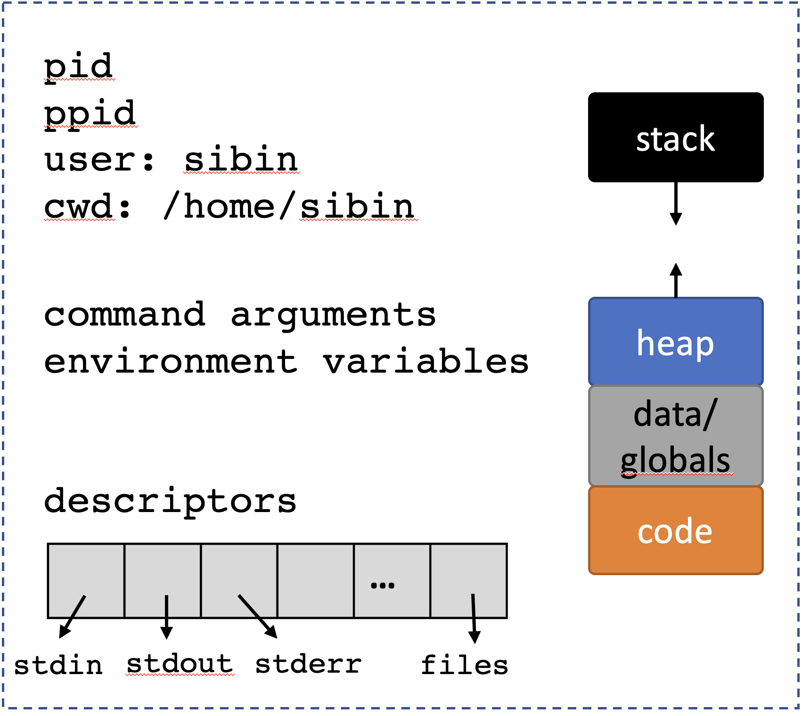``

## `fork()`
Create a new, child, process &rarr; from the **state of the calling process**

Defined in `<unistd.h>`.

### after `fork()`


### process creation/termination/coordination API

Let's take a look at all the function available in `C` for dealing with processes.

|name| action |
|------|-------|
|`fork` | create process |
|`getpid` | get ID of process |
|`getppid` | get ID of parent |
|`exit` | terminate a process |
|`wait` | parent waiting for child to exit |
|`exec` | new program from _current process_ ^[This is a little bit like when an agent transforms from a normal citizen in the Matrix.]. |
||

#### process vs program
- program &rarr; **compiled** version of code
- process &rarr; program **executing** in memory

### `pdt_t`
- process identifier defined in `<sys/types.h>`
- same as a (signed) `int`

### let's revisit `fork()`

A very *simple* interface, for a very *complex* mechanism!

```c 
pid_t fork(void);
```

The new ("child") process get a copy of the resources as shown before:


<br>
<br>

**Note:** some important nuances:
- the child starting executing **from the `fork()` instruction onwards**! 
- all previous instructions don't matter for the child
- the parent, on the other hand, will **also continue to execute**, in **parallel** with the child.

<br>


```c 
/* CSC 2410 Code Sample 
 * intro to fork
 * Fall 2023
 * (c) Sibin Mohan
 */

#include <stdio.h>
#include <unistd.h>
#include <sys/types.h>

int main()
{
    printf( "BEFORE calling fork()" ) ;

    pid_t pid = fork() ;

    printf( "AFTER calling fork()" ) ;

    printf( "\n" ) ;
    return 0 ;
}
```

The output from the above code:
```
BEFORE calling fork()AFTER calling fork()

BEFORE calling fork()AFTER calling fork()
```

Hold on a second! We said that the child starts executing **from the `fork()` instruction** and not before. So, why is the `BEFORE calling fork()`  being printed *twice*? We should, ideally, see the following behavior:
- *one* instance of `BEFORE calling fork()` &rarr; parent only
- *two* instances of `AFTER calling fork()` &rarr; parent and child

> We are seeing a side-effect/vagary of the implementation of `printf()` and really any function that outputs to a standard destination *e.g.*, `stdio` (standard input/output), `stderr` (standard error), *etc.* These output "locations" (rather called, *"streams*) are **buffered**, *i.e.,* instead of immediately writing to the screen (in the case of `stdio`), the string/data are written to temporary inernal buffer that is then *periodically cleansed* (*i.e.,* written out to the screen). The buffers are cleared out in the following situations:
> - when the buffer gets full (different systems have varied sizes, *e.g.,* `64k`)
> - when the buffer is explicitly flushed, *e.g.*, using `stdout`
> - when a newline character (`\n`) is printed

So, in the above code example, while the first `printf()` is written only *once* (by the parent), the `printf("\n")` statement is present in both, parent and child. Remember that when a fork happens, the child gets a copy of *all* resources of the parent and that include the output buffer -- which, at that point, includes the `BEFORE calling fork()` text. After the `fork()`, there are *two* processes with unflushed output buffers, the parent and the child. Hence, the `\n` causes *both* buffers to be flushed thus resulting in the above output. 

There are two ways to fix this problem and get the desired behavior:
1. add `\n` to the end of *Every* `printf()`
2. force a flush after every `printf()` or perhaps just before every `fork()`

The call to flush a stream is:
```c 
int fflush( FILE* stream ) ; 
```
defined in `<stdio.h>`.

So, we let's look at the above code again, this time with `fflush` (since the `\n` method is trivial and is left as an exercise):


```c 
/* CSC 2410 Code Sample 
 * intro to fork
 * Fall 2023
 * (c) Sibin Mohan
 */

#include <stdio.h>
#include <unistd.h>
#include <sys/types.h>

int main()
{
    printf( "BEFORE calling fork()" ) ;
    fflush(stdout) ; // to flush the standard output

    pid_t pid = fork() ;

    printf( "AFTER calling fork()" ) ;

    printf( "\n" ) ;
    return 0 ;
}
```

The output is:
```
BEFORE calling fork()AFTER calling fork()

AFTER calling fork()
```

See `man fflush` for more information.

### `fork()` return values
Now, let's look back at the interface for:
```c 
pid_t fork(void);
```
We see that is returns a `pid_t`. `fork()` returns *two distinct values*, depending on which process the call is returning to:

|return value | called from | meaning |
|-------------|-------------|---------|
| actual pid  | parent | child created|
| `0` | child | inside child |
|||


### `fork` Questions

1. How many processes (not including the initial one) are created in the following?

	```c
	#include <unistd.h>

	int
	main(void)
	{
		fork();
		fork();

		return 0;
	}
	```

2. What are the *possible outputs* for:

	``` c
	#include <unistd.h>
	#include <stdio.h>
	#include <sys/wait.h>

	int
	main(void)
	{
		pid_t parent = getpid();
		pid_t child;

		child = fork();
		if (getpid() == parent) {
			printf("p");
			wait(NULL); /* why is `NULL` OK here? */
			printf("w");
		} else {
			printf("c");
		}

		return 0;
	}
	```


## `wait()`

[Slides](https://sibin.github.io/teaching/csci2410-gwu-systems_programming/fall_2023/slides/reveal_slides/processes.html#/42)

Parents are responsible for managing their children!


so, they...`wait()`!


```c 
pid_t wait(int *wstatus)
```

- wait for state changes in a **child**
- called by a **parent**
- parents can wait for, 
- *all* children
- *specific* child
- a *subset* of children

defined in `<sys/wait.h>`

A child changes "*state*" if one of following happens:
- child **terminated/exited**
- child was **stopped by a signal** *
- child was **resumed** by a signal

[* will discuss signals later]

|child status| action |
|-------------|-------------|
| already changed | **return immediately** to parent |
| executing normally | parent **waits**/**blocks** for child|
||

#### `wait()` return value

|return value | meaning |
|-------------|-------------|
| pid via `pid_t` | pid of terminated child |
| `-1` | error |
||


```c 
/* CSC 2410 Code Sample 
 * intro to fork() and wait()
 * Fall 2023
 * (c) Sibin Mohan
 */

#include <stdio.h>
#include <unistd.h>
#include <sys/types.h>
#include <sys/wait.h>

int main()
{
        pid_t child_pid ;
        pid_t parent ;

        printf( "------------------------------\n" ) ;
        printf( ":::BEFORE::: \
                 getpid() = %d \
                 parent = %d \
                 child = %d\n",
             getpid(), child_pid, parent ) ;
        printf( "------------------------------\n" ) ;

        // create 5 children
        for( unsigned int i = 0 ; i < 5 ; ++i )
        {
                child_pid = fork() ;

                // make sure the children don't create more children!
                if(!child_pid)
                        break ;
        }

        // wait for the kids
        int wait_status ;
        pid_t wait_result = wait( &wait_status ) ;

        printf( ":::AFTER::: " ) ;
        child_pid ? printf( "---PARENT!--- " ) : printf( "---CHILD!--- " ) ;
        printf( "getpid() = %d \
                 parent = %d \
                 child = %d\n",
             getpid(), child_pid, parent ) ;

        printf( "\n" ) ;
        return 0 ;
}
```

**Note:** the output can **vary!** Depends on which process gets to writing its buffer first.

```
------------------------------
:::BEFORE::: 		 getpid() = 2492442 		 parent = 1612788000 	 	 child = 374366320
------------------------------
:::AFTER::: ---CHILD!--- getpid() = 2492443 		 parent = 0 	 	 child = 374366320

:::AFTER::: ---CHILD!--- getpid() = 2492444 		 parent = 0 	 	 child = 374366320

:::AFTER::: ---CHILD!--- getpid() = 2492445 		 parent = 0 	 	 child = 374366320

:::AFTER::: ---PARENT!--- getpid() = 2492442 		 parent = 2492447 	 	 child = 374366320
:::AFTER::: ---CHILD!--- getpid() = 2492446 		 parent = 0 	 	 child = 374366320


:::AFTER::: ---CHILD!--- getpid() = 2492447 		 parent = 0 	 	 child = 374366320
```
OR
```
------------------------------
:::BEFORE::: 		 getpid() = 2492454 		 parent = -2016386784 	 	 child = 780062336
------------------------------
:::AFTER::: ---CHILD!--- getpid() = 2492455 		 parent = 0 	 	 child = 780062336

:::AFTER::: ---CHILD!--- getpid() = 2492456 		 parent = 0 	 	 child = 780062336

:::AFTER::: ---CHILD!--- getpid() = 2492457 		 parent = 0 	 	 child = 780062336

:::AFTER::: ---CHILD!--- getpid() = 2492458 		 parent = 0 	 	 child = 780062336
:::AFTER::: ---PARENT!--- getpid() = 2492454 		 parent = 2492459 	 	 child = 780062336


:::AFTER::: ---CHILD!--- getpid() = 2492459 		 parent = 0 	 	 child = 780062336
```
OR many other combinations. We are seeing the **inherent nondeterminism** in parallel execution.

### process vs thread

A minor detour. One may ver well be confused about the difference between a "process" and a "thread". The main difference is that a process, *owns resources* while a thread is just a *unit of execution*. This table should help clarify the difference:

|process | thread |
|--------|--------|
|owns resources | unit of execution |
|isolation | share memory |
|system call* | no system call*|
||

\* for creation: *i.e.,* the creation of a process is a **system call**, *i.e.,* we need to ask the operating system to help us since the OS is what allocates resources to newly formed procsses. A new thread, on the other hand, doesn't require us to invoke a system call and is often created using *user-space libraries* (*e.g., look up [pthreads](https://man7.org/linux/man-pages/man7/pthreads.7.html)). 


## `exit()`

[Slides](https://sibin.github.io/teaching/csci2410-gwu-systems_programming/fall_2023/slides/reveal_slides/processes-2-exit.html#/)

`exit` is the function that used to terminate the current process.
```c 
void exit(int status);
```
as defined in `<stdlib.h`. The input argument is the **exit status**:

|value| meaning |
|--------|--------|
| `0`| `EXIT_SUCCESS`|
| `1`| `EXIT_FAILURE`|
||

And note that `exit()` does not *explicitly* return any value. All the information is passed via the `status` field.

The following two pieces of code are identical:
```c 
#include <stdlib.h>

int main()
{
	exit(EXIT_SUCCESS) ;
}
```
```c 
#include <stdlib.h>

int main()
{
	return EXIT_SUCCESS ;
}
```
<br>

### Interpreting `exit()` status

Despite `wait`'s status return value being a simple `int`, the *bits* of that integer mean very specific things. See the `man` page for `wait` for details, but we can use a set of functions (really "macros") to interpret the status value:
- `WIFEXITED(status)` will return `0` if the process didn't exit (e.g. if it faulted instead), and non-`0` otherwise
- `WEXITSTATUS(status)` will get the intuitive integer value that was passed to `exit` (or returned from `main`), but assumes that this value is only 8 bits large, max (thus has a maximum value of 256)

both defined in `<sys/wait.h>`.


### Relationship between `wait()` and `exit()`

The relationship between these two calls can be confusing but they are *closelfy related*. 

1. first `fork()` creates a new child:

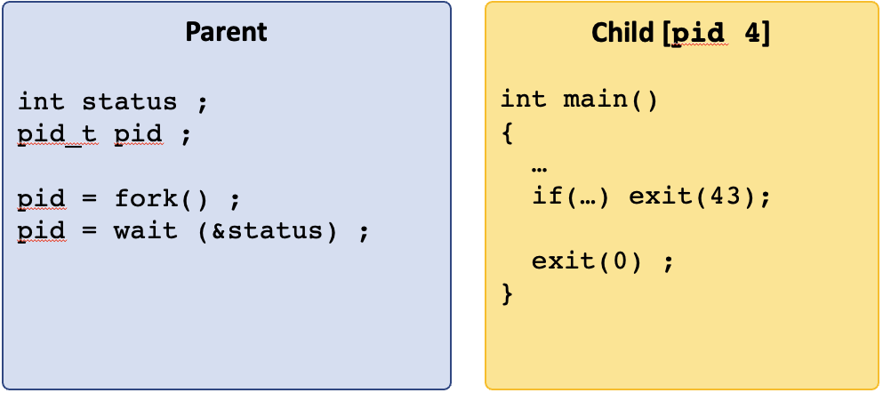

2. if the parent is waiting for the child, then the return value of `wait()` is the `pid` of that child.

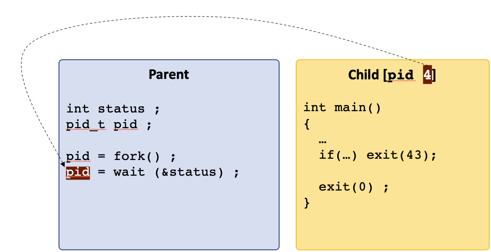

3. when the **child** calls `exit(status)` then that status is written into the status variable of the `wait(&status)` call. 

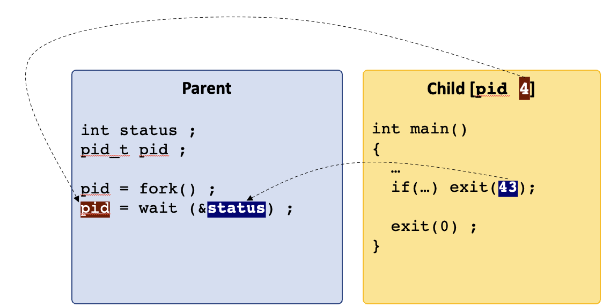

**Note:** the interface for `wait()`:
```c 
pid_t wait(int *wstatus)
```
the input is a **pointer to an integer**. Hence, the value passed from `exit()` is written into that integer and is **accessible after the `wait()` call returns**. 

4. this goes for *any* `exit()` call from the child.

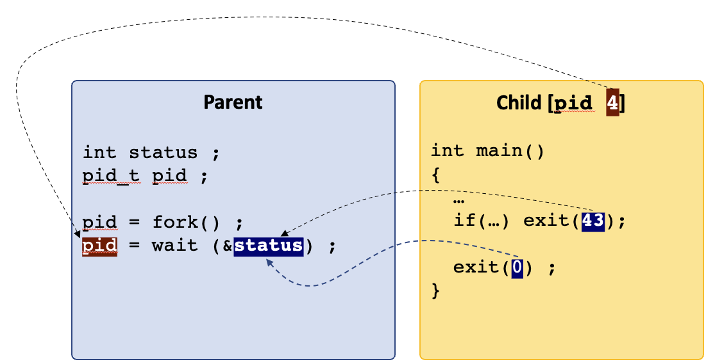

```c 
/* CSC 2410 Code Sample 
 * intro to fork(), wait() and exit()
 * Fall 2023
 * (c) Sibin Mohan
 */


#include <unistd.h>     // fork(), getpid()
#include <sys/wait.h>   // wait()
#include <stdlib.h>     // exit()
#include <stdio.h>


#define NUM_CHILDREN 5

int main()
{
    pid_t pid, child_pid ;

    // create multiple children 
    for( unsigned int i = 0 ; i < NUM_CHILDREN ; ++i )
    {
        pid = fork() ;
        if( !pid )
        {
            // we are inside the child
            printf( "---CHILD %d--- exiting with %d\n", getpid(), i+1 ) ;

            // both of these terminate immediately AND return the same value
            // identical, really!
            if( i % 2 )
                exit( i+1 ) ;
            else
                return i+1 ;
        }
    }

    /* Inside the parent, wait until the wait() call returns -1 -> no more children left
     * take the return value from wait(), put it in "child_pid" and compare that to "-1"
     */
    int status ;
    while( ( child_pid = wait( &status ) ) != -1 )
    {
        // all children are done!
        if( WIFEXITED(status) )
        {
            // check that the process didn't terminate with any errors
            // note that the output of WIFEEXITED is non-zero for normal exit

            printf( "Inside :::PARENT::: where child %d exited with status: %d\n", 
                    child_pid, 
                    (char) WEXITSTATUS(status) ) ;
        }
    }

    printf( "\n" ) ;
    return 0 ;
    // exit(EXIT_SUCCESS) ;
    // return EXIT_SUCCESS ;
}
```

**Note:** the output of this is alo **non-deterministic** as we can see with multiple runs of it:
```
---CHILD 2566089--- exiting with 1
---CHILD 2566090--- exiting with 2
---CHILD 2566091--- exiting with 3
---CHILD 2566092--- exiting with 4
Inside :::PARENT::: where child 2566089 exited with status: 1
---CHILD 2566093--- exiting with 5
Inside :::PARENT::: where child 2566090 exited with status: 2
Inside :::PARENT::: where child 2566091 exited with status: 3
Inside :::PARENT::: where child 2566092 exited with status: 4
Inside :::PARENT::: where child 2566093 exited with status: 5
```
```
---CHILD 2568612--- exiting with 1
---CHILD 2568613--- exiting with 2
---CHILD 2568614--- exiting with 3
---CHILD 2568615--- exiting with 4
Inside :::PARENT::: where child 2568612 exited with status: 1
---CHILD 2568616--- exiting with 5
Inside :::PARENT::: where child 2568613 exited with status: 2
Inside :::PARENT::: where child 2568614 exited with status: 3
Inside :::PARENT::: where child 2568615 exited with status: 4
Inside :::PARENT::: where child 2568616 exited with status: 5
```

This *non-determinism* is a product of the *isolation* that is provided by processes.
The OS switches back and forth between processes frequently (up to thousands of time per second!) so that if one goes into an infinite loop, others will still make progress.
But this also means that the OS can choose to run any of the processes that are trying to execute at any point in time!
We cannot predict the order of execution, completion, or `wait` notification.
This non-deterministic execution is called *concurrency*.
You'll want to keep this in mind as you continue to learn the process APIs, and when we talk about IPC, later.

### life after `exit()`?

Remember that when `main()` returns, it is the same as `exit()` because **main() calls exit()**.

> **Investigating `main` return → `exit` via `gdb`.**
> You can see this by diving into any program with `gdb -tui`, breakpointing before the return (e.g. `b 5`), and single-stepping through the program.
> You'll want to `layout asm` to drop into "assembly mode", and single step through the assembly and if you want to step through it instruction at a time use `stepi` or `si`.
> You can see that it ends up calling `__GI_exit`.
> `__GI_*` functions are glibc internal functions, so we see that `libc` is actually calling `main`, and when it returns, it is then going through its logic for `exit`.

`C` provides you with additional control of what happens when you exit from a program. For instance, you may need to *clean up resources*, *e.g.,* release some memory, close some files or network connections, write some debug information to a file, *etc.* Hence, the following functions *can be* are called once `exit()` is invoked:
|function| defined in |
|--------|--------|
| `on_exit`| `<stdlib.h>`|
| `atexit`| `<stdlib.h>`|
| `_exit`| `<unistd.h>`|
||

Let's look at these in more details.

#### `on_exit()`
```c 
typdef void (*function)( int , void * ) ;
int on_exit( function my_func, void *arg ) ;
```
- register a *user-defined*  **function pointer**
- `my_func`
- to be called while exiting from `main()`<br>
`typdef void (*function)( int , void * ) ;`
- function receives &rarr; exit `status` & `argument`
- we can pass data/args to that function


#### `atexit()`

```c 
typedef void (*function)(void) ;
int atexit(function my_func);
```

Program output:
```
/usr/bin/ld: /usr/lib/gcc/x86_64-linux-gnu/9/../../../x86_64-linux-gnu/Scrt1.o: in function `_start':
(.text+0x24): undefined reference to `main'
collect2: error: ld returned 1 exit status
make[1]: *** [Makefile:33: inline_exec_tmp] Error 1
```
- register a *user-defined*  **function pointer**
- `my_func`
- to be called while exiting from `main()`<br>
`typedef void (*function)(void) ;`
- **much simpler** function/interface &rarr; **no** args!
-  **no** data/args passed to that function

**Note:** some nuances:
1. neither `atexit()` nor `on_exit()` immediately terminate the process.
2. you can register **multiple** functions using either one; these are called in **reverse** order of registrations
3. `atexit()` is *standard* `c`, while `on_exit()` *may not* be!


#### `_exit()`
`void _exit(int status);`

- **immediate** termination of process!
- no return value
- output buffers are **not** flushed
- **does not** call the funcs registered by others

```c 
/* CSC 2410 Code Sample 
 * intro to fork(), wait() and exit()
 * Fall 2023
 * (c) Sibin Mohan
 */


#include <unistd.h>     // fork(), getpid()
#include <sys/wait.h>   // wait()
#include <stdlib.h>     // exit()
#include <stdio.h>


#define NUM_CHILDREN 1

// function signature to match on_exit()
void cleanup( int status, void* args )
{
    free( args ) ;
    printf( "AFTER Exit(): Doing some cleanup. Freeing memory %hhx status = %d\n", args, status ) ;
}

void simple_cleanup()
{
    printf( "Goodbye cruel world!\n" ) ;
}

int main()
{
    pid_t pid, child_pid ;

    int* some_memory = (int*)malloc(1024) ;
    // register the function and also tell it what to cleanup
    on_exit( cleanup, some_memory ) ;

    // register the simpler atexit function
    atexit(simple_cleanup) ;
    

    // create multiple children 
    for( unsigned int i = 0 ; i < NUM_CHILDREN ; ++i )
    {
        pid = fork() ;
        if( !pid )
        {
            // we are inside the child
            printf( "---CHILD %d--- exiting with %d\n", getpid(), i+1 ) ;

            // both of these terminate immediately AND return the same value
            // identical, really!
            if( i % 2 )
                exit( i+1 ) ;
            else
                return i+1 ;
        }
    }

    /* Inside the parent, wait until the wait() call returns -1 -> no more children left
     * take the return value from wait(), put it in "child_pid" and compare that to "-1"
     */
    int status ;
    while( ( child_pid = wait( &status ) ) != -1 )
    {
        // all children are done!
        if( WIFEXITED(status) )
        {
            // check that the process didn't terminate with any errors
            // note that the output of WIFEEXITED is non-zero for normal exit

            printf( "Inside :::PARENT::: where child %d exited with status: %d\n", 
                    child_pid, 
                    (char) WEXITSTATUS(status) ) ;
        }
    }

    printf( "\n" ) ;
    return 0 ;
    // exit(EXIT_SUCCESS) ;
    // return EXIT_SUCCESS ;
}
```

The output:
```
---CHILD 2608965--- exiting with 1
Goodbye cruel world!
AFTER Exit(): Doing some cleanup. Freeing memory a0 status = 1
Inside :::PARENT::: where child 2608965 exited with status: 1

Goodbye cruel world!
AFTER Exit(): Doing some cleanup. Freeing memory a0 status = 0
```

But, what happens if we change the following lines?
```c 
    // register the simpler atexit function
    atexit(simple_cleanup) ;

    int* some_memory = (int*)malloc(1024) ;
    // register the function and also tell it what to cleanup
    on_exit( cleanup, some_memory ) ;
```

The output now looks like (what's the difference?):
```
---CHILD 2609577--- exiting with 1
AFTER Exit(): Doing some cleanup. Freeing memory a0 status = 1
Goodbye cruel world!
Inside :::PARENT::: where child 2609577 exited with status: 1

AFTER Exit(): Doing some cleanup. Freeing memory a0 status = 0
Goodbye cruel world!
```

Finally, we change the `return (i+1)` to `_exit(i+1)` as follows:
```c 
            if( i % 2 )
                exit( i+1 ) ;
            else
                // return i+1 ;
                _exit(i+1) ;
```

What does the output look like now?
```
---CHILD 2610300--- exiting with 1
Inside :::PARENT::: where child 2610300 exited with status: 1

AFTER Exit(): Doing some cleanup. Freeing memory a0 status = 0
Goodbye cruel world!
```
## Command Line Arguments

I think that we likely have a decent intuition about what the command-line arguments are`:

```
$ ls /bin /sbin
```

The `ls` program takes two arguments, `/bin` and `/sbin`.
How does `ls` access those arguments?

Lets look at a *chain of programs* that `exec` each other.
The first program (that you see here) is called `inline_exec_tmp`, and the programs `03/args?.c` are subsequently executed.


```c
#include <unistd.h>
#include <stdio.h>
#include <stdlib.h>

char *prog = "./03/args1.bin";

int
main(int argc, char *argv[])
{
	char *args[] = {prog, "hello", "world", NULL};

	if (argc != 1) return EXIT_FAILURE;

	printf("First program, arg 1: %s\n", argv[0]);
	fflush(stdout);

	/* lets execute args1 with some arguments! */
	if (execvp(prog, args)) {
		perror("exec");
		return EXIT_FAILURE;
	}

	return 0;
}
```

Program output:
```
First program, arg 1: ./inline_exec_tmp
Inside ./03/args2.bin
arg 0: ./03/args2.bin
arg 1: hello
arg 2: world
```

`args1.c` is

``` c
#include <stdio.h>
#include <stdlib.h>
#include <assert.h>
#include <unistd.h>

char *prog = "./03/args2.bin";

int
main(int argc, char *argv[])
{
	int i;
	char **args; 		/* an array of strings */

	printf("Inside %s\n", argv[0]);

	/* lets just pass the arguments on through to args2! */
	args = calloc(argc + 1, sizeof(char *));
	assert(args);

	args[0] = prog;
	for (i = 1; i < argc; i++) {
		args[i] = argv[i];
	}
	args[i] = NULL; /* the arguments need to be `NULL`-terminated */

	if (execvp(prog, args)) {
		perror("exec");

		return EXIT_FAILURE;
	}

	return 0;
}
```

...and `args2.c` is

``` c
#include <stdio.h>

int
main(int argc, char *argv[])
{
	int i;

	printf("Inside %s\n", argv[0]);

	for (i = 0; i < argc; i++) {
		printf("arg %d: %s\n", i, argv[i]);
	}

	return 0;
}
```

So we see the following.

- It is *convention* that the first argument to a program is always the program itself.
    The shell will *always* ensure that this is the case (NB: the shell `exec`s your programs).
- The rest of the arguments are passed as separate entries in the array of arguments.
- The `v` variants of `exec` require the `NULL` termination of the argument array, something that is easy to mess up!

Parsing through the command-line arguments can be a little annoying, and `getopt` can help.

## Environment Variables

Environment variables are UNIX's means of providing configuration information to any process that might want it.
They are a key-value store^[Yes, yes, yes, I know this is getting redundant. Key-value stores are *everywhere*!] that maps an environment variable to its value (both are strings).

Environment variables are used to make configuration information accessible to programs.
They are used instead of command-line arguments when:

- You don't want the user worrying about passing the variable to a program.
    For example, you don't want the user to have to pass their username along to every program as an argument.
- You don't know which programs are going to use the configuration data, but *any* of them *could*.
    You don't want to pass a bunch of command-line variables into each program, and expect them to pass them along to each child process.

Example common environment variables include:

- `PATH` - a `:`-separated list of file system paths to use to look for programs when attempt to execute a program.
- `HOME` - the current user's home directory (e.g. `/home/gparmer`).
- `USER` - the username (e.g. `gparmer`).
- `TEMP` - a directory that you can use to store temporary files.

Many programs setup and use their own environment variables.
Note that environment variables are pretty pervasively used -- simple libraries exist to access them from `python`, `node.js`, `rust`, `java`, etc...

You can easily access environment variables from the command line:

```
$ echo $HOME
/home/gparmer
$ export BESTPUP=penny
$ echo $BESTPUP
penny
```

Any program executed from that shell, will be able to access the "`BESTPUP`" environment variable.
The `env` command dumps out all current environment variables.

### Environment Variable APIs

So how do we access the environment variable key-value store in C?
The core functions for working with environment variables include:

- `getenv` - Get an environment variable's value.
- `setenv` - Set one of environment variable's value (used by the shell to set up children's variables).
- `clearenv` - Reset the entire environment.
- `environ` array - This is the array of environment variables you'll see in the `man` pages.
    You don't want to access/modify this directly, but you can imagine it is used to back all of the previous calls.

```c
#include <stdlib.h>
#include <stdio.h>
#include <assert.h>

int
main(int argc, char *argv[])
{
	char *u = getenv("USER");
	char *h = getenv("HOME");

	assert(u && h);

	printf("I am %s, and I live in %s\n", u, h);

	return 0;
}
```

Program output:
```
I am sibin, and I live in /home/sibin
```

You can see all of the environmental variables available by default with:

```
$ env
SHELL=/bin/bash
DESKTOP_SESSION=ubuntu
EDITOR=emacs -nw
PWD=/home/gparmer/repos/gwu-cs-sysprog/22/lectures
LOGNAME=gparmer
HOME=/home/gparmer
USERNAME=gparmer
USER=gparmer
PATH=/home/gparmer/.local/bin::/home/gparmer/.cargo/bin:/usr/local/sbin:/usr/local/bin:/usr/sbin:/usr/bin:/sbin:/bin:/snap/bin:/usr/racket/bin/
DBUS_SESSION_BUS_ADDRESS=unix:path=/run/user/1000/bus
...
```


```c
#include <unistd.h>
#include <stdlib.h>
#include <stdio.h>
#include <assert.h>

int
main(int argc, char *argv[])
{
	char *u = getenv("USER");

	assert(u);
	printf("user: %s\n", u);
	fflush(stdout);

	if (setenv("USER", "penny", 1)) {
		perror("attempting setenv");
		exit(EXIT_FAILURE);
	}

	if (fork() == 0) {
		char *u = getenv("USER");
		char *args[] = { "./03/envtest.bin", "USER", NULL };

	    /* environment is inherited across *both* `fork` and `exec`! */
		printf("user (forked child): %s\n", u);
		fflush(stdout);
		if (execvp("./03/envtest.bin", args)) {
			perror("exec");

			return EXIT_FAILURE;
		}
	}

	return 0;
}
```

Program output:
```
user: sibin
user (forked child): penny
Environment variable USER -> penny
```

`03/envtest.c` is
``` c
#include <stdlib.h>
#include <stdio.h>
#include <assert.h>

int
main(int argc, char *argv[])
{
	char *e = "NOARG";
	char *v = "NOVAL";

	if (argc == 2) {
		e = argv[1];
		v = getenv(e);
		if (!v) {
			v = "";
		}
	}

	printf("Environment variable %s -> %s\n", e, v);

	return 0;
}
```

A common use of environment variables is the "home" directory in your shell.
How is this implemented?

```
$ cd ~
```

The `~` means "my home directory".
To understand what directory is a user's home directory, you can `getenv(HOME)`!

### An Aside: Creating Processes with `posix_spawn`

`fork` and `exec` are not the only functions to execute a program.
`posix_spawn` also enables the creation of a new process that execute a given program.
`posix_spawn` performs three high-level actions:

1. `fork` to create a new process,
2. a set of "file actions" that update and modify the files/descriptors for the new process, that are specified in an array argument to `posix_spawn`, and
3. `exec` to execute a program and pass arguments/environmental variables.

It is strictly *more limited* in what it can do than `fork` and `exec`, but this is often a feature not a bug.
`fork` is really hard to use well, and can be quite confusing to use.
It is considered by some to be a [flawed API](https://www.microsoft.com/en-us/research/uploads/prod/2019/04/fork-hotos19.pdf).
Thus the focus of `posix_spawn` on specific executing a new program can be quite useful to simply programs.

## Representations of Processes

We've seen how to create and manage processes and how to execute programs.
Amazingly, modern systems have pretty spectacular facilities for *introspection* into executing processes.
Introspection facilities generally let you dive into something as it runs.
The most immediate example of this is `gdb` or any debugger that let you dive into an implementation.
Looking at `pause.c`:

``` c
#include <unistd.h>
#include <stdio.h>
#include <stdlib.h>

const int global_readonly = 0;
int global = 0;

int
main(void)
{
	int stack_allocated;
	int *heap = malloc(sizeof(int));

	printf("pid %d\nglobal (RO):\t%p\nglobal:      \t%p\nstack:      \t%p\nheap:      \t%p\nfunction:\t%p\n",
	       getpid(), &global_readonly, &global, &stack_allocated, heap, main);

	pause();

	return 0;
}
```

Program output:

```
pid 9310
global (RO):    0x55be6d40b008
global:         0x55be6d40d014
stack:          0x7ffc7abafc7c
heap:           0x55be6da162a0
function:       0x55be6d40a1c9
```

Lets take the process identifier, and *dive into the process!*
The "`proc` filesystem" in Linux is a part of the file system devoted to representing processes.
There is a subdirectly in it for each process in the system.
Lets check out process `9310`.

```
$ cd /proc/9310/
$ ls
arch_status  cgroup      coredump_filter  exe      io         maps       mountstats  oom_adj        patch_state  sched      smaps         statm    timers
attr         clear_refs  cpuset           fd       limits     mem        net         oom_score      personality  schedstat  smaps_rollup  status   timerslack_ns
autogroup    cmdline     cwd              fdinfo   loginuid   mountinfo  ns          oom_score_adj  projid_map   sessionid  stack         syscall  uid_map
auxv         comm        environ          gid_map  map_files  mounts     numa_maps   pagemap        root         setgroups  stat          task     wchan
$ cat maps
55be6d409000-55be6d40a000 r--p 00000000 08:02 1315893                    /home/ycombinator/repos/gwu-cs-sysprog/22/lectures/03/pause.bin
55be6d40a000-55be6d40b000 r-xp 00001000 08:02 1315893                    /home/ycombinator/repos/gwu-cs-sysprog/22/lectures/03/pause.bin
55be6d40b000-55be6d40c000 r--p 00002000 08:02 1315893                    /home/ycombinator/repos/gwu-cs-sysprog/22/lectures/03/pause.bin
55be6d40c000-55be6d40d000 r--p 00002000 08:02 1315893                    /home/ycombinator/repos/gwu-cs-sysprog/22/lectures/03/pause.bin
55be6d40d000-55be6d40e000 rw-p 00003000 08:02 1315893                    /home/ycombinator/repos/gwu-cs-sysprog/22/lectures/03/pause.bin
55be6da16000-55be6da37000 rw-p 00000000 00:00 0                          [heap]
7ff4a127f000-7ff4a12a4000 r--p 00000000 08:02 11797912                   /lib/x86_64-linux-gnu/libc-2.31.so
7ff4a12a4000-7ff4a141c000 r-xp 00025000 08:02 11797912                   /lib/x86_64-linux-gnu/libc-2.31.so
7ff4a141c000-7ff4a1466000 r--p 0019d000 08:02 11797912                   /lib/x86_64-linux-gnu/libc-2.31.so
7ff4a1466000-7ff4a1467000 ---p 001e7000 08:02 11797912                   /lib/x86_64-linux-gnu/libc-2.31.so
7ff4a1467000-7ff4a146a000 r--p 001e7000 08:02 11797912                   /lib/x86_64-linux-gnu/libc-2.31.so
7ff4a146a000-7ff4a146d000 rw-p 001ea000 08:02 11797912                   /lib/x86_64-linux-gnu/libc-2.31.so
7ff4a146d000-7ff4a1473000 rw-p 00000000 00:00 0
7ff4a1495000-7ff4a1496000 r--p 00000000 08:02 11797896                   /lib/x86_64-linux-gnu/ld-2.31.so
7ff4a1496000-7ff4a14b9000 r-xp 00001000 08:02 11797896                   /lib/x86_64-linux-gnu/ld-2.31.so
7ff4a14b9000-7ff4a14c1000 r--p 00024000 08:02 11797896                   /lib/x86_64-linux-gnu/ld-2.31.so
7ff4a14c2000-7ff4a14c3000 r--p 0002c000 08:02 11797896                   /lib/x86_64-linux-gnu/ld-2.31.so
7ff4a14c3000-7ff4a14c4000 rw-p 0002d000 08:02 11797896                   /lib/x86_64-linux-gnu/ld-2.31.so
7ff4a14c4000-7ff4a14c5000 rw-p 00000000 00:00 0
7ffc7ab90000-7ffc7abb1000 rw-p 00000000 00:00 0                          [stack]
7ffc7abe1000-7ffc7abe4000 r--p 00000000 00:00 0                          [vvar]
7ffc7abe4000-7ffc7abe5000 r-xp 00000000 00:00 0                          [vdso]
ffffffffff600000-ffffffffff601000 --xp 00000000 00:00 0                  [vsyscall]
```

There's a **lot** going on here.
The most important parts of the *ranges* of addresses on the left that tell us where we can find the `pause.bin` program's code, read-only global data, global read-writable data, heap, and stack!
We also see that the number of maps in a very simple process is surprisingly large.
Let me manually focus in on a few parts of this.

```
...
55be6d40a000-55be6d40b000 r-xp ... /03/pause.bin <-- &main      (0x55be6d40a1c9)
55be6d40b000-55be6d40c000 r--p ... /03/pause.bin <-- &global_ro (0x55be6d40b008)
...
55be6d40d000-55be6d40e000 rw-p ... /03/pause.bin <-- &global    (0x55be6d40d014)
...
55be6da16000-55be6da37000 rw-p ... [heap]        <-- heap       (0x55be6da162a0)
...
7ff4a14c4000-7ff4a14c5000 rw-p ...
7ffc7ab90000-7ffc7abb1000 rw-p ... [stack]       <-- stack      (0x7ffc7abafc7c)
...
```

We can see that each of the variables we're accessing in the program are at addresses that correspond to the *ranges* of memory in the `maps`.
Even more, the `/proc/9310/mem` file contains *the actual memory for the process*!
This is really amazing: we can watch the memory, even as it changes, as a process actually executes.
This is how debuggers work!

As you can see, *processes are data* too!

## Process Exercises

### Exercise 1: fibonacci with `fork`

Implement `forkonacci`!
This will solve the `n`th [fibonacci number](https://en.wikipedia.org/wiki/Fibonacci_number), using `fork` for the recursion, and a combination of `exit` to "return" and `wait` to retrieve the returned value, instead of function calls.
The normal recursive implementation:

``` c
unsigned int
fibonacci(unsigned int n)
{
    if (n == 0 || n == 1) return n;

	return fibonacci(n - 1) + fibonacci(n - 2);
}
```

This will work decently for `n <= 12`, but not for `n > 12`.
Why^[Hint: make sure to read the `man` pages for `exit` (`man 1 exit`).]?

### Exercise 2: Shell Support for Environment Variables

How do you think that the shell-based support for environment variables (`export BESTPUP=penny`) is implemented?
Specifically, if we do the following...

```
$ export BESTPUP=penny
$ ./03/envtest.bin BESTPUP  // this just prints the environment variable
Environment variable BESTPUP -> penny
```

...which process is using which APIs?
Put another way, how is `export` implemented?

### Exercise 3: Process Detective

The `/proc` filesystem is a treasure trove of information.
You can dive into the process with `pid` `N`'s information in `/proc/N/`.
You'll only have access to the informationx for your processes.
So how do you find the `pid` of your processes?
You can find the `pid` of all of the processes that belong to you using `ps aux | grep gparmer  | awk '{print $2}'`^[`ps` prints out process information, `grep` filters the output to only lines including the argument (`gparmer` here), and `awk` enables us to print out specific columns (column `2` here). You should start getting familiar with your command-line utilities!], but replacing your username for `gparmer`.

Choose one of those, and go into its directory in `/proc`.
It it doesn't work, you might have chosen a process that has terminated since you find its ID.
Try again.

What do you think the following files contain:

- `cmdline`
- `environ`
- `status`

Some of the files are *binary*, which means you might need to use `xxd` (a hexdecimal binary view program) to look at them.
In `xxd`, pay attention to the right column here.

## Executing Other Processes 

[Slides](https://sibin.github.io/teaching/csci2410-gwu-systems_programming/fall_2023/slides/reveal_slides/execve.html)

`fork()` only makes clones of *itself*. So, we're limited to the functions defined in that program. A shell can execute **other programs**! Recall the difference between a program and process:
- program &rarr; **compiled** version of code
- process &rarr; program **executing** in memory

So, we want to create a new process and then **execute a new program**. This is done via the `exec()` *family* of calls:

```C 
     int execl(const char *path, const char *arg0, ..., /*, (char *)0, */);
     int execle(const char *path, const char *arg0, ..., /* (char *)0 char *const envp[] */);
     int execlp(const char *file, const char *arg0, ..., /*, (char *)0, */);
     int execv(const char *path, char *const argv[]);
     int execvp(const char *file, char *const argv[]);
     int execvP(const char *file, const char *search_path, char *const argv[]);
```

They are defined in `<unistd.h>`.

These calls will do the following:
- Stop executing in the current process.
- Reclaim all memory within the current process.
- Load the target program into the process.
- Start executing in the target program (i.e. starting normally, resulting in `main` execution).

**Note:** the main insight is that the **same process continues execution** but **it now executes a new program**.

### Sequence of operations
1. initial process executing [parent]


2. `fork()` a new process [child]:


  
3. replace **old** code [child]


                      
 
4. with **new** code [child]


  

5. with **new** code [child]


  

6. reclaim resources [child]


  

7. execute **new** program [child | from `main()`]


  

<br>

A few handy side-effects:

- The execution of the new program inherits the process identifier (`pid_t`) and the parent/child relationships of the process.
- Comparably, the *descriptors* are inherited into the new program's execution.
- The environment variables (see section below) pass to the new program's execution.
- Many other process properties are comparably inherited.
    With the exception of the process memory, you can assume, by default, that process properties are inherited across an `exec`.

**Good** side effects | Shared Resources


  

<br>

**Note:** only memory **not** shared | Resources not Shared


  

<br>


> **Detour**: Variadic functions.
> 
> Sometimes, *we don't know how many arguments are needed for a function*, *e.g.*, `printf()`. 
> Also, command line functions, *e.g.,* `ls` vs `ls -l`. In this instance, the shell is calling `fork()` and one of the `exec()` functions to launch `ls` which starts from...its own `main()`. 
>
> So, how does `ls` (or any other program) know what arguments are passed to it, and more importantly, **how many**?
> 
> The *actual* signature of `main()` is:
> ```C DNE
> int main( int argc, char* argv[] )
> ```
> - `argc` tells us *now many* arguments have been passed and 
> - `char* argv[]` is the actual set of arguments, i.e. *an array of strings*!
>
> **Note**: the *first* argument is always the **name of the program**! Hence, we always have *at least one* argument.

```C
/* CSC 2410 Code Sample 
 * exec() family of system calls | arguments to main()
 * Fall 2023
 * (c) Sibin Mohan
 */


#include <stdio.h>
#include <unistd.h>
#include <stdlib.h>
#include <sys/wait.h>
#include <errno.h>

int main( int argc, char* argv[] ) 
{
    if( argc )
    {
        // we get a positive number of arguments
        // note that the first argument is always the name of the program
        // so we ALWAYS have AT LEAST ONE argument

        printf( "Command Line Args received:\t" ) ;
        for( unsigned int i = 0 ; i < argc ; ++i )
        {
            printf( "%s ", argv[i] ) ;
        }
    } 

    printf( "\n" ) ;
    return 0 ;
}
```


## `exec_()` family

Multiple ways to launch a new program:
- `execl`
- `execlp`
- `execle`
- `execv`
- `execvp`

The naming scheme is quite annoying and hard to remember, but the `man` page has a decent summary.
The trailing characters correspond to specific operations that differ in how the command-line arguments are passed to the `main`:

1. `execl()` and `execlp()`:  pass the argmuments *directly* to the `exec()` call:

```C 
 int execl( const char *path, const char *arg, ..., (char*)0 ) ;
```

 The program gets the argument via the `argc` and `argv` method described earlier. 

 **Note:** the last argument has to be `(char*)0`, *i.e.,* a `NULL`. This is so that the progam can figure out when the list of arguments is done.

2. `execv()` and `execvp()`: pass argmuments in **null terminated array**, `argv[]`

```C 
int execv( const char *path, char *const argv[] ) ;
```

The caller *actually creates* an **array of strings** and passes the arguments using that. 

**Note:** *no `NULL` termination* in the function call.

3. `execle()` and `execvpe()`: **environment variables** of caller are passed

```C 
int execle( const char *pathname, const char *arg, .../*, (char *) NULL, char *const envp[] */ ) ;
int execvpe(const char *file, char *const argv[], char *const envp[]) ;
```


 (`l` means pass the arguments to this `exec` call to the program,  while `v` means pass the arguments as an array of the arguments into the `exec` call), how the program's path is specified (by default, an "absolute path" starting with `/` must be used, but in a `v` variant, the binary is looked up using comparable logic to your shell), and how environment variables are passed to the program.
For now, we'll simply use `execvp`, and cover the rest in subsequent sections.

### `execve()`

All of the above are layers on top of `execve()`

```C 
#include "unistd.h"

int execve(const char *pathname, char *const argv[],
char *const envp[]);

```

### `fork()` and `exec()`

Consider the following piece of code:

```C
/* CSC 2410 Code Sample 
 * exec() 
 * Fall 2023
 * (c) Sibin Mohan
 */

#include <stdio.h>
#include <unistd.h>     // fork(), getpid()
#include <sys/types.h>  // pid_t
#include <sys/wait.h>   // wait()
#include <stdlib.h>     // exit()

// int main() // not actual signature
int main( int argc, char* argv[] )
{
    char* program = "/bin/ls" ;
    char* arg1 = "-al" ;
    char* arg2 = "/home" ;

    printf( "BEFORE EXEC!\n" ) ;

    int ret = execl( program, "banana", arg1, arg2, NULL ) ;

    printf( "AFTER EXEC!\n" ) ;

    printf( "\n" ) ;
    return 0 ;
}
```

**Note:** the `printf( "AFTER EXEC!\n" ) ;` and further code will **never** execute as the code for the *current* process is **completely replaced** by the code for the program called using `execl()`, *i.e.,* `/bin/ls`. 

So, to get the behavior that *we want*, *i.e.,* for some post-processing/messages, *etc.*, we must first `fork()` and new child process and then run `execl()` **in the child process**!

Updating the previous code:
```C
/* CSC 2410 Code Sample 
 * exec() 
 * Fall 2023
 * (c) Sibin Mohan
 */

#include <stdio.h>
#include <unistd.h>     // fork(), getpid()
#include <sys/types.h>  // pid_t
#include <sys/wait.h>   // wait()
#include <stdlib.h>     // exit()

// int main() // not actual signature
int main( int argc, char* argv[] )
{
    char* program = "/bin/ls" ;
    char* arg1 = "-al" ;
    char* arg2 = "/home" ;

    printf( "BEFORE EXEC!\n" ) ;

    pid_t child = fork() ;

    if( !child)
    {
        // in child process
        int ret = execl( program, "banana", arg1, arg2, NULL ) ;

        // ideally never comes here!
        // as the child process' code has now been replaced
        perror("what happened!") ;
    }

    int status ;
    pid_t pid = wait(&status) ;

    if( WIFEXITED(status) )
    {
            // the child exited normally
            printf( "--PARENT--: Child %d exited with status %d\n",
                    pid, WEXITSTATUS(status) ) ;
    }

    printf( "AFTER EXEC!\n" ) ;

    printf( "\n" ) ;
    return 0 ;
}
```

### Launch **Any** Child Processes

If we have **another** program that we've written, *e.g.*, `child1.c`:
```C 
/* CSC 2410 Code Sample 
 * exec() child 1
 * Fall 2023
 * (c) Sibin Mohan
 */

#include <stdio.h>
#include <unistd.h>

int main(int argc, char* argv[])
{
    /* Does nothing. Just prints the arguments passed to this program */
    printf( "INSIDE CHILD 1: argc = %d, argv[0] = %s, argv[1] = %s, argv[2] = %s\n", 
                                            argc, argv[0], argv[1], argv[2] ) ;
 
    return 0 ;
}
```

Once it is compiled and linked and ready as an executable, say, `child1`, we can do:
```C 
/* CSC 2410 Code Sample 
 * exec() 
 * Fall 2023
 * (c) Sibin Mohan
 */

#include <stdio.h>
#include <unistd.h>     // fork(), getpid()
#include <sys/types.h>  // pid_t
#include <sys/wait.h>   // wait()
#include <stdlib.h>     // exit()

// int main() // not actual signature
int main( int argc, char* argv[] )
{
    char* program = "./child1" ;
    char* args = "hello" ;
    char* args2 = "world" ;

    pid_t child = fork() ;

    if( !child)
    {
        // in child process
        int ret = execl( program, "banana", args, args2, NULL ) ;

        // ideally never comes here!
        perror("what happened!") ;
    }

    int status ;
    pid_t pid = wait(&status) ;

    if( WIFEXITED(status) )
    {
            // the child exited normally
            printf( "--PARENT--: Child %d exited with status %d\n",
                    pid, WEXITSTATUS(status) ) ;
    }

    printf( "\n" ) ;
    return 0 ;
}
```
# Process Descriptors

[Slides](https://sibin.github.io/teaching/csci2410-gwu-systems_programming/fall_2023/slides/reveal_slides/process_descriptors.html)

We’re going to start discussing how processes can **manipulate the resources** it has access to.

### Key Mechanisms
for a process to use effectively

- current working directory, `pwd`
- ability to manipulate **descriptors**
    - "file descriptors"
- controlling "exceptional" control flow, via **signals**


### current working directory

- each process has a "working directory"
- base for any relative pathrs
- all file system paths are one of,
    - absolute paths &rarr; they begin with "/"
    - relative paths

Relative paths are quite frequently used when we interact with the shell. Every time you type `cd blah/`, you’re saying “please change the current working directory to  `blah/`" which is a directory in the current working directory. 

A simple API to interact with the current working directory:
|function| operation |
|--------|--------|
| `getcwd`| gets the current process' working dir |
| `chdir`| enables process to change dir |
||

both defined in `<unistd.h>`.

A quick listing of the *directory structure* of Linux:


Let's look at a simple code example:
```C
#include <unistd.h>
#include <assert.h>
#include <stdio.h>
#include <stdlib.h>

int main(void)
{
    char *wd = getcwd(NULL, 0);

    assert(wd);
    printf("Current directory: %s\n", wd);
    free(wd);

    if (chdir("..") == -1) {
        perror("chdir");
        abort();
    }
    wd = getcwd(NULL, 0);
    printf("New current dir: %s\n", wd);
    free(wd);

    printf( "\n" ) ;
    return 0;
}
```
<br>

**Note:** the command `cd` is actually **not** a program, and is instead a *shell-internal function*. Try using the `which` program (used to find the location of a *known* program):

```
$ which ls
/bin/ls
$ which pwd
/bin/pwd
$ which cd
$
```

### Process Descriptors

- each process has a set of **descriptors**
- associated with a system resource
    - integer &rarr; passed to a family of APIs


<br>

Most processes have **at least** three:
|number | descriptor | What it is |
|--------|--------|--------|
|`0` | `STDIN_FILENO` | standard **input** |
|`1` | `STDOUT_FILENO` | standard **output** |
|`2` | `STDERR_FILENO` | standard **error** `perror()`|
||

defined in `unistd.h`.
    

#### Standard **input**, **output** and **error**

- *infinite* sequence of bytes or "channels"
- can terminate, if they run out of data
    - *e.g.*, reaches end of file
    - user hits `ctrl-d`


When we type at the shell, we’re providing a channel of data that is sent to the standard input of the active process. When a process prints, it sends a sequence of characters to the standard output, and because programs can loop, that stream can be **infinite**! 

`STDIN_FILENO` = `0` is the *standard input*, or the main way the process gets input from the system. As such, the resource is often the terminal if the user directly provides input, or sometimes the output of a previous stage in a command-line pipeline. `STDOUT_FILENO` = `1` is the *standard output*, or the main way the process sends its output to the system. When we call `printf`, it will, by default, output using this descriptor. `STDERR_FILENO` = `2` is the *standard error*, or the main way that the process outputs error messages. `perror` (and other error-centric APIs) output to the standard error.

Each of these descriptors is associated with a potentially infinite sequence of bytes, or *channel*^["Channel" is a term that is heavily overloaded, but I'll inherit the general term from the [glibc documentation](https://www.gnu.org/software/libc/manual/html_node/Stream_002fDescriptor-Precautions.html).].
When we type at the shell, we're providing a channel of data that is sent to the standard input of the active process.
When a process prints, it sends a sequence of characters to the standard output, and because programs can loop, that stream can be infinite!
Channels, however, *can* terminate if they run out of data.
This could happen, for example, if a channel reading through a file reaches the end of the file, or if the user hits `cntl-d` on their terminal to signify "I don't have any more data".

### File Descriptor Operations

Now these are **file descriptors** so we treat them as **files**!

File descriptors are *analogous* to pointers. The descriptors effectively *point to channel resources*. 

Some core operations on files:
|operation| interface |
|---------|-----------|
|**pull** bytes from channel into buffer | `read` | 
|**send** bytes from channel into buffer | `write`
|**duplicate** a file descriptor | `dup/dup2/dup3` |
|**deallocate** a file descriptor | `close` |
||

**Note:**:
- `printf()` is a `write` to standard out
- `close` doesn't necessarily remove channel
    - analogous to removing a pointer

#### `dup()` vs `dup2()` vs `dup3()`

- `dup()` returns smallest unused number as `fd`
- `dup2()` same as dup() but uses given `fd`
- if given `fd` exists, then it is closed, *atomically*
- `dup3()` same as `dup2()` but takes flags as input

Look at the `man dup` page for more information.

Let's see some of these calls in action:
```C 
#include <stdio.h>
#include <string.h>
#include <unistd.h>
#include <assert.h>
#include <stdlib.h>

int
main(void)
{
    char *hw = "hello world\n";
    char output[256];
    int fd;
    ssize_t amnt; /* signed size */

    amnt = write(STDOUT_FILENO, hw, strlen(hw));
    if (amnt == 0) { /* maybe STDOUT writes to a file with no disk space! */
        /* this is *not* an error, so errno not set! */
        printf("Cannot write more data to channel\n");
        exit(EXIT_FAILURE);
    } else if (amnt > 0) {
        /* normally, the return value tells us how much was written */
        assert(amnt == (ssize_t)strlen(hw));
    } else { /* amnt == -1 */
        perror("Error writing to stdout");
        exit(EXIT_FAILURE);
    }

    amnt = write(STDERR_FILENO, hw, strlen(hw));
    assert(amnt >= 0);

    fd = dup(STDOUT_FILENO);
    assert(fd >= 0);

    /* We can write formatted data out to stdout manually! */
    snprintf(output, 255, "in: %d, out: %d, err: %d, new: %d\n",
             STDIN_FILENO, STDOUT_FILENO, STDERR_FILENO, fd);
    output[255] = '\0';
    amnt = write(fd, output, strlen(output));
    /* new file descriptors are supposed to use the lowest unused descriptor! */

    /* make a descriptor available */
    close(STDIN_FILENO); /* STDIN is no longer really the input! */
    fd = dup(STDOUT_FILENO);
    printf("New descriptor @ %d\n", fd);

    return 0;
}
```

You can run this, and redirect the standard error to a file to see that writing to standard error is a different operation than writing to standard output.
For example: `$ prog 2> errors.txt` will redirect file descriptor `2` (stderr) to the file.

Lets focus in a little bit on `read` and `write`. First, it is notable that the buffer they take as an argument (along with its length) is simply an array of bytes. It can be a string, or it could be the bytes that are part of an encoded video. Put another way, by default, *channels are just sequences of bytes*. It is up to our program to interpret those bytes properly.

Second, we need to understand that the return value for `read`/`write` has four main, interesting conditions:

```c 
#include <unistd.h>
#include <stddef.h>
#include <string.h>
#include <errno.h>

int
main(void)
{
	ssize_t amnt;
	char *hi = "more complicated than you'd think...";
	ssize_t hi_sz = strlen(hi);

	amnt = write(STDOUT_FILENO, hi, hi_sz);

	/* Can often mean that we are not able to write to the resource */
	if (amnt == 0) {
	    /*
		 * Keep trying to write, or give up.
		 * Common return value for `read` when a file has no more data, or a pipe is closed.
		 */
	} else if (amnt > 0 && amnt < hi_sz) {
		/*
		 * Didn't write everythign we wanted, better call write again sending
		 * data starting at `&hi[amnt]`, of length `hi_sz - amnt`.
		 */
	} else if (amnt == hi_sz) {
		/*
		 * Wrote out everything! Wooo!
		 */
	} else { /* amnt == -1 */
		/* Could be a genuine error, but not always... */
		if (errno == EPIPE || errno == EAGAIN || errno == EINTR || errno == EWOULDBLOCK) {
		    /* conditions we should probably handle properly */
		} else {
		    /* error in the channel! */
		}
	}

	return 0;
}
```

It is common to have a convention on how channel data is structured.
UNIX pipeline encourage channels to be plain text, so that each program can read from their standard input, do some processing that can involved filtering out data or transforming it, and send the result to the standard out.
That standard output is sent to the standard input of the next process in the pipeline.
An example in which we print out each unique program that is executing on the system:

```
$ ps aux | tr -s ' ' | cut -d ' ' -f 11 | sort | uniq
```

Each of the programs in the pipeline is not configured to print out each unique process, and we are able to compose them together in a pipeline to accomplish the goal.

## Pipes

[Slides](https://sibin.github.io/teaching/csci2410-gwu-systems_programming/fall_2023/slides/reveal_slides/pipes.html)

Processes have resources


Note that descriptors `0-2` are automatically set up: 
- `STDIN_FILENO`
- `STDOUT_FILENO`
- `STDERR_FILENO`

But how do we *create* resources? But first off, **what** are resources? There are many different resources in a UNIX system, but three of the main ones:

1. `files` and other file-system objects (e.g. directories),
2. `sockets` that are used to communicate over the network, and
3. communication facilities like `pipe`s that are used to send data and coordinate between processes.

Each of these has very different APIs for creating the resources. We'll discuss files later, and will now focus on **`pipe`s**.

We've seen pipes before:
```
$ ps aux | tr -s ' ' | cut -d ' ' -f 11 | sort | uniq
```
(look up each of those commands).

Not what we're talking about...well, not exactly!

### unix 'pipes'

(short for "*pipelines*")

A finite *channel* &rarr; a sequence of bytes:


A pipe is accessed using **two (file) descriptors**^[We see why the name "file" in file descriptors is not very accurate. Recall that I'm using the traditional "file descriptors" to denote all of our generic descriptors.],

|descriptor| function |
|----------|----------|
| `fd[0]` | read |
| `fd[1]` | write|
||

This can be represented as follows:

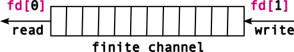

The sequence of bytes written to the pipe will be correspondingly read out *in a FIFO* manner.

### pipes api

```C 
int pipe( int pipefd[2] ) ;
```

defined in `<unistd.h>`. 

The `pipe` and `pipe2` functions create a pipe resource, and return the two file descriptors that reference the readable and writable ends of the pipe.

**Return values**

|value| meaning|
|----------|----------|
| `0` | success |
| `1` | failed |
||

We use a familiar interface to send/receive data from a pipe, *viz.*, `read()` and `write()`.

Let's look at a simple example of how to use a `pipe`.

```C 
/* CSC 2410 Code Sample 
 * intro to pipes
 * Fall 2023
 * (c) Sibin Mohan
 */

#include <unistd.h>
#include <stdio.h>
#include <stdlib.h>
#include <errno.h>
#include <string.h>
#include <assert.h>
#include <sys/param.h> /* MIN */

#define BUFFER_SIZE 16

int main()
{
    char from[BUFFER_SIZE] = {'\0'} ;
    char to[BUFFER_SIZE] = {'\0'} ;

    int pipe_fds[2] ; // the two FDs for reading/writing

    memset( from, 'x', BUFFER_SIZE-1 ) ;
    memset (to, '-', BUFFER_SIZE-1 ) ;

    if( pipe(pipe_fds) )
    {
        // non zero is an error!
        perror( "Pipe creation failed!" ) ;
        exit( EXIT_FAILURE ) ;
    }

    printf( "BEFORE\n\t from: %s\n\t to: %s\n", from, to ) ;

    ssize_t write_return = write( pipe_fds[1], &from, BUFFER_SIZE ) ;
    assert( write_return == BUFFER_SIZE ) ; // check how many bytes were written

    ssize_t read_return = read( pipe_fds[0], &to, BUFFER_SIZE ) ;

    printf( "AFTER\n\t from: %s\n\t to: %s\n", from, to ) ;


    printf( "\n" ) ;
    return 0 ;
}
```

Output, as expected:

```
BEFORE
         from: xxxxxxxxxxxxxxx
         to: ---------------
AFTER
         from: xxxxxxxxxxxxxxx
         to: xxxxxxxxxxxxxxx
```

Now, let's change things a bit. Let's make the `from` buffer really **LARGE**!

```C 
/* CSC 2410 Code Sample 
 * intro to pipes
 * Fall 2023
 * (c) Sibin Mohan
 */

#include <unistd.h>
#include <stdio.h>
#include <stdlib.h>
#include <errno.h>
#include <string.h>
#include <assert.h>
#include <sys/param.h> /* MIN */

#define BUFFER_SIZE 16
#define LARGE_BUFFER_SIZE 1<<18


int main()
{
    char from[LARGE_BUFFER_SIZE] = {'\0'} ;
    char to[BUFFER_SIZE] = {'\0'} ;

    int pipe_fds[2] ; // the two FDs for reading/writing

    memset( from, 'x', LARGE_BUFFER_SIZE-1 ) ;
    memset (to, '-', BUFFER_SIZE-1 ) ;

    if( pipe(pipe_fds) )
    {
        // non zero is an error!
        perror( "Pipe creation failed!" ) ;
        exit( EXIT_FAILURE ) ;
    }

    ssize_t write_return = write( pipe_fds[1], &from, LARGE_BUFFER_SIZE ) ;
    printf( "Here!\n" ) ;
    assert( write_return == LARGE_BUFFER_SIZE ) ; // check how many bytes were written

    ssize_t read_return = read( pipe_fds[0], &to, BUFFER_SIZE ) ;

    printf( "AFTER\n\t to: %s\n", from, to ) ;


    printf( "\n" ) ;
    return 0 ;
}
```

Output is empty and the program **doesn't terminate**. Why? Two reasons:

1. the size of a pipe is **limited** (usually `64k` on moder linux)
2. `write()` **blocks** until a `read()` clears some space in the pipe buffer.

You can get/set the size of the pipe buffer. See `man 7 pipe` for more details.

so, what do we need to do? We need to **clear** the pipe buffer by using `read`.

Why does this not work?
```C 
/* CSC 2410 Code Sample 
 * intro to pipes
 * Fall 2023
 * (c) Sibin Mohan
 */

#include <unistd.h>
#include <stdio.h>
#include <stdlib.h>
#include <errno.h>
#include <string.h>
#include <assert.h>
#include <sys/param.h> /* MIN */

#define BUFFER_SIZE 16
#define LARGE_BUFFER_SIZE 1<<18


int main()
{
    char from[LARGE_BUFFER_SIZE] = {'\0'} ;
    char to[LARGE_BUFFER_SIZE] = {'\0'} ;

    int pipe_fds[2] ; // the two FDs for reading/writing

    memset( from, 'x', LARGE_BUFFER_SIZE-1 ) ;
    memset (to, '-', LARGE_BUFFER_SIZE-1 ) ;

    if( pipe(pipe_fds) )
    {
        // non zero is an error!
        perror( "Pipe creation failed!" ) ;
        exit( EXIT_FAILURE ) ;
    }

    ssize_t write_return = write( pipe_fds[1], &from, LARGE_BUFFER_SIZE ) ;
    printf( "Here!\n" ) ;
    assert( write_return == LARGE_BUFFER_SIZE ) ; // check how many bytes were written

    ssize_t read_return = read( pipe_fds[0], &to, LARGE_BUFFER_SIZE ) ;

    printf( "\n" ) ;
    return 0 ;
}
```

Because the `write()` is *still blocked*! We haven't cleared the pipe buffer. The `write()` call *has not returned* and so the `read()` call *cannot run*! 

**Note**: this is not parallel execution!

So, let's fix it. By writing and reading inside a loop, using **smaller chunks** of read/write each time.

```C 
/* CSC 2410 Code Sample 
 * intro to pipes
 * Fall 2023
 * (c) Sibin Mohan
 */

#include <unistd.h>
#include <stdio.h>
#include <stdlib.h>
#include <errno.h>
#include <string.h>
#include <assert.h>
#include <sys/param.h> /* MIN */

#define BUFFER_SIZE 16
#define LARGE_BUFFER_SIZE 1<<18

#define WRITE_CHUNK 1<<8


int main()
{
    char from[LARGE_BUFFER_SIZE] = {'\0'} ;
    char to[LARGE_BUFFER_SIZE] = {'\0'} ;

    int pipe_fds[2] ; // the two FDs for reading/writing

    memset( from, 'x', LARGE_BUFFER_SIZE-1 ) ;
    memset (to, '-', LARGE_BUFFER_SIZE-1 ) ;

    int buffer_size = sizeof(from) ;

    if( pipe(pipe_fds) )
    {
        // non zero is an error!
        perror( "Pipe creation failed!" ) ;
        exit( EXIT_FAILURE ) ;
    }

    size_t written = 0 ;
    while( buffer_size )
    {
        ssize_t write_return, read_return ;
        size_t write_amount = MIN( buffer_size, WRITE_CHUNK ) ;

        write_return = write( pipe_fds[1], &from[written], write_amount ) ;
        if( write_return < 0 )
        {
            perror( "Error writing to pipe!" ) ;
            exit(EXIT_FAILURE) ;
        }

        read_return = read( pipe_fds[0], &to[written], write_return ) ;
        assert( read_return == write_return ) ;

        // what's going on here?
        buffer_size -= write_return ;
        written += write_return ;
    }

    assert( memcmp( from, to, sizeof(from) ) == 0 ) ;
    printf( "from and to are IDENTICAL!\n" ) ;

    printf( "\n" ) ;
    return 0 ;
}
```

Now, let's make this more interesting (and actually useful)! Let's send data **between processes**, **i.e.,** using `fork()`!


```c
#include <unistd.h>
#include <stdio.h>
#include <stdlib.h>
#include <errno.h>
#include <assert.h>

/* Large array containing 2^20 characters */
char from[1 << 20];
char to[1 << 20];

int main(void)
{
	int pipe_fds[2]; /* see `man 3 pipe`: `[0]` = read end, `[1]` = write end */
	pid_t pid;
	size_t buf_sz = sizeof(from);

	if (pipe(pipe_fds) == -1) {
		perror("pipe creation");
		exit(EXIT_FAILURE);
	}

	/* descriptors copied into each process during `fork`! */
	pid = fork();

	if (pid < 0) {
		perror("fork error");
		exit(EXIT_FAILURE);
	} else if (pid == 0) { /* child */
		ssize_t ret_w;

	    close(pipe_fds[0]); /* we aren't reading! */
		ret_w = write(pipe_fds[1], from, buf_sz);
		if (ret_w < 0) {
			perror("write to pipe");
			exit(EXIT_FAILURE);
		}
		assert((size_t)ret_w == buf_sz);
		printf("Child sent whole message!\n");
	} else { /* parent */
		ssize_t ret_r;
		ssize_t rest = buf_sz, offset = 0;

	    close(pipe_fds[1]); /* we aren't writing! */
		while (rest > 0) {
			ret_r = read(pipe_fds[0], &to[offset], rest);
			if (ret_r < 0) {
				perror("read from pipe");
				exit(EXIT_FAILURE);
			}
			rest   -= ret_r;
			offset += ret_r;
		}

		printf("Parent got the message!\n");
	}

	return 0;
}
```

Program output:
```
Child sent whole message!
Parent got the message!
```

The *concurrency* of the system enables separate processes to be active at the same time, thus for the `write` and `read` to be transferring data through the pipe *at the same time*. This simplifies our code as we don't need to worry about sending chunks of our data.

Note that we're `close`ing the end of the pipe that we aren't using in the corresponding processes.
Though the file descriptors are identical in each process following `fork`, each process does have a *separate* set of those descriptors. Thus closing in one, doesn't impact the other.

Remember, processes provide  **isolation**!

### The Shell

We can start to understand part of how to a shell might be implemented now!

**Setting up pipes.**
Lets start with the more obvious: for each `|` in a command, the shell will create a new `pipe`.
It is a little less obvious to understand how the standard output for one process is hooked up through a `pipe` to the standard input of the next process.
To do this, the shell does the following procedure:

1. Create a `pipe`.
2. `fork` the processes (a `fork` for each process in a pipeline).
3. In the *upstream* process `close(STDOUT_FILENO)`, and `dup2` the writable file descriptor in the pipe into `STDOUT_FILENO`.
4. In the *downstream* process `close(STDIN_FILENO)`, and `dup2` the readable file descriptor in the pipe into `STDIN_FILENO`.

Due to this *careful* usage of `close` to get rid of the old standard in/out, and `dup` or `dup2` to methodically replace it with the pipe, we can see how the shell sets up the processes in a pipeline!

Lets go over an example of setting up the file descriptors for a child process.
This does *not* set up the pipe-based communication between *two children*, so is not sufficient for a shell; but it is well on the way.
Pipes contain arbitrary streams of bytes, not just characters.
This example will

1. setup the input and output of two files to communicate over a pipe, and
2. send and receive binary data between processes.

```c
#include <stdlib.h>
#include <stdio.h>
#include <unistd.h>
#include <sys/wait.h>

void perror_exit(char *s)
{
	perror(s);
	exit(EXIT_FAILURE);
}

int main(void)
{
	int fds[2];
	pid_t pid;

	/* make the pipe before we fork, so we can acccess it in each process */
	if (pipe(fds) == -1) perror_exit("Opening pipe");

	pid = fork();
	if (pid == -1) perror_exit("Forking process");

	if (pid == 0) {       /* child */
		/* Same as above, but for standard output */
		close(STDOUT_FILENO);
		if (dup2(fds[1], STDOUT_FILENO) == -1) perror_exit("child dup stdout");

		close(fds[0]);
		close(fds[1]);

		printf("%d %c %x", 42, '+', 42);
		fflush(stdout); /* make sure that we output to the stdout */

		exit(EXIT_SUCCESS);
	} else {              /* parent */
		int a, c;
		char b;

		/* close standard in... */
		close(STDIN_FILENO);
		/* ...and replace it with the input side of the pipe */
		if (dup2(fds[0], STDIN_FILENO) == -1) perror_exit("parent dup stdin");
		/*
		 * if we don't close the pipes, the child will
		 * always wait for additional input
		 */
		close(fds[0]);
		close(fds[1]);

		scanf("%d %c %x", &a, &b, &c);

		printf("%d %c %x", a, b, c);
		if (wait(NULL) == -1) perror_exit("parent's wait");
	}

	return 0;
}
```

Program output:
```
42 + 2a
```

**Closing pipes.**
`read`ing from a pipe will return that there is no more data on the pipe (i.e. return `0`) *only if all `write`-ends of the pipe are `close`d*.

This makes sense because we think of a pipe as a potentially infinite stream of bytes, thus the only way the system can know that there are no more bytes to be `read`, is if the `write` end of the pipe cannot receive more data, i.e. if it is `close`d.

This seems simple, in principle, but when implementing a shell, you use `dup` to make multiple copies of the `write` file descriptor.
In this case, the shell must be very careful to close its own copies because *if any `write` end of a pipe is open, the reader will not realize when there is no more data left*.
If you implement a shell, and it seems like commands are hanging, and not `exit`ing, this is likely why.

![A graphical sequence for the above code. Each image is a snapshot of the system after an operation is preformed. The red portions of each figure show what is changed in each operation. The parent creates a pipe, forks a child, which inherits a copy of all of the file descriptors (including the pipe), the parent and child close their stdin and stdout, respectively, the pipes descriptors are `dup`ed into those now vacant descriptors, and the pipe descriptors are closed. Now all processes are in a state where they can use their stdin/stdout/stderr descriptors as normal (`scanf`, `printf`), but the standard output from the child will get piped to the standard input of the parent. Shells do a similar set of operations, but in which a child has their standard output piped to the standard input of another child.](figures/pipe_proc.png)

**Question.**
If we wanted to have a parent, shell process setup two child connected by `|`, what would the *final* picture (in the image of the pictures above) look like?

## Signals

[Slides](https://sibin.github.io/teaching/csci2410-gwu-systems_programming/fall_2023/slides/reveal_slides/signals.html)

We're used to *sequential* execution in our processes. Each instruction executes after the previous in the "instruction stream". However, systems also require *exceptional* execution patterns. What happens when you access memory that doesn't exist (e.g. `*(int *)NULL`); when you divide by `0`; when a user types `cntl-c`; when a process terminates; or when you make a call to access a descriptor which somehow is not accessible outside of the call^[We'll discuss the kernel later, and dual-mode execution to protect the implementation of these calls in OS.]?

Consider the following code where we try to access (dereference) address `NULL`.

```C 
/* CSC 2410 Code Sample 
 * intro to signals
 * Fall 2023
 * (c) Sibin Mohan
 */

int main()
{
    // some standard errors
    int* a = (int*)NULL ;
    *a = 10 ;

    return 0 ;
}
```

What happens with the following code?
```C 
/* CSC 2410 Code Sample 
 * intro to signals
 * Fall 2023
 * (c) Sibin Mohan
 */

int main()
{
    // some standard errors
    int div = 100/0 ;

    return 0 ;
}
```

Programs **crash**! Unless you *plan* to "**handle**" it!

### Enter '**signals**'

UNIX's **signals** provide *asynchronous* execution in a process: 
- provide asynchronous execution
- when a signal activates,
    - a "signal handler" function is activated
    - regardless of what was executing!

Signals can be used for,
- dealing with *exceptions*, *e.g.,*
    - invalid access &rarr; `*(int *)NULL`
    - divide by `0`
- tracking time &rarr; `ualarm`
- parent/child coordination &rarr; `SIGTERM`
- ...

Let's look at a basic setup for using signals:
```c
#include <signal.h> /* sigaction and SIG* */
#include <stdio.h>
#include <stdlib.h>
#include <errno.h>
#include <string.h>

// this is the interface for the signal fault handler!
void sig_fault_handler(int signal_number, siginfo_t *info, void *context)
{
	/* printf has problems here; see "The Dark Side of Signals" */
	printf("My downfall is the forbidden fruit at address %p.\n", info->si_addr);

	/* Question: what happens if we comment this out? */
	exit(EXIT_FAILURE);

	return;
}

int main(void)
{
	sigset_t masked;
	struct sigaction siginfo;
	int ret;

	sigemptyset(&masked);
	sigaddset(&masked, SIGSEGV);
	siginfo = (struct sigaction) {
		.sa_sigaction = sig_fault_handler,
		.sa_mask      = masked,
		.sa_flags     = SA_RESTART | SA_SIGINFO /* we'll see this later */
	};

	if (sigaction(SIGSEGV, &siginfo, NULL) == -1) {
		perror("sigaction error");
		exit(EXIT_FAILURE);
	}

	printf("Lets live dangerously\n");
	ret = *(int *)NULL;
	printf("I live!\n");

	return 0;
}
```

Program output:
```
Lets live dangerously
My downfall is the forbidden fruit at address (nil).
make[1]: *** [Makefile:30: inline_exec] Error 1
```

We can actually execute in the signal handler when we access invalid memory! We can write code to execute in response to a segmentation fault. This is how Java prints out a backtrace. 

Let's explore the concepts in the above code and the **signals interface** in general.

### Signals Interface

#### `sigset_t`

- a bitmap &rarr; **one bit per signal**
- used to program the **signal mask**
- filled with `0`s or `1`s


|value|meaning|
|-----|-------|
|| signals **can** nest |
|| signals **cannot** nest |
||

Essentially....`sigset_t` tells us...when a signal executes, 
- can *others* occur?
- if so, *which ones*?      

#### `sigset_t` functions

Defined in `<signal.h>` to manage the `sigset_t` data structure.
|name|function|
|----|--------|
|`sigemptyset`| initialize/empty the signal set <br> *i.e.*, "unmask" all|
|`sigfullset`| initializefill the signal set <br> *i.e.*, "mask" all|                       
|`sigaddset`|add *specific*  signal to set <br> *i.e.,* "mask" specific one|
|`sigdelset`|remove *specific* signal from set <br> *i.e.,* "mask" specific one|
|`sigismember`|checks whether given signal is <br> part of the set|

#### `sig_fault_handler`

- the signal `"handler"`
- function that is called *asynchronously* 
    - when corresponding event happens
- **user defined**

In the example of SIGSEGV above, here, the signal handler is called whenever we access invalid memory (e.g. segmentation fault).

#### `sigaction`

The function that sets up signal handler for a specific signal:

```C 
#include "signal.h"

int sigaction( int signum, 
               const struct sigaction *restrict act, 
               struct sigaction *restrict oldact ) ;
```

#### `struct sigaction`

```C
struct sigaction {
            void     (*sa_handler)(int);
            void     (*sa_sigaction)(int, siginfo_t *, void *);
            sigset_t   sa_mask;
            int        sa_flags;
            void     (*sa_restorer)(void);
} ;
```

#### Sequence of Actions
...for using signals

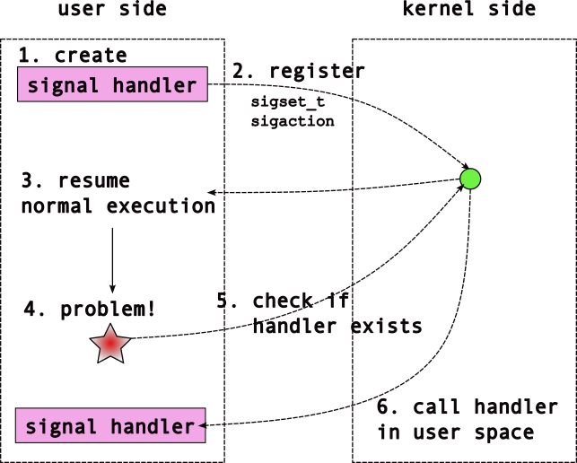


### Notable Signals

There are signals for quite a few events. A list of all of the signals is listed in `man 7 signal` and `glibc` has decent [documentation](https://www.gnu.org/software/libc/manual/html_node/Signal-Handling.html).
Notable signals include:
|signal| description |
|--------|--------|
|`SIGCHILD` | child process terminated |
|`SIGINT` | user typed `ctrl-c` |
|`SIGSTOP/SIGCONT` | stop/continue child execution |
|`SIGTSTP` | user typed `ctrl-z` |
|`SIGTPIPE` | write to a pipe with no reader |
|`SIGSEGV` | invalid memory access [segmentation fault] |
|`SIGTERM/SIGKILL` | kill a process; SIGTERM can be caught, **SIGKILL** not |
|`SIGHUP` | kill terminal that created shell |
|`SIGALRM` | notification that time has passed |
|`SIGUSR1/SIGUSR2` | **user-defined** signal handlers |
||

**Note:** ` SIGKILL/SIGTOP `
- cannot be "caught" 
- to deal with unresponsive processes
- SIGCONT &rarr; continue process after SIGSTOP

Each signal has a *default behavior* that triggers if you do not define a handler. These are:
* ignore
* terminate process
* stop process from executing
* continue execution
            
### Minor Detour | `sa_sigaction`

We have seen (and used) this struct:

```c 
struct sigaction {
    void     (*sa_handler)(int);
    void     (*sa_sigaction)(int, siginfo_t *, void *);
    sigset_t   sa_mask;
    int        sa_flags;
    void     (*sa_restorer)(void);
};
```

Program output:
```
inline_exec_tmp.c:3:35: error: unknown type name siginfo_t
    3 |     void     (*sa_sigaction)(int, siginfo_t *, void *);
      |                                   ^~~~~~~~~
inline_exec_tmp.c:4:5: error: expected ; before sigset_t
    4 |     sigset_t   sa_mask;
      |     ^~~~~~~~
make[1]: *** [Makefile:33: inline_exec_tmp] Error 1
```

Why **two** function pointers?
- `(*sa_handler)`
- `(*sa_sigaction)`

One takes **more information** than the other

```c 
void     (*sa_handler)(int);`
void     (*sa_sigaction)(int, siginfo_t *, void *);
```

Program output:
```
inline_exec_tmp.c:1:29: error: stray ` in program
    1 | void     (*sa_handler)(int);`
      |                             ^
inline_exec_tmp.c:2:31: error: unknown type name siginfo_t
    2 | void     (*sa_sigaction)(int, siginfo_t *, void *);
      |                               ^~~~~~~~~
make[1]: *** [Makefile:33: inline_exec_tmp] Error 1
```
choice of which &rarr; depends on a **flag** that is set.

#### Flags?

Provide flags to `sa_flags` member:

|flag|result|
|----|------|
|`SA_SIGINFO`| use the `*sa_sigaction` handler (*i.e.,* take more information)|
|`SA_RESTART`| make sure system calls are '*restartable*'|
|(many others) | ... |
||

`man 2 sigaction` for more details.

### Signals | Further Examples

#### Tracking Time with Signals 

Now let's use another signal, `SIGALRM`. Use the following code example:

```c 
/* CSC 2410 Code Sample 
 * intro to signals
 * Fall 2023
 * (c) Sibin Mohan
 */

#include <stdio.h>
#include <stdlib.h>
#include <errno.h>
#include <signal.h>
#include <unistd.h>
#include <string.h>

// why volatile?
volatile int timers = 0 ;

// the signal hanlder
void my_timer_handler( int signal_number, siginfo_t* info,
                                            void* context )
{
    // Handler for SIGALRM

    printf( "Inside Alarm Handler!\n" ) ;

    ++timers ;
    return ;
}

// the function pointer for the signal handler type
typedef void(*signal_handler_function)( int, siginfo_t*, void* ) ;

// We can use a function to set up the signal, 
// hide all the sigset, sigaction stuff using this
// EXPLAIN this function
void setup_signal( int signal_number, 
                   signal_handler_function func,
                   int sa_flags )
{
    sigset_t masked ; // bitmask
    sigemptyset( &masked ) ; // clear the mask
    sigaddset( &masked, signal_number ) ; // set only bit for SIGSEGV
    struct sigaction siginfo = (struct sigaction){
        .sa_sigaction = func,
        .sa_mask = &masked,
        .sa_flags = sa_flags 
    } ; 

    if( sigaction( signal_number, &siginfo, NULL ) == -1 )
    {
        perror( "sigaction failed!" ) ;
        exit(EXIT_FAILURE) ;
    }
}

int main()
{
    int t = timers ;
    setup_signal( SIGALRM, my_timer_handler, (SA_RESTART | SA_SIGINFO) ) ;

    pid_t pid ;

    if( (pid = fork()) == 0 )
    {
        // Child process
        pause() ;
        exit( EXIT_SUCCESS ) ;
    }

    // We did setup_signal BEFORE fork(). Parent/child both get signal info!
    
    ualarm( 1000, 1000 ) ; // 1000 us --> 1 ms
    // alarm(1) ; // same as previous ualarm? SHOW BOTH!

    while (t < 10)
    {
        if( timers > t )
        {
            printf( "Count: %d\n", t ) ;
            t = timers ;
        }
    }

    printf( "\n" ) ;
    return 0 ;
}
```

*Question**: Track and explain the control flow through this program.

`SIGKILL` and `SIGSTOP` are unique in that they *cannot be disabled*, and handlers for them cannot be defined. They enable non-optional control of a child by the parent.


#### Parent/Child Coordination with Signals

Another example of coordination between parent and child processes.
We can use signals to get a notification that *a child has exited*!
Additionally, we can send the `SIGTERM` signal to terminate a process (this is used to implement the `kill` command line program -- see `man 1 kill`).

```c
#include <signal.h>
#include <stdio.h>
#include <stdlib.h>
#include <errno.h>
#include <string.h>
#include <unistd.h> /* kill, pause */
#include <assert.h>
#include <sys/wait.h>

void sig_handler(int signal_number, siginfo_t *info, void *context)
{
	switch(signal_number) {
	case SIGCHLD: {
		/* see documentation on `siginfo_t` in `man sigaction` */
		printf("%d: Child process %d has exited.\n", getpid(), info->si_pid);
		fflush(stdout);
		break;
	}
	case SIGTERM: {
		printf("%d: We've been asked to terminate. Exit!\n", getpid());
		fflush(stdout);
		exit(EXIT_SUCCESS);
		break;
	}}

	return;
}

void setup_signal(int signo, void (*fn)(int , siginfo_t *, void *))
{
	sigset_t masked;
	struct sigaction siginfo;
	int ret;

	sigemptyset(&masked);
	sigaddset(&masked, signo);
	siginfo = (struct sigaction) {
		.sa_sigaction = fn,
		.sa_mask      = masked,
		.sa_flags     = SA_RESTART | SA_SIGINFO
	};

	if (sigaction(signo, &siginfo, NULL) == -1) {
		perror("sigaction error");
		exit(EXIT_FAILURE);
	}
}

int main(void)
{
	pid_t pid;
	int status;

	setup_signal(SIGCHLD, sig_handler);
	setup_signal(SIGTERM, sig_handler);

	/*
	 * The signal infromation is inherited across a fork,
	 * and is set the same for the parent and the child.
	 */
	pid = fork();
	if (pid == -1) {
		perror("fork");
		exit(EXIT_FAILURE);
	}

	if (pid == 0) {
		pause(); /* stop execution, wake upon signal */

		exit(EXIT_SUCCESS);
	}

	printf("%d: Parent asking child (%d) to terminate\n", getpid(), pid);
	kill(pid, SIGTERM); /* send the child the TERM signal */

	/* Wait for the sigchild notification of child termination! */
	pause();

	/* this should return immediately because waited for sigchld! */
	assert(pid == wait(&status));
	assert(WIFEXITED(status));

	return 0;
}
```

Program output:
```
1206766: We've been asked to terminate. Exit!
1206765: Parent asking child (1206766) to terminate
1206765: Child process 1206766 has exited.
```

*Note:* You want to run this a few times on your system to see the output.
The auto-execution scripts of the lectures might cause wonky effects here due to concurrency.

We now see a couple of new features:

- The `SIGCHLD` signal is activated in the parent when a child process exits.
- We can use the `kill` function to *send a signal* to a another process owned by the same user (e.g. `gparmer`).
- The `pause` call says to stop execution (to pause) until a signal is triggered.


A couple of additional important functions:

- `raise` will trigger a signal in the current process (it is effectively a `kill(getpid(), ...)`).
- `ualarm` will set a recurring `SIGALRM` signal.
    This can be quite useful if your program needs to keep track of time in some way.


### The Dark Side of Signals


Signals are dangerous mechanisms in some situations. It can be difficult to use them properly, and avoid bugs. Signals complication data-structures as only functionality that is re-eentrant should be used in signal handlers, and they complicate the logic around all system calls as they can interrupt slow system calls.

**Two** main problems:
1. problems with "slow" system calls
2. only "reentrant" data structures

#### "Slow" System Calls

- many library calls can *block*
    - *e.g.*, `wait` or `read`
- what if &rarr; signal sent *when blocked?*
- default &rarr; sys call will **return immediately**
- `wait` &rarr; returns even if child didn't `exit`
- `read` &rarr; returns despite **not** reading data!

So how do you tell the difference between the blocking function returning properly, or returning because it was interrupted by a signal? The answer is, of course, in the man pages -- look at the **return**/`errno` values:
- function will return `-1`
- errno will be set to `EINTR`

Given this, we see the problem with this design: now the programmer must add logic for *every single system call* that can block to check this condition.
Yikes^[A hallmark of *bad design* is functionality that is not [*orthogonal* with existing functionality](https://www.youtube.com/watch?v=mKJcqvozfA8&t=2124s). When a feature must be considered in the logic for many other features, we're adding a significant complexity to the system.].

Luckily, UNIX provides a means to disable the interruption of blocking calls by setting the `SA_RESTART` flag to the `sa_flags` field of the `sigaction` struct passed to the `sigaction` call.

**Note:** that the code above already sets this as I consider it a default requirement if you're setting up signal handlers.

The use of `SA_RESTART` can have interesting side effects, especially for **slow** system calls! Lets see the explicit interaction with between the slow call `wait`, and the signal handler:

```c
/* CSC 2410 Code Sample 
 * intro to signals
 * Fall 2023
 * (c) Sibin Mohan
 */

#include <stdio.h>
#include <stdlib.h>
#include <errno.h>
#include <signal.h>
#include <unistd.h>
#include <string.h>
#include <sys/types.h>

void my_timer_handler( int signal_number, siginfo_t* info,
                                            void* context )
{
    // Handler for SIGALRM

    printf( "Inside Alarm Handler!\n" ) ;

    return ;
}

// the function pointer for the signal handler type
typedef void(*signal_handler_function)( int, siginfo_t*, void* ) ;

// We can use a function to set up the signal, 
// hide all the sigset, sigaction stuff using this
void setup_signal( int signal_number, 
                   signal_handler_function func,
                   int sa_flags )
{
    sigset_t masked ; // bitmask
    sigemptyset( &masked ) ; // clear the mask
    sigaddset( &masked, signal_number ) ; // set only bit for given signal
    struct sigaction siginfo = (struct sigaction){
        .sa_sigaction = func,
        .sa_mask = &masked,
        .sa_flags = sa_flags 
    } ; 

    if( sigaction( signal_number, &siginfo, NULL ) == -1 )
    {
        perror( "sigaction failed!" ) ;
        exit(EXIT_FAILURE) ;
    }
}

int main()
{

    // comment out one or the other of this to see the different behaviors
    setup_signal( SIGALRM, my_timer_handler, (SA_SIGINFO) ) ;
    // setup_signal( SIGALRM, my_timer_handler, (SA_RESTART | SA_SIGINFO) ) ;

    pid_t pid ;

    if( (pid = fork()) == 0 )
    {
        // Child process
        pause() ; // wait for a signal
        exit( EXIT_SUCCESS ) ;
    }

    alarm(1);

    while (1)
    {
        pid_t ret = wait(NULL) ;

        if( ret == -1 )
        {
            if( errno == EINTR )
            {
                // Child didn't exit properly

                printf( "System call interrupted by Signal\n" ) ;
                kill( pid, SIGTERM ) ; // end the child process

                // return -1 ;
            }
            else if( errno == ECHILD )
            {
                // this code may NEVER execute!
                printf( "Child exited cleanly\n" ) ;
                return 0 ;
            }
        }
    }

    printf( "\n" ) ;
    return 0 ;
}
```

Program output:
```
inline_exec_tmp.c: In function setup_signal:
inline_exec_tmp.c:39:20: warning: initialization of long unsigned int from sigset_t * {aka struct <anonymous> *} makes integer from pointer without a cast [-Wint-conversion]
   39 |         .sa_mask = &masked,
      |                    ^
inline_exec_tmp.c:39:20: note: (near initialization for (anonymous).sa_mask.__val[0])
inline_exec_tmp.c:37:32: warning: missing braces around initializer [-Wmissing-braces]
   37 |     struct sigaction siginfo = (struct sigaction){
      |                                ^
   38 |         .sa_sigaction = func,
      |                             }
   39 |         .sa_mask = &masked,
      |                    {{     }}
inline_exec_tmp.c: In function main:
inline_exec_tmp.c:70:21: warning: implicit declaration of function wait [-Wimplicit-function-declaration]
   70 |         pid_t ret = wait(NULL) ;
      |                     ^~~~
Inside Alarm Handler!
System call interrupted by Signal
Child exited cleanly
```
Comment out one of the other of the `setup_signal` function calls in `main()` to see very different behaviors.


#### Re-entrant Computations

Signal handlers execute by interrupting the currently executing instructions, regardless what computations they are performing. Because we don't really know anything about what was executing when a signal handler started, we have to an issue. What if an action in the signal handler in some way **conflicts with the action it interrupted**?

Consider `printf`,
- copies data into a buffer 
- calls `write` &rarr; send buffer to standard output 
- a signal raised between the two?
- signal calls printf!

The data written by the earlier `printf()` will be overwritten/discarded by the later one!

Any function that has these issues is called [**non-reentrant**](https://www.gnu.org/software/libc/manual/html_node/Nonreentrancy.html). Yikes.

Consider the following example that overwrites `errno` with (potentially) disastrous effects!
```c
#include <signal.h>
#include <stdio.h>
#include <stdlib.h>
#include <errno.h>
#include <unistd.h>
#include <string.h>
#include <assert.h>

void sig_handler(int signal_number, siginfo_t *info, void *context)
{
	/*
	 * Reset `errno`! In a real program, this might instead be a call that causes
	 * an error setting `errno` to whatever the error is for *that call*.
	 */
	errno = 0;

	return;
}

void setup_signal(int signo)
{
	sigset_t masked;
	struct sigaction siginfo;
	int ret;

	sigemptyset(&masked);
	sigaddset(&masked, signo);
	siginfo = (struct sigaction) {
		.sa_sigaction = sig_handler,
		.sa_mask      = masked,
		.sa_flags     = SA_RESTART | SA_SIGINFO
	};

	if (sigaction(signo, &siginfo, NULL) == -1) {
		perror("sigaction error");
		exit(EXIT_FAILURE);
	}
}

int main(void)
{
	setup_signal(SIGUSR1);

	assert(read(400, "not going to work", 10) == -1);
	raise(SIGUSR1);
	printf("errno should be \"Bad file descriptor\", but has value \"%s\"\n", strerror(errno));

	return 0;
}
```

Program output:
```
errno should be "Bad file descriptor", but has value "Success"
```

The set of functions you *can* call in a signal handler (i.e. that are *re-entrant*) are listed in the manual page: `man 7 signal-safety`.

Notably these do *not* include the likes of
- `printf`/`snprintf`
- `malloc`
- `exit` (though `_exit` is fine)
- functions that set `errno`!
- ...

It is hard to do much in a program of any complexity without `snprintf` (called by `printf`), `malloc`, or use `errno`. A very common modern way to handle this situation is to create a `pipe` into which the signal handlers `write` a notification (e.g. the signal number), while the main flow execution `read`s from the pipe. This enables the main execution in our programs to handle these notifications. However, this is only really possible and feasible when we get to `poll` later, and can block waiting for any of a number of file descriptors, including this pipe.

Note that in *most* cases, you won't see a bug due to using non-re-entrant functions in your signal handlers. These bugs are heavily non-deterministic, and are dependent on exactly what instructions were interrupted when the signal activated. This may feel like a good thing: buggy behavior is very rare! But reality is opposite: rare, non-deterministic bugs become *very very hard to debug and test*. Worse, these bugs that pass your testing are more likely to happen in customer's systems that might have different concurrency patterns. So it is nearly impossible to debug/test for these bugs, and they are more likely to cause problems in your customer's environment. Again, yikes.

# Files and File Handling

[Slides](https://sibin.github.io/teaching/csci2410-gwu-systems_programming/fall_2023/slides/reveal_slides/files.html)


The filesystem is one of the core abstractions on UNIX systems and indeed, on modern OSes.
Each file is identified by a *path* through directories.

Remember the UNIX philosophy: **everything** is a file!

This is a strange statement as it raises the question "what wouldn't normally be a file?"
Some examples:

|location|description|
|--------|-----------|
|`/proc/*`| processes|
|`/dev/*`|devices (hard disk, keyboards,...)|
|`/dev/random`|random values|
|`/sys/*`|power settings|
|`/dev/null`| "nothing"|
||

**Note:**

- We know of processes as executable instances of programs so certainly they cannot be files, right? We've seen that they are represented by files in `/proc/*`! These files are used to provide "task monitor" type functionality (showing running processes) and `gdb`.
- Devices are the physical parts of our computers like screens, keyboards, USB devices, hard-drives, and networks. They are all represented by files in `/dev/*`! You can actually `cat` a file directly to your disk^[Please, please do *not* try this.]!
- Want random values? `/dev/random`.
- Want the complete absence of anything? `/dev/null`^[This is useful to redirect shell output to if you don't care about the output.].
- Want to update your power settings? There are files in `/sys/*` for that.

Remember the high-level directory structure of modern Linux:


## Basic File Access

When everything is a file, it can all be manipulated and accessed using the exactly same functions and APIs as the normal files in the system, *e.g.,* `open`, `close`, `read`, `write`, *etc.*

This means that all of the shell programs we've seen can be used not just to operate on files, but also *on processes* or *devices*!

Here are the basic APIs for file operations:

1. `open( path, flags, ... ) `
    * open a file &rarr; identified by `path</cb>
    * return &rarr; `file descriptor` &rarr; to access file

"flags" must be one of

- `O_RDONLY` &rarr; only **read** from the file
- `O_WRONLY` &rarr; only **write** from the file
- `O_CREAT` &rarr; **create** the file if it doesn't exist
- can use bitwise OR: `O_RDONLY | O_CREAT`

When using O_CREAT &rarr; pass the third arg, "mode":

```c 
open("my_file_name.txt", O_RDWR | O_CREAT, 0700)
```

Whenever you see "flags", you should think of them as a set of bits, and each of the options as a single bit. The above example will create the file, `my_file_name.txt` if it doesn't exist already and open it for reading and writing.

Note that when you pass in `O_CREAT`, you should pass in the third argument, the `mode` (for now, just always pass in `0700`!). 

2. `read`, `write`
    - generic functions for 
        - getting data from,
        - sending data to,
    - "descriptors" &rarr; **file descriptors** in this case.

We've seen them before when using pipes!

3. `close`
    - to "close" any descriptor
    - akin to a `free` for descriptors

4. `stat`
    - get information about file pointed by `path`
    - into the `info` structure
    - `int stat(path, struct stat *info)`
    - `fstat` &rarr; same, but uses `fd`

```c 
    struct stat { 
    dev_t    st_dev;    /* device inode resides on */
    ino_t    st_ino;    /* inode's number */
    mode_t   st_mode;   /* inode protection mode */
    nlink_t  st_nlink;  /* number of hard links to the file */
    uid_t    st_uid;    /* user-id of owner */
    gid_t    st_gid;    /* group-id of owner */
    dev_t    st_rdev;   /* device type, for special file inode */
    struct timespec st_atimespec;  /* time of last access */
    struct timespec st_mtimespec;  /* time of last data modification */
    struct timespec st_ctimespec;  /* time of last file status change */
    off_t    st_size;   /* file size, in bytes */
    quad_t   st_blocks; /* blocks allocated for file */
    u_long   st_blksize;/* optimal file sys I/O ops blocksize */
    u_long   st_flags;  /* user defined flags for file */
    u_long   st_gen;    /* file generation number */
};
```
The structure is documented in the `man` page, but it includes, for example, the file size. It is defined in `<sys/stat.h>`.

5. `unlink()`
    - try and **remove** a file
    - *e.g.,* called by the `rm` program

> It is *really* important that quite a few interesting functions operate on *descriptors*, which might reference pipes, files, the terminal, or other resources.
> This means that processes can operate on descriptors and not care what resources back them.
> This enables shells to implement pipelines and the redirection of output to files, all without the processes knowing!
> It enables `fork`ed processes to inherit these resources from its parent.
> In this way, descriptors and the functions to operate on them are a *polymorphic* foundation (in the sense of object-oriented polymorphism) to accessing the system.

Now, let's look at an example of basic file operations:
```C
/* CSC 2410 Code Sample 
 * intro to reading and writing on files
 * Fall 2023
 * (c) Sibin Mohan
 */

#include <stdio.h>
#include <sys/types.h>
#include <fcntl.h>
#include <unistd.h>
#include <stdlib.h>
#include <errno.h>
#include <assert.h>
#include <sys/stat.h>

#define TWEET_LEN 280

int main()
{
    char tweet[TWEET_LEN] ;
    int fd = open( "./daffodils.txt", O_RDONLY ) ;
    if( fd == -1 )
    {
        perror( "File daffodils.txt failed to open!" ) ;
        exit( EXIT_FAILURE ) ;
    }

    // what is the size of the file?
    struct stat file_info ;
    int ret = fstat( fd, &file_info ) ;
    assert( ret >=0 ) ;
    printf( "Number of characters in file: %ld\n", file_info.st_size ) ;
    
    // Read TWEET_LEN number of characters from file
    ret = read( fd, tweet, TWEET_LEN ) ;
    assert( ret == TWEET_LEN ) ;
    write( STDOUT_FILENO, tweet, TWEET_LEN  ) ;

    ret = read( fd, tweet, TWEET_LEN ) ;
    assert( ret == TWEET_LEN ) ;
    write( STDOUT_FILENO, tweet, TWEET_LEN  ) ;

    close(fd) ; // close the file.

    return 0 ;
}
```

## Moving Around in Files

We see something a little strange with files as compared to `pipe`s.

**Files vs Pipes**:

|files|pipes|
|-----|-----|
| finite size | potentially "infinite" |
| data is permanent | temporary &rarr; only until read |
| **forward/backward** | no movement (FIFO) |
||

For files, subsequent reads and writes must progress through the contents of the file, but we must also to be able to go back and read previously read data.

Lets understand what happens when we `read` or `write` from a file -- we'll focus only on `read` to start, but both behave similarly.

First, each `fd`^[I'll try and call it a "file descriptor" when we know the descriptor is to a file.] tracks an "**offset**"
- offset determines *where* we read/write in file


Lets go through an example of a file that contains the alphabet:

For freshly opened files &rarr; `offset = 0`

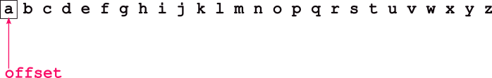
<br>
<br>

A `read(fd, buf, 10)` that returns `10` (saying that `10` bytes or characters `a` through `j`  was successfully read) advances `offset` by `10`.
<br>
<br>
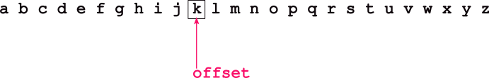
<br>
<br>
Thus, an additional read will start reading from the file at `k`. The offset, then, enables subsequent reads to iterate through a file's contents. 

`write()` uses the offset identically.

There are many cases in which we might want to modify the `offset`.
For example, databases want to jump around a file to find exactly the interesting records, playing audio and video requires us to skip around a file finding the appropriate frames. So, we use:
```C 
off_t lseek(int fd, off_t update, int whence)
```

"**whence**"?


**how** to update the `offset`

|value|how updated|
|-----|-----------|
| `SEEK_SET` | `offset = update` |
| `SEEK_CUR` | `offset += update` |
| `SEEK_END` | `offset = eof + update` |
||

`eof` &rarr; end of file

Let's update our previous example to use `lseek()` to reset to the start of the file.
```C
/* CSC 2410 Code Sample 
 * intro to reading and writing on files
 * Fall 2023
 * (c) Sibin Mohan
 */

#include <stdio.h>
#include <sys/types.h>
#include <fcntl.h>
#include <unistd.h>
#include <stdlib.h>
#include <errno.h>
#include <assert.h>
#include <sys/stat.h>

#define TWEET_LEN 280

int main()
{
    char tweet[TWEET_LEN] ;
    int fd = open( "./daffodils.txt", O_RDONLY ) ;
    if( fd == -1 )
    {
        perror( "File daffodils.txt failed to open!" ) ;
        exit( EXIT_FAILURE ) ;
    }

    // what is the size of the file?
    struct stat file_info ;
    int ret = fstat( fd, &file_info ) ;
    assert( ret >=0 ) ;
    printf( "Number of characters in file: %ld\n", file_info.st_size ) ;
    
    // Read TWEET_LEN number of characters from file
    ret = read( fd, tweet, TWEET_LEN ) ;
    assert( ret == TWEET_LEN ) ;
    write( STDOUT_FILENO, tweet, TWEET_LEN  ) ;

    ret = read( fd, tweet, TWEET_LEN ) ;
    assert( ret == TWEET_LEN ) ;
    write( STDOUT_FILENO, tweet, TWEET_LEN  ) ;

    // Reset to the start of the file
    ret = lseek( fd, 0, SEEK_SET ) ;
    if( ret == -1 )
    {
        perror( "lseek failed!" ) ;
        exit( EXIT_FAILURE ) ;
    } 

    printf( "\n\n ------ AFTER LSEEK ---------\n\n" ) ;
    // Read TWEEDT_LEN number of characters from file
    ret = read( fd, tweet, TWEET_LEN ) ;
    assert( ret == TWEET_LEN ) ;
    write( STDOUT_FILENO, tweet, TWEET_LEN  ) ;

    close(fd) ; // close the file.

    return 0 ;
}
```

## Other Ways to Access Files

So far,

- `read` & `write` are fine interfaces for files
- require many interactions with multiple calls 

There are *two* additional methods to access files:

- **memory mapping**
- **streams**

### Memory Mapping Files | `mmap()`

UNIX also provides a way to directly "map" a file into a process, enabling to appear directly in memory, thus be accessible using normal memory accesses.

This is cool because your changes *in memory* update the file directly!

```C 
void *mmap(addr, len, prot, flags, fd, offset)
```

defined in `<sys/mman.h>`.

#### `mmap` arguments:

|arg|description|
|-----|-----------|
| `fd` | file descriptor to map to memory |
| `addr` | address in memory to map |
| `len` | how much of the file to map?|
| `prot` | `PROT_READ` or `PROT_WRITE` |
| `flags` | type of mapped object `MAP_PRIVATE` |
| `offset` | where in the file to start the mapping |
||

**return value** is the **address** at which the file is mapped.

Overview:

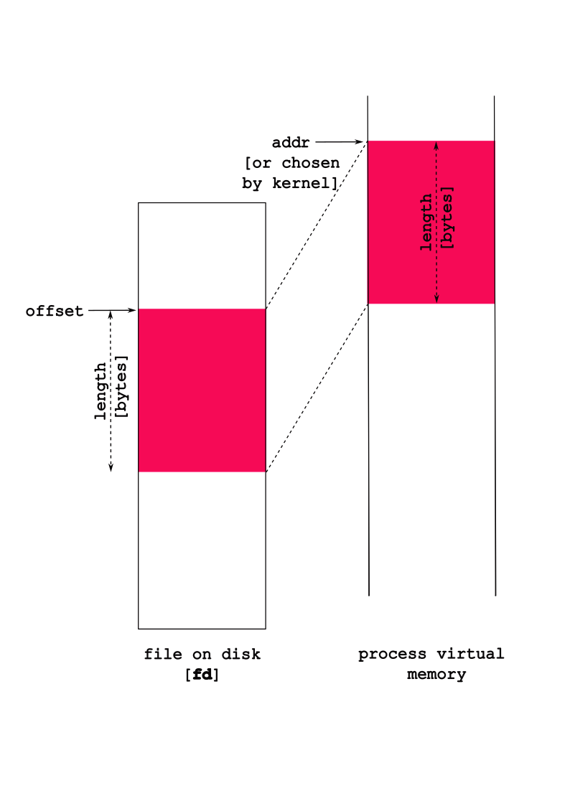

Some nuances:

1. The `flags` argument indicates the *type* of mapped object:

|flag|meaning|
|-----|-----------|
| `MAP_PRIVATE` | changes **not** written to file |
| `MAP_SHARED` | changes **written to** file |
||

So, if you want you changes to be reflected in the actual file, then make sure you set the flag as: `MAP_SHARED`.

Look at `man mmap` for more details on the `prot` and `flags` options.

2. Normally, `addr`, the address in memory at which you want to map, is `NULL`, which means "please map it whereever you want". The *return value* is the address at which the file is mapped, or `NULL` if there was an error (see the `man` page and `errno` values).

3. `stat` is quite useful to find the file's size if you want to map it all in.

4. `prot` enables you to choose some properties for the mapping, *e.g.*, `PROT_READ`, and `PROT_WRITE` that ask the system to map the memory in readable, or writable modes respectively (you can choose both with `PROT_READ | PROT_WRITE`).
**Note:** the type of accesses here must *match* request accesses previously requested in `open` -- for example, if we passed `O_RDONLY` in to `open`, `mmap` will return an error if we ask for `PROT_WRITE`.

#### `munmap()`

- **unmap** a previously mapped file
- deletes "mapping" for **specified address range**

```C 
int munmap(void *addr, size_t len);
```

<br>

Consider the following code:
```C
/* CSC 2410 Code Sample 
 * accessing files using mmap()
 * Fall 2023
 * (c) Sibin Mohan
 */

#include <stdio.h>
#include <stdlib.h>
#include <errno.h>
#include <fcntl.h>
#include <string.h>
#include <unistd.h>
#include <stdlib.h>
#include <sys/mman.h>
#include <assert.h>
#include <sys/types.h>
#include <sys/stat.h>

#define TWEET_LEN 280
#define NUM_TWEETS 2

int main()
{
    int fd = open( "./daffodils.txt", O_RDONLY ) ;
    // int fd = open( "./daffodils.txt", O_RDWR ) ;
    if( fd == -1 )
    {
        perror( "File daffodils.txt failed to open!" ) ;
        exit(EXIT_FAILURE) ;
    }

    // char* addr = mmap( NULL, TWEET_LEN, ( PROT_READ | PROT_WRITE ), MAP_SHARED, fd, 0 ) ;
    char* addr = mmap( NULL, TWEET_LEN, ( PROT_READ | PROT_WRITE ), MAP_PRIVATE, fd, 0 ) ;
    if( addr == NULL )
    {
        perror( "nmmap failed!" ) ;
        exit( EXIT_FAILURE ) ;
    }

    // write out a tweet length 
    write( STDOUT_FILENO, addr, TWEET_LEN ) ;

    // change the case of "by" to "BY"
    char* by = strstr( addr, "by" ) ;
    assert(by) ;
    by[0] = 'B' ;
    by[1] = 'Y' ;

    // printf( "%c %c\n", by[0], by[1] ) ;

    // write out a tweet length 
    write( STDOUT_FILENO, addr, TWEET_LEN ) ;

    munmap( addr, TWEET_LEN ) ;
    close(fd) ;

    printf( "\n" ) ;
    return 0 ;
}
```
**Note:** 

1. will the above code work?
2. will the file reflect the changes?
3. what happens if the following line is uncommented (and the other, corresponding line is commented out?)
```c 
char* addr = mmap( NULL, TWEET_LEN, ( PROT_READ | PROT_WRITE ), MAP_SHARED, fd, 0 ) ;
``` 
4. how will you fix the (inevitable) problem that occurs?


#### `mmap` and memory allocation

* can use mmap to **allocate memory**!
* ` fd = 0 `
* ` prot = PROT_READ | PROT_WRITE `
* ` flags = MAP_ANONYMOUS | MAP_PRIVATE `
* mmap returns &rarr; **newly allocated memory**
* `malloc()` actually calls `mmap`!


### Stream-Based I/O

There is actually a *third* way to access files beyond "raw" `read`/`write` and `mmap` -- streams! [Streams](https://www.gnu.org/software/libc/manual/html_node/I_002fO-on-Streams.html) are an abstraction *on top of the* "raw" descriptor accesses using `read` and `write`.

Streams:

- a **sequence** of characters
- includes functions to
    - put characters in one end
    - take characters out on one end

Streams are identified by the type `FILE *`, and all the APIs for operating on streams take `FILE`s instead of file descriptors.

We've seen streams before...a lot!

- `stdin`, `stdout`, `stderr`
- `FILE*` names 
- `STDOUT_FILENO`, `STDIN_FILENO` and `STDERR_FILENO` 
- `printf()` writes to a stream! Hence, it is **buffered I/O**

> **Why use Streams?**
>
> From the [GNU manual](https://www.gnu.org/software/libc/manual/html_mono/libc.html#Streams-and-File-Descriptors): 
"*Streams provide a higher-level interface, layered on top of the primitive file descriptor facilities. The stream interface treats all kinds of files pretty much alike...The main advantage of using the stream interface is that the set of functions for performing actual input and output operations (as opposed to control operations) on streams is much richer and more powerful than the corresponding facilities for file descriptors. The file descriptor interface provides only simple functions for transferring blocks of characters, but the stream interface also provides powerful formatted input and output functions (`printf` and `scanf`) as well as functions for character- and line-oriented input and output.*"
>
> There is also the issue of **portability**:
> "*(raw) file descriptors are not as portable as streams. You can expect any system running ISO C to support streams, but non-GNU systems may not support file descriptors at all, or may only implement a subset of the GNU functions that operate on file descriptor*"

**file** streams &rarr; opened/read/written/closed as streams

#### File Stream Interface

|function|description|
|-----|-----------|
| `fopen` | same as `open` &rarr; but returns stream |
| `fclose` | similar to `close` but for `FILE*`|
| `fread/ fwrite` | similar to `read/ write` |
| `feof` | tells us if we are at **end of file** |
| `printf/fprintf` | write to a stream <br> [`fprintf` to **any** stream not just `stdout`] |
| `scanf/fscanf` | read from a stream <br> [`fscanf` read from **any** stream not just `stdin`] |
| `fflush` | "flush out" buffer associated with **specific stream** |
| `fileno` | get file descriptor, `fd`, associated with stream `FILE*` |
| `getline` | read out **one line** (delineated by `\n`) | 
||

Some notes:

1. access rights (while opening a file) that we're asking for (reading or writing to the file), are specified in a more intuitive `mode` string, *e.g.*, `"r"` to read, `"r+"` for read/write, *etc.*
2. streams provide the `feof` function that tells us if we are at the end of a file.

Now, let's look at our previous example of printing the `daffodils.txt` file in tweet lengths, this time using streams:

```c
#include <stdio.h>
#include <assert.h>

int main(void)
{
    // why do we need the +1?
    char tweet[TWEET_LEN+1] ;

    FILE* f = fopen( "./daffodils.txt", "r" ) ;
    if( f == NULL )
    {
        perror( "File open failed!" ) ;
        exit( EXIT_FAILURE ) ;
    }

    // read TWEET_LEN characters from the file
    int ret = fread( tweet, TWEET_LEN, 1, f ) ;
    tweet[TWEET_LEN] = '\0' ;

    // write it to stdout
    fprintf( stdout, "%s", tweet ) ;
    fflush(stdout) ;

   	fclose(f);

    printf( "\n" ) ;
	return 0;
}
```

Program output:
```
inline_exec_tmp.c: In function main:
inline_exec_tmp.c:7:16: error: TWEET_LEN undeclared (first use in this function)
    7 |     char tweet[TWEET_LEN+1] ;
      |                ^~~~~~~~~
inline_exec_tmp.c:7:16: note: each undeclared identifier is reported only once for each function it appears in
inline_exec_tmp.c:13:9: warning: implicit declaration of function exit [-Wimplicit-function-declaration]
   13 |         exit( EXIT_FAILURE ) ;
      |         ^~~~
inline_exec_tmp.c:13:9: warning: incompatible implicit declaration of built-in function exit
inline_exec_tmp.c:3:1: note: include <stdlib.h> or provide a declaration of exit
    2 | #include <assert.h>
  +++ |+#include <stdlib.h>
    3 | 
inline_exec_tmp.c:13:15: error: EXIT_FAILURE undeclared (first use in this function)
   13 |         exit( EXIT_FAILURE ) ;
      |               ^~~~~~~~~~~~
make[1]: *** [Makefile:33: inline_exec_tmp] Error 1
```

#### Streams as buffered I/O

So it doesn't seem like we're getting much of use out of these streams compared to raw descriptors. Streams are an *optimization* over `read`/`write` as they *buffer* data.

Buffering essentially means that your `fwrite`s actually write data into a "buffer" in memory, and only when either you write out a `\n` or when the buffer gets large enough does a `write` get called to send the data to the system.

Why do this?

By buffering data in memory rather than making a `write` for each `fwrite`, we're saving any **overheads** associated with each `write` (to be discussed in a couple of weeks).

However, this means that just because we called `printf`, doesn't mean it will output immediately!

Lets see this how this works in practice:

```c
#include <unistd.h>
#include <stdio.h>
#include <stdlib.h>

int main(void)
{
	printf("hello world");
	_exit(EXIT_SUCCESS); /* this exits immediately without calling `atexit` functions */

	return 0;
}
```

Program output:
```
```

Well that's not good!

The *buffered data* is copied into each process, then it is output when an `\n` is encountered.

```c
#include <stdio.h>
#include <unistd.h>
#include <string.h>

int main(void)
{
	printf("hello ");
	write(STDOUT_FILENO, "world ", 6);
	printf("\n"); /* remember, streams output on \n */

	return 0;
}
```

Program output:
```
world hello 
```

Both `printf` and the `write ` are, technically, to the standard output, but `printf` is to a *stream*. The *buffered* `printf` output is not written out immediately, thus ordering can get messed up.

Yikes.

Last example of the complexities of streams. What happens if you get a **segfault!?** Runtime errors can mess up expected behaviors. 

```c
#include <stdio.h>
#include <unistd.h>
#include <string.h>

int main(void)
{
	int a;

	printf("hello ");
	a = *(int *)NULL;

	return 0;
}
```

Program output:
```
make[1]: *** [Makefile:30: inline_exec] Segmentation fault
```

Even though we fault *after* the `printf`, we don't see the `printf`'s output!

We now know why: the `printf` wrote into a buffer, and **didn't yet `write` to the system**! Thus the segmentation fault, that terminates the process, happens **before the buffer is actually written!**

#### Flushing Stream Buffers

It is imperative that streams give us some means to force the buffer to be output! Thus, streams provide a means of *flushing* the stream's buffers, and sending them out to the system (e.g. using `write`).

- `fflush` - flush out the buffer associated with a specific stream.

Fixing the previous examples:

```c
#include <unistd.h>
#include <stdio.h>
#include <stdlib.h>

int main(void)
{
	printf("hello ");
	fflush(stdout); // "flush" out the buffer to standard output
	write(STDOUT_FILENO, "world ", 6);
	printf("\n"); /* remember, streams output on \n */

	printf("hello world");
	fflush(stdout);
	_exit(EXIT_SUCCESS); /* this exits immediately without calling `atexit` functions */

	return 0;
}
```

Program output:
```
hello world 
hello world
```

```c
#include <stdio.h>
#include <unistd.h>

int main(void)
{
	printf("hello world");
	fflush(stdout); // "flush" out the buffer to standard output
	fork();
	printf("\n"); /* remember, streams output on \n */

	return 0;
}
```

Program output:
```
hello world

```

#### Other Useful Stream Functions

A few other functions for streams that can be useful:

- `fileno`: get the file descriptor number associated with a stream.
    This can be useful if you need to use an API that takes a descriptor, rather than a stream `* FILE`.
- `getline`: read out a line (delimited by a `\n`) from a stream.
    Since reading input, line at a time, is a pretty common thing, this is a useful function.

```c
#include <stdio.h>
#include <assert.h>
#include <stdlib.h>
#include <string.h>

int main(void)
{
	FILE *f = fopen("./05/prufrock.txt", "r");
	size_t s = 0;
	char *line = NULL;
	int i;

	assert(f);
	printf("The new genre: abridged, tweet-worthy poetry...\n\n");
	for (i = 0; getline(&line, &s, f) != -1; i++) {
		if (i % 15 == 0) {
			fwrite(line, 1, strlen(line), stdout);
			/* same as printf("%s", line); */
		}
	}
	if (!feof(f)) {
		perror("getline");
		exit(EXIT_FAILURE);
	}
	free(line);
	fclose(f);

	return 0;
}
```

Program output:
```
The new genre: abridged, tweet-worthy poetry...

 The Love Song of J. Alfred Prufrock
Of restless nights in one-night cheap hotels
Let fall upon its back the soot that falls from chimneys,
And for a hundred visions and revisions,
Disturb the universe?
Then how should I begin
Of lonely men in shirt-sleeves, leaning out of windows? ...
And I have seen the eternal Footman hold my coat, and snicker,

Am an attendant lord, one that will do

```

## Accessing Directories

Files aren't the only thing we care to access in the system -- what about directories!
We want to be able to create directories, delete them, and be able to read their contents.
These core operations are what underlies the implementation of the `ls` program, or, similarly, what happens when you double-click on a directory in a graphical file explorer!

- `opendir`, `closedir` -
    Open (and close) a directory, and return a *directory stream*, a `DIR *`, to it, which is backed by a descriptor.
	Yes, another descriptor!
- `readdir` -
    This takes a `DIR *` to a directory, and returns a structure that includes the "current" file or directory in the directory.
	This includes the name of the returned object in `d_name`, and type (in the `d_type` field) which is one of:

    - `DT_BLK` -   This is a block device.
    - `DT_CHR` -   This is a character device.
    - **`DT_DIR` -   This is a directory.**
    - `DT_FIFO` -  This is a named pipe (FIFO).
    - `DT_LNK` -   This is a symbolic link.
    - **`DT_REG` -   This is a regular file.**
    - `DT_SOCK` -  This is a UNIX domain socket.
    - `DT_UNKNOWN` - The file type could not be determined.

	The two main ones we care about are directories and files.
	Subsequent calls to `readdir` will return the "next" file or directory.
- `scandir` & `glob` -
    Two functions that enable you to get directory contents based on some simple search patterns and logic.
	`scandir` lets you pass in a directory stream, and a couple of functions that are used to sort directory contents output, and filter it (enable you to say that you don't want to look at some directory contents).
	`glob`, on the other hand, lets you search for "wildcards" designated by `*` to select all files/direcotries that match the string.

```c
#include <sys/types.h>
#include <sys/stat.h>
#include <dirent.h>
#include <assert.h>
#include <errno.h>
#include <stdio.h>
#include <stdlib.h>
#include <string.h>

long file_size(char *dir, char *file);

int main(void)
{
	DIR *d = opendir("./05/");
	struct dirent *entry;

	assert(d);

	errno = 0;
	while ((entry = readdir(d)) != NULL) {
		char *type;

		if (entry->d_type == DT_DIR)      type = "Directory";
		else if (entry->d_type == DT_REG) type = "File";
		else                              type = "Unknown";

		if (entry->d_type == DT_DIR || entry->d_type != DT_REG) {
			printf("%10s: %s\n", type, entry->d_name);
		} else { /* entry->d_type == DT_REG */
			printf("%10s: %s (size: %ld)\n", type, entry->d_name, file_size("05", entry->d_name));
		}
	}
	if (errno != 0) {
		perror("Reading directory");
		exit(EXIT_FAILURE);
	}
	closedir(d);

	return 0;
}

long file_size(char *dir, char *file)
{
	struct stat finfo;
	char buf[512];
	int ret;

	memset(buf, 0, 512); /* zero out the buffer to add '\0's */
	snprintf(buf, 512, "./%s/%s", dir, file);

	ret = stat(buf, &finfo);
	assert(ret == 0);

	return finfo.st_size;
}
```

Program output:
```
      File: 150_01_lecture.md (size: 4245)
 Directory: ..
      File: 150_02_exercises.md (size: 2978)
      File: OLD_01_lecture copy_md (size: 21581)
      File: 14.02.files.other_methods.md (size: 11966)
      File: prufrock.txt (size: 6044)
 Directory: test_directory
      File: shelley_poems.txt (size: 283)
 Directory: figures
 Directory: .
      File: daffodils.txt (size: 869)
      File: 14.01.files.md (size: 9624)
```

To make *changes* in the first system hierarchy, we need an additional set of functions.

- `mkdir(path, mode)` -
    This function is used in, for example, the `mkdir` program.
	Don't confuse the program you use in the shell, with the function you can call from C.
- `rmdir(path)` -
    Deletes a directory that is empty.
	This means that you have to `unlink` and `rmdir` the directory's contents first.
- `rename(from, to)` -
    Change the name of file or directory from `from` to `to`.
	You can imagine this is used by the `mv` command line program.

```c
#include <sys/stat.h>
#include <sys/types.h>
#include <assert.h>
#include <unistd.h>
#include <fcntl.h>
#include <stdio.h>

int main(void)
{
	int ret;
	int fd;

	ret = mkdir("05/newdir", 0700);
	assert(ret == 0);
	fd = open("05/newdir/newfile", O_RDWR | O_CREAT, 0700);
	assert(fd >= 0);
	ret = write(fd, "new contents", 13);
	assert(ret == 13);
	ret = rename("05/newdir", "05/newerdir");
	assert(ret == 0);
	ret = unlink("05/newerdir/newfile");
	assert(ret == 0);
	ret = rmdir("05/newerdir");
	assert(ret == 0);

	printf("If there were no errors, we\n\t"
		"1. created a directory, \n\t"
		"2. a file in the directory, \n\t"
		"3. change the directory name,\n\t"
		"4. removed the file, and\n\t"
		"5. removed the directory\n");

	return 0;
}
```

Program output:
```
If there were no errors, we
	1. created a directory, 
	2. a file in the directory, 
	3. change the directory name,
	4. removed the file, and
	5. removed the directory
```

## Exercises

Write a `tree` clone, with disk usage information.
Though it isn't installed, by default, tree outputs the filesystem at a specific directory:

```
$ tree .
.
├── 01_lecture.md
├── 02_exercises.md
├── prufrock.txt
└── test_directory
    └── crickets.txt
```

### Task 1: Markdown Tree

We'll simplify the output to print out markdown lists with either `D` or `F` for directories or files.
If we run the program in the `05` directory:

```
$ ./t
- 01_lecture.md (20759)
- 02_exercises.md (1683)
- prufrock.txt (6044)
- test_directory
    - crickets.txt (26)
```

Some starter code that focuses on printing out info for a single directory.

**Task: Change this code to print out the *hierarchy* of files and directories, rather than just the contents of a single directory.**

```c
#include <sys/types.h>
#include <sys/stat.h>
#include <dirent.h>
#include <assert.h>
#include <errno.h>
#include <stdio.h>
#include <stdlib.h>
#include <string.h>

/* helper functions */
void indent(int n);
int ignoredir(char *dir);
long file_size(char *dir, char *file);

/*
 * Return the size of the directory (sum of all files inside).
 * The easiest implementation here is recursive where this is called
 * for each directory.
 */
size_t
print_dir(char *dir, int depth)
{
	DIR *d = opendir(dir);
	struct dirent *entry;

	assert(d);
	errno = 0;

	/* Go through each dir/file in this directory! */
	while ((entry = readdir(d)) != NULL) {
		/* we'll ignore . and .. */
		if (ignoredir(entry->d_name)) continue;

		/* print out the proper indentation */
		indent(depth);
		if (entry->d_type == DT_DIR) {
			printf("- D %s\n", entry->d_name);
		} else if (entry->d_type == DT_REG) {
			printf("- F %s (%ld)\n", entry->d_name, file_size(dir, entry->d_name));
		}
		/* we'll ignore everything that isn't a file or dir */
	}
	if (errno != 0) {
		perror("Reading directory");
		exit(EXIT_FAILURE);
	}
	closedir(d);

	return 0;
}

int
main(void)
{
	print_dir("./", 0);

	return 0;
}

/* Indent `n` levels */
void
indent(int n)
{
	for (int i = 0; i < n; i++) printf("    ");
}

/* Should we ignore this directory? */
int
ignoredir(char *dir)
{
	return strcmp(dir, ".") == 0 || strcmp(dir, "..") == 0;
}

long
file_size(char *dir, char *file)
{
	struct stat finfo;
	char buf[512];
	int ret;

	memset(buf, 0, 512); /* zero out the buffer to add '\0's */
	snprintf(buf, 512, "%s/%s", dir, file);

	ret = stat(buf, &finfo);
	assert(ret == 0);

	return finfo.st_size;
}
```

Program output:
```
- D 09
- D 04
- F output_tmp.dat (0)
- D 01
- F Makefile (2007)
- F lectures.html (1091604)
- D 99
- D 00
- D 11
- D 02
- D 10
- D 13
- D 03
- D 14
- D templates
- F .gitignore (952)
- D 12
- F inline_exec_tmp.c (1658)
- F theme.css (691)
- D 07
- F inline_exec_tmp (60184)
- F LICENSE (1522)
- D code
- D tools
- D .git
- D 06
- D figures
- F title.md (333)
- F README.md (35)
- F aggregate.md (299109)
- D 08
- D slides
- D 05
```

### Task 2: File and Directory Sizes

**Task: Add output for the size of files, and the size of each directory -- the sum of the size of all contained directories and files.**

Again, if we run the program in the `05` directory:
```
$ ./t
- 01_lecture.md (20759)
- 02_exercises.md (1683)
- prufrock.txt (6044)
- test_directory
    - crickets.txt (26)
	(26)
(28512)
```

The `test_directory` size is the `(26)`, while the `./` directory has size `(28512)`.
Your specific sizes might differ.

# I/O: Inter-Process Communication

We've seen that processes often coordinate through pipes, signals, and `wait`.
This is necessary when coordinating between parents and children in shells (both on the terminal, and GUIs).
These are useful when children have a common parent (thus can share pipes), and where the parent knows that the children want to communicate before they are `exec`ed.
Modern systems require a lot of flexibility than this.
Generally, we want a process to be able to decide who to coordinate with as they execute given their own goals.
For example, the shell -- when it executes a child -- doesn't know if it wants to have a GUI, thus needs to talk to the window server.

We require more dynamic, more flexible forms of coordination between processes.
Generally, we call this coordination *Inter-Process Communication* or *IPC*.
*When do we generally want more flexible forms of IPC* than pipes, signals, and wait?

1. If the parent doesn't know what other processes with which a child wants IPC.
2. If the parent didn't create the other process with which a child wants IPC.
3. The process with which we want IPC belongs to a different user.
4. The process with which we want IPC has access to special resources in the system (e.g. graphics cards, other hardware, or filesystem data).

Even applications that are implemented as many processes often require IPC between those processes.

## IPC Example: Modern Browsers

Browsers all require a *lot* of IPC.
Each tab is a separate process, and there is a single *browser management* process that manages the GUI and other browser resources.
This is motivated by security concerns: a tab that fails or is compromised by an attacker cannot access the data of another tab!
In the early (first 15-20 years) of browsers, this wasn't the case, and you had to be careful about opening your banking webpage next to webpages that were suspect.
The browser management process communicates with each of the child tab processes to send them user input (mouse clicks, keyboard input), and receive a bitmap to display on screen.
Lets see this structure:

```
$ ps aux | grep firefox
... 8029 ... /usr/lib/firefox/firefox -new-window
... 8151 ... /usr/lib/firefox/firefox -contentproc -childID 1 -isForBrowser ... 8029 ...
...
```

I have an embarrassing number of tabs open, so I've taken the liberty of manually filtering this output.
We can see that the process with pid `8029` is the parent, browser management process, and the process `8151` is a child managing a tab (note, you can see processes arranges as a process  tree using `ps axjf`).
There are many other children processes managing tabs.

Lets try and figure out how they communicate with each other.
First, lets look at the file descriptors of the tab's processes (the child).

```
$ ls -l /proc/8151/fd/
0 -> /dev/null
1 -> socket:[100774]
...
11 -> /memfd:mozilla-ipc
4 -> socket:[107464]
5 -> socket:[107467]
7 -> pipe:[110438]
```

We see that there is no standard input (`/dev/null` is "nothing"), and that there are a few means of IPC:

- `pipe` - We know these!
- `memfd` - A Linux-specific way of sharing a range of memory between the processes.
    Stores to the memory can be seen by all sharing processes.
- `socket` - Another pipe-line channel in which bytes written into the socket can be read out on the other side.
    A key difference is that socket connections between processes can be created without requiring the inheritance of descriptors via `fork`.

Lets look at the browser management process, and see what's going on.
Notably, we want to see how the tab's processes communicate with it.
Thus, lets look at the descriptors for the parent:

```
$ ls -l /proc/8029/fd/ | awk '{print $9 $10 $11}'
110 -> /home/ycombinator/.mozilla/.../https+++mail.google.com...data.sqlite
171 -> /home/ycombinator/.mozilla/.../https+++www.youtube.com....data.sqlite
123 -> /home/ycombinator/.mozilla/.../formhistory.sqlite
130 -> /home/ycombinator/.mozilla/.../bookmarks.sqlite
58 -> /home/ycombinator/.mozilla/.../cookies.sqlite
3 -> /dev/dri/renderD128
43 -> /dev/dri/card0
...
100 -> /memfd:mozilla-ipc
60 -> socket:[107464]
64 -> socket:[107467]
82 -> pipe:[110438]
```

This is *heavily filtered*.
The first, highlighted section shows that the browser management process uses a database (`sqlite`) to access a webpage's data (see `gmail` and `youtube`), store form histories, bookmarks, and cookies.
It also uses the `dri` device is part of the [Direct Rendering Infrastructure](https://en.wikipedia.org/wiki/Direct_Rendering_Infrastructure) which enables it to communicate with the X Window Server, and display what we see on screen.
Finally, we see it uses the same means of IPC as the client, and if we carefully look at the `[ids]` of the sockets and pipes, we can see that they match those in the child tab process!
We can see that the tab has multiple IPC channels open with the parent, and can access them with file descriptors.

## Goals of IPC Mechanisms

There are multiple IPC mechanisms in the system, and they all represent different trade-offs.
They might be good for some things, and bad at others.

- **Transparent IPC.**
    Do applications need to be changed at all to perform IPC?
	If not, they are *transparently* leveraging IPC.
	Shell-driven pipes have a huge benefit that they enable transparent IPC!
- **Named IPC.**
    If we want multiple process to communicate that can't rely on a comment parent to coordinate that communication, they need a means to find an "name" the IPC mechanism.
	Named IPC is in conflict with transparent IPC as we likely need to use a specific API to access the IPC mechanism.
- **Channel-based IPC.**
    Often we want to send *messages* between processes such that a sent message, when received is removed from the channel -- once read, it won't be read again.
	This enables processes to receive some request, do some processing on it, then move on to the next request.
- **Multi-client communication.**
    We often want to create a process that can provide services to *multiple* other "client" processes.
	Clients request service, and the "server" process receives these requests, and provides replies.

Lets assess `pipe`s in this taxonomy:

- ✓ **Transparent IPC.** - Pipes are pervasive for a reason!
    They enable composition of programs via pipelines despite the programs not even knowing they are in the pipeline!
- ✗ **Named IPC.** - Na.
    The parent has to set it all up -- lots of `dup`, `close`, and `pipe`.
- ✓ **Channel-based IPC.** - Data written to a pipe is removed by the reader.
- ✗ **Multi-client communication.** - Pipes are really there to pass a stream of data from one process to the other.

## Files & Shared Memory

If the goal is to send data from one process to another, one option is found in the filesystem (FS): can't we just use files to share?
Toward this, we saw in the section on FS I/O that we can open a file, and `read` and `write` (or `fread`/`fwrite`) from it from *multiple* processes.
This will certainly get data from one process to the other.
However, it has a number of shortcomings:

1. If you want to pass a potentially infinite stream of data between processes (think `pipe`s), then we'd end up with an infinite file.
    That translates to your disk running out of space very quickly, with little benefit.
	Take-away: files are for a finite amount of data, not for an infinite stream of data.
2. Given this, processes must assume that the file has a specific format, and they have indication of if the other process has accessed/read data in the file.
    An example of a specific format: maybe the file is treated as a single string of a constant length.
3. There isn't any indication about when other processes have modified the file, thus the processes might overwrite each other's data^[This is called a "race condition". File "locking" helps solve this issue, but we'll delay discussing locking until the OS class.].

To emphasize these problems, lets try and implement a channel in a file to send data between processes.
We just want to send a simple string repetitively from one process to the other.

```c
#include <stdio.h>
#include <assert.h>
#include <string.h>
#include <unistd.h>
#include <stdlib.h>
#include <sys/wait.h>
#include <sys/stat.h>
#include <sys/types.h>
#include <fcntl.h>

int
main(void)
{
	int ret;

	ret = creat("string_data", 0777);
	assert(ret != -1);

	if (fork() == 0) {
		char *msg[] = {"penny for pawsident", "america for good doggies"};
		int fd = open("string_data", O_WRONLY);
		assert(fd != -1);

		/* send the first message! */
		ret = write(fd, msg[0], strlen(msg[0]) + 1);
		assert(ret == (int)strlen(msg[0]) + 1);
		/* send the second message! */
		ret = lseek(fd, 0, SEEK_SET);
		ret = write(fd, msg[1], strlen(msg[1]) + 1);
		assert(ret == (int)strlen(msg[1]) + 1);

		close(fd);
		exit(EXIT_SUCCESS);
	} else {
		char data[32];
		int fd = open("string_data", O_RDONLY);
		assert(fd != -1);

		memset(data, 0, 32);
		ret = read(fd, data, 32);
		assert(ret != -1);
		printf("msg1: %s\n", data);

		ret = lseek(fd, 0, SEEK_SET);
		assert(ret != -1);
		ret = read(fd, data, 32);
		assert(ret != -1);
		printf("msg2: %s\n", data);
	}
	wait(NULL);
	unlink("string_data");

	return 0;
}
```

Program output:
```
msg1: 
msg2: america for good doggies
```

You can see that there are some problems here.
If we run it many times, we can see that sometimes we don't see any messages, sometimes we only see the first, sometimes we only see the second, and other times combinations of all three options.
Thus, they are not useful for channel-based communication between multiple processes.

On the other side, files have a very  *useful* properti that we'd like to use in a good solution to IPC: they *have a location in the FS* that the communicating processes can both use to find the file, thus avoiding the need for a shared parent.


- ✗ **Transparent IPC** - We have to open the file explicitly.
- ✓ **Named IPC.** - Each file has a path in the filesystem.
- ✗ **Channel-based IPC.** - When we read out of a file, the data remains, making it hard to know what we've read, and what is yet to be written.
    A stream of messages placed into a file also will expend your disk!
- ✗ **Multi-client communication.** - It isn't clear how multiple clients can convey separate requests, and can receive separate replies from a server.

> An aside: you can use `mmap` to map a *file* into the address space, and if you map it `MAP_SHARED` (instead of `MAP_PRIVATE`), then the memory will be shared between processes.
> When one process does a store to the memory, the other process will see that store immediately!
> We can use this to pass data between processes, but we still have many of the problems above.
> How do we avoid conflicting modifications to the memory, get notifications that modifications have been made, and make sure that the data is formatted in an organized (finite) manner?

## Named Pipes

The core problem with files is that they aren't channels that remove existing data when it is "consumed" (`read`).
But they have the significant up-side that they have a "name" in the filesystem that multiple otherwise independent processes can use to access the communication medium.

Named pipes or FIFOs are like pipes in that one process can write into the FIFO, and another process can read from it.
Thus, unlike files, they have the desirable property of channels in which data read from the channel is consumed.
However, like files (and unlike pipes) they have a "name" in the filesystem -- FIFOs appear in the filesystem along-side files.
The `stat` function will let you know that a file is a FIFO if the `st_mode` is `S_IFIFO`.
Since these pipes appear in the filesystem, they are called **named pipes**.
Two processes that wish to communicate need only both know where in the filesystem they agree to find the named pipe.

Lets see an example of using named pipes:

```c
#include <sys/types.h>
#include <sys/stat.h>
#include <sys/wait.h>
#include <fcntl.h>
#include <assert.h>
#include <unistd.h>
#include <stdio.h>
#include <stdlib.h>
#include <string.h>

void
proc1(void)
{
	int fd, ret;

	fd = open("office_hours", O_WRONLY);
	assert(fd != -1);

	ret = write(fd, "halp!", 5);
	assert(ret == 5);
	close(fd);
}

void
proc2(void)
{
	char msg[6];
	int fd, ret;

	memset(msg, 0, 6);
	fd = open("office_hours", O_RDONLY);
	assert(fd != -1);

	ret = read(fd, msg, 5);
	assert(ret == 5);
	close(fd);

	printf("What I hear at office hours is \"%s\".", msg);
	unlink("office_hours");
}

int
main(void)
{
	int ret;

	/* This is how we create a FIFO. A FIFO version of creat. */
	ret = mkfifo("office_hours", 0777);
	assert(ret == 0);

	if (fork() == 0) {
		proc1();
		exit(EXIT_SUCCESS);
	} else {
		proc2();
		wait(NULL);
	}

	return 0;
}
```

Program output:
```
What I hear at office hours is "halp!".
```

There is one very awkward named pipe behavior.
Processes attempting to `open` a named pipe will block (the `open` will not return) until processes have opened it separately as both *readable* and *writable*.
This is awkward because how would a process *know* when another process might want to communicate with it?
If a process gets IPC requests from many others (think the browser manager), then it doesn't want to block awaiting a new communication; it wants to service the requests of other processes.

Regardless, we do see named pipes as a cool option: named pipes enable us to use the filesystem to identify the pipe used for IPC.
This enables communicating processes without shared parents to leverage IPC.
This enables pipes to live up to the UNIX motto: *everything is a file*.

### Challenges with Named Pipes for Multi-Client Communication

Lets check out an example that demonstrates how using named pipes for communication between a single process and multiple *clients* has a number of challenges.

```c
#include <sys/types.h>
#include <sys/stat.h>
#include <sys/wait.h>
#include <fcntl.h>
#include <assert.h>
#include <unistd.h>
#include <stdio.h>
#include <stdlib.h>
#include <string.h>

/*
 * Receive requests, and send them immediately as a response.
 * You can imagine that interesting computation could be done
 * to formulate a response.
 */
void
instructor(void)
{
	int req, resp, ret;
	char msg[32];

	req = open("requests", O_RDONLY);
	assert(req != -1);
	resp = open("responses", O_WRONLY);
	assert(resp != -1);

	while (1) {
		ret = read(req, msg, 32);
		if (ret == 0) break;
		assert(ret != -1);
		ret = write(resp, msg, ret);
		if (ret == 0) break;
		assert(ret != -1);
	}

	close(req);
	close(resp);
}

/*
 * Make a "request" with our pid, and get a response,
 * hopefully also our pid.
 */
void
student(void)
{
	int req, resp, ret;
	char msg[32];

	req = open("requests", O_WRONLY);
	assert(req != -1);
	resp = open("responses", O_RDONLY);
	assert(resp != -1);

	ret = snprintf(msg, 32, "%d", getpid());
	ret = write(req, msg, ret);
	assert(ret != -1);
	ret = read(resp, msg, 32);
	assert(ret != -1);

	printf("%d: %s\n", getpid(), msg);

	close(req);
	close(resp);
}

void
close_fifos(void)
{
	unlink("requests");
	unlink("responses");
}

int
main(void)
{
	int ret, i;
	pid_t pids[3];

	/* clients write to this, server reads */
	ret = mkfifo("requests", 0777);
	assert(ret == 0);
	/* server sends replies to this, clients read */
	ret = mkfifo("responses", 0777);
	assert(ret == 0);

	/* create 1 instructor that is lecturing */
	if ((pids[0] = fork()) == 0) {
		instructor();
		return 0;
	}
	/* Create 2 students "listening" to the lecture */
	for (i = 0; i < 2; i++) {
		if ((pids[i + 1] = fork()) == 0) {
			student();
			return 0;
		}
	}

	atexit(close_fifos);
	sleep(1);
	for (i = 0; i < 3; i++) kill(pids[i], SIGTERM);
	while (wait(NULL) != -1);

	return 0;
}
```

Program output:
```
1207044: 1207044
1207045: 1207045
```


If executed many times, you see the expected result:

```
167907: 167907
167908: 167908
```

...but also strange results:

```
167941: 167940167941
```

If this is executed many times, we see a few properties of named pipes.

1. There isn't really a way to predict which student sees which data -- this is determined by the concurrency of the system.
2. Sometimes a student is "starved" of data completely.
3. The instructor doesn't have any control over *which* student should receive which data.


**Named pipes summary.**
These solve an important problem: how can we have multiple processes find a "pipe" to use for communication even if they don't have a parent to coordinate that communication?
They use a filesystem path/name to identify the pipe.
However, they are not suitable for a single processes (a server) to communicate with multiple clients as they don't enable the communication for each client to be separated in the server.

- ✗ **Transparent IPC.** - we have to use the `mkfifo` API explicitly.
- ✓ **Named IPC.** - the named pipe is represented as a file in the filesystem.
- ✓ **Channel-based IPC.** - read data is removed from the pipe.
- ✗ **Multi-client communication.** - a server cannot tell the difference between clients, nor can they send responses to specific clients.

## UNIX Domain Sockets

*Sockets* are the mechanism provided by UNIX to communicate over the *network*!
However, they can also be used to communicate between processes on your system through *UNIX domain sockets*.

A few key concepts for domain sockets:

1. They are presented in the filesystem as a file, similar to named pipes.
    This enables them to be accessed by multiple communicating processes that don't necessarily share a parent to coordinate that communication.
2. Each new *client* that attempts to connect to a *server* will be represented as a *separate descriptor* in the server, thus enabling the server to separate its communication with on, from the other.
    The goal is to create a descriptor for *each pair of communicating processes*.
3. Each descriptor to a domain socket is bi-directional -- it can be `read` and `write`n to, thus making communication back and forth quite a bit easier.

### Domain sockets for Multi-Client Communication

Lets look at an example were we want a server to receive a client's requests as strings, and to reply with those same strings.
This isn't useful, per-say, but demonstrates how this communication can happen.
Notably, we want to enable the server to communicate with different clients!

- A *server* receives IPC requests from *clients*.
    Note that this is similar to how a server on the internet serves webpages to multiple clients (and, indeed, the code is similar!).
- The server's functions include `socket`, `bind`, and `listen`.
    `socket` creates a domain socket file descriptor
- The server creates a *separate descriptor* for each client using `accept`.
- The client's functions include `socket` and `connect`.

Most of these functions are complex and have tons of options.
Most of them have been distilled into the following functions in `06/domain_sockets.h`:

- `int domain_socket_server_create(const char *file_name)` - Create a descriptor to the "server" end of the IPC channel identified by `file_name` in the filesystem, similar to the named pipes before.
- `int domain_socket_client_create(const char *file_name)` - Create a descriptor to the "client" end of the IPC channel identified by a file name.
    One constraint is that the *server must create the domain socket first*, or else this call (the `connect`) will fail.

The server's descriptor is not meant to be used for direct communication (i.e. should not be used for `read`, and `write`).
Instead, it is used to *create new descriptors, one per client*!
With a descriptor per-client, we have the fortunate ability to communicate explicitly with each client without the same problem of messages getting messed up in named pipes.

![A sequence of using domain sockets to communicate between multiple clients and a server. (a) The single domain socket that clients can attempt to `connect` to. (b) The server using `accept` to create a new descriptor and channel for communication with the red client (thus the "red" channel). (c) Subsequent communication with that client is explicitly through that channel, so the server can send specifically to that client. (d) The server creates a *separate* channel for communication with the blue client.](./figures/domain_sockets.png)

#### Setting up Domain Sockets

Two functions that both take an argument which is the domain socket name/path in the file system, and return a descriptor to the socket.
For the most part, you can just use these functions in your code directly by using `06/domain_sockets.h`.

```c
#include "06/domain_sockets.h"

#include <errno.h>
#include <unistd.h>
#include <stdio.h>
#include <string.h>
#include <sys/wait.h>

void
unlink_domain_socket(int status, void *filename)
{
	unlink(filename);
	free(filename);
}

#define MAX_BUF_SZ 128

void
server(int num_clients, char *filename)
{
	char buf[MAX_BUF_SZ];
	int new_client, amnt, i, socket_desc;

	socket_desc = domain_socket_server_create(filename);
	if (socket_desc < 0) exit(EXIT_FAILURE); /* should do proper cleanup */
	on_exit(unlink_domain_socket, strdup(filename));

	/*
	 * Service `num_clients` number of clients, one at a time.F
	 * For many servers, this might be an infinite loop.
	 */
	for (i = 0; i < num_clients; i++) {
		/*
		 * We use this new descriptor to communicate with *this* client.
		 * This is the key function that enables us to create per-client
		 * descriptors. It only returns when a client is ready to communicate.
		 */
		if ((new_client = accept(socket_desc, NULL, NULL)) == -1) exit(EXIT_FAILURE);
		printf("Server: New client connected with new file descriptor %d.\n", new_client);
		fflush(stdout);

		amnt = read(new_client, buf, MAX_BUF_SZ - 1);
		if (amnt == -1) exit(EXIT_FAILURE);
		buf[amnt] = '\0'; /* ensure null termination of the string */
		printf("Server received message (sz %d): \"%s\". Replying!\n", amnt, buf);
		fflush(stdout);

		/* send the client a reply */
		if (write(new_client, buf, amnt) < 0) exit(EXIT_FAILURE);
		/* Done with communication with this client */
		close(new_client);
	}
	close(socket_desc);

	exit(EXIT_SUCCESS);
}

void
client(char *filename)
{
	char msg[MAX_BUF_SZ];
	int  amnt = 0, socket_desc;

	socket_desc = domain_socket_client_create(filename);
	if (socket_desc < 0) exit(EXIT_FAILURE);
	printf("1. Client %d connected to server.\n", getpid());
	fflush(stdout);

	snprintf(msg, MAX_BUF_SZ - 1, "Citizen %d: Penny for Pawsident!", getpid());
	amnt = write(socket_desc, msg, strlen(msg) + 1);
	if (amnt < 0) exit(EXIT_FAILURE);
	printf("2. Client %d request sent message to server.\n", getpid());
	fflush(stdout);

	if (read(socket_desc, msg, amnt) < 0) exit(EXIT_FAILURE);
	msg[amnt] = '\0';
	printf("3. Client %d reply received from server: %s\n", getpid(), msg);
	fflush(stdout);

	close(socket_desc);

	exit(EXIT_SUCCESS);
}

int
main(void)
{
	char *channel_name = "pennys_channel";
	int nclients = 2;
	int i;

	if (fork() == 0) server(nclients, channel_name);
	/* wait for the server to create the domain socket */
	sleep(1);
	for (i = 0; i < nclients; i++) {
		if (fork() == 0) client(channel_name);
	}
	/* wait for all of the children */
	while (wait(NULL) != -1);

	return 0;
}
```

Program output:
```
Server: New client connected with new file descriptor 4.
1. Client 1207065 connected to server.
2. Client 1207065 request sent message to server.
Server received message (sz 38): "Citizen 1207065: Penny for Pawsident!". Replying!
3. Client 1207065 reply received from server: Citizen 1207065: Penny for Pawsident!
Server: New client connected with new file descriptor 4.
1. Client 1207066 connected to server.
2. Client 1207066 request sent message to server.
Server received message (sz 38): "Citizen 1207066: Penny for Pawsident!". Replying!
3. Client 1207066 reply received from server: Citizen 1207066: Penny for Pawsident!
```

The server's call to `accept` is the key difference of domain sockets from named pipes.
It enables us to have per-client descriptors we can use to separately communicate (via `read`/`write`) to each client.

- ✗ **Transparent IPC.** - We have to explicitly use the socket APIs.
- ✓ **Named IPC.** - Uses a file name to name the domain socket.
- ✓ **Channel-based IPC.** - When data is read, it is removed from the socket.
- ✓ **Multi-client communication.** - The server separates each client's communication into separate descriptors.

> Aside:
> Sockets are the main way to communicate over the network (i.e. to chat with the Internet).
> The APIs you'd use to create network sockets are the same, it simply requires setting up the `socket` and the `bind`ing of the socket in a network-specific manner.

## IPC Exercises

Find the programs:

- [`06/domain_socket_server.c`](https://github.com/gwu-cs-sysprog/lectures/blob/main/06/domain_socket_server.c) - a sample server.
- [`06/domain_socket_client.c`](https://github.com/gwu-cs-sysprog/lectures/blob/main/06/domain_socket_client.c) - a sample client.

Both require the [`06/domain_sockets.h`](https://github.com/gwu-cs-sysprog/lectures/blob/main/06/domain_sockets.h) header file.
You *must* run the server first to create the domain socket "file".
If you run the server, and it complains that "server domain socket creation", then you might need to `rm` the domain socket file on the command line first.
It already exists from a previous run of the server, so the server cannot create it again!

Your job is to try to figure what in the hey these do!
Answer the following questions:

- Describe what the server does to handle each client request.
- How many clients can the server handle at a time?
- Is the number of clients limited by the server `wait`ing on client/child processes?
    Recall when talking about background tasks in a shell that the `wait` is key to the system's concurrency/behavior.
- Describe what the client does.
    What data does it send to the server?
- Describe the behavior when you use the client with the server.

The programs can be compiled directly with `gcc` (e.g. `gcc domain_socket_server.c -o server; gcc domain_socket_client.c -o client`).
Use these programs on the command line to send data from the client to server.

- How can you use the client and server programs to send data between them?
- How can you make multiple clients connect to the server?

# Reinforcing Ideas: Assorted Exercises and Event Notification

In the following, if you aren't *positive* of the answer, please run the program!
Note that we're omitting error checking in these programs to keep them terse.
Remember that in your programs, you must check and react to all errors.
This will require you to use the `man` pages to look up the required `#include`s.
If the output doesn't match a high-level intuition, how would you modify the program to match the intuition?
What are all of the potential output of the following programs?
Why?

### `fork` and Stream Behavior

``` c
fork();
fork();
printf("z");
```

``` c
printf("z");
fork();
fork();
```

``` c
printf("z");
fork();
write(STDOUT_FILENO, ".", 1);
```

### Wait Behavior

``` c
#include <stdlib.h>
#include <unistd.h>
#include <stdio.h>
#include <sys/wait.h>

int
main(void)
{
    pid_t child;
    int i;
    int wait_param = 0;     /* or WNOHANG */
    int output_w_write = 0; /* or 1 */

    for (i = 0; i < 2; i++) {
    	child = fork();
    	if (child == 0) {
    		sleep(1);
    		if (output_w_write) write(STDOUT_FILENO, ".\n", 2);
    		else                printf(".\n");
    		exit(EXIT_SUCCESS);
    	}
    	waitpid(child, NULL, wait_param);
    	write(STDOUT_FILENO, "Post-fork\n", 10);
    }
    /* ...are we done here? */

	return 0;
}
```

- What if change `wait_param` to equal `WNOHANG`?
- What if we change `output_w_write` to `1`?
- Why do we need to reap children?
    Why would this actually matter?

### `read` Behavior

``` c
#include <stdio.h>
#include <unistd.h>
#include <sys/wait.h>
#include <string.h>

int
main(void)
{
    pid_t child;
    int fds[2];
    char *msg = "What type of doggo is Penny?\n";

    pipe(fds);

    if ((child = fork()) == 0) {
    	/* recall: `cat` reads its stdin, and outputs it to stdout */
    	char *args[] = {"cat", NULL};

    	close(STDIN_FILENO);
    	dup2(fds[0], STDIN_FILENO);
    	execvp(args[0], args);
    }
	write(fds[1], msg, strlen(msg));
	printf("100%% good girl.");
	wait(NULL);

	return 0;
}
```

- There are *multiple* bugs here.
    Find them and squish 'em.

### Signals

What is the following doing?

``` c
#include <execinfo.h>
#include <stdlib.h>
#include <stdio.h>
#include <signal.h> /* sigaction and SIG* */

void
bt(void)
{
	void *bt[128];
	char **symbs;
	int nfns, i;

	nfns = backtrace(bt, 128);
	symbs = backtrace_symbols(bt, nfns);
	for (i = 0; i < nfns; i++) {
		printf("%s\n", symbs[i]);
	}
	free(symbs);
}

void
bar(int *val)
{
	*val = 42;
	bt();
}

void
foo(int *val)
{
	bar(val);
}

void
sig_fault_handler(int signal_number, siginfo_t *info, void *context)
{
	printf("Fault triggered at address %p.\n", info->si_addr);
	bt();
	exit(EXIT_FAILURE);

	return;
}

int
main(void)
{
	sigset_t masked;
	struct sigaction siginfo;
	int ret;
	int val;

	sigemptyset(&masked);
	sigaddset(&masked, SIGSEGV);
	siginfo = (struct sigaction) {
		.sa_sigaction = sig_fault_handler,
		.sa_mask      = masked,
		.sa_flags     = SA_RESTART | SA_SIGINFO /* we'll see this later */
	};

	if (sigaction(SIGSEGV, &siginfo, NULL) == -1) {
		perror("sigaction error");
		exit(EXIT_FAILURE);
	}

	foo(&val);
	printf("---\nMoving on...\n---\n");
	fflush(stdout);
	foo(NULL);

	return 0;
}
```

- What are the various aspects of the output?
    What do the numbers mean?
	What do the strings mean?
- Explain what is happening *before* the "Moving on...".
- Explain what is happening *after* the "Moving on...".
- There is a lot of information there (lines being output) that aren't useful to the programmer.
    Make the output more useful by printing only the parts of the output that a programmer would find useful.

### Communication with Multiple Clients

Communicating with multiple clients is hard.
Domain sockets are complicated, but there are challenges around blocking on `read`s.
What if one client is very "slow", and we block waiting for them?

``` c
#include "06/domain_sockets.h"

#include <errno.h>
#include <unistd.h>
#include <stdio.h>
#include <string.h>
#include <sys/wait.h>
#include <assert.h>

void
panic(char *msg)
{
	perror(msg);
	exit(EXIT_FAILURE);
}

void
client(char *filename, int slowdown)
{
	int i, socket_desc;
	char b;

	socket_desc = domain_socket_client_create(filename);
	if (socket_desc < 0) {
		perror("domain socket client create");
		exit(EXIT_FAILURE);
	}

	/* delay after creating connection, but before communicating */
	sleep(slowdown);
	if (write(socket_desc, ".", 1) == -1) panic("client write");
	if (read(socket_desc, &b, 1) == -1)   panic("client read");
	printf("c: %c\n", b);

	close(socket_desc);
	exit(EXIT_SUCCESS);
}

void
client_slow(char *filename)
{
	client(filename, 3);
}

void
client_fast(char *filename)
{
	client(filename, 1);
}

int
main(void)
{
	char *ds = "domain_socket";
	int socket_desc, i;

	socket_desc = domain_socket_server_create(ds);
	if (socket_desc < 0) {
		/* remove the previous domain socket file if it exists */
		unlink(ds);
		socket_desc = domain_socket_server_create(ds);
		if (socket_desc < 0) panic("server domain socket creation");
	}

	/* TODO: change this order. What changes? */
	if (fork() == 0) client_slow(ds);
	if (fork() == 0) client_fast(ds);

	/* handle two clients, one after the other */
	for (i = 0; i < 2; i++) {
		int ret, new_client, i;
		char b;

		new_client = accept(socket_desc, NULL, NULL);
		if (new_client == -1) panic("server accept");

		/* read from, then write to the client! */
		if (read(new_client, &b, 1) == -1)   panic("server read");
		if (write(new_client, "*", 1) == -1) panic("server write");
		close(new_client);
	}

	close(socket_desc);
	/* reap all children */
	while (wait(NULL) != -1) ;

	return 0;
}
```

- See the TODO in the `main`.
    When you change the order, what do you see?
- Is there generally a problem when we use both fast and slow clients?

## Revisiting IPC with Multiple Clients

### System Services

The `systemctl` command enables you to understand many of the services on the system (of which there are many: `systemctl --list-units | wc -l` yields `244` on my system).

```
$ systemctl --list-units
...
  cups.service           loaded active     running   CUPS Scheduler
...
  gdm.service            loaded active     running   GNOME Display Manager
...
  ssh.service            loaded active     running   OpenBSD Secure Shell server
...
  NetworkManager.service loaded active     running   Network Manager
...
  openvpn.service        loaded active     exited    OpenVPN service
...
```

I've pulled out a few selections that are easier to relate to:

- CUPS which is the service used to receive print jobs.
- [GDM](https://en.wikipedia.org/wiki/GNOME_Display_Manager) which manages your *graphical logins* on Ubuntu.
- OpenSSH which manages your *remote* logins through `ssh`.
- NetworkManager that you interact with when you select which wifi hotspot to use.
- OpenVPN which handles your VPN logins to the school network.
    You can see that the service is currently "exited" as I'm not running VPN now.

Each of these services communicates with many clients using domain sockets.

### Understanding Descriptor Events with `poll`

Each of these services is a process that any client send requests to.
We've seen that domain sockets can help us to talk to many different clients as each is represented with a separate file descriptor.
How does the service process know *which of the file descriptors* has information available on it?
Imagine the following case:

1. a client, *A*, connects to a service.
2. a client, *B*, connects to the same service.
3. *B* immediately sends a request, while *A* goes into a `sleep(100)` (or, more realistically, simply does some expensive computation).

If the server issues a `read` on the descriptor for *A*, it will block for 100 seconds!
Worse, it won't service *B* despite it making a request immediately.
Why are we waiting for a slow client when there is a fast client with data already available?
Yikes.

We'd really like a facility that can tell us *which* descriptor's have data and are ready to be read from, and which are ready to be written to!
Luckily, UNIX comes to the rescue with its *event notification* APIs.
These are APIs that let us understand when a file descriptor has an *event* (i.e. a client writes to it) and is now readable or writable.
These include three functions: `poll`, `select`, and (the more modern) `epoll`.
Lets look at how to use `poll`!

### Event Loops and `poll`

Lets look at some pseudocode for using `poll`.

```python
fdinfo[NUM_FDS] = {
	# initialized to all fds of interest, listening for read and write events
}
while True:
	poll(fdinfo, NUM_FDS, -1) # -1 = no timeout
	for fdi in fdinfo:
		# check and respond to each of the possible events
		if fdi.revents & (POLLHUP | POLLERR):
			# process closed fds
		if fdi.revents & POLLIN:
			# read off of, or accept on the file desciptor
		if fdi.revents & POLLOUT:
			# write to the file desciptor
```

This yields what is called an *event loop* -- we loop, each time processing a single event.
You see event loops in most GUIs (where each event is a key/mouse press), and in web programming where javascript callbacks are executed by the browser's event loop.
Importantly, *we only process descriptors that have events, thus can avoid blocking on descriptors that don't have available data!*
This solves our previous problem: a server won't block awaiting communication with a client that is delayed, or never writes to a channel, instead only `read`ing/`write`ing to descriptors that are ready.

### `poll` API

- `int poll(struct pollfd *fds, nfds_t nfds, int timeout)` - We pass in an array of `struct pollfd`s of length `nfds`, with each entry corresponding to a single file descriptor we want to get information about.
    The `timeout` is in milliseconds, and enables `poll` to return after that amount of time returns even if none of the file descriptors has an event.
	A negative `timeout` is interpreted as "infinite", while `0` means that `poll` will return immediately with any current events.

Lets check out the `struct pollfd`:

``` c
struct pollfd {
    int   fd;         /* file descriptor */
    short events;     /* requested events */
    short revents;    /* returned events */
};
```

When we make the `poll` call, we populate the `fd` and `events` fields with the file descriptors we're interested in, and which events we're interested in retrieving.
`events` is a "bitmap" which means each bit in the value denotes a different type of event, and we bitwise *or* event types together when writing them into `events`.
These event types include:

- `POLLIN` - is there data available to be `read`?
    If the file descriptor is the domain socket that we use for `accept`, then this `POLLIN` means that a new client request is ready to `accept`.
- `POLLOUT` - is there data available to be `write`n?

We can almost always set `events = POLLIN | POLLOUT` as we wait to wait for both.

When `poll` returns, we determine which events happened by looking at the contents of the `revents` field.
In addition to `POLLIN` and `POLLOUT` which tell us if data is ready to be `read` or `written`, we have the following:

- `POLLHUP` - The other side of the pipe closed its descriptor!
    Subsequent `read`s to the descriptor will return `0`.
	We can likely `close` our descriptor.
- `POLLERR` - Again, there was some sort of a problem with the descriptor, and we should likely `close` it, terminating communication.

### Example `poll` Code

Lets put this all together.
For simplicity, in this example, we'll assume that we can always `write` to a descriptor without blocking.
This isn't generally true if you're writing large amounts of data, and in "real code" you'd also want to handle `POLLOUT` appropriately.

``` c
#include "06/domain_sockets.h"

#include <errno.h>
#include <unistd.h>
#include <stdio.h>
#include <string.h>
#include <sys/wait.h>
#include <assert.h>
#include <poll.h>

void
panic(char *msg)
{
	perror(msg);
	exit(EXIT_FAILURE);
}

void
client(char *filename)
{
	int i, socket_desc;

	sleep(1); /* await the domain socket creation by the server */
	socket_desc = domain_socket_client_create(filename);
	if (socket_desc < 0) {
		perror("domain socket client create");
		exit(EXIT_FAILURE);
	}

	for (i = 0; i < 5; i++) {
		char b;
		if (write(socket_desc, ".", 1) == -1) panic("client write");
		if (read(socket_desc, &b, 1) == -1)   panic("client read");
		printf("c %d: %c\n", getpid(), b);
	}

	close(socket_desc);
	exit(EXIT_SUCCESS);
}

/* we can track max 16 fds */
#define MAX_FDS 16

void
server(char *filename)
{
	int socket_desc, num_fds = 0;
	struct pollfd poll_fds[MAX_FDS];

	/*** Initialize the domain socket and its pollfd ***/
	socket_desc = domain_socket_server_create(filename);
	if (socket_desc < 0) {
		unlink(filename); /* remove the previous domain socket file if it exists */
		socket_desc = domain_socket_server_create(filename);
		if (socket_desc < 0) panic("server domain socket creation");
	}

	/* Initialize all pollfd structs to 0 */
	memset(poll_fds, 0, sizeof(struct pollfd) * MAX_FDS);
	poll_fds[0] = (struct pollfd) {
		.fd     = socket_desc,
		.events = POLLIN,
	};
	num_fds++;

	/*** The event loop ***/
	while (1) {
		int ret, new_client, i;

		/*** Poll; if we don't get a client for a second, exit ***/
		ret = poll(poll_fds, num_fds, 1000);
		if (ret == -1) panic("poll error");
		/*
		 * If we timeout, break out of the loop.
		 * This isn't what you'd normally do as servers stick around!
		 */
		if (ret == 0) break;

		/*** Accept file descriptor has a new client connecting! ***/
		if (poll_fds[0].revents & POLLIN) {
			if ((new_client = accept(socket_desc, NULL, NULL)) == -1) panic("server accept");
			/* add a new file descriptor! */
			poll_fds[num_fds] = (struct pollfd) {
				.fd = new_client,
				.events = POLLIN
			};
			num_fds++;
			poll_fds[0].revents = 0;
			printf("server: created client connection %d\n", new_client);
		}
		/*** Communicate with clients! ***/
		for (i = 1; i < num_fds; i++) {
			if (poll_fds[i].revents & (POLLHUP | POLLERR)) {
				printf("server: closing client connection %d\n", poll_fds[i].fd);
				poll_fds[i].revents = 0;
				close(poll_fds[i].fd);
				/* replace the fd to fill the gap */
				poll_fds[i] = poll_fds[num_fds - 1];
				num_fds--;
				/* make sure to check the fd we used to fill the gap */
				i--;

				continue;
			}
			if (poll_fds[i].revents & POLLIN) {
				char b;

				poll_fds[i].revents = 0;
				/* our server is simply sending a '*' for each input character */
				if (read(poll_fds[i].fd, &b, 1) == -1) panic("server read");
				if (write(poll_fds[i].fd, "*", 1) == -1) panic("server write");
			}
		}
	}
	close(socket_desc);

	exit(EXIT_SUCCESS);
}

int
main(void)
{
	char *ds = "domain_socket";

	if (fork() == 0) client(ds);
	if (fork() == 0) client(ds);
	server(ds);

	return 0;
}
```

# Libraries

Up till now, we've been focusing on UNIX programming APIs, and how to interact with various aspects of the system.
Part of this discussion has been how various programs can be orchestrated to cooperate.
Pipelines enable larger functionalities to be composed out of multiple programs in which the output of one goes to the input of the next.
System servers provide services to clients that use IPC to harness their functionality.
This enables servers that control system resources (like wifi) to let many clients have limited and controlled access to those resources.

The next few chapters dive under the hood of processes.
We'll investigate

1. how programs are represented and how to understand their format,
2. how programs are organized and can share code, and
3. how they interact with the system.

How do we think about our system's programs?
We're used to writing our own programs, and like to think of the code we write being relatively self-contained.
In contrast, quite a bit of *system programming* is about providing functionality that can be used by *any program on the system*.
What if you wanted to implement the world's best key-value store, and wanted to enable anyone to use your implementation!?

We think of these *shared* functionalities as falling into one of two categories:

1. *Libraries* that represent bodies of code that can be pull into our applications.
    You're already quite used to these!
	`libc` is the core library that provides all of the functions that we use when we include many of the headers in the class, for example, `#include <stdlib.h>`, `#include <stdio.h>`, or `#include <string.h>`.
2. *Services* which track different aspects of the system, and provide information to our programs.
    They tend to be programs that are always running on your system, and your programs can communicate with them to harness their functionality.
	These include services that receive print requests, that service `ssh` sessions, that provide your `vpn` connection, and that display your graphical user interface, and many other functions.
	We've already seen many of the IPC and communication foundations that make these tick.

This chapter, we'll focus on libraries as a foundation for sharing software in systems.

## Libraries - Goals and Overview

Before we start, consider:

- When you `#include` a ton of files, do you think that all of the related functionality is compiled into your program?
    That would mean that *every* program has the functionality compiled into it.
- If so, how much memory and disk space do you think that will take?
- Do you think there are other options?
    What might they be?

Visually, this is what it would look like to compile with "libraries" that are defined as normal `*.o` files.


The *goals* of libraries are to:

- Enable programs to leverage shared implementations of specific functionality (e.g. the contents of `string.h`).
- Provide a uniform set of programming APIs to programs.
- Attempt to save memory by making all programs in the system as small as possible by not taking memory for all of the library code in each program.
- Enable the system to upgrade both libraries and programs (for example, if a security compromise is found).

Libraries are collections of functionality that can be used by many different programs.
They are code that expand the functionality of programs.
This differs from services which are separate programs.
Libraries have two core components that mirror what we understand about C:

1. *header files* that share the types of the library API functions and data, and
2. the *code to implement* those APIs.

Lets set up some visual nomenclature.


There are two main ways library code is integrated into programs:

- **Static libraries.**
    These are added into your program *when you compile it*.
- **Shared or dynamic libraries.**
    These are integrated into your program, dynamically, *when you run the program*.

We'll discuss each of these in subsequent sections

## Libraries - Header Files

We can see most of the header files in `/usr/include`, within which you'll find some familiar files:

```
$ ls /usr/include/std*
/usr/include/stdc-predef.h  /usr/include/stdint.h  /usr/include/stdio_ext.h  /usr/include/stdio.h  /usr/include/stdlib.h
```

Yes, this means that you have the source code for much of the standard library at your fingertips!
But how does `gcc` know to find all of these files when we use `#include <...>`?
The following `gcc` incantation gives us a good idea:

```
$ gcc -xc -E -v -
...
#include <...> search starts here:
 /usr/lib/gcc/x86_64-linux-gnu/9/include
 /usr/local/include
 /usr/include/x86_64-linux-gnu
 /usr/include
End of search list.

```

These are all of the "include paths" that are searched, by default, when we do an `#include <>`.

> Aside: In `Makefiles`, we often want to add to tell the compiler to look for header files in our own files
> Thus, we update the include paths by adding multiple `-I<dir>` options to the `gcc` command line.
> We can see how this works:
>
> ```
> $ gcc -I. -xc -E -v -
> ...
> #include <...> search starts here:
> .
> /usr/lib/gcc/x86_64-linux-gnu/9/include
> ...
> ```
>
> The include paths are searched in order, so you can see that when we explicitly tell `gcc` to include a directory `-I.` here, we're asking to to check in the current directory (`.`) first.

## Linking Undefined Symbols to References Across Objects

Before we proceed to figure out how multiple `*.o` *objects* are combined into an executable, lets learn what it means for one object to depend on another for some functionality.
To understand this, we have to understand how object files (`*.o`) and binaries think about symbols and linking them together.

When your program uses a library's API, the library's code is *linked* into your program.
Linking is the act of taking any symbols that are referenced, but not defined in your object (`*.o`) files, and the definition of those symbols in the objects that provide them.
A *symbol* is a functions or global variable in your program.
Each symbol has a representation in your object files so that they can be referenced across objects.
We have to understanding the linking operation to dive into how libraries can be added into, thus accessible from your program.
Lets peek into how our objects think about the world using a number of programs that can introspect on the objects including `nm`, `objdump`, and `readelf`.

As an example, lets look at your `ptrie` implementation.
We know that each of the tests (in `tests/0?-*.c`) depends on your ptrie implementation in `ptrie.c`.
What does that look like?

```
$ nm tests/01-add.o
                 U _GLOBAL_OFFSET_TABLE_
000000000000022a T main
                 U printf
                 U ptrie_add
                 U ptrie_allocate
                 U ptrie_free
                 U __stack_chk_fail
0000000000000000 t sunit_execute
0000000000000000 d test
0000000000000184 T test_add
0000000000000144 T test_alloc
```

The left column is the address of the symbol, and the character in the middle column gives us some information about the symbol:

- `T` - this symbol is part of the code of the `*.o` file, and is visible outside of the object (i.e. it isn't `static`).
    Capital letters mean that the symbol is visible outside the object which simply means it can be linked with another object.
- `t` - this symbol is part of the code, but is *not visible* outside of the object (it is `static`).
- `D` - a global variable that is visible.
- `d` - a global variable that is not visible.
- `U` - an *undefined symbol* that must be provided by another object file.

For other symbol types, see `man nm`.

We can see what we'd expect: the test defines its own functions for (e.g. `main`, `test_add`), but requires the `ptrie_*` functions and `printf` to be provided by another object file.
Now lets check out the `ptrie` objects.

```
$nm ptrie.o
...
                 U calloc
                 U free
...
                 U printf
00000000000005ae T ptrie_add
00000000000003fc t ptrie_add_internal
0000000000000016 T ptrie_allocate
0000000000000606 T ptrie_autocomplete
00000000000000f8 T ptrie_free
...
                 U putchar
                 U puts
                 U strcmp
                 U strdup
                 U strlen
```

We can see that the `ptrie.o` object depends on other objects for all of the functions we're using from `stdio.h`, `stdlib.h`, and `string.h`, provides all of the functions that are part of the public API (e.g. `ptrie_add`), and some other symbols (e.g. `ptrie_add_internal`) that *cannot be linked* to other object files.

After we link the `ptrie` into the test (with `gcc ... tests/01_add.o ptrie.o -o tests/01_add.test`),

```
$ nm tests/01_add.test | grep alloc
                 U calloc@@GLIBC_2.2.5
0000000000001566 T ptrie_allocate
00000000000013ad T test_alloc
```

Now we can see that there are no longer any undefined references (`U`) to `ptrie_allocate`, so the test object has now found that symbol within the `ptrie.o` object.
Additionally, we can see that some symbols (e.g. `calloc` here) are still undefined and have some mysterious `@@...` information associated with them.
You might guess that this somehow tells us that the function should be provided by the standard C library (`glibc` on Ubuntu).

Lets see another example visually using the `libexample/*` files:

![The program on the left depends on the functionality of the object on the right, the library. We can see from the `nm` output that the left has undefined symbols for `bar` which is defined in the library. On the right, we can see the symbols defined in the object (with `T`, saying it is part of the text, or code, i.e. a function). Both are compiled together into an executable binary, `prog_naive` which shows that the reference from `prog.o` is *resolved* or linked with the definition in `example.o`.](figures/08_objectsymbs.svg)


*Where are we?*
OK, lets summarize so far.
Objects can have *undefined symbol references* that get *linked* to the symbols when combined with the objects in which they are defined.
How is this linking implemented?

**Question: What does a file *format* mean?**
**We talk about the format of webpages being `html`, images, being `png`, documents being `docx` or `pdf`.**
**What do these formats mean?**
**What is the format of object and executable binaries?**

### ELF Object Format

First, we have to understand something that is a little *amazing*: all of our objects and binaries have a defined file format called the [Executable and Linkable Format](https://en.wikipedia.org/wiki/Executable_and_Linkable_Format) (ELF)^[ELF is a file format for binary programs in the same way that  `html` is the data format for webpages, `.c` for C files, [`.png`](https://raw.githubusercontent.com/corkami/pics/master/binary/PNG.png) for images, and [`.pdf`](https://raw.githubusercontent.com/corkami/pics/master/binary/PDF.png) for documents. It just happens to contain all of the information necessary to link and execute a program! It may be surprising, but comparable formats even exist for [java (`.class`) files](https://github.com/corkami/pics/blob/master/binary/CLASS.png) as well.].

.](figures/elf.png)

We can confirm that these files are ELF with
```
$ xxd ptrie.o | head -n 1
00000000: 7f45 4c46 0201 0100 0000 0000 0000 0000  .ELF............
```
`xxd` dumps out a file in hexadecimal format, and `head` just lets us filter out only the first line (i.e. at the head).
The first characters in most formats often denote the *type* of file, in this case an ELF file.

This reveals a cool truth: **programs are data**, plain and simple.
They happen to be data of a very specific format, ELF.
`nm`, `readelf`, and `objdump` are all programs that simply understand how to dive into the ELF format, parse, and display the information.

As programs are simply data encapsulated in the ELF format, we can start to understand what it means to *link* two objects together.


An in-depth explanation follows.
Now we get to an interesting part of the ELF objects:

```
$ readelf -r tests/01_add.o | grep ptrie
000000000151  001500000004 R_X86_64_PLT32    0000000000000000 ptrie_allocate - 4
000000000179  001600000004 R_X86_64_PLT32    0000000000000000 ptrie_free - 4
000000000191  001500000004 R_X86_64_PLT32    0000000000000000 ptrie_allocate - 4
0000000001dd  001800000004 R_X86_64_PLT32    0000000000000000 ptrie_add - 4
00000000021f  001600000004 R_X86_64_PLT32    0000000000000000 ptrie_free - 4
```

The `-r` flag here outputs the "relocation" entries of the elf object.

This output says that there are number of references to the `ptrie_*` functions in the code, and enumerates each of them.
You can imagine that these are simply all of the places in the code that these functions are called.
The first column gives us the offset into the ELF object where the reference to the function is made -- in this case where it is called.
For example, at the offset `0x151`^[Note: these are hexadecimal values, not base-10 digits.] into the ELF object, we have a call to `ptrie_allocate`.
This is important because the `tests/01_add.o` does not know where the `ptrie_allocate` function is yet.
It will only know that when it links with the `ptrie` implementation!

Lets check out what this looks like in the ELF object's code.
For this, we'll use `objdump`'s ability to dump out the "assembly code" for the object file.
It also will try and print out the C code that corresponds to the assembly, which is pretty cool.

```
$ objdump -S tests/01_add.o
...
sunit_ret_t
test_alloc(void)
{
 144:   f3 0f 1e fa             endbr64
 148:   55                      push   %rbp
 149:   48 89 e5                mov    %rsp,%rbp
 14c:   48 83 ec 10             sub    $0x10,%rsp
    struct ptrie *pt;

    pt = ptrie_allocate();
 150:   e8 00 00 00 00          callq  155 <test_alloc+0x11>
 155:   48 89 45 f0             mov    %rax,-0x10(%rbp)
...
```
I've printed out the addresses in the object around offset `0x151` because the first reference to `ptrie_allocate` is made there (see `readelf` output above).
We can see an instruction to `call` `test_alloc`.
However, you can see that the address that the binary has for that function is `00 00 00 00`, or `NULL`!
This is what it means for a function to be undefined (recall: the `nm` output for the symbol is `U`).

Now we can understand what a *linker*'s job is:

> **What does a Linker do?**
> A linker takes all of the undefined *references* to symbols from the *relocation records*, and rewrites the binary to populate those references with the address of that symbol (here updating `00 00 00 00` to the actual address of `test_alloc`).

In our `Makefile`s, we always use `gcc` both for compiling `*.c` files into objects, but also linking objects together into a binary.

### Linking Summary

Lets back up and collect our thoughts.

- Our programs are collections of a number of ELF object files.
- We've seen that some symbols in an object file are *undefined* if they are functions or variables that are not defined in a `.c` file.
- Though their types are defined in header files, their implementation must be found somewhere.
- Each reference to an undefined symbol has a *relation entry* that enables the linker to update the reference once it knows the ELF object that provides it.
- When another ELF exports the symbol that is undefined elsewhere, they can be *linked* to turn the function calls of undefined functions into function calls, and references to global variables be actual pointers to memory.

This is the *foundation for creating large programs out of small pieces*, and to enable some of those pieces to be *shared between programs*.

We'll also see that libraries enable an opportunity to *save memory*.
For example,

- static libraries enable only the object files that are needed by a program to be compiled into it, and
- dynamic libraries enable the code for a library to be *shared* between all processes that execute it in the system.

## Static Libraries

A static library is simply a collection of ELF object (`*.o`) files created with `gcc -c`.
They are collected together into a static library file that has the name `lib*.a`.
You can think of these files as a `.zip` or `.tar` file containing the ELF objects.

Static libraries of the form `lib*.a` and are created with the `ar` (archive) program from a collection of objects.
An example from the `ptrie` library (expanded from its `Makefile`) that creates `libptrie.a`:

```
$ ar -crs libptrie.a *.o
```

So a static library is just a collection of ELF objects created by our compilation process.
If we are writing a program that wants to *use* a library, first you make sure to include its header file(s).
Then, when compiling, we have to tell the compiler which library we want to link with by using a few compiler flags:

```
$ gcc -o tests/01_add.test 01_add.o -L. -lptrie
```

The last two flags are the relevant ones:

- `-L.` says "look for static libraries in the current directory (i.e. `.`)" -- other directories can be included, and a few default directories are used, and
- `-lptrie`  says "please link me with the `ptrie` library" which should be found in one of the given directories and is found in a file called `libptrie.a`.

Note that the linker already searches a few directories for libraries (i.e. default `-L` paths):

```
$ gcc -print-search-dirs | grep libraries | sed 's/libraries: =//' | tr -s ":" '\n'
/usr/lib/gcc/x86_64-linux-gnu/9/
/usr/lib/gcc/x86_64-linux-gnu/9/../../../../x86_64-linux-gnu/lib/x86_64-linux-gnu/9/
/usr/lib/gcc/x86_64-linux-gnu/9/../../../../x86_64-linux-gnu/lib/x86_64-linux-gnu/
/usr/lib/gcc/x86_64-linux-gnu/9/../../../../x86_64-linux-gnu/lib/../lib/
/usr/lib/gcc/x86_64-linux-gnu/9/../../../x86_64-linux-gnu/9/
/usr/lib/gcc/x86_64-linux-gnu/9/../../../x86_64-linux-gnu/
/usr/lib/gcc/x86_64-linux-gnu/9/../../../../lib/
/lib/x86_64-linux-gnu/9/
/lib/x86_64-linux-gnu/
/lib/../lib/
/usr/lib/x86_64-linux-gnu/9/
/usr/lib/x86_64-linux-gnu/
/usr/lib/../lib/
/usr/lib/gcc/x86_64-linux-gnu/9/../../../../x86_64-linux-gnu/lib/
/usr/lib/gcc/x86_64-linux-gnu/9/../../../
/lib/
/usr/lib/
```

As many of these paths are in directories that any user can access, this is how the functionality of these libraries can be accessed by any program wishing to use them.
As we compile our `ptrie` library as a static library, you've already seen one example of these in use.


### Saving Memory with Static Libraries

Static libraries do provide some facilities for trying to shrink the amount of memory required for library code.
If this was all done naively, then all of the object files in a static library could get loaded into a program with which it is linked.
This means that for $N$ programs that link with a library whose objects take $X$ bytes, we'll have $N \times X$ bytes devoted to storing programs on disk, and running the programs in memory (if they all run at the same time).
Some static libraries can be quite large.

Instead, static libraries are smarter.
If a static library contains multiple `.o` files, *only those object files that define symbols that are undefined in the program being linked with, are compiled into the program*.
This means that when designing a static library, you often want to break it into multiple `.o` files along the lines of different functionalities that separately used by different programs^[This is increasingly not true as many compilers support [Link-Time Optimization](https://en.wikipedia.org/wiki/Interprocedural_optimization#WPO_and_LTO) (LTO). This goes beyond the scope of this class.].

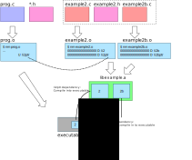

Some projects take this quite far.
For example [musl libc](https://www.musl-libc.org/) is a libc replacement, and it separates almost every single function into a separate object file (i.e. in a separate `.c` file!) so that only the exact functions that are called are linked into the program.

## Shared/Dynamic Libraries

Shared or dynamic libraries (for brevity, I'll call them only "dynamic libraries", but both terms are commonly used) are linked into a program *at runtime* when the program starts executing as part of `exec`.

Recall that even executable binaries might still have undefined references to symbols.
For example, see `calloc` in the example below:

```
$ nm tests/01_add.test | grep calloc
                 U calloc@@GLIBC_2.2.5
```

Though we can execute the program `tests/01_add.test`, it has references to functions that don't exist in the program!
How can we possibly execute a program that has undefined functions; won't the calls to `calloc` here be `NULL` pointer dereferences?

To understand how dynamic linking works, lets look at the output of a program that tells us about dynamic library dependencies, `ldd`.

```
$ ldd tests/01_add.test
        linux-vdso.so.1 (0x00007ffff3734000)
        libc.so.6 => /lib/x86_64-linux-gnu/libc.so.6 (0x00007fb502adf000)
        /lib64/ld-linux-x86-64.so.2 (0x00007fb502cfa000)
```

`ldd` also simply parses through the ELF program, and determines which dynamic libraries are required by the program.
For now, we'll ignore the `linux-vdso`, but the other two entries are interesting.
We can see that the C standard library, `libc` is being provided by `/lib/x86_64-linux-gnu/libc.so.6`.
These are both dynamic libraries, as are most `*.so.?*` and `*.so` files.
If we check out that object we see that it provides `calloc`.

```
$ objdump -T /lib/x86_64-linux-gnu/libc.so.6  | grep calloc
000000000009ec90 g    DF .text  0000000000000395  GLIBC_2.2.5 __libc_calloc
000000000009ec90  w   DF .text  0000000000000395  GLIBC_2.2.5 calloc
```

So this library provides the symbols we require (i.e. the `calloc` function)!

### Compiling and Executing with Dynamic Libraries

If we want our program to use a dynamic library, we have to compile it quite similarly to when we wanted to use static libraries:

```
$ gcc -o dyn_prog *.o -L. -lptrie
```

So everything is somewhat normal here; we're saying "look for the library in this directory", and compile me with the `ptrie` library.
To create the dynamic library:

```
$ gcc -Wall -Wextra -fpic -I. -c -o ptrie.o ptrie.c
$ gcc -shared -o libptrie.so ptrie.o
```

The first line is the normal way to create an object file from C, but includes a new flag, `-fpic`.
This tells the compiler to generate ["Position Independent Code", or PIC](https://en.wikipedia.org/wiki/Position-independent_code), which is code that can, seemingly magically, be executed when the code is loaded into any address!
The dynamic library cannot assume which addresses it will be loaded into as many dynamic libraries might be loaded into an executable, thus the PIC requirement.

The second line creates the dynamic (shared) library.
By convention, all dynamic libraries end with `.so` which you can think of as "shared object".
This is the line that is dynamic-library equivalent to the `ar` command for static libraries.

Now we have a binary that has been told were the library is; lets execute it!

```
$ ./dyn_prog
./dyn_prog: error while loading shared libraries: libptrie.so: cannot open shared object file: No such file or directory
```

Whaaaaaa?
If we dive in a little bit, we can see:

```
$ nm ./dyn_prog | grep ptrie_alloc
                 U ptrie_alloc
```

But I thought that we wanted all symbols to be defined when we create a binary?
Why is the library's `ptrie_alloc` not linked into the program?
We can see that not all symbols are defined in a program when we are using dynamic libraries as they are *linked when we try and run the program*!

We now can see the main practical difference between static and dynamic libraries:

- Static libraries are compiled into the program when you compile with the `-lptrie` directive.
- Dynamic libraries not *not* compiled into the program, and are instead *linked* into the program when it is executed (i.e. at the time of `exec`).

We can start to see why the program wont execute when we look at its dynamic library dependencies:

```
$ ldd ./dyn_prog
        linux-vdso.so.1 (0x00007ffdf3ca0000)
        libptrie.so => not found
        libc.so.6 => /lib/x86_64-linux-gnu/libc.so.6 (0x00007ff9921e8000)
        /lib64/ld-linux-x86-64.so.2 (0x00007ff9923f8000)
```

It isn't finding `libptrie.so`!

To execute the program, we have to properly set an *environment variable* that will tell the program, when it is executed, where to look for the dynamic library:

```
$ LD_LIBRARY_PATH=./:$LD_LIBRARY_PATH ./dyn_prog
...success...
```

This is some strange shell syntax.
`LD_LIBRARY_PATH=./:$LD_LIBRARY_PATH` essentially says "The environment variable called `LD_LIBRARY_PATH` should be updated to prepend the diretory `./` onto the front of it.
This is conceptually similar to something like `lib_path = "./:" + lib_path` in a language that supports string concatenation.
When `./dyn_prog` is executed, the updated `LD_LIBRARY_PATH` environment variable is visible in that program using the normal `getenv`.
So there is some part of the initialization of `./dyn_prog` that looks at this environment variable to figure out where to look for the dynamic library.

To confirm why we can now execute the program, we can again look at the library dependencies:

```
$ LD_LIBRARY_PATH=./:$LD_LIBRARY_PATH ldd prog_dynamic
        linux-vdso.so.1 (0x00007ffc939f8000)
        libptrie.so => ./libptrie.so (0x00007f70d316f000)
        libc.so.6 => /lib/x86_64-linux-gnu/libc.so.6 (0x00007f70d2f66000)
        /lib64/ld-linux-x86-64.so.2 (0x00007f70d3236000)
```

If we expand the `LD_LIBRARY_PATH` to include the current directory, the program can find the library.

If we want to see the [default paths](https://stackoverflow.com/questions/9922949/how-to-print-the-ldlinker-search-path) that are searched for dynamic libraries:

```
$ ldconfig -v 2>/dev/null | grep -v ^$'\t'
/usr/local/lib:
/lib/x86_64-linux-gnu:
/lib32:
/libx32:
/lib:
```

In fact, `ldconfig -v` will also print out all of the potential default dynamic libraries we can link with.

![Using dynamic libraries to compile a program. Additional flags are required when compiling the library files (for PIC), and we must tell the system that the library is dynamic when compiling using the `-shared` flag. But even then, the executable doesn't have the library functionality linked into it. Only when we execute the program does `ld` dynamically link in the library. For `ld` to know where to look for te library, we also have to tell it additional paths in which to look using an environment variable.](figures/08_dynamiclib.svg)

### `exec` with Dynamic Linking

How does the `libc.so` library get linked into our program?
Diving in a little bit further, we see that `ld` is our program's "interpreter":

```
$ readelf --program-headers tests/01_add.test
Elf file type is DYN (Shared object file)
Entry point 0x1180
There are 13 program headers, starting at offset 64

Program Headers:
  Type           Offset             VirtAddr           PhysAddr
                 FileSiz            MemSiz              Flags  Align
  PHDR           0x0000000000000040 0x0000000000000040 0x0000000000000040
                 0x00000000000002d8 0x00000000000002d8  R      0x8
  INTERP         0x0000000000000318 0x0000000000000318 0x0000000000000318
                 0x000000000000001c 0x000000000000001c  R      0x1
      [Requesting program interpreter: /lib64/ld-linux-x86-64.so.2]
  LOAD           0x0000000000000000 0x0000000000000000 0x0000000000000000
                 0x00000000000008e8 0x00000000000008e8  R      0x1000
  LOAD           0x0000000000001000 0x0000000000001000 0x0000000000001000
                 0x0000000000000e55 0x0000000000000e55  R E    0x1000
...
```

A lot is going on here, but we see the reference to `ld-linux-x86-64.so.2` that we saw previously in the `ldd` output.
We can now see that the library (that I'll call simply `ld`) is a "program interpreter" (see "`Requesting program interpreter: /lib64/ld-linux-x86-64.so.2`") for our program^[We can even choose to use a different program interpreter, for example, `interp.so`, using `gcc -Wl,--dynamic-linker,interp.so`.].
This is the core of understanding how our program can execute while having undefined references to functions provided by another library.

When we call `exec`, we believe that the program we execute takes over the current process and starts executing.
This is not true!
Instead, if a program interpreter is defined for our program (as we see: it is), the interpreter program's memory is loaded along side our program, but then the interpreter is executed instead of our program!
It is given access to our program's ELF object, and `ld`'s job is to finish linking and loading our program.
We have to add `./` to the `LD_LIBRARY_PATH` to make the program execute because **`ld` reads that environment variable when it is trying to link and load in your program**!

### Diving into Dynamic Linking at `exec`

But wait.
Why does `exec` end up loading `ld`, which then loads our program?
Why load `ld` to link our program instead of just running our program?
Because `ld` *also* loads and links all of the dynamic libraries (`.so`s) that our program depends on!!!

We can confirm that `ld` is loaded into our program by executing it in `gdb`, blocking it on breakpoint, and outputting its memory maps (`cat /proc/262648/maps` on my system):

```
555555554000-555555555000 r--p 00000000 08:02 527420                     /home/gparmer/repos/gwu-cs-sysprog/22/hw_solns/02/tests/01_add.test
555555555000-555555556000 r-xp 00001000 08:02 527420                     /home/gparmer/repos/gwu-cs-sysprog/22/hw_solns/02/tests/01_add.test
555555556000-555555557000 r--p 00002000 08:02 527420                     /home/gparmer/repos/gwu-cs-sysprog/22/hw_solns/02/tests/01_add.test
555555557000-555555558000 r--p 00002000 08:02 527420                     /home/gparmer/repos/gwu-cs-sysprog/22/hw_solns/02/tests/01_add.test
555555558000-555555559000 rw-p 00003000 08:02 527420                     /home/gparmer/repos/gwu-cs-sysprog/22/hw_solns/02/tests/01_add.test
7ffff7dbe000-7ffff7de3000 r--p 00000000 08:02 2235639                    /usr/lib/x86_64-linux-gnu/libc-2.31.so
7ffff7de3000-7ffff7f5b000 r-xp 00025000 08:02 2235639                    /usr/lib/x86_64-linux-gnu/libc-2.31.so
7ffff7f5b000-7ffff7fa5000 r--p 0019d000 08:02 2235639                    /usr/lib/x86_64-linux-gnu/libc-2.31.so
7ffff7fa5000-7ffff7fa6000 ---p 001e7000 08:02 2235639                    /usr/lib/x86_64-linux-gnu/libc-2.31.so
7ffff7fa6000-7ffff7fa9000 r--p 001e7000 08:02 2235639                    /usr/lib/x86_64-linux-gnu/libc-2.31.so
7ffff7fa9000-7ffff7fac000 rw-p 001ea000 08:02 2235639                    /usr/lib/x86_64-linux-gnu/libc-2.31.so
7ffff7fac000-7ffff7fb2000 rw-p 00000000 00:00 0
7ffff7fc9000-7ffff7fcd000 r--p 00000000 00:00 0                          [vvar]
7ffff7fcd000-7ffff7fcf000 r-xp 00000000 00:00 0                          [vdso]
7ffff7fcf000-7ffff7fd0000 r--p 00000000 08:02 2235423                    /usr/lib/x86_64-linux-gnu/ld-2.31.so
7ffff7fd0000-7ffff7ff3000 r-xp 00001000 08:02 2235423                    /usr/lib/x86_64-linux-gnu/ld-2.31.so
7ffff7ff3000-7ffff7ffb000 r--p 00024000 08:02 2235423                    /usr/lib/x86_64-linux-gnu/ld-2.31.so
7ffff7ffc000-7ffff7ffd000 r--p 0002c000 08:02 2235423                    /usr/lib/x86_64-linux-gnu/ld-2.31.so
7ffff7ffd000-7ffff7ffe000 rw-p 0002d000 08:02 2235423                    /usr/lib/x86_64-linux-gnu/ld-2.31.so
7ffff7ffe000-7ffff7fff000 rw-p 00000000 00:00 0
7ffffffde000-7ffffffff000 rw-p 00000000 00:00 0                          [stack]
ffffffffff600000-ffffffffff601000 --xp 00000000 00:00 0                  [vsyscall]
```

Recall that this dumps all of the memory segments of the process.

There are two important observations:

- `/usr/lib/x86_64-linux-gnu/libc-2.31.so` is present in the process so somehow got linked and loaded into the process.
- `/usr/lib/x86_64-linux-gnu/ld-2.31.so` is also present in the process; indeed it was the first code to execute in the process!

### Dynamic Loading Summary

Lets summarize the algorithm for executing a dynamically loaded program.

1. `exec` is called to execute a new program.
2. The program's ELF file is parsed, and if a "program interpreter" is set, the interpreter is instead executed.
3. In most cases, the interpreter is `ld`, and it is loaded into the process along with the target program.
4. Execution is started at `ld`, and it:

    1. Loads all of the dynamic libraries required by the program, looking at the `LD_LIBRARY_PATH` environment variable to help look for them.
    2. Links the program such that all of its references to library symbols (i.e. `calloc` above) are set to point to library functions.
    3. Executes the initialization procedures (and eventually `main`) of our program.

This is all quite complex.
Why would we ever want all of this complexity over the simplicity of static libraries?

### Saving Memory with Dynamic Libraries

First, lets look at how much memory a library takes up.

```
$ ls -lh /usr/lib/x86_64-linux-gnu/libc-2.31.so
-rwxr-xr-x 1 root root 2.0M Dec 16  2020 /usr/lib/x86_64-linux-gnu/libc-2.31.so
```

So `libc` takes around 2MiB.
Other libraries take quite a bit more:

- Graphics card drivers (e.g. `libradeonsi_dri.so` is 23 MiB)
- Databases clients (e.g. `libmysqlclient.so` is 7.2 MiB)
- Languages (e.g. firefox's javascript engine, `libmozjs.so` is 11 MiB, and webkit's `libjavascriptcoregtk.so` is 26 MiB)
- ...

If $N$ programs must load in multiple libraries (totaling, say, $X$ MiB), then $N \times X$ MiB is consumed.
For context, my system is currently running 269 programs (`ps aux | wc -l`), so this memory can add up!

Dynamic libraries enable us to do a lot better.
The contents memory for the library is the same regardless the process it is present in, and an Operating System has a neat trick: it can make the same memory appear in multiple processes if it is identical *and* cannot be modified^[This sharing of library memory across processes is why dynamic libraries are also called *shared libraries.*].
As such, dynamic libraries typically only require memory for each library *once* in the system (only $X$), as opposed for each process.


## Static vs. Dynamic Library Memory Usage Summary

When a program is linked with a static library, the result is relatively small as only the objects in the library that are necessary are linked into the program.
When executed as a process, the memory consumed will only include the necessary objects of the library.
In contrast, a program that uses a dynamic library links in the entire library at runtime into a process.
Thus, for a *single process*, a static library approach is almost always going to be more memory-efficient.

However, in a system with *many* executing processes, the per-library memory, rather than per-process memory, will result in significantly less memory consumption.
Requiring only a *single copy* of a *larger* dynamic library shared between all processes, uses less memory than *multiple copies* of *smaller* compilations of the library in each program.

# Organizing Software with Dynamic Libraries: Exercises and Programming

Lets dive a little deeper into how software is structured on our system, and the trade-offs that different libraries make in the system.

## Exercise: Understanding Library Memory Consumption

Lets investigate the `libexample` from the figures in last week's lectures.
See the [`08/libexample/` directory](https://github.com/gwu-cs-sysprog/lectures/tree/main/08/libexample) for examples of using normal linking (`make naive`), static library linking (`make static`), and dynamic library linking (`make dynamic`).
The source includes:

- `prog` and `prog2` that are programs that use libraries.
- `example.c` is a single file that creates the first library which generates `libexample.a` and `libexample.so`.
- `example2.c` and `example2b.c` are the files that create the second library which generates `libexample2.a` and `libexample2.so`.

Each of the library objects uses around *750KB* of memory.
To help you set the `LD_LIBRARY_PATH` to execute the dynamic libraries, you can run the dynamic library examples using

```
$ ./run_dyn.sh ./prog_dynamic
```

1. Use `nm` and `ldd` to understand which libraries and object files within those libraries each of the programs require.
2. Use `ls -lh` to see the size of each of the resulting executable programs.
    Explain the differences in sizes.

## Library Trade-offs

- *Question:*
    What types of systems might want to always use only static libraries?
- *Question:*
    What types of systems might want to always use only dynamic libraries?
- *Question:*
    OSX uses dynamically linked libraries for a few common and frequently used libraries (like `libc`), and static libraries for the rest.
    Why?

## Programming Dynamic Libraries

We saw how libraries enable the sharing of functionality between programs.
Static libraries are convenient, and only required objects are linked with your program at compile time.
In contrast, dynamic libraries are linked at runtime *before* the `main` of your program executes.

### Plugins and Dynamic Library APIs

In addition to enabling shared library code, dynamic libraries also enable explicit means to load libraries programmatically.
Namely, UNIX provdes an API that enables your process to *load* a dynamic library into itself.
This is kinda crazy: a running process with a set of code and data can add a library with more code and data into itself dynamically.
This effectively means that your program can change its own code as it executes by adding and removing dynamic libraries.
Being able to load library code into your process as your program executes (at runtime) is an instance of *self-modifying code*, and it enables a few very cool features including:

- *dynamic update of services* in which new versions of key computations in a service can be dynamically loaded in (and old versions eventually removed),
- *plugin architectures* enable different interesting functionalities to be loaded into a process to provide unique functionalities -- some of the most popular image and video processing programs (e.g. `ffmpeg`) enable different formats to be handled with separate dynamic libraries, thus enabling the processing of any image or video by simply loading a new library, and
- *languages*, such as `python`, dynamically load libraries (many or most are written in C) into a process when the python code `import`s them.
	Since the `import`s are part of the code, the corresponding dynamic libraries must be loaded by the python runtime dynamically.
    This enables your dynamic (slow) python code to load and leverage fast C libraries.

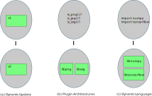

This API is provided by the linker (`ld.so`) that loaded the elf object for the currently executing process.
What does the API that enables this dynamic loading look like?

- `handle = dlopen(file_path, flags)` - Open and load in a dynamic library.
    This returns a handle to the library that you should pass into the latter functions.
    You can read about the `flags` in `man dlopen`.
	Unless otherwise noted, I'd recommend using `RTLD_NOW | RTLD_LOCAL`^[What are "flags"? The notion of "flags" is pretty confusing. Flags are often simply a set of bits (in this case, the bits of the `int`) where each bit specifies some option. In this case, there's a bit for `RTLD_NOW` which says to load all of the symbol dependencies now, and a separate bit for `RTLD_LOCAL` which says that subsequent libraries should not see this library's symbols. In short, these are just single bits in the "flags" integer, thus they can be bitwise or-ed together (thus the `|`) to specify options -- they are simply a way to specify a set of options.].
	Returns `NULL` if it cannot find the dynamic library.
- `dlclose(handle)` - Close and unload a library that was previously loaded.
- `symb_ptr = dlsym(handle, symbol)` - pass in a `symbol` which is a string holding a function or variable name in the dynamic library.
    It should return a pointer to that symbol, which you can then call (if it is a function pointer), or dereference if it is a variable.

```c
#include <stdio.h>
#include <stdlib.h>
#include <dlfcn.h>

int
main(void)
{
	void *handle;
	typedef int *(*bar_fn_t)(int a);
	bar_fn_t bar;
	int *ret;

	/* Open a dynamic library: the example is in ../08/libexample/ */
	handle = dlopen("08/libexample/libexample.so", RTLD_NOW | RTLD_LOCAL);
	if (!handle) return EXIT_FAILURE;

	/*
	 * Lets find the function "bar" in that dynamic library.
	 * We know that `bar` is the function: int *bar(int a)
	 */
	bar = dlsym(handle, "bar");
	if (!bar) return EXIT_FAILURE;

	/* bar allocates an int, populates it with the argument + 2 and returns it */
	ret = bar(40);
	printf("%d\n", *ret);
	free(ret);

	return 0;
}
```

Program output:
```
42
```

As `dlsym` returns a pointer to the symbol passed in (as a string), it means that you end up seeing a *lot* of function pointers when you're using plugin infrastructures.
See (a) in the image below.

We can also use `dlsym` to ask for a symbol in *any of the installed libraries*.
To do so, we pass in the "special pseudo-handles" `RTLD_DEFAULT` or `RTLD_NEXT`.

```c
#define _GNU_SOURCE /* added this due to `man 3 dlsym` */
#include <stdio.h>
#include <stdlib.h>
#include <dlfcn.h>
#include <string.h>
#include <unistd.h>

int
main(void)
{
	typedef int (*write_fn_t)(int fd, char *buf, size_t s);
	write_fn_t w;
	char *buf = "Look at me! Diving into your dynamic libraries...pulling out the symbols\n";

	/* Now lets find `write`! */
	w = dlsym(RTLD_DEFAULT, "write");
	if (!w) return EXIT_FAILURE;
	w(STDOUT_FILENO, buf, strlen(buf));

	return 0;
}
```

Program output:
```
Look at me! Diving into your dynamic libraries...pulling out the symbols
```

Though this example doesn't have much of a point, as we can directly call `write`, thus have to go through the symbol we retrieved from `dlsym`,
See (b) in the image below.

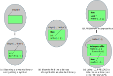

### Interposing Libraries on Library APIs

One powerful mechanism that dynamic libraries enable is to *interpose* on library function calls.
Your program might believe that it calls `malloc` when it invokes the function "malloc", but you can orchestrate it so that it instead calls a `malloc` in your library!
You can then, if you choose, invoke the normal library calls, thus why this is known as *interposing* on the library calls.
But how?

The environment variable `LD_PRELOAD` can be used to specify a dynamic library to load into the process to *interpose* on any library calls.
A trivial use of this might be to *log* (i.e. write out to a file) all of a set of library calls.
We'll use it to add intelligence on the memory allocation paths.

When we use `LD_PRELOAD=lib`, the symbols in the dynamic library that we specify in `lib` have priority over those of other libraries.
Thus, if we include a `malloc` function definition, when the application calls `malloc`, it will call *our* malloc!
In the image above, (c) demonstrates using `LD_PRELOAD`.

In [`malloclog`](https://github.com/gwu-cs-sysprog/lectures/tree/main/09/malloclog/), we can see a library that interposes on `malloc` and `free`, and prints information to standard error.
This includes the following:

``` c
typedef void *(*malloc_fn_t)(size_t s);
static malloc_fn_t malloc_fn;

/* This `malloc` will override libc's `malloc` */
void *
malloc(size_t sz)
{
	void *mem;

	/* if we don't yet know where libc's malloc is, look it up! */
	if (malloc_fn == NULL) {
		/*
		 * Lets find the `malloc` function in libc! The `RTLD_NEXT`s
		 * specify that we don't want to find our *own* `malloc`, we'd like to
		 * search starting with the *next* library.
		 */
		malloc_fn = dlsym(RTLD_NEXT, "malloc");
		assert(malloc_fn);
	}
	/* call libc's `malloc` here! */
	mem = malloc_fn(sz);
	fprintf(stderr, "malloc(%ld) -> %p\n", sz, mem);

	return mem;
}
```

We do the same for `free`, and should do the same also for `calloc` and other memory allocation functions.

**Question:** Why can't we just call `malloc` directly instead of doing this complex thing with `dlsym`?

We can use it on a simple program that simply calls `malloc` and `free` on the allocated memory.
To test this out, in [`malloclog`](https://github.com/gwu-cs-sysprog/lectures/tree/main/09/malloclog/):

```
$ make
$ LD_PRELOAD=./libmalloclog.so ./main.bin
malloc(4) -> 0x55fe6cd492a0
free(0x55fe6cd492a0)
...
```

This shows us that dynamic libraries are *programmable* and that we can use them in interesting ways to coordinate between libraries, provide new functionalities, and to interpose on functionalities.
For example, many of the largest companies use `LD_PRELOAD` to swap out the `malloc` implementation for one that is higher performance.

**Questions:**

- What else can you think to do with the ability to interpose on *any* library functions?
- How might we implement some of the `valgrind` functionality using the ability to interpose on library functions?

Note that running a program that uses `LD_PRELOAD` environment variables are more difficult to use in `gdb`.
The [`ldpreload_w_gdb.sh`](https://github.com/gwu-cs-sysprog/lectures/tree/main/09/malloclog/ldpreload_w_gdb.sh) script demonstrates how to use both technologies together.

# System Calls and Memory Management

We've talked about the many resources that are provided by the *system*.
These include files, pipes, and domain sockets.
But we've been vague about what the system is.
Though we'll leave the details for a later course, lets dive in to what constitutes the "system" a little bit.

## System Calls

We've claimed many times that *the system* provides pipes, domain sockets, files, the file system, etc...
What is "the system"?
First, lets start from what we know: is this system just a dynamic library?
To some extent this makes sense.

**Question:**

- The dynamic libraries we've seen provide many of the functions we've used, so why *couldn't* they provide *all* of the functionality we require!?
    For example, why can't `read`, `open`, etc... all be simply provided solely by dynamic libraries?

A few observations:

1. Dynamic libraries are loaded into a process, but *what provides the process itself*?
2. Some resources, like `pipe`s, *involve multiple processes*, thus there must be something in the system beyond specific processes.
3. *Hardware is limited* -- a system only has a limited amount of DRAM (memory) -- and something has to determine how to hand it out to processes.

![The OS kernel's relationship to processes and libraries. Each OS has a kernel, in this case the Linux Kernel. The kernel provides resources such as file systems, channels (domain sockets, `pipe`s, etc...), and it implements processes (including `fork`, `exec`, `wait`, etc...). The kernel is separated from processes so that a failure in a process won't spread beyond the process. This means that when a process wants to interact with the kernel, it must make a special *system call*. This behaves like a function call, but it maintains isolation of the kernel from the process.  This is a system with four processes. The second is making a `write` system call, the third is using `printf` which is implemented in `libc` as part of the stream API in `stdio.h`. The stream implementation makes a `write` system call to send the data to the kernel (e.g. to display on our terminal). On the far right, we can see a process that doesn't even have any libraries and makes system calls directly.](figures/10_kernel_syscalls.svg)

The *system*, as we've discussed it so far, is called the *kernel*.
One of the main components of every operating system is the kernel.
Every process in the system uses the kernel's functionality.
It provides the logic for *most* of the calls we've learned in the class, `fork`, `exec`, `pipe`, `read`, `write`, `open`, `creat`, etc... and also most of the resources we've discussed including channels, domain sockets, pipes, files, and the filesystem.
It is some of the most trusted code on the system.
If it has a bug, the whole system can crash -- or worse!

We have to be able to call functions in the kernel from any process.
This means we want to make what seem like function calls to the kernel.
And we want to make sure that the faults of one process don't spread to another!
This means that somehow the kernel must be isolated from each process.

**System calls** are the mechanism that behaves like a function call (and looks like one to us!), but that switches over to the kernel.
System calls are a special instruction in the instruction set architecture (Intel x86 or ARM) that triggers the switch to the kernel.
When the kernel's done with its functionality, it can return (via a special instruction) to the process.

So system calls *behave* like function calls, but inherently involves *switches* from the process and to the kernel and back.

**Question:**

- So why does UNIX decide what functionality to put in a library, and what to put in the kernel?

### System Calls and Processes

In UNIX, system calls are available in `unistd.h`, so whenever you include that file to use a function, you know the function is likely a direct system call!
You can also tell if a UNIX function is a system call by looking at the *sections* of `man` (from `man man`):

```
MANUAL SECTIONS
    The standard sections of the manual include:

    1      User Commands
    2      System Calls
    3      C Library Functions
    4      Devices and Special Files
    5      File Formats and Conventions
    6      Games et. al.
    7      Miscellanea
    8      System Administration tools and Daemons
```

**Questions:**

- Do `man write`.
    What is this documentation for?
- Do `man 2 write`.
    What is this documentation for?
	What does the `2` mean?

    You can always tell which section you're looking at in the header line of the `man` output: `WRITE(2)` shows that we're reading about `write` in the "System Calls" section.

- Is `malloc` a system call or a C Library Function?

We know what a system call looks like, as we've used them many times throughout the class.
Lets look at the various ways to make the same system call.
First, the normal way:

```c
#include <unistd.h>

int
main(void)
{
	write(1, "hello world\n", 12);

	return 0;
}
```

Program output:
```
hello world
```

The C standard library even provides you a "generic" way to invoke *any* system call.
The `syscall` function lets you make an integer-identified system call.
Each system call on the system is identified with a unique integer.
In this case, we'll use `SYS_write`.

```c
#include <unistd.h>
#include <sys/syscall.h>

int
main(void)
{
	syscall(SYS_write, 1, "hello world\n", 12);

	return 0;
}
```

Program output:
```
hello world
```

Lets look at a few of these integer values to see what's happening here:

```c
#include <stdio.h>
#include <sys/syscall.h>

int
main(void)
{
	printf("write: %d\nread:  %d\nopen:  %d\nclose: %d\n",
		SYS_write, SYS_read, SYS_open, SYS_close);

	return 0;
}
```

Program output:
```
write: 1
read:  0
open:  2
close: 3
```

Note, these integer values are *not* related to descriptors (e.g. `STDIN_FILENO == 0`).
The system calls in Linux (and in all operating systems!) are each assigned an integer with which to identify them.
You can see all of the [system calls and their integer numbers](https://filippo.io/linux-syscall-table/), and some documentation in [`man syscalls` (link)](https://manpages.debian.org/unstable/manpages-dev/syscalls.2.en.html).

**Exercise:**

- Find three interesting system calls that you didn't know about.

OK, now lets do a little more of a deep-dive.
You won't be familiar with the Intel's/AMD's x86-64 assembly language that follows, but the comments on the right give you the jist.

```asm
.data				 ; Add some global variables - our "hello world" message
msg:
    .ascii "hello world\n"
    len = . - msg	 ; magic length computation "here" - start of `msg`

.text				 ; The code starts here!
    .global _start

_start:              ; Note: the %rxx values are registers, $x are constants
    movq  $1,   %rax ; Syscall's integer value, 1 == write, now set up the arguments...
    movq  $1,   %rdi ; Arg 1: file descriptor 1
    movq  $msg, %rsi ; Arg 2: the string!
    movq  $len, %rdx ; Arg 3: the length of the string
    syscall			 ; Kick off the system call instruction!

    movq  $60,  %rax ; System call #60 == exit
    xorq  %rdi, %rdi ; Arg 1: xor(x, x) == 0, pass NULL as argument!
    syscall
```

We compile this assembly with `make` (in `10/`).
Program output:

```
hello world
```

We can see that the requirements of making a system call are quite minimal!
A special instruction (on x86-64, `syscall`) provides the magical incantation to make what feels like a function call *to the kernel*.

How does this work?
Recall that ELF, the file format for objects and programs includes many pieces of information necessary to execute the program.
Among them, the *starting or entry address* which is the initial instruction to start executing when the program runs.

```
$ readelf -a ./asm_syscall  | grep "Entry"
  Entry point address:               0x401000
$ readelf -a ./asm_syscall  | grep "401000"
  Entry point address:               0x401000
...
     6: 0000000000401000     0 NOTYPE  GLOBAL DEFAULT    1 _start
```

We can see that the "entry point address" for the binary is `0x401000`, and we can see that the `_start` symbol has that address.
The `exec` logic of the kernel will set the program to start executing at that `_start` address.

Note that this same analysis rings true for the normal C system call code above (not only for the assembly)!
The `_start` function is where all execution starts in each program.
This explains why our program above labels its code with `_start`!

## Observing System Calls

The `strace` program lets us monitor the system calls a program makes.
Running int on the assembly program above:

```
$ strace ./asm_syscall
execve("./asm_syscall", ["./asm_syscall"], 0x7fff3c06ae10 /* 50 vars */) = 0
write(1, "hello world\n", 12hello world
)           = 12
exit(0)                                 = ?
+++ exited with 0 +++
```

This likely has what you'd expect: We see the `exec` that kicks off the program, the `write`, and, finally, the `exit`.
You'd likely expect the same from the normal C program that also writes out `hello world`.

```
$ trace ./normal_syscall
execve("./normal_syscall", ["./normal_syscall"], 0x7ffc036c1520 /* 50 vars */) = 0
brk(NULL)                               = 0x5638ed59d000
arch_prctl(0x3001 /* ARCH_??? */, 0x7ffd8bfb49c0) = -1 EINVAL (Invalid argument)
access("/etc/ld.so.preload", R_OK)      = -1 ENOENT (No such file or directory)
openat(AT_FDCWD, "/etc/ld.so.cache", O_RDONLY|O_CLOEXEC) = 3
fstat(3, {st_mode=S_IFREG|0644, st_size=138102, ...}) = 0
mmap(NULL, 138102, PROT_READ, MAP_PRIVATE, 3, 0) = 0x7efddf831000
close(3)                                = 0
openat(AT_FDCWD, "/lib/x86_64-linux-gnu/libc.so.6", O_RDONLY|O_CLOEXEC) = 3
read(3, "\177ELF\2\1\1\3\0\0\0\0\0\0\0\0\3\0>\0\1\0\0\0\360A\2\0\0\0\0\0"..., 832) = 832
pread64(3, "\6\0\0\0\4\0\0\0@\0\0\0\0\0\0\0@\0\0\0\0\0\0\0@\0\0\0\0\0\0\0"..., 784, 64) = 784
pread64(3, "\4\0\0\0\20\0\0\0\5\0\0\0GNU\0\2\0\0\300\4\0\0\0\3\0\0\0\0\0\0\0", 32, 848) = 32
pread64(3, "\4\0\0\0\24\0\0\0\3\0\0\0GNU\0\237\333t\347\262\27\320l\223\27*\202C\370T\177"..., 68, 880) = 68
fstat(3, {st_mode=S_IFREG|0755, st_size=2029560, ...}) = 0
mmap(NULL, 8192, PROT_READ|PROT_WRITE, MAP_PRIVATE|MAP_ANONYMOUS, -1, 0) = 0x7efddf82f000
pread64(3, "\6\0\0\0\4\0\0\0@\0\0\0\0\0\0\0@\0\0\0\0\0\0\0@\0\0\0\0\0\0\0"..., 784, 64) = 784
pread64(3, "\4\0\0\0\20\0\0\0\5\0\0\0GNU\0\2\0\0\300\4\0\0\0\3\0\0\0\0\0\0\0", 32, 848) = 32
pread64(3, "\4\0\0\0\24\0\0\0\3\0\0\0GNU\0\237\333t\347\262\27\320l\223\27*\202C\370T\177"..., 68, 880) = 68
mmap(NULL, 2037344, PROT_READ, MAP_PRIVATE|MAP_DENYWRITE, 3, 0) = 0x7efddf63d000
mmap(0x7efddf65f000, 1540096, PROT_READ|PROT_EXEC, MAP_PRIVATE|MAP_FIXED|MAP_DENYWRITE, 3, 0x22000) = 0x7efddf65f000
mmap(0x7efddf7d7000, 319488, PROT_READ, MAP_PRIVATE|MAP_FIXED|MAP_DENYWRITE, 3, 0x19a000) = 0x7efddf7d7000
mmap(0x7efddf825000, 24576, PROT_READ|PROT_WRITE, MAP_PRIVATE|MAP_FIXED|MAP_DENYWRITE, 3, 0x1e7000) = 0x7efddf825000
mmap(0x7efddf82b000, 13920, PROT_READ|PROT_WRITE, MAP_PRIVATE|MAP_FIXED|MAP_ANONYMOUS, -1, 0) = 0x7efddf82b000
close(3)                                = 0
arch_prctl(ARCH_SET_FS, 0x7efddf830540) = 0
mprotect(0x7efddf825000, 16384, PROT_READ) = 0
mprotect(0x5638eb775000, 4096, PROT_READ) = 0
mprotect(0x7efddf880000, 4096, PROT_READ) = 0
munmap(0x7efddf831000, 138102)          = 0
write(1, "hello world\n", 12hello world
)           = 12
exit_group(0)                           = ?
+++ exited with 0 +++
```

Whaaaaa!?
If you look carefully, at the bottom we see the expected output.
But we also see a *lot* of system calls previous to that.
Between when we start execution at `_start`, and when we execute in `main`, quite a lot happens.

**Question:**

- What do you think is causing all of these system calls?
    What is the program doing before running `main`?

![Why are there so many system calls in a simple C program? Lets compare what happens in the C versus assembly programs. The process on the left is `normal_syscall` above, while `asm_syscall` is on the right. The assembly system call avoids much of the C runtime support, thus starts execution at `_start`, and makes system calls directly. In contrast, the C program starts execution in the dynamic linker `ld` (i.e. at `_start` in `ld`) -- step (1). `ld` links in the `libc` dynamic library (2), then executes `_start` in our program (3). Our program actually calls `libc` (4) before executing `main` to do library initialization, which then calls `main`. After `main` returns (5), it returns into `libc`, which then terminates our program with the `_exit` system call. So why are there so many system calls made in the C program? There's a lot of execution that happens outside of our logic! Most of the system calls are from `ld`.](figures/10_bootup_syscalls.svg)

## System Call Overhead

There are many reasons why some functionality might be in a library, and accessed via function calls, or in the kernel, and accessed with system calls.

Lets look at an example of memory allocation.
We can, of course, use `malloc` and `free` to allocate and free memory.
But we can also call `mmap` and `munmap` that make *system calls* to allocate and free memory.

**Questions:**

- Which will be *faster*, `malloc`/`free` or `mmap`/`munmap`?
- How much overhead would you *guess* a system call has?

```c
#include "10/timer.h"

#include <unistd.h>
#include <stdio.h>
#include <sys/mman.h>
#include <stdlib.h>

#define ITER 256

int
main(void)
{
	int i;
	unsigned long long start, end;
	int *mem;

	/* How many cycles does `write` take? */
	start = cycles();
	for (i = 0; i < ITER; i++) {
		mem = malloc(256);
		mem[0] = 42;
		free(mem);
	}
	end = cycles();
	printf("\nmalloc + free overhead (cycles): %lld\n", (end - start) / ITER);

	/* How many cycles does `fwrite` take? */
	start = cycles();
	for (i = 0; i < ITER; i++) {
		mem = mmap(NULL, 256, PROT_READ | PROT_WRITE, MAP_ANONYMOUS | MAP_PRIVATE, 0, 0);
		mem[0] = 42;
		munmap(mem, 256);
	}
	end = cycles();
	printf("\nmmap + munmap overhead (cycles): %lld\n", (end - start) / ITER);

	return 0;
}
```

Program output:
```

malloc + free overhead (cycles): 1167

mmap + munmap overhead (cycles): 36686
```

> What is a "cycle"?
> When you read that you have a 3GHz, that essentially says that the internal "clock" that drives the logic in the processor cycles by at 3 billion cycles per second.
> That's a *lot*.
> Each cycle is 1/3 a nanosecond.
> A cycle is the smallest unit of measurement on a processor, and the `cycles` function we implement here gives us how many cycles have elapsed since the system boots.

We can also look at the output APIs like `write` and compare them to the stream APIs that buffer their output.

**Questions:**

- If we write a byte to a file using `write` or to a stream (via a `FILE`) using `fwrite`, what performance would you expect?
- How about if we did an `fflush` after the `fwrite`?

```c
#include "10/timer.h"

#include <unistd.h>
#include <stdio.h>

#define ITER 256

int
main(void)
{
	int i;
	unsigned long long start, end;

	/* How many cycles does `write` take? */
	start = cycles();
	for (i = 0; i < ITER; i++) write(1, " ", 1);
	end = cycles();
	printf("\nwrite overhead (cycles): %lld\n", (end - start) / ITER);

	/* How many cycles does `fwrite` take? */
	start = cycles();
	for (i = 0; i < ITER; i++) fwrite(" ", 1, 1, stdout);
	end = cycles();
	printf("\nfwrite (stream) overhead (cycles): %lld\n", (end - start) / ITER);

	/* How many cycles does `fwrite + fflush` take? */
	start = cycles();
	for (i = 0; i < ITER; i++) {
		fwrite(" ", 1, 1, stdout);
		fflush(stdout);
	}
	end = cycles();
	printf("\nfwrite + fflush overhead (cycles): %lld\n", (end - start) / ITER);

	return 0;
}
```

Program output:
```
                                                                                                                                                                                                                                                                
write overhead (cycles): 18266
                                                                                                                                                                                                                                                                
fwrite (stream) overhead (cycles): 153
                                                                                                                                                                                                                                                                
fwrite + fflush overhead (cycles): 18043
```

## Library vs. Kernel Trade-offs in Memory Allocation

We've seen that

1. the kernel is there to facilitate access to hardware resources (memory, processing, etc...),
2. the kernel provides processes (`fork`, `exec`) and inter-process interactions (`wait`, `pipe`, etc...) as these functionalities require implementation beyond any single process,
3. functions in dynamic libraries are much faster to invoke as system calls have significant overhead.

This leads us to the conclusion that for performance, we'd like to implement as many functions as possible in libraries, and to rely on the kernel when processes require modifications (`exec`, `fork`), when there are multiple processes involved (IPC), or when the finite resources of the system must be split up between processes (`open`, `creat`, `sbrk`).

Here, we're going to dive into the design of the *memory management* functionalities in UNIX to better understand the trade-offs.
Specifically, *how does `malloc` and `free` work*!?

### Library Tracking of Memory

So `malloc`, `calloc`, `realloc`, and `free` are implemented in a library (in `libc`), and when we request memory from them, they might call `sbrk` (or `mmap` on some systems) to get memory from the kernel, but from that point on, they will manage that memory themselves.
What does this mean?
When the *heap* doesn't have enough free memory to satisfy a `malloc` request, we call the kernel to *expand the heap*.
To do so, we ask the kernel for memory via `sbrk` or `mmap`, and we generally get a large chunk of memory.
For example, we might ask `sbrk` for 64KB of memory with `mem = sbrk(1 << 16)`^[Note, this is just $2^16$, using shifts to emulate the power operator.].
Then it is `malloc`'s job to split up that memory into the smaller chunks that we'll return in each subsequent call to `malloc`.
When memory is `free`d, it is returned to the pool of memory which we'll consider for future allocations.
Because we're *reusing* freed memory, we're avoiding system calls when the heap contains enough `free`d memory to satisfy a request.


This is what it means that our `malloc`/`free` code in the `libc` library need to track the memory in the heap.
We need to track *where allocated memory is located* and *where freed spans of memory are located*, to enable intelligent allocation decisions for future `malloc` calls.

**Questions:**

- What data-structures should we use to track allocated/freed memory?
- Do you foresee any challenges in using data-structures to track memory?

### Malloc Data-structures

The `malloc` and `free` implementation must track which chunks of memory are allocated, and which are freed, but it cannot use `malloc` to allocate data-structures.
That would result in `malloc` calling itself recursively, and infinitely!
If `malloc` requires memory allocation for its tracking data-structures, who tracks the memory for the tracking data-structures?
Yikes.

We solve this problem by allocating the tracking data-structures along with the actual memory allocation itself.
That is to say, we allocate a *header* that is a struct defined by `malloc` that is *directly before* an actual memory allocation.
Because the header is part of the same contiguous memory chunk, we allocate the header at the same time as we allocate memory!
When memory is freed, we use the header to track the chunk of memory (the header plus the free memory directly following the header) in a linked list of free chunks of memory called a *freelist*.

![Memory allocations through various sets of details. The red boxes are allocated memory, white box is memory that we've retrieved in the heap from `sbrk`, the green boxes are the *headers* data-structures that track free chunks of memory we can use for future allocations, and they are arranged in a linked list called *freelist*, and orange boxes are headers for allocated chunks of memory thta track how large that allocation is so that when we `free` it, we know large the chunk of freed memory will be.](figures/10_malloc.svg)

- (a) the heap with some memory allocated, and some free spans of memory.
- (b) we need to make a data-structure to track where the free spans of memory are, so we add a structure into each of the free chunks, and use it to construct a linked list of the free chunks.
- (c) When we `malloc`, we can find the free chunk large enough for the allocation, remove it from the freelist, ...
- (d) ...and return it!
- (e) If we want to free that memory, we must understand somehow (i.e. must have a structure that tracks) the size of the allocation, so that we can add it back onto the freelist.
- (f) We can track the size of each allocation in a *header* directly before the memory we return.
    We are tracking the memory in the same contiguous span of memory we use for the allocation!
- (g) So when we free, we're just adding that memory back onto the freelist.
- (h) If we ever receive a `malloc` request that can't be satisfied by the freelist, *only then* do we make a system call to allocate more heap.

### Exercise: `smalloc`

Look at the [`10/smalloc.c` (link)](https://github.com/gwu-cs-sysprog/lectures/blob/main/10/smalloc.c) file for a simple implementation of a `malloc`/`free` that assumes *only allocations of a specific size*.
This means that we don't need to track the sizes of allocations and free chunks in the headers, simplifying our implementation.
Build, and run the program:

```
$ make
$ ./smalloc.bin
```

It currently implements this simple `malloc`!
Read through the `smalloc` and `sfree` functions, and the `main`.
Answer `QUESTION 1-3`.
Then, move on to `QUESTION 4`.
In `expand_heap`, we make the system call to allocate more memory from the system with `sbrk`.
We need to set up that newly allocated heap memory to include memory chunks that we can allocate with `smalloc`.
Answering how this is done is the core of `QUESTION 4`.

# UNIX Security: Users, Groups, and Filesystem Permissions

> **This material adapted from Prof. Aviv's [material](https://classes.adamaviv.com/ic221/s18/units/01/unit.html#org26c0ea7).**

We've seen how the filesystem is used to store and name files and channels, and we've seen the APIs to access directories and files.
If everyone had access to every else's files, then there would be no way to secure your information.
Thus, the kernel provides means to control different user's *access* to different files and directories.
This means that I cannot access your files, and vice-versa!

To understand the core concept of *access control* in UNIX, we have to understand

1. how UNIX thinks about, implements, and organizes users and groups of users,
2. how files and directories provide various access permissions to different users and how to alter those permissions, and
3. how services, even when executed by a user, can have heightened access to system resources.

## File and Directory Permissions

The filesystem stores files and directories are somehow associated with each of us, separately.
Lets check out the properties of a file that are returned by running `ls -l`:

```
.- Directory?
|    .-------Permissions                   .- Directory Name
| ___|___     .----- Owner                 |
v/       \    V     ,---- Group            V
drwxr-x--x 4 aviv scs 4096 Dec 17 15:14 im_a_directory
-rw------- 1 aviv scs 400  Dec 19  2013 .ssh/id_rsa.pub
                       ^   \__________/    ^
File Size -------------'       |           '- File Name
  in bytes                     |
                               |
   Last Modified --------------'
```

An example from the class' server where we create a file, a directory, and see the results:

```
$ echo hi > file.txt
$ mkdir hello
$ ls -l
-rw-r--r-- 1 gparmer dialout    3 Mar 18 12:19 file.txt
drwxr-xr-x 2 gparmer dialout 4096 Mar 18 12:20 hello
```

We see that each file and directory has a owner and group associated with it.

**Question:**

- What do you think this means?
    Why do files have owners and groups?

### File Ownership and Groups

The *owner* of a file is the *user* that is directly responsible for the file and has special status with respect to the file permissions.
Users can also be collected together into a set called a *group*, a collection of users who posses the same permissions.
A file is associated with a group.
A file's or directory's owners and groups have different permissions to access the file.
Before we dive into that, lets understand how to understand users and groups.

You all are already aware of your username.
You can get your username with the `whoami` command:

```
$ whoami
gparmer
```

To have UNIX tell you your username and connection information on this machine, use the command, `who`:

```
$ who
gparmer  pts/1        2022-03-18 12:12 (128.164...)
```

The first part of the output is the username.
The rest of the information in the output refers to the terminal you're using (it is a "pseudo-terminal device", something that pretends it is a typewriter from the 60s), the time the terminal was created, and from which host you are connected.

You can determine which groups you are in using the groups command.

```
$ groups
dialout CS_Admins
```

On the class' server, I'm in the `dialout` and `CS_Admins` groups.
On my work computer, I'm in a few more groups:

```
$ groups
ycombinator adm cdrom sudo dip plugdev lpadmin sambashare
```

The good news is that I can use my `cdrom`.
Fantastic.
It will pair well with my pseudo-typewriter.
Cool.

### File Permissions

The *permissions* associated with each file/directory specify who should be able to have the following access:

- `r` - the ability to *read* the file, or *read the contents* of a directory.
- `w` - the ability to *write* to the file, or update the contents of a directory.
- `x` - the ability to *execute* a file (i.e. a program), or `chdir` into a directory.

We think about different users as having different sets of these permissions to access files and directories.
When we see the permissions string for a file, we see three sets of these `rwx` permissions:

```
-rw-r--r-- 1 gparmer dialout    3 Mar 18 12:19 file.txt
```

Here we have three sets of permissions `rw-` (read and write), `r--` (read only), and `r--` (read only).
These three sets of permissions each specify the access permissions for the *owner*, the *group*, and everyone else's *global* permissions.

```
 .-- Directory Bit
|
|       ,--- Global Permission (i.e. "every else")
v      / \
-rwxr-xr-x
 \_/\_/
  |  `--Group Permission
  |
   `-- Owner Permission
```

Given this, now we can understand the permissions for each file in:

```
ls -l 11/perm_example/
total 0
-rw-r--r-- 1 gparmer gparmer 0 Mar 25 18:43 bar
-rw-rw-r-- 1 gparmer gparmer 0 Mar 25 18:43 baz
-rwx------ 1 gparmer gparmer 0 Mar 25 18:42 foo
```

*Question:*

- *Who* has *what access permissions* to which files?

### Numerical Representation of Permissions

Each permission has a *numerical representation*.
We represent it in *octal*, which is a fancy way to say that we think of each digit of our numerical representation as being between `0-7` -- it is "base 8" (in contrast to the normal digits numbers we use every day that are "base 10").
Thus, each of the three sets of permissions is `3` bits.

Each of the three permissions, `r`, `w`, and `x` correspond to the most-significant to the least significant bits in each octal digit.
For example:

```
rwx -> 1 1 1 -> 7
r-x -> 1 0 1 -> 5
--x -> 0 0 1 -> 1
rw- -> 1 1 0 -> 6
```

On the left we see a permission, its bit representation, and the associated octal digit.
The shorthand, you can think of this is this:

- `r = 4` as it is represented with the most significant bit
- `w = 2` as the second bit
- `x = 1` as it is the least significant bit

Thus the octal digit is simply the addition of each of these numeric values for each access right.
We can combine these digits to encapsulate permissions for the owner, group, and everyone else:

```
-rwxrwxrwx -> 111 111 111 -> 7 7 7
-rwxrw-rw- -> 111 110 110 -> 7 6 6
-rwxr-xr-x -> 111 101 101 -> 7 5 5
```

So now we know how to interpret, and understand these permission values, and how to represent them as digits.

### Updating File/Directory Permissions

To change a file permission, you use the `chmod` command, or the `chmod` system call.
In each, we specify the file to update, and the new permissions in octal.
Lets play around with permission and see their impact:

```
$ gcc helloworld.c -o helloworld.bin
$ ls -l helloworld.bin
-rwxrwxr-x 1 gparmer gparmer 41488 Mar 22 08:52 helloworld.bin
$ ./helloworld.bin
hello world!
```

I can execute the program, and I could read the program, for example using `nm`.
I could even overwrite the file.

> Note: on the server, the default permissions are more restrictive --
> `-rwxr-xr-x 1 gparmer dialout 16464 Mar 25 19:16 helloworld.bin`.
> We don't want anyone other than us writing to the file on a shared server!

What if I removed all permissions for everyone but the owner, and even removed my own ability to execute?

```
$ chmod 600 helloworld.bin
$ ls -l helloworld.bin
-rw------- 1 gparmer gparmer 41488 Mar 22 08:52 helloworld.bin
$ ./helloworld.bin
-bash: ./helloworld.bin: Permission denied
```

We removed our own ability to execute the file, so we no longer can!
Note that permission `6` is `4 + 2` which is `r` + `w`.
If I wanted on the system to be able to execute the program:

```
$ chmod 711 helloworld.bin
$ ls -l helloworld.bin
-rwx--x--x 1 gparmer gparmer 41488 Mar 22 08:52 helloworld.bin
$ ./helloworld.bin
hello world!
```

Recall, `7 = 4 + 2 + 1` which is `r` + `w` + `x`.
We can see that we've given everyone on the system execute permissions, so the file is again about to execute!
Any other user on the system would also be able to execute the program.

**Questions:**

- How do you think permissions change access to directories?
    Try out setting the permissions of a directory (recall `mkdir`), and seeing what accesses cannot be made if permissions are removed.
- You and a classmate should sit down together, and use `chmod` to concretely understand when you can access each other's files.
    Remember, you can find out where your files are with `pwd`, what groups you're in with `groups`.
	Which files can another user can access at that path with sufficient permissions?
	You can use the `/tmp/` directory to store files that you can both mutually access, permissions allowing.

### Changing File/Directory Owner and Group

We've seen that each file and directory is associated with a user, and with a group.
Which means that, of course, we can change those settings!
Two commands (and their corresponding system call: `chown`):

- `chown <user> <file/directory>` - change owner of the file/directory to the user
- `chgrp <group> <file/directory>` - change group of the file to the group

UNIX limits who is able to execute these operations.

- Only a *superuser* called `root` is allowed to `chown` a file or directory.
    `root` is special in that they are able to change the permissions of any file/directory, and most of the most sensitive files on the system are owned by root.
	For example, the devices (think, hard-drives holding the filesystem, monitors, and network devices) are only accessible by `root` (check out `/dev/*`).
- Only the *owner* of a file (and `root`) is allowed to change the group of a file, and only to a group that user is in (recall `groups`).

We can see this:

```
$ chown root helloworld.bin
chown: changing ownership of 'helloworld.bin': Operation not permitted
```

**Question:**

- Why do you think we aren't allowed to change the owner of a file, nor change the group to one in which we don't belong?

## Security and Programming with Users and Groups

We've seen that a lot of UNIX security centers around users, groups, and the corresponding permissions associated with files and directories.
When a process is `fork`ed, it *inherits* the user and group of the parent process.
Thus, when you're typing at a shell, the *shell process* is what really is executing as your user id, and when you create programs, they inherit your user id.
These are the core of the security primitives, so lets dive into a little more detail.

#### APIs for Accessing a Program's Privilege Settings

If every process has a user and group, we must be able to access them, right?
There are two basic system calls for retrieving user and group information within a program.

- `uid_t getuid(void)` - Returns the real user id of the calling process.
- `gid_t getgid(void)` - Returns the real group id of the calling process.

Let's look at an example program.

```c
#include <unistd.h>
#include <stdio.h>
#include <stdlib.h>

int
main(int argc, char * argv[])
{
	uid_t uid;
	gid_t gid;

	uid = getuid();
	gid = getgid();

	printf("uid=%d gid=%d\n", uid, gid);

	return 0;
}
```

Program output:
```
uid=1003 gid=20
```

Every user has different identifiers as does each group.
If another user where to run the same program, they'd get a different value.

**Question:**

- In groups, one of you compile this program, and the other run it!
    Use `chmod` to make sure that they can!
	What do you observe?
- If the kernel thinks of users as numeric identifiers, how does `whoami` print out a *human-readable string*?
    Use `strace whoami` to come up with a strong guess.
- How do we get human-readable groups with `groups` (investigate with `strace groups`)?

Interestingly, whomever *executes* the program will have their uid/gid printed out; it won't use the uid/gid of the owner of the program.
Remember, that we inherit the uid/gid on fork, thus when the shell runs the program, it uses our shell's (thus our) uid/gid.

### User and Group Strings

If the UNIX programmatic APIs provide access to user and group *identifiers* (i.e. integers), how is it that we can see strings corresponding to these numeric values?
The mapping of the identifiers to strings are defined in two places.
The first is a file called `/etc/passwd` which manages all the users of the system.
Here is the `/etc/passwd` entry on my local system (the server uses another means to store user info):

```
$ cat /etc/passwd | grep gparmer
gparmer:x:1000:1000:Gabe Parmer,,,:/home/ycombinator:/bin/bash
   |    |   |     |      |                 |             |
   V    |   V     |      V                 V             V
 user   | user id |  human-readable id  home directory  shell to use upon login
        V         V
    password    group id
```

We can lookup our username and associate it with a numerical user id, and a group id for that user.
These numbers are what the system uses to track users, but UNIX nicely converts these numbers into names for our convenience.
The file additionally holds the path to the user's home directory, and their shell.
These are used upon the user logging in: the login logic will switch to the user's home directory, and execute their shell.
The `password` entry is deprecated.
The translation between userid and username is in the password file.
The translation between groupid and group name is in the group file, `/etc/group`.
Here is the entry for the administrators on the class' server:

```
$ grep CS_Admins /etc/group
CS_Admins:x:1004:aaviv,timwood,gparmer,...
```

There you can see that the users `aaviv`, `timwood`, and `gparmer` are all in the group of administrators.

All of this information, including identifiers, and human-readable strings can be retrieved with `id`.

```
$ id
uid=1000(gparmer) gid=1000(gparmer) groups=1000(gparmer),4(adm),24(cdrom),27(sudo),30(dip),46(plugdev),120(lpadmin),131(lxd),132(sambashare)
```

**Question:**
Take a moment to explore these files and the commands.
See what groups you are in.

## Application-Specific Privileges using set-user-id/set-group-id

Systems that support multiple users are quite complex.
They have services used by many users, but that must be protected from the potentially accidental or malicious actions of users.
These programs require more privileges than a user to do their job.
A few examples:

- *Logging* is a very important functionality in systems.
    It enables services to log actions that are taken, for example, users logging in to `ssh` and clients connecting to webservers.
    The logs are stored in files (often in `/var/log/`), and users must *not* be able to directly modify (and potentially corrupt) the logs.
	But they must be able to append to the logs.
	How can we support this contradiction when a logging process will run with our user id when we execute it!?
- *Coordinating actions* such as running commands regularly, or at specific points in time.
    The programs `at` and `cron` enable exactly this!
	They require adding entries into system files (e.g. `crontab`) to record the actions, but one user must not corrupt the entires of another user.
	Again, we want to both be able to add entries to the files, but cannot modify the file!

We already know one way to solve this problem.
We can write a service, and have clients *request* (e.g. via IPC and domain sockets) it perform actions on our behalf.
So long as a service runs as a different user, its files will be in accessible from clients.

However, there is another way to solve the above contradictions.
We really want a program to run with a *different* user's permissions -- those that go beyond our own.
We want the *logger* to run with the permissions of the logging user, and we want `cron` to run with the permissions of the `cron` service.
This is possible with the set-uid-bits (and set-gid-bits).

The `set-*-bits` can be seen in the `man chmod` manual page.
We're used to permissions being three digits (for the owner, the group, and everyone else), but it can be specified as *four* digits.
The most significant digit can be set on executable binaries, and will result in the binary executing with the owner's uid/gid.

That is, we previously assumed a permission string contained 3 octal digits, but really there are 4 octal digits.
The missing octal digit is that for the set-bits.
There are three possible set-bit settings and they are combined in the same way as other permissions:

- `4` - *set-user-id*: sets the program's effective user id to the owner of the program
- `2` - *set-group-id*: sets the program's effective group id to the group of the program
- `1` - *the sticky bit*: which, when set on a directory, prevents others from deleting files from that directory.
    We won't cover the stick bit.

These bits are used in much the same way as the other permission modes.
For example, we can change the permission of our get_uidgid program from before like so:

```
chmod 6751 get_uidgid
```

And we can interpet the octals like so:

```
set      group
bits user |  other
  |   |   |   |
  V   V   V   V
 110 111 101 001
  6   7   5   1
```

When we look at the `ls -l` output of the program, the permission string reflects these settings with an "s" in the execute part of the string for user and group.

```
$ ls -l get_uidgid
-rwsr-s--x 1 aviv scs 8778 Mar 30 16:45 get_uidgid
```

#### Real vs. Effective Capabilities

With the set-bits, when the program runs, the capabilities of the program are effectively that of the owner and group of the *program*.
However, the real user id and real group id remain that of the user who ran the program.
This brings up the concept of *effective* vs. *real* identifiers:

- *real user id* (or *group id*): the identifier of the actual user who executed a program.
- *effective user id* (or *group id*): the idenifier for the capabilities or permissions settings of an executing program.

The system calls `getuid` and `getgid` return the *real* user and group identifiers, but we can also retrieve the *effective* user and group identifiers with

- `uid_t geteuid(void)` - return the effective user identifier for the calling process.
- `gid_t getegid(void)` - return the effective group identifer for the calling process.

We now have enough to test *set-x-bit* programs using a the following program that prints both the real and effective user/group identities.

``` c
#include <unistd.h>
#include <stdio.h>
#include <stdlib.h>

int
main(void)
{
	uid_t uid,euid;
	gid_t gid,egid;

	uid = getuid();
	gid = getgid();
	printf(" uid=%d  gid=%d\n",  uid,  gid);

	euid = geteuid();
	egid = getegid();
	printf("euid=%d egid=%d\n", euid, egid);

	return 0;
}
```

As the owner of the file, after compilation, the permissions can be set to add set-user-id:

```
$ gcc 11/get_uidgid.c -o get_uidgid
$ chmod 6755 get_uidgid
$ ls -l get_uidgid
-rwsr-sr-x   1 gparmer        gparmer     16880 2022-03-29 08:30 get_uidgid
```

Notice the `s` values to denote the `set-*-bits`.

Lets test this set uid stuff!

```
$ cp get_uidgid /tmp/
$ chmod 4755 /tmp/get_uidgid
```

Now you should all have access to the file, with it being set as set-uid.

**Question:**

- Compile and run the `get_uidgid` program.
	What would you expect to happen?
    What do you observe?
	Recall that you can use `id` to print out both of your ids and groups.
- Run the `get_uidgid` program I placed in `/tmp/`.
    What is the expected output?
	What do you observe?
- What happens if we enable a program to create files while using the `set-*-id` bits?
    Lets use the following program that will create a file named after each command line arguments.

	``` c
	#include <stdio.h>
	#include <stdlib.h>
	#include <unistd.h>
	#include <fcntl.h>

	int
	main(int argc, char * argv[])
	{
		int i, fd;

		for(i = 0; i < argc; i++){
			/* create an empty file */
			if((fd = open(argv[i],O_CREAT,0666) > 0) > 0){
				close(fd);
			} else {
				perror("open");
			}
		}

		return 0;
	}
	```

	Run the following program in your home directory (can also be found in `create_files.c`), passing as arguments the names of files you want to create: `./create_files blah` will create a file `blah`.
	Check out the owner of the files (`ls -l blah`).
	I've also set up the file as **setuid** on the server in `/tmp/create_files`.
	Try running the following

	```
	$ /tmp/create_files /tmp/blah
	$ ls -l /tmp/blah
	...
	$ /tmp/create_files ~/blah
	...
	```

    What do you think the output for the first `...` will be -- who is the owner of the file?
	The second?
	What are the outputs, and why?

#### Programmatically Downgrading/Upgrading Capabilities

The set-bits automatically start a program with the effective user or group id set; however, there are times when we might want to *downgrade privilege* or change permission dynamically. There are two system calls to change user/group settings of an executing process:

- `setuid(uid_t uid)` - change the effective user id of a process to uid
- `setgid(gid_t gid)` - change the effective group id of a proces to gid

The requirements of `setuid()` (for all users other than root) is that the effective user id can be changed to the *real user id of the program* or to an *effective user id as described in the set-bits*.
The root user, however, can *downgrade to any user id* and upgrade back to the root user.
For `setgid()` the user can chance the group id to any group the user belongs to or as allowed by the set-group-id bit.

Now we can look at a program that downgrades and upgrades a program dynamically:

``` c
#include <stdio.h>
#include <stdlib.h>
#include <unistd.h>

int
main(void)
{
	uid_t uid, euid;
	gid_t gid, egid;
	uid_t saved_euid;

	uid = getuid();
	gid = getgid();
	printf(" uid=%d  gid=%d\n",  uid,  gid);

	euid = geteuid();
	egid = getegid();
	printf("euid=%d egid=%d\n", euid, egid);

	saved_euid=euid;
	setuid(uid);
	printf("---- setuid(%d) ----\n",uid);

	uid = getuid();
	gid = getgid();
	printf(" uid=%d  gid=%d\n",  uid,  gid);

	euid = geteuid();
	egid = getegid();
	printf("euid=%d egid=%d\n", euid, egid);

	setuid(saved_euid);
	printf("---- setuid(%d) ----\n",saved_euid);
	uid = getuid();
	gid = getgid();
	printf(" uid=%d  gid=%d\n",  uid,  gid);

	euid = geteuid();
	egid = getegid();
	printf("euid=%d egid=%d\n", euid, egid);

	return 0;
}
```

**Question:**

- What do think will happen if you have a peer run it on the server after you set the `set-uid` bit?

## Applications of Identify and Permission Management

### Logging Events: Selectively Increasing Access Rights

We previously covered the general desire to have a log in the system of the events for different activities.
For example, logging when each user logs in, when clients make web requests of an http server, etc...

We might support two high-level operations:

1. adding a logging event, and
2. reading the log.

If we don't care to censor the log, we can support the second very easily by, for example, making the log file's group the `log` group, and giving read (`4`) permissions to the log for anyone in that group.
Now any user in the `log `group can read the log.

However, to support adding logging events to the log, we might use the set-uid-bit to ensure that a `log` program runs with the effictive user-id of the logger user.
Thus, it will be able to append to the log in a straightforward manner.

### Logging In: Carefully Decreasing Access Rights

One example of how you might want to use the identity management APIs is when logging in.
The process of logging in requires that the `login` program access sensitive files that include (encrypted) user passwords (`/etc/shadow`).
Understandably, users don't generally have access to these files.
Thus, the act of logging in requires programs running as `root` to read in username and password.
Only if they match the proper values for a user, will the login logic then change uid/gid to the corresponding user and group id, and execute a shell for the user (as the user).
See the figure for more details.

, or "get tty" program (or `ssh` for remote, or `gdm` for graphical) which makes available a terminal for a user to interact with. `getty` executes the [`login` (link)](https://github.com/mirror/busybox/blob/master/loginutils/login.c) program that reads the username and password from the user. If it is unable to find a match, it exits, letting `systemd` start again. If the username and password match what is in the `/etc/passwd` and `/etc/shadow` (password) files, it will change the user and group ids to those for the user in the `/etc/passwd` file, change to the home directory specified in that same file, and `exec` the corresponding shell.](figures/login.svg)

### `sudo` and `su`: Increasing Access Rights

There are many times in systems that we want to *increase* the privileges of a human.
For example, for security, it is often *not possible* to login as *root*.
But it is certainly true that sometimes humans need to be able to run commands as root.
For example, updating some software, installing new software, creating new users, and many other operations, all require *root*.

To control who is able to execute commands as *root*, the `sudo` and `su` programs enable restricted access to root privileges.
Specifically, `sudo` and `su` will execute a command as a *specified user* or *switch to a specified user*.
By default, these commands execute as the root user, and you need to know the root password or have sudo access to use them.

We can see this as the case if I were to run the `get_euidegid` program using `sudo`.
First notice that it is no longer set-group or set-user:

```
$ sudo ./get_euidegid
[sudo] password for gparmer:
 uid=0  gid=0
euid=0 egid=0
```

After sudo authenticated me, the program's effective and real user identification becomes 0 which is the uid/gid for the root user.

#### sudoers

Who has permission to run `sudo` commands?
This is important because on many modern unix systems, like ubuntu, there is no default root password.

**Question:**

- Why don't we just have a `root` account with a password instead of having `sudo` and `su`?

Instead certain users are deemed to be sudoers or privileged users.
These are set in a special configuraiton file called the `/etc/sudoers`.

```
aviv@saddleback: lec-23-demo $ cat /etc/sudoers
cat: /etc/sudoers: Permission denied
aviv@saddleback: lec-23-demo $ sudo cat /etc/sudoers
#
# This file MUST be edited with the 'visudo' command as root.
#
# Please consider adding local content in /etc/sudoers.d/ instead of
# directly modifying this file.
#
# See the man page for details on how to write a sudoers file.
#
Defaults	env_reset
Defaults	mail_badpass
Defaults	secure_path="/usr/local/sbin:/usr/local/bin:/usr/sbin:/usr/bin:/sbin:/bin"

# Host alias specification

# User alias specification

# Cmnd alias specification

# User privilege specification
root	ALL=(ALL:ALL) ALL

# Members of the admin group may gain root privileges
%admin ALL=(ALL) ALL

# Allow members of group sudo to execute any command
%sudo	ALL=(ALL:ALL) ALL

# See sudoers(5) for more information on "#include" directives:

#includedir /etc/sudoers.d
```

Notice that only root has access to read this file, and since I am a `sudoer` on the system I can get access to it.
If you look carefully, you can perform a basic parse of the settings.
The root user has full `sudo` permissions, and other sudoer's are determine based on group membership.
Users in the `sudo` or `admin` group may run commands as `root`, and I am a member of the `sudo` group:

```
$ id
uid=1000(gparmer) gid=1000(gparmer) groups=1000(gparmer),4(adm),24(cdrom),27(sudo),30(dip),46(plugdev),120(lpadmin),131(lxd),132(sambashare)
```

**Question:**

- How do you think that `sudo` is implemented?
    What mechanisms from this week's lecture is it using to provide the requested functionality?

####  Assignment Submission

What if we implemented an assignment submission program that copied a student's directory into the instructor's home directory?
For example, if you wanted to submit the directory of code at `my_hw/` for homework `HW1`,

```
$ ./3410_submit HW1 my_hw
```

This program, run by you, has your user and group permissions, but it is able to take your submission and copy/save those submissions to my home directory, with my permissions at a location where you do not have access to write.
How is that possible?

Naively, we'd have a problem:

- The submission program is written and provided by the instructor.
- The students would be executing the program, thus it would execute with their identity.
- We don't want the submitted data to be visible to *any* students.
- *However*, if the students run the submission program, it will run as their uid/gid, and 1. it won't have access to the instructor's home directory, and 2. any files it creates (during the copy) will belong to the user.

Yikes.

**Question:**

- How could we go about implementing a homework submission program?

# Security: Attacks on System Programs

> **This material adapted from Prof. Aviv's [material](https://classes.adamaviv.com/ic221/s18/units/07/unit.html#org67f4730).**

It is an unfortunate truth of security that all programs have faults because humans have faults — human's write programs.
As such, we will take some time to understand the kinds of mistakes you, me, and all programmers may make that can lead to security violations.

This is a broad topic area, and we only have a small amount of time to talk about it.
We will focus on three classes of attack that are very common for the kinds of programs we've been writing in this course.

- *Path Lookup Attacks*: Where the attacker leverages path lookup to compromise an executable or library
- *Injection Attacks*: Where an attacker can inject code, usually in the form of bash, into a program that will get run.
- *Overflow Attacks*: Where the attack overflows a buffer to alter program state.

In isolation, each of these attacks can just make a program misbehave; however, things get interesting when an attack can lead to *privilege escalation*.
Privilege escalation enables a user to maliciously access resources (e.g. files) normally unavailable to the user, by exploiting a program with heightened privilege (e.g. due to `setuid` bits, or explicit id upgrades) to perform arbitrary tasks.
The ultimate goal of an attacker is to achieve privilege escalation to `root`, which essentially gives them access to all system resources.

> You might think that the kernel has more privilege than the `root` user.
> However, the `root` user is given access to the `/dev/mem` pseudo-device that is "all of memory" including all of the kernel's memory, and `root` has the ability to insert dynamic libraries (called "kernel modules") into the kernel to dynamically update kernel code!
> Being `root` truly is a super-power!

Each of these topics are quite nuanced, and the hope is to give you a general overview so you can explore the topic more on your own.

## Path Attacks

We've been using path lookup throughout the class.
Perhaps the best example is when we are in the shell and type a command:

```
$ cat Makefile
BINS=$(patsubst %.c,%,$(wildcard *.c))

all: $(BINS)

%: %.c
        gcc -o $@ $<

clean:
        rm -rf $(BINS)
```

The command `cat` is run, but the program that is actually cat's the file exists in a different place in the file system.
We can find that location using the `which` command:

```
$ which cat
/bin/cat
```

So when we type `cat`, the shell look for the `cat` binary, finds it in `/bin/cat`, and executes that.
Recall when we discussed environment variables that binaries are found by looking in all of the directories in the `PATH` enviroment variable.

```
$ echo $PATH
/home/gparmer/.local/bin/:/home/gparmer/.local/bin:/home/gparmer/.cargo/bin:/home/gparmer/.local/bin/:/usr/local/sbin:/usr/local/bin:/usr/sbin:/usr/bin:/sbin:/bin:/usr/games:/usr/local/games:/snap/bin:/home/gparmer/local/bin:/usr/racket/bin/:/home/gparmer/local/bin:/usr/racket/bin/
```

Lets look at that by converting the `:`, which separate the directories, with newlines:

```
$ echo $PATH | tr : "\n"
/home/gparmer/.local/bin/
/home/gparmer/.local/bin
/home/gparmer/.cargo/bin
/home/gparmer/.local/bin/
/usr/local/sbin
/usr/local/bin
/usr/sbin
/usr/bin
/sbin
/bin
/usr/games
/usr/local/games
/snap/bin
/home/gparmer/local/bin
/usr/racket/bin/
/home/gparmer/local/bin
/usr/racket/bin/
```

Each of the directories listed is searched, in order, until the command's program is found.

Environment variables are *global variables* set across programs that provide information about the current environment.
The `PATH` environment variable is a perfect example of this, and the customizability of the environment variables.
If you look at the directories along my path, I have a bin directory Win my home directory so I can load custom binaries.
The fact that I can customize the `PATH` in this way can lead to some interesting security situations.

### `system()`

To help this conversation, we need to introduce two library functions that work much like `execvp()` with a `fork()`, like we've done all along, but more compact.
Here's an abridged description in the manual page:

```
NAME
       system - execute a shell command

SYNOPSIS
       #include <stdlib.h>

       int system(const char *command);

DESCRIPTION

       system() executes a command specified in command by calling
       /bin/sh -c command, and returns after the command has been
       completed.  During execution of the command, SIGCHLD will be
       blocked, and SIGINT and SIGQUIT will be ignored.
```

That is, the `system()` function will run an arbitrary shell command, inheriting all of the file descriptors of the caller of `system`.
Let's look at a very simple example, a "hello world" that uses two commands.

``` c
#include <stdio.h>
#include <stdlib.h>

int
main(void)
{
	/*
	 * Execute `cat`. It inherits the stdin/stdout/stderr
	 * of the current process.
	 */
	system("cat");

	return 0;
}
```

```
$ echo "Hello World" | ./system_cat
Hello World
```

The `system_cat` program runs cat with `system()`, thus it will print whatever it reads from stdin to the screen (recall: `cat` essentially echos stdin to stdout).
It turns out, that this program, despite its simplicity, actually has a relatively bad security flaw.
Let's quickly consider what might happen if we were to *change the `PATH` value* to include our local directory:

```
$ export PATH=.:$PATH
$ echo $PATH
./:/home/gparmer/.local/bin/:/home/gparmer/.local/bin:/home/gparmer/.cargo/bin:/home/gparmer/.local/bin/:/usr/local/sbin:/usr/local/bin:/usr/sbin:/usr/bin:/sbin:/bin:/usr/games:/usr/local/games:/snap/bin:/home/gparmer/local/bin:/usr/racket/bin/:/home/gparmer/local/bin:/usr/racket/bin/
$ echo $PATH | tr : "\n" | head -n 2
./
/home/gparmer/.local/bin
```

The `export` builtin command in our shell updates an environment variable.
We see that at the start of the `PATH` variable is now the current directory!
`system` (and `execvp`) will look for the program in the *current directory* before the others.
So now the local directory is on the path, thus if I were to create a program named cat, then that cat would run instead of the one you would expect.
For example, here is such a program (in `fake_cat.c`):

``` c
#include <stdlib.h>

int
main(void)
{
	system("echo 'Goodbye World'");

	return 0;
}
```

This is our *imposter* program!
In this case it is innocuous, but you can imagine it being more nefarious.
To do this, we'll  make a *new* `cat` command in the current directory.

```
$ echo "Hello World" | ./system_cat
$ cp fake_cat cat
$ echo "Hello World" | ./system_cat
Goodbye World
```

This is not just a problem with the `system()` command, but also `execvp()`, which will also look up commands along the path.

``` c
#include <unistd.h>

int
main(void)
{
	char * args[] = { "cat", NULL };

	execvp(args[0], args);

	return 0;
}
```

```
$ rm ./cat
$ echo "Hello World" | ./execvp_cat
Hello World
$ cp fake_cat cat
$ echo "Hello World" | ./execvp_cat
Goodbye World
```

**Question:**

- Explain what has happened here to your teammates.
- How do you think we can prevent the intended execution of our program from being taken over so easily?

#### Fixing Path Attacks

How do we fix this? There are two solutions:

1. Always use full paths. Don't specify a command to run by its name, instead describe exactly which program is to be executed.
2. Fix the path before executing using `setenv()`

You can actually control the current `PATH` setting during execution.
To do this you can set the enviorment variables using `setenv()` and `getenv()`

``` c
#include <stdlib.h>
#include <unistd.h>

int
main(void)
{
	/* ensure the enviorment only has the path we want and overwrite */
	setenv("PATH","/bin",1);

	char * args[] = { "cat", NULL };
	execvp(args[0], args);

	return 0;
}
```

```
$ rm ./cat
$ echo "Hello World" | ./setenv_cat
Hello World
$ cp fake_cat cat
$ echo "Hello World" | ./setenv_cat
Hello World
```

Success!
Because we used a controlled and known `PATH`, we can avoid the attacker-chosen `cat` from executing.

### Path Attacks with Set-user-id Bits for Privilege Escalation

The previous examples were *bad* as we made the program execute different than the programmer intended.
But we didn't necessarily see the risk of *privilege escalation* yet.
So let's see what happens when we introduce `set-uid` to the mix.
This time, I've set the program system_cat to be set-user-id in a place that others can run it:

```
$ chmod 4775 system_cat
$ ls -l system_cat
-rwsrwxr-x 1 gparmer gparmer 16704 Apr  4 13:01 system_cat
```

Now lets imagine there is another user on the system `hacker-mchackyface`, and as that user we update the `PATH`...

```
$ export PATH=.:$PATH

```

...and do something this time that is not so innocuous.
Lets run a shell after *changing our real user id to that of `gparmer`*.
Yikes.

``` c
#include <stdlib.h>

int
main(void)
{
	char * args[]={"/bin/sh",NULL};

	/* set our real uid to our effective uid */
	setreuid(geteuid(),geteuid());
	execvp(args[0],args);

	return 0;
}
```

This time when we run the system_cat program, it will run bash as the set-user-id user. Now we've just escalated privilege.

```
$ whoami
hacker-mchackyface
$ ./system_cat
$ whoami  <---- new shell!
gparmer
$
```

Uh oh.
Now user `hacker-mchackyface` has escalated their privilege to that of user `gparmer`!

**Path Attacks Summary:**
Multiple UNIX APIs rely on the `PATH` environment variable to help us find a program we want to execute.
The attacker can modify `PATH` by adding their attack path, and ensure that a program with the same name as the target is in that path.
This will lead to the program executing the attacker's code!
Should this attack exist in a program that is `set-uid`, the attacker can now execute the program at the higher privilege.

### `LD_PRELOAD` Attacks?

We might be clever, and think that we can use `LD_PRELOAD` to take over some of the library APIs with our own code!
Fortunately, this doesn't work.
The dynamic linker (`ld.so`) will only use the `LD_PRELOAD` environment variable if the real user id is the same as the effective user id!
A simple solution to a threatening problem.

## Injection Attacks

Now, lets consider a situation where you use `system()` in a safer way.
You call all programs with absolute path, or update and control `PATH` before using it.
Unfortunately, *even that is not enough*.
You must also consider *injection attacks* which is when the attacker can inject code that will run.
In our case, the injected code will be bash.

Consider this program which prompts the user for a file to cat out.

``` c
#include <stdio.h>
#include <stdlib.h>
#include <string.h>


int
main(void)
{
	char cmd[1024] = "/bin/cat ./"; /* will append to this string */
	char input[40];

	printf("What input do you want to 'cat' (choose from below)\n");
	system("/bin/ls"); /* show available files */

	printf("input > ");
	fflush(stdout); /* force stdout to print */

	scanf("%s",input);/* read input */

	strcat(cmd,input); /* create the command */

	printf("Executing: %s\n", cmd);
	fflush(stdout); /* force stdout to print */

	system(cmd);

	return 0;
}
```

If we were to run this program, it hopefully does what you'd expect:

```
$ ./inject_system
What input do you want to 'cat' (choose from below)
01_lecture.md  cat  execvp_cat  execvp_cat.c  fake_cat  fake_cat.c  inject_system  inject_system.c  Makefile  setenv_cat  setenv_cat.c  system_cat  system_cat.c
input > Makefile
Executing: /bin/cat ./Makefile
BINS=$(patsubst %.c,%,$(wildcard *.c))

all: $(BINS)

%: %.c
        gcc -o $@ $<

clean:
        rm -rf $(BINS)
```

Ok, now consider if we were to provide input that doesn't fit this model.
What if we were to provide *shell commands as input* instead of simply the file name?

```
$ ./inject_system
What input do you want to 'cat' (choose from below)
01_lecture.md  cat  execvp_cat  execvp_cat.c  fake_cat  fake_cat.c  inject_system  inject_system.c  Makefile  setenv_cat  setenv_cat.c  system_cat  system_cat.c
input > ;echo
Executing: /bin/cat ./;echo
/bin/cat: ./: Is a directory

$
```

The input we provided was `;echo` the semi-colon closes off a bash command allowing a new one to start.
Specifically, the programmer thought that the command to be executed would *only take the shape* `/bin/cat ./<file>` for some user-specified `<file>`.
Instead, we make the command execute `/bin/cat ./;echo`!
Notice that there is an extra new line printed, that was the echo printing.
This is pretty innocuous; can we get this program to run something more interesting?

We still have the `cat` program we wrote that prints "Goodbye World" and the `PATH` is set up to look in the local directory.
Setting that up, we get the following result:

```
$ ./inject_system
What input do you want to 'cat' (choose from below)
01_lecture.md  cat  execvp_cat  execvp_cat.c  fake_cat  fake_cat.c  inject_system  inject_system.c  Makefile  setenv_cat  setenv_cat.c  system_cat  system_cat.c
input > ;cat
Executing: /bin/cat ./;cat
/bin/cat: ./: Is a directory
Goodbye World
```

At this point, we own this program (`pwn` in the parlance) -- we can essentially get it to execute whatever we want.
If the program were `set-uid`, we could escalate our privilege.

**Injection Attacks Summary:**
When the user can enter commands that are passed to functions that will execute them, we must be exceedingly careful about *sanitizing* the input.
For shell commands, this often means avoiding `;` and `|` in inputs.
Interestingly, one of the most common attacks on webpages is **SQL injection**.
When user input is used to create SQL commands, an attacker might add `;` followed by additional queries.
For example, we might append `; DROP TABLE USERS` to destructively harm the database!


## Overflow Attacks

Two attacks down, moving onto the third.
Let's now assume that the programmer has wised up to the two previous attacks.
Now we are using full paths to executables and we are scrubbing the input to remove any potential bash commands prior to execution.
The result is the following program:

``` c
#include <stdio.h>
#include <stdlib.h>
#include <string.h>

int
main(void)
{
	char cmd[1024] = "/bin/cat ./"; /* will append to this string */
	char input[40];
	int i;

	printf("What input do you want to 'cat' (choose from below)\n");
	system("/bin/ls"); /* show available files */

	printf("input > ");
	fflush(stdout); /* force stdout to print */

	scanf("%s",input);/* read input */

	/* clean input before passing to /bin/cat */
	for (i = 0; i < 40; i++) {
		if (input[i] == ';' || input[i] == '|' || input[i] == '$' || input[i] == '&') {
			input[i] = '\0'; /* change all ;,|,$,& to a NULL */
		}
	}

	/* concatenate the two strings */
	strcat(cmd,input);
	printf("Executing: %s\n", cmd);
	fflush(stdout);

	system(cmd);

	return 0;
}
```

```
$ ./overflow_system
What input do you want to 'cat' (choose from below)
cat    execvp_cat    inject_system    inject_system.c~	Makefile  overflow_system    overflow_system.c~  run_foo.c  setenv_cat	  setenv_cat.c~  system_cat    #system-ex.c#
cat.c  execvp_cat.c  inject_system.c  input.txt		mal-lib   overflow_system.c  run_foo		 run_foo.o  setenv_cat.c  shared-lib	 system_cat.c
input > ;cat
Executing: /bin/cat ./
/bin/cat: ./: Is a directory
```

This time, no dice, but the jig is not up yet.
There is an *overflow attack*.

**Question:**

- Inspect the program.
    What happens when we increase the size of the string input into the program?
- At any point does the program start to do "bad things"?

To increase the input side programatically, we'll use a small trick to print a bunch of `A`s:

```
$ python -c "print 'A'*10"
AAAAAAAAAA
$ python -c "print 'A'*30"
AAAAAAAAAAAAAAAAAAAAAAAAAAAAAA
$ python -c "print 'A'*50"
AAAAAAAAAAAAAAAAAAAAAAAAAAAAAAAAAAAAAAAAAAAAAAAAAA
```

This produces strings of varying lengths `10`, `30`, and `50`.
Those strings can be sent to the target program using a pipe.
And we can see the result:

```
$ python -c "print 'A'*10" | ./inject_system
What input do you want to 'cat' (choose from below)
01_lecture.md  cat  execvp_cat  execvp_cat.c  fake_cat  fake_cat.c  inject_system  inject_system.c  Makefile  overflow_system.c  setenv_cat  setenv_cat.c  system_cat  system_cat.c
input > Executing: /bin/cat ./AAAAAAAAAA
/bin/cat: ./AAAAAAAAAA: No such file or directory
$ python -c "print 'A'*30" | ./inject_system
What input do you want to 'cat' (choose from below)
01_lecture.md  cat  execvp_cat  execvp_cat.c  fake_cat  fake_cat.c  inject_system  inject_system.c  Makefile  overflow_system.c  setenv_cat  setenv_cat.c  system_cat  system_cat.c
input > Executing: /bin/cat ./AAAAAAAAAAAAAAAAAAAAAAAAAAAAAA
/bin/cat: ./AAAAAAAAAAAAAAAAAAAAAAAAAAAAAA: No such file or directory
$ python -c "print 'A'*50" | ./inject_system
What input do you want to 'cat' (choose from below)
01_lecture.md  cat  execvp_cat  execvp_cat.c  fake_cat  fake_cat.c  inject_system  inject_system.c  Makefile  overflow_system.c  setenv_cat  setenv_cat.c  system_cat  system_cat.c
input > Executing: AAAAAAAAAAAAAAAAAAAAAAAAAAAAAAAAAAAAAAAAAAAAAAAAAAAAA
sh: 1: AAAAAAAAAAAAAAAAAAAAAAAAAAAAAAAAAAAAAAAAAAAAAAAAAAAAA: not found
```

Something changes at when the input string is `50` bytes long.
We overflow the buffer for the input.

**Question:**

- Inspect the code, or run the program above, and deduce what values of the string length cause the first failure to execute `/bin/cat`.

Recall that the input buffer is only `40` bytes and size, and it is placed adjacent to the cmd buffer:

```
char cmd[1024] = "/bin/cat ./"; /* will append to this string */
char input[40];
```

When the `input` buffer overflows, we begin to write `A`s to `cmd` which replaces `/bin/cat` with whatever string is written at that location!
Yikes.
Finally, we concatenate `cmd` with input, resulting in a long string of `A`s for the command being executed by `system()`.

How do we leverage this error to pwn this program?
The program is trying to execute a command that is `AAA...` and we can control the `PATH`.
Lets get dangerous.
Let's create such a program named `AAA...`, so that it is executed when we overflow!

```
$ cp cat AAAAAAAAAAAAAAAAAAAAAAAAAAAAAAAAAAAAAAAAAAAAAAAAAAAAA
$ ./AAAAAAAAAAAAAAAAAAAAAAAAAAAAAAAAAAAAAAAAAAAAAAAAAAAAA
Goodbye World
```

Now when we execute the overflow, we get our desired "Goodbye World" result:

```
python -c "print 'A'*50" | ./inject_system
What input do you want to 'cat' (choose from below)
01_lecture.md                                          cat           fake_cat       inject_system.c    setenv_cat    system_cat.c
AAAAAAAAAAAAAAAAAAAAAAAAAAAAAAAAAAAAAAAAAAAAAAAAAA     execvp_cat    fake_cat.c     Makefile           setenv_cat.c
AAAAAAAAAAAAAAAAAAAAAAAAAAAAAAAAAAAAAAAAAAAAAAAAAAAAA  execvp_cat.c  inject_system  overflow_system.c  system_cat
input > Executing: AAAAAAAAAAAAAAAAAAAAAAAAAAAAAAAAAAAAAAAAAAAAAAAAAAAAA
Goodbye World
```

Uh-oh: we're executing attacker-controlled code again!

**Question:**

- How would you fix this bug?
- How should we generally fix overflow bugs?

The most direct way is to always "bound check" accesses to strings, just like Java and Python do.
For example, always use library functions like `strncp()` or `strncat()` that we can use to prevent `input` from overflowing, but that is even sometimes not sufficient.
This can all get quite complex.
This is an introduction to this issue, and not the final say.

# The Android UNIX Personality

Find the [slides](./slides/android_slides.html).

# UNIX Containers

Find the [slides](./slides/container_slides.html).

# Appendix: C Programming Conventions

C gives you quite a bit of freedom in how you write your code.
Conventions are *necessary* in C because they bring order to the unrestricted freedom that allows code that is too complicated to debug, too clever to understand, and completely unmaintainable.
Conventions are a set of rules that we follow that inherently *limit* the way in which we write code.
The intention is to put [guard rails](https://en.wikipedia.org/wiki/Guard_rail) onto our development process and to only deviate from the conventions in exceptional cases.
An important aspect of this is that once you understand the conventions, it is *drastically easier to read the code* because you only have to consider how convention-based code is written.
This means that there is a significant importance to uniformly applying conventions.
Because of this, it is less important if one likes the conventions, than it is to adhere to them for uniformity.

Put another way, it is easy for *any* programmer to code themself into a corner where the program is more complex than our brains can handle.
Being an experienced programmer is *much less* about being able to handle more complexity, and much more about understanding that you need to spend significant development time *simplifying* your code.
Conventions are a set of codified simplifications, in some sense.
They provide your a set of rules (that you don't need to think about, you just do) to simplify the structure of your code.

OK, onward to conventions!

## Naming Conventions

There are many potential naming conventions, for example, [camel case](https://en.wikipedia.org/wiki/Camel_case), [snake case](https://en.wikipedia.org/wiki/Snake_case), and [hungarian notiation](https://en.wikipedia.org/wiki/Hungarian_notation).
Some are antiquated (hungarian), but most are a matter of taste and convention.

> **Convention.**
> Most C uses lower-case `snake_case` for variables, types, and functions, capital `SNAKE_CASE` for constants and macros.

Stick to this convention.
A new convention will likely not feel "right" because it is new and different.
Remember that they are subjective, but the aim to apply them uniformly.

For names that are visible across `.c` files (i.e. functions in a `.h` file), use names that are the shortest they can be to convey the functionality.
Within functions, names can be short, and here there are a few conventions as well:

- `ret` is a variable that stores a return value (i.e. a value that will later be used as in `return ret;`).
- `i`, `j`, `k`, `l` are iterator variables.

## Namespacing

When you create a global variable, type, or function, you're creating a symbol that can be accessed for any `.c` file.
This has a significant downside: if you choose a name that is already used in a library, or that is common, you might get a linker error along the lines of:

```
multiple definition of `foo'; /tmp/ccrvA8in.o:a.c:(.text+0x0): first defined here
...
collect2: error: ld returned 1 exit status
```

This means that the naming choices each application and library makes can easily cause such a problem.

> **Convention.**
> Thus, the convention is that you should "namespace" your functions and variables by pre-pending them with a functionality-specific prefix.
> For example, a key-value store might have all of its types, variables, and functions prefixed with `kv_`, for example, `kv_get`.

## Headers and Visibility

C does not have classes and the rules therein to support per-class/object encapsulation.
Instead, C views each `.c` file as a unit of visibility.
Functions and global variables (known as "symbols") can be hooked up with references to them in other objects by the linker.
However, it is possible to write code in a `.c` file that is *not visible* outside of that file.
In contrast to the linking error above emphasizing good naming, if a symbol is marked as `static`, no other `.c` file will be able to reference that symbol.

``` c
static int global_var;
static void foo(void) { }
```

No other `.c` file can define code that will be able to access `global_var` nor call `foo`.
You can see the list of all symbols within a `.c` file that are accessible outside of it by compiling into a `.o` file (using `gcc -c ...`), and `nm -g --defined-only x.o | awk '{print $3}'` (replace `x` with your object file name).

> **Convention.**
> All functions and variables that are not part of the *public interface* with which to interact with the `.c` file should be `static` so that they cannot be used from other objects.

This convention enables `.c` files to support encapsulation.
It is also important to support encapsulation at compile time (which is before linking).
We want our compiler to tell us if we try and access a symbol we shouldn't be able to access.
Header files are `#include`d into `.c` files, thus providing access to the symbol names and types, so that the `.c` file can compile while referencing symbols in another.

> **Convention.**
> The focus of header files should be to provide the types for the data and functions of a public interface, and nothing more.

When we include a file, it just copies the file at the point of the `#include`.
Thus, if the same header is included separately into two `.c` files, then it effectively replicates the header's contents into the two `.o` files.
This can cause problems if the two `.o` files are linked together.
An example:

`a.c`:
``` c
#include "c.h"
```

`b.c`:
``` c
#include "c.h"

int main(void) { return 0; }
```

`c.h`:
``` c
int foo(void) { return -1; }
```

After compiling these files, we get
```
$ gcc -c a.c -o a.o
$ gcc -c b.c -o b.o
$ gcc a.o b.o -o test
/usr/bin/ld: b.o: in function `foo':
b.c:(.text+0x0): multiple definition of `foo'; a.o:a.c:(.text+0x0): first defined here
collect2: error: ld returned 1 exit status
```

Because `foo` was replicated into each `.o` file, when they were linked together the linker said "I see two `foo`s!".
Note that we would have avoided this if we put only the function declaration (i.e. the type information) in the `.h` file (e.g. `int foo(void);`).

> **Convention.**
> Never put global data in a `.h` file.
> Only put type information (e.g. function declarations) in `.h` files^[There are sometimes optimization-driven motivations to place function definitions in `.h` files. In such cases, the functions *must* be marked `static` to avoid the above problem.].

## What to Include?

You *must* include the header files that provide the functionality that you rely on and use.
This sounds obvious, but it is *very* easy to mess this up.
A couple of examples:

*Example 1: Implementing a library.*
You're implementing a library, and you have a `.h` file for it that exposes the types of the library's functions.
You test your library, and it works wonderfully -- victory!
However, because it is a library, it might be used by other people's code, and all they are going to do is `#include <your_lib.h>`, and expect everything to work.

What if the following happened?
Your `your_lib.h` file does this:

``` c
/* ... */
size_t my_function(struct my_type *t);
/* ... */
```

In your test file, you do this:

``` c
#include <stddef.h>
#include <your_lib.h>

/* ... */
```

Your tests of your library work wonderfully!
But if the user of your library simply does:

``` c
#include <your_lib.h>
/* ... */
```

The user will get a compiler error that says it doesn't understand what `size_t` is!
The core problem is that your library's header file didn't include all of the headers it relies on!
Instead, it should updated to look like so:

``` c
#include <stddef.h> /* we require `size_t` */
/* ... */
size_t my_function(struct my_type *t);
/* ... */
```

A good way to defensively code to try to minimize the chance that this error happens, you should include your header files *before* the rest of the header files.
The only real solution is to be very careful, and always include what headers are necessary for the functionality you depend on.

*Example 2: implementing a program or test.*
A `.c` file, lets say `my_prog.c`, includes some header file, `head.h`.
It compiles just fine.
But if `my_prog.c` relies on some header file -- lets say `dep.h` -- that is only included itself in the `head.h` file, then if `head.h` is updated and removes the include, it will break any program that depends on it!
In this case, `my_prog.c` should explicitly include `dep.h`: include the headers that are required for your functionality!

*How do you know which headers to include?*
If you're using a system function, the `man` page for it is explicit about which headers provide the necessary functionality.
If you're implementing a library in the class, we are explicit about what headers are required.

## Depth = Complexity

Syntactic nesting, or depth often significantly increase the cognitive complexity in C^[...and in most languages that don't support first class functions/closures.].
Two examples of this:

**Depth through indentation nesting.**
Each additional nesting level (each nested set of `{}`) adds another condition that you must keep in your mind^[Short term memory only holds 7 $\pm$ 2 items, an each nesting level expands at least one.] when understanding the code.
This includes the conditions, or looping conditions associated with the nesting level.
This is *a lot* to keep in your head, and makes developing and reading code quite a bit more difficult.

What can you do to avoid this nesting?
*First*, return early for errors.
Instead of the following code...
``` c
if (a) {
	/* normal code */
} else {
	/* error code */
	return;
}
```
...do the following...
``` c
if (!a) {
	/* error code */
	return;
}
/* normal code */
```
Though seemingly trivial, it enables you to separate your understanding of error conditions from the complexity of the following code.
Try to perform as much error checking as soon as it possibly can be done so that you can switch into "normal case" thinking.

*Second*, if you nest deeper than four levels of brackets, then pull code out into appropriately-named functions.
Long functions aren't necessarily bad, but *complex* functions are.

> **Convention.**
>
> 1. Separate error handling where possible, and put it as close to the top of the function as possible.
> 2. If you nest brackets deeper than 4 levels, pull logic out into separate, appropriately named functions.

I use indentation levels in C of eight visual spaces to make it visually clear when I'm indenting too much.

**Depth through field nesting.**
It can be quite difficult to follow code that nests access to fields.
For example:
``` c
a.b->c[d].e = f.g->h;
```
Of course, this is fake code, but even if it wasn't, keeping track of the types of each of the levels of increasing depth of field reference is nearly impossible.
This will make writing the code fickle and challenging, and reading the code, needlessly complex.

The main means we have to remove this complexity is to

1. Create an set of typed variables

    ``` c
	struct *b   = &a.b;
	struct *c[] = b->c;
	struct *g   = &f.g;

	c[d].e = g->h;
	```

    It is up to you to decide where it is right to provide an "intermediate" type for a certain depth in the fields, and when to directly dive into a few fields.
2. If any the structs (or sub-structs, or arrays) represents an API layer, then you can call a function that performs the necessary operation on that part of the data-structure.
    This both provide abstraction over the data access, and documents the types.

> **Convention.**
> When faced with walking through nested composite data-structures, use intermediate variables to make types explicit, or functions to abstract operations.

## Object Orientation: Initialization, Destruction, and Methods

C is an imperative programming language as it came before Object Orientation (OO) took hold.
That said, the OO concept of [encapsulation](https://en.wikipedia.org/wiki/Encapsulation_(computer_programming)) behind an [abstract data type](https://en.wikipedia.org/wiki/Abstract_data_type) is a universal requirement of programming in complex environments.
Though C doesn't support this explicitly, conventions can provide much of the same benefit.
Such an abstraction requires

1. a *datatype* that stores the information required for the abstraction (think: a list, a key-value store, etc...),
2. a set of *methods* to operate on that datatype, and
3. means to *create and destroy* objects of that datatype.

If we wanted to provide a key-value datatype, `kv`, we'd provide these in C by

1. providing a `struct kv` for the datatype in which the rest of the data is contained,
2. publicly providing (in `kv.h`) a set of functions with names all prefixed with `kv_`, that take the `kv` to operate on as the first argument (e.g. `void *kv_get(struct kv *kv, int key);`) -- this first argument acts as "`this`" in Java, and
3. allocate and deallocate functions, for example, `struct kv *kv_alloc(...)` and `void kv_free(struct kv *kv)`^[We also often provide an initialization function that initializes a `struct kv` instead of allocating a new one (e.g. `int kv_init(struct kv *kv)`). These are useful since C allows stack and global allocation of the datatype, and we want to provide a means to initialize one of those allocations.].

C can support polymorphism, inheritance, dependency injection and composition as well, but we'll leave that for a future discussion.

> **Convention.**
>
> 1. Meticulously name your header files, your structure, and the methods to act on the datatype to associate them with each other.
> 2. Pass the object to be acted on as the first argument to each of the "methods" to act as the C equivalent of "`this`".
> 3. Provide allocation and deallocation functions for the datatype.

With this, we encourage the client (user of the API) to think of the datatype as encapsulated.
