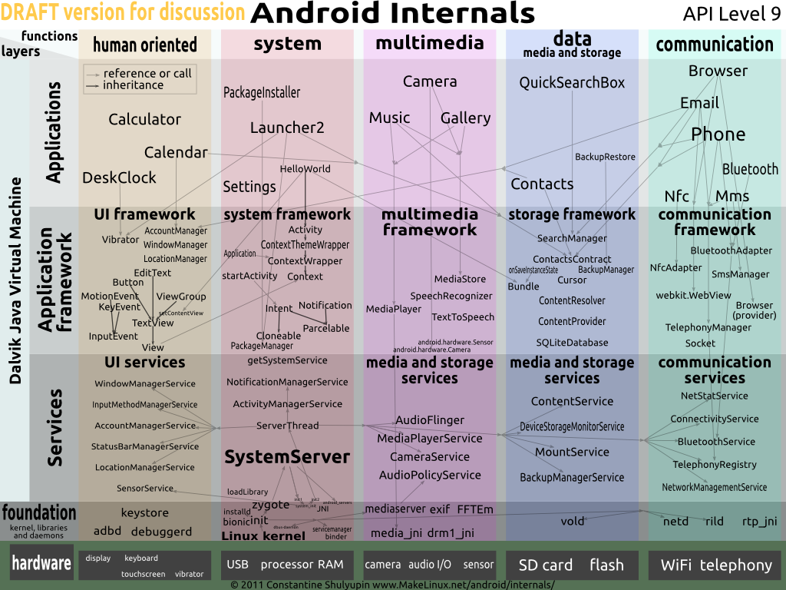
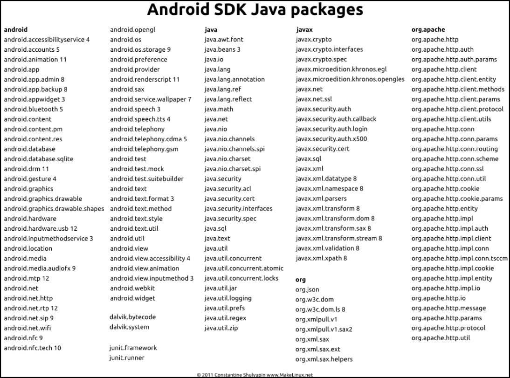
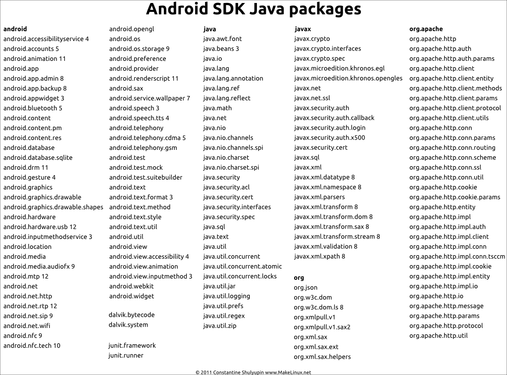
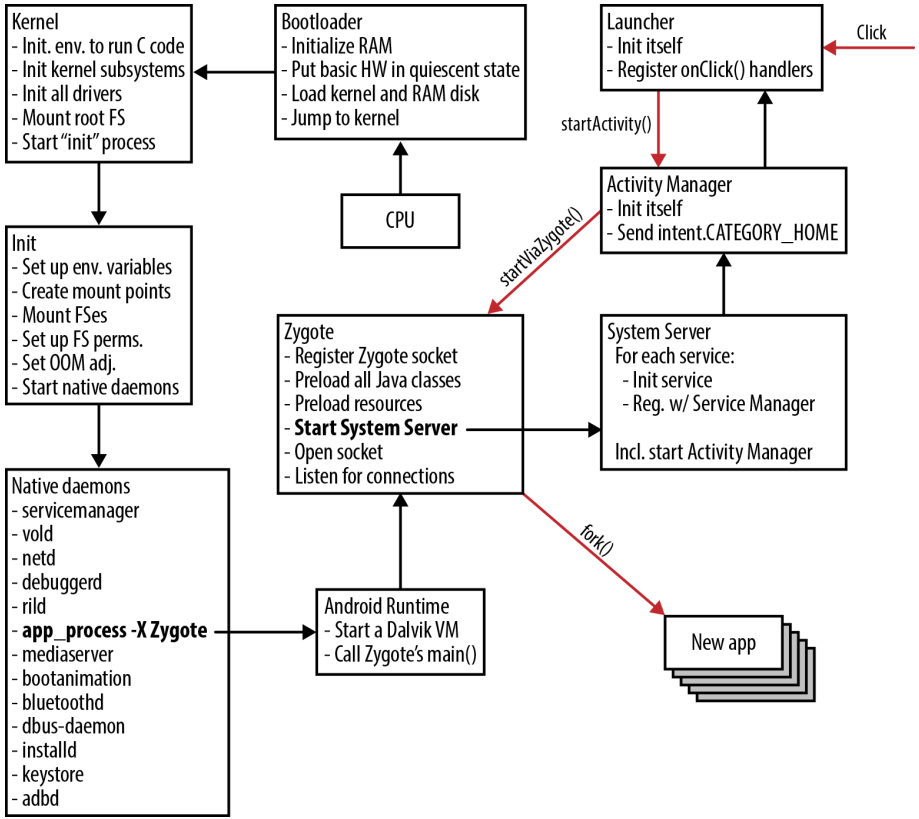

#  UNIX's World View

## UNIX's User-Centrality

- Users that belong to groups,
- own and access files,
- execute processes to perform tasks on their behalf, and
- control the access rights to those files.

> User-centric - programs run on behalf of users, thus can access any of the user's files!

## UNIX Process & Composition Model

Running a UNIX program:

- `fork` + `exec`
- `ld.so` dynamic library loading + sharing $\to$ memory saving

Composition on shell:

- `pipe`s + `fork` + `exec`

> `$ echo $PATH | tr : "\n" | wc -l`

## Everything's a File

- `files`
- `directories`
- `/proc/*`
- `/dev/*`
- IPC channels (named pipes + domain sockets)

$\to$ Shell composition of programs can process on all system resources!

$\to$ UNIX APIs for file manipulation manipulate all resources (polymorphism)!

## Shared Services w/ `setuid` Bits

We can use `setuid` bits to coordinate services that serve multiple users.

- users  *read* files (e.g. `/etc/passwd`)
- `setuid` bit programs *update* files
- services (`daemons`) consume and act on files

# UNIX Challenges

## UNIX Security Challenge: `root`

- `root` permission is *all or nothing*
- Particularly susceptible to privilege escalation
- `root` *required* for many roles (e.g. `chown`)

Examples:

- Why is `root` required for `login`?
    Only require 1. access to password file, and 2. ability to `setuid` to user.
- Why are many of the files in `/etc/` owned by `root`;
    why are the files in `/dev/` all owned by `root` (e.g. `/dev/mem`)

## UNIX Security Challenge: Unrestricted IPC

Traditional services:

- Daemon that executes periodically, reads configuration/data files
- (setuid) Commands that users run to update configuration/data files

$\to$ Each *user* (and all of their programs) can interact with the service

> Should everyone's programs be able to interact with core services?

## UNIX Security Challenges: DAC

> **Discretionary Access Control (DAC)**:
> Users restrict access to their own files/data, and can indiscriminately pass that privilege.

- Example: students can each decide to share homeworks.

> **Mandatory Access Control (MAC)**:
> Users restricted in sharing files/data by system-wide policies that restrict sharing relationships.

- Example: Policy disallowing students to share homeworks.

## UNIX Security Challenge: User-Centric Access

All of a user's data is accessible to *every program they execute*.
Assume a program *will* be attacked and compromised.
How can we minimize its negative effects?

*Principle of least privilege*: Only give the access required to accomplish a program's goals.

Examples:

 - Pdf viewer accesses network?
 - Browser accesses password file?
 - Compiler accesses anything other than code files?

# Android's World View

## Android's World View

App-store model is central

- User does not trust an App
- Apps should not trust other Apps

> Apps cannot access each other's resources!
>
> Default: share nothing.

## Android's World View: Files

- Apps cannot have access to each other's files!
- Apps have their own directories, and no access to other Apps!

> App-centric - programs have *separate, limited access to files*

## Android's World View: IPC

Sensitive resources are not just files

- Camera
- GPS/IMU
- Contacts

Must limit App access to each of these, based on App's goals/requirements.

> By-default **deny** App access to resources, *mediated* IPC

## Android's World View: Application-Centric Access

> Idea: Apps are *not* trusted. Isolate them from each other!

They are run by the user, but

- the user doesn't trust them, and
- they don't trust each other

*Example*: Banking App running alongside flashlight app

- Should they execute with access to each other's data?
- Why can applications not access each other's files?
- Can any application access any phone resource (e.g. contacts)?

## Android: Restrict IPC by Default

Services oversee key abstraction/resources

- Programmable resources, provided by services
- Not just files, provided by the kernel

Resources include

- Contacts
- Screen
- Camera
- Contacts

Only Apps with permissions given by the user should be able to communicate with these services.

## UNIX Process Model vs. JVM

UNIX programs:

- `fork` + `exec`
- `ld.so` dynamic library loading

Java VM program execution:

- `fork`
- Load/init Java language execution program (VM)
- Load dynamic libraries (in `classpath`)
- Load libraries for java program (`imports`)
- Execute java program (JIT, GC)

## Android: Everything is JVM Execution

An application's computation is always within a JVM.
This means:

- We should optimize for starting an app in a JVM
- JVM is memory-hungry $\to$ share as much memory between VMs as possible

> JVM-first execution abstractions

# Android Architecture

## Android Architecture


## Android Architecture II

<center></center>


# Zygote Process

##  Zygote Process Creation I

The Java VM has a huge number of large packages

- essentially similar to dynamic libraries
- *expensive*: loading them all at App-start time
- *expensive*: memory replication across Apps/Services

##  Zygote Process Creation II

Zygote: single process that is the *parent* of *all* Apps and Services.

- Loads all java packages into the zygote
- Listens for App/Service-creation requests
- `fork`s the new App/Service
- `setuid` to the App's `uid` (zygote is `root`)
- Executes App/Service's java code

## Zygote Memory Savings

<center></center>


## System & Zygote Bootup

<center></center>
 discussing bootup. Source: zybuluo.com](figures/android/zygote_flowchart.png)

# Application Centrality

## App-Centrality: Application Sandbox

1. Apps have `uid`/`gid`s, not users
2. Apps have "home directories" for private storage
3. No facilities for filesystem sharing between applications
4. Apps explicitly specify their resource requirements

    - Contacts,
    - networking,
    - Camera, ...

## Allowing Apps to Access Devices

Apps have a *permission manifest*: what resources they can access.

- "This app wants access to your Contacts, do you consent?"

```
<permission name="android.permission.BLUETOOTH" >
    <group gid="net_bt" />
</permission>
<permission name="android.permission.WRITE_MEDIA_STORAGE" >
    <group gid="media_rw" />
    <group gid="sdcard_rw" />
</permission>
<permission name="android.permission.INTERNET" >
    <group gid="inet" />
</permission>
```

All of the system's potential [permissions](https://developer.android.com/reference/android/Manifest.permission).

- For example, [the `READ_CONTACTS` permission](https://developer.android.com/reference/android/Manifest.permission#READ_CONTACTS)

## Tracking of Permissions

App and Service permissions are tracked and queried:

- `PermissionManager` + `PackageManager`

```
return AppGlobals.getPackageManager()
	.checkUidPermission(permission, uid);
```


## App Filesystem Access

Applications have access only to a small part of the filesystem

- The `uid` and `gid` are a unique, per-app values `app_N`. I.e. `app_6`
- `/data/app/<app_name>/` binary and "ELF-like" data
- `/data/data/<app_name>/` storage

# Resource Access through IPC and Services

## *Service-based Coordination*

> If Apps cannot access each other's data, how do we have a cohesive, single experience as user?

**Our** human experience is clicking buttons, and seeing actions.
The system need only provide the *illusion* of a single, shared device.

**How?**

## *Service-based Coordination* II

Illusion of a single, shared device:

1. Apps communicate to services that provide shared resources

	- windows
	- input (e.g. keyboard)/output (screen)
	- contacts
	- network
	- location
	- ...

2. Composition of Apps: communication through *intents*

	- Talk about this later

## User/Group IDs

```
/* This is the master Users and Groups config for the platform.*/
#define AID_ROOT             0  /* traditional unix root user */
#define AID_SYSTEM        1000  /* system server */
#define AID_RADIO         1001  /* telephony subsystem, RIL */
#define AID_BLUETOOTH     1002  /* bluetooth subsystem */
#define AID_GRAPHICS      1003  /* graphics devices */
#define AID_INPUT         1004  /* input devices */
#define AID_AUDIO         1005  /* audio devices */
#define AID_CAMERA        1006  /* camera devices */
#define AID_LOG           1007  /* log devices */
#define AID_COMPASS       1008  /* compass device */
#define AID_MOUNT         1009  /* mountd socket */
#define AID_WIFI          1010  /* wifi subsystem */
#define ...
#define AID_WEBVIEW_ZYGOTE 1053 /* WebView zygote process */
/* The 3000 series are intended for use as supplemental group id's only*/
#define AID_NET_BT_ADMIN  3001  /* bluetooth: create any socket */
#define AID_NET_BT        3002  /* bluetooth: create sco, rfcomm, ... */
#define AID_APP          10000  /* first app user */
#define AID_USER        100000  /* offset for uid ranges for each user */
```

- `0`/`1000` - `root` + System, `1001...1052` - Devices
- `1053` - Zygote, `10000+` - Apps

## Binder: Inter-Process Communication

*Binder*: domain-socket analog for IPC

- Nameserver associates Apps/Services with `names`
- IPC to those `names` can mimic function calls

$\to$ cross App/Service "function invocations"

## Binder-based IPC

- IPC Connections can be passed to Apps

    - "*I want to talk to the location service!*"
	- `ServiceManager` nameserver: "*here you go, have this connection*"

- `uid/gid` of Apps using connection can be queried

    - Example: does the App have group `AID_INPUT` to be able to input?
    - Example: pass uid to `Package/PermissionManager`: "*are they allowed?*"

## Binder Communication Authentication

> Who is making a request to a service? Do they have permissions?

- Connections include `pid` and `euid`
- `Binder.getCallingPid()` & `Binder.getCallingUid()`
- Trusted *authentication* of App making request

```
ActivityManager.checkComponentPermission(permission, uid, owningUid, exported)
```

## ServiceManager: Android Nameserver

`android.os.ServiceManager` includes:

```
public static void addService(String name, IBinder service) { /* ... */ }
public static IBinder getService(String name) { /* ... */ }
```

We can see that at its core, Android has a nameserver to map names to IPC channels.

- Similar to our nameserver creating a domain socket for each server
- Interacts with kernel to enable namespace-driven discovery for Binder

## [Services (link)](https://www.youtube.com/watch?v=M6extgmQQNw&list=TLPQMDkwNDIwMjLUVCspTvNY9A)

- *Location Manager* - GPS + IMU
- *Package Manager* - track code and permissions for Apps
- *Account Manager* - track user permissions and data
- *Power Manager* - track/manage power
- *Wallpaper Service*
- Input/output via *Input Manager* (manage connection from app to keyboard) and [*Window Manager*](https://source.android.com/devices/graphics/surfaceflinger-windowmanager) (interacts with `surfaceflinger` to display contents)

Coordination:

- *Activity Manager* - nameserver to coordinate between Apps/Services

# Composing System from Apps

## General Communication between Apps

UNIX focuses on pipelines for composition

- streams of text
- read on `stdin`, output on `stdout`
- `pipe`s for composition
- using polymorphic `read`/`write` calls

Android:

[*Intents*](https://developer.android.com/guide/components/intents-filters): simple action you'd like to perform, identified by a name

- [*Activities* (link)](https://developer.android.com/guide/components/activities/intro-activities) provide App-based intent implementations
- [*Services* (link)](https://developer.android.com/reference/android/app/Service) provide "background" intent implementations

## Intent-based IPC

![How an implicit intent is delivered through the system to start another activity: [1] `Activity` $A$ creates an `Intent` with an action description and passes it to `startActivity()`. [2] The "Android System" searches all apps for an intent filter that matches the intent. When a match is found, [3] the system starts the matching activity (`Activity` $B$) by invoking its `onCreate()` method and passing it the `Intent`. Credit: Picture & text from https://developer.android.com .](figures/android/intent_ipc.png)

## Intents

[List of default *intents*](https://developer.android.com/guide/components/intents-common). These include:

- Alarm clock operations (setting alarm)
- Calendar (setting/retrieving events)
- Camera (taking pics)
- Contacts (accessing/setting contacts)
- Email (sending)
- File storage (service-provided, not in our local files)
- Text messages (send)
- Web browser (loading URL)

`ActivityManager` is nameserver for intents

## Intent Example: Sent email

```
// java code to send an email!
public void composeEmail(String[] addresses, String subject, Uri attachment) {
    Intent intent = new Intent(Intent.ACTION_SEND);
    intent.setType("*/*");
    intent.putExtra(Intent.EXTRA_EMAIL, addresses);
    intent.putExtra(Intent.EXTRA_SUBJECT, subject);
    intent.putExtra(Intent.EXTRA_STREAM, attachment);
    if (intent.resolveActivity(getPackageManager()) != null) {
        startActivity(intent);
    }
}
```

## Intents - Mechanism for Launching Apps

1. System starts out by triggering the `PRE_BOOT_COMPLETED` intent
1. Homescreen App displays homescreen (or "update" might run)
1. Homescreen triggers `BOOT_COMPLETED` intent
1. Homescreen App detects click $\to$ triggers App intent
1. If App is running, pass it the message, otherwise *start it*!
1. App might trigger many intents

	- `INPUT_METHOD_SERVICE` to read from onscreen keyboard
	- `ACTION_SEND` to send email
	- open URL, view pdf, download file, etc...

## ActivityManager I

`ActivityManager` implements this *intent* system

- a service running inside the `SystemServer` process
- manages the runtime activities of applications in the system

For functionality: `void startActivity (Intent intent)`

- find activity/service to handle `intent`
- check permissions
- ask zygote to start *or* activate activity/service

## Intents - Mechanism for Launching Apps II

](figures/android/app_launch.png)

## ActivityManager Example

- [the `InputManager` multiplexes](https://developer.android.com/reference/android/view/inputmethod/InputMethodManager.html) user input between `InputMethod`s.

    - Think: where are we getting our `stdin`?
	    Up to the system to decide if `stdin` is a pipe, or a terminal.
		Polymorphic!

- [`InputMethod`s (link)](https://developer.android.com/reference/android/inputmethodservice/InputMethodService) are things like on-screen keyboards that are Services activated by intents from the `InputManager`.

    - Provides the `INPUT_METHOD_SERVICE` intent
	- This class is much like "file descriptor `0`"; we know it will give us input.

- App $\to$ `ActivityManager`(`INPUT_METHOD_SERVICE`) $\to$ `InputMethod`

## Intent/Activity Permissions

- Binder provides `uid`/`pid` of client
- `ActivityManager` checks if the client has permissions to access resource/trigger intent
- Will privilege system services and `root`

## ActivityManager II

```
// frameworks/base/core/java/android/app/ActivityManager.java

public class ActivityManager {
    public static int checkComponentPermission(String permission, int uid,
            int owningUid, boolean exported) {
        final int appId = UserHandle.getAppId(uid);
        if (appId == Process.ROOT_UID || appId == Process.SYSTEM_UID) {
            return PackageManager.PERMISSION_GRANTED;
        }
        if (UserHandle.isIsolated(uid)) {
            return PackageManager.PERMISSION_DENIED;
        }
        if (owningUid >= 0 && UserHandle.isSameApp(uid, owningUid)) {
            return PackageManager.PERMISSION_GRANTED;
        }
        if (!exported) {
            return PackageManager.PERMISSION_DENIED;
        }
        if (permission == null) {
            return PackageManager.PERMISSION_GRANTED;
        }
        try {
            return AppGlobals.getPackageManager()
                .checkUidPermission(permission, uid);
        } catch (RemoteException e) {
            throw e.rethrowFromSystemServer();
        }
    }
}
```

#  Summary: POSIX vs. Android

## App-Centric

- A user (`uid`) for each App/Service
- File system directory per App
- Binder IPC gives us `uid`/`pid` of calling App
- Each App has a permission manifest
- `Package/PermissionManager` lets us query App permissions

$\to$ foundation for per-App access control/privileges

## Shared Resources Through Services

- `SystemManager` nameserver maps unique `name` to a Service
- Apps use IPC to request resources from Services

	- Contacts
	- Shared documents
	- Hardware (location, screen, networking, etc...)

## Everything is App/Service Execution

Zygote as the parent of each App

- pre-loads all class libraries
- a service awaiting App creation requests on a domain socket
- App creation = `fork`
- uses `setuid` to restrict App's privileges

## Composition via `Intent`s

Apps and Services are activated by *intents*.

- Polymorphic

    - Code for homescreen? Provide `PRE_BOOT_COMPLETED` intent.
	- On-screen keyboard? Provide `INPUT_METHOD_SERVICE` intent.

- Drives App/Service activation

    - If the intent provide isn't running, start it!

- Communication driven by the `ActivityManager`

	- nameserver for intents
	- in some sense, provides similar purpose to the shell

## UNIX vs. Android: Access to Resources

UNIX:

- $open(String path) \to int descriptor$

    - Access check based on `uid`/`gid`

- $descriptor_table(int descriptor) \to char[] file$

## UNIX vs. Android: Access to Resources

Android:

- $open(String path) \to int descriptor$

    - Access check based on `uid`/`gid`

- $descriptor_table(int descriptor) \to char[] file$

*and*

- $ActivityManager(String Intent) \to BinderChannel$

	- Permission checking with `PackageManager`

- BinderChannel(fn, args...) \to Service


##  POSIX vs. Android Summary

| POSIX                      | Android                                   |
|----------------------------|-------------------------------------------|
| User-centric               | App-centric, per-App permissions          |
| Security through FS        | Security through permission manifests     |
| Shared resources on FS     | Shared resources via Services             |
| Everything's a file        | Everything's App (JVM) execution          |
| Shell + `pipe` composition | Composition via App IPC through `Intent`s |

## Android's UNIX

Similar set of system calls to normal UNIX system...

...augmented with pervasive use of IPC...

...to coordinate between Apps and Services...

...while checking per-App permissions...

...all driven by the special trust relationship of untrusted Apps.
